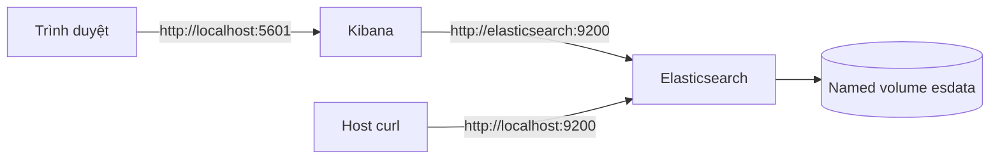

import { File, Folder, Files } from 'fumadocs-ui/components/files';
import { Step, Steps } from 'fumadocs-ui/components/steps';

Docker Compose giúp mô tả Elasticsearch và Kibana trong một file có thể đọc, kiểm tra và khởi động lại nhiều lần. Bài này dùng một cluster **đơn node** với security được bật, nhưng HTTP chỉ mở trên máy local. Cấu hình này phù hợp để học API, Query DSL và Kibana; nó không phải topology production.

<Callout type="warn" title="Phạm vi an toàn">
  Mật khẩu được đọc từ `.env.local`, không ghi trực tiếp vào `compose.yaml`. Compose chỉ mở cổng trên máy phát triển của bạn. Không expose cấu hình này ra Internet và không dùng nó làm mẫu production khi chưa thêm TLS, nhiều node, backup và quản lý secret.
</Callout>

## Mục lục

- [Mục tiêu và phạm vi](#mục-tiêu-và-phạm-vi)
- [Kiến trúc lab](#kiến-trúc-lab)
- [Chuẩn bị](#chuẩn-bị)
  - [Kiểm tra Docker](#kiểm-tra-docker)
  - [Tạo thư mục làm việc](#tạo-thư-mục-làm-việc)
- [Tạo cấu hình](#tạo-cấu-hình)
  - [Tạo `.env.local`](#tạo-envlocal)
  - [Tạo `compose.yaml`](#tạo-composeyaml)
- [Khởi động stack](#khởi-động-stack)
  - [Tạo mật khẩu cho `kibana_system`](#tạo-mật-khẩu-cho-kibanasystem)
  - [Kiểm tra file Compose](#kiểm-tra-file-compose)
  - [Khởi động Elasticsearch trước](#khởi-động-elasticsearch-trước)
  - [Reset password hệ thống của Kibana](#reset-password-hệ-thống-của-kibana)
- [Khởi động Kibana](#khởi-động-kibana)
- [Khởi động cả stack ở lần sau](#khởi-động-cả-stack-ở-lần-sau)
- [Kiểm tra và đăng nhập](#kiểm-tra-và-đăng-nhập)
  - [Kiểm tra Elasticsearch](#kiểm-tra-elasticsearch)
  - [Đăng nhập Kibana](#đăng-nhập-kibana)
  - [Hiểu đường đi của request](#hiểu-đường-đi-của-request)
- [Vòng đời container và dữ liệu](#vòng-đời-container-và-dữ-liệu)
  - [Xem logs](#xem-logs)
  - [Dừng và khởi động lại](#dừng-và-khởi-động-lại)
  - [Persistence của volume](#persistence-của-volume)
- [Reset và cleanup](#reset-và-cleanup)
- [Troubleshooting](#troubleshooting)
  - [Container Elasticsearch không healthy](#container-elasticsearch-không-healthy)
  - [Kibana báo lỗi xác thực](#kibana-báo-lỗi-xác-thực)
  - [Cổng đã được sử dụng](#cổng-đã-được-sử-dụng)
  - [Thiếu bộ nhớ hoặc disk](#thiếu-bộ-nhớ-hoặc-disk)
- [Lab khác production như thế nào](#lab-khác-production-như-thế-nào)
- [Bước tiếp theo](#bước-tiếp-theo)

## Mục tiêu và phạm vi

Sau bài này, bạn có thể:

- khởi động Elasticsearch và Kibana bằng một file Compose;
- kiểm tra cluster health bằng `curl` và đăng nhập Kibana;
- xem logs, dừng stack mà không xoá dữ liệu, rồi reset toàn bộ volume khi cần;
- giải thích phần nào của cấu hình chỉ dành cho lab.

**Volume** là nơi Docker lưu dữ liệu bên ngoài vòng đời của container. Nếu chỉ chạy `docker compose down`, volume vẫn còn. Nếu chạy `docker compose down -v`, volume bị xoá và dữ liệu Elasticsearch mất hoàn toàn.

<Callout type="info" title="Vì sao dùng `.env.local`?">
  File `.env.local` được Git ignore trong starter repository này và chứa mật khẩu local. Nếu bạn dùng repository khác, hãy kiểm tra `git check-ignore -v .env.local` trước khi điền secret. Không commit file này và không dán mật khẩu thật vào issue, log hoặc ảnh chụp màn hình.
</Callout>

## Kiến trúc lab

Compose tạo hai service trên cùng một network mặc định. Elasticsearch lưu dữ liệu trong named volume `esdata`. Kibana gọi Elasticsearch bằng tên service `elasticsearch`, còn trình duyệt gọi Kibana qua `localhost:5601`.



Tên `elasticsearch` chỉ phân giải được bên trong network Compose. Từ máy host, hãy dùng `http://localhost:9200`. Đây là hai địa chỉ khác nhau cho cùng một service.

## Chuẩn bị

### Kiểm tra Docker

Cài Docker Desktop hoặc Docker Engine có Docker Compose plugin. Bài này dùng cú pháp `docker compose` có dấu cách, không dùng binary cũ `docker-compose`.

```bash
docker --version
docker compose version
docker info
```

`docker info` phải trả về thông tin daemon. Nếu lệnh này báo không kết nối được, hãy khởi động Docker Desktop hoặc service Docker trước khi tiếp tục.

Máy học tập nên có ít nhất 4 GB RAM dành cho Docker và khoảng 10 GB disk trống. Elasticsearch có thể khởi động với ít hơn, nhưng dễ bị chậm hoặc bị hệ điều hành kill khi indexing dữ liệu mẫu.

### Tạo thư mục làm việc

Tạo một thư mục riêng để Compose không trộn volume, logs và secret với dự án khác.

```bash
mkdir -p ~/elk-lab
cd ~/elk-lab
```

Thư mục sau khi hoàn tất có cấu trúc tối thiểu như sau:

<Files>
  <Folder name="elk-lab" defaultOpen>
    <File name=".env.local" />
    <File name="compose.yaml" />
  </Folder>
</Files>

## Tạo cấu hình

### Tạo `.env.local`

Tạo file secret với quyền chỉ cho user hiện tại đọc. `STACK_VERSION` là version được pin để lần khởi động sau không âm thầm kéo một image khác. Bạn có thể đổi nó sang version Elasticsearch/Kibana tương thích được xuất bản trên Elastic registry, nhưng hai image phải luôn cùng version.

```bash
cat > .env.local <<'EOF'
STACK_VERSION=9.0.0
ELASTIC_PASSWORD=LocalElasticPassword123
KIBANA_PASSWORD=replace-after-reset
KIBANA_ENCRYPTION_KEY=local-only-encryption-key-change-me-123456
EOF
chmod 600 .env.local
git check-ignore -v .env.local
```

Nếu `git check-ignore` không in ra rule nào, dừng lại và thêm `.env.local` vào `.gitignore` của repository trước khi sử dụng. Các giá trị ví dụ chỉ dành cho máy local. Không tái sử dụng chúng ở môi trường chia sẻ.

`KIBANA_PASSWORD` ban đầu chỉ là placeholder. Ở bước sau, Elasticsearch sẽ tạo một mật khẩu ngẫu nhiên cho user hệ thống `kibana_system`; bạn sẽ thay placeholder bằng giá trị đó.

### Tạo `compose.yaml`

File dưới đây bật authentication của Elasticsearch nhưng tắt TLS HTTP. Tắt TLS chỉ giảm số bước cho lab trên `localhost`; password vẫn cần để gọi API. `ES_JAVA_OPTS` giới hạn heap ở mức 1 GB để máy học tập không bị dùng hết RAM.

```yaml
services:
  elasticsearch:
    image: docker.elastic.co/elasticsearch/elasticsearch:${STACK_VERSION}
    container_name: elk-elasticsearch
    environment:
      - discovery.type=single-node
      - xpack.security.enabled=true
      - xpack.security.http.ssl.enabled=false
      - ELASTIC_PASSWORD=${ELASTIC_PASSWORD}
      - ES_JAVA_OPTS=-Xms1g -Xmx1g
    ports:
      - "9200:9200"
    volumes:
      - esdata:/usr/share/elasticsearch/data
    healthcheck:
      test:
        - CMD-SHELL
        - >-
          curl -fsS -u "elastic:$$ELASTIC_PASSWORD"
          "http://localhost:9200/_cluster/health?wait_for_status=yellow"
          >/dev/null
      interval: 10s
      timeout: 10s
      retries: 20
      start_period: 30s

  kibana:
    image: docker.elastic.co/kibana/kibana:${STACK_VERSION}
    container_name: elk-kibana
    depends_on:
      elasticsearch:
        condition: service_healthy
    environment:
      - ELASTICSEARCH_HOSTS=["http://elasticsearch:9200"]
      - ELASTICSEARCH_USERNAME=kibana_system
      - ELASTICSEARCH_PASSWORD=${KIBANA_PASSWORD}
      - XPACK_ENCRYPTEDSAVEDOBJECTS_ENCRYPTIONKEY=${KIBANA_ENCRYPTION_KEY}
      - XPACK_REPORTING_ENCRYPTIONKEY=${KIBANA_ENCRYPTION_KEY}
      - XPACK_SECURITY_ENCRYPTIONKEY=${KIBANA_ENCRYPTION_KEY}
    ports:
      - "5601:5601"

volumes:
  esdata:
```

Có hai chi tiết dễ bỏ sót trong file này:

- `$$ELASTIC_PASSWORD` giữ dấu `$` cho shell chạy **bên trong container**. Nếu dùng một dấu `$`, Compose sẽ cố nội suy biến ở host khi đọc file.
- Kibana không nên dùng user `elastic` để truy cập thường xuyên. Nó dùng `kibana_system`, vì vậy ta phải đặt password cho user này trước khi khởi động service Kibana.

<Callout type="warn" title="Giữ các image cùng version">
  Không thay `STACK_VERSION` bằng `latest`. Một lần kéo image mới có thể thay đổi format dữ liệu hoặc behavior giữa hai lần khởi động. Pin một version giúp bài lab lặp lại được; khi nâng version, đọc upgrade guide và backup dữ liệu trước.
</Callout>

## Khởi động stack

Lần đầu cần khởi động Elasticsearch trước, tạo password cho `kibana_system`, rồi mới khởi động Kibana. Các lệnh đều truyền `--env-file .env.local` để Compose đọc secret đúng file.

### Tạo mật khẩu cho `kibana_system`

<Steps>
<Step>

### Kiểm tra file Compose

Lệnh `config` render biến môi trường và kiểm tra cấu trúc YAML mà chưa tạo container.

```bash
docker compose --env-file .env.local config
```

Nếu thấy cảnh báo biến không được set, kiểm tra tên biến trong `.env.local`. Không paste output có password vào nơi công khai.

</Step>
<Step>

### Khởi động Elasticsearch trước

```bash
docker compose --env-file .env.local up -d elasticsearch
```

Theo dõi đến khi health chuyển sang `healthy`:

```bash
docker compose --env-file .env.local ps
```

</Step>
<Step>

### Reset password hệ thống của Kibana

Chạy công cụ đi kèm image Elasticsearch để sinh password ngẫu nhiên:

```bash
docker compose --env-file .env.local exec elasticsearch \
  bin/elasticsearch-reset-password -u kibana_system -b
```

Copy giá trị sau `New value:`. Mở `.env.local`, thay:

```dotenv
KIBANA_PASSWORD=replace-after-reset
```

bằng password vừa sinh. Giữ file ở quyền `600`.

</Step>
</Steps>

Nếu bạn reset lại password sau khi Kibana đã chạy, hãy restart Kibana để nó đọc giá trị mới:

```bash
docker compose --env-file .env.local restart kibana
```

### Khởi động Kibana

Sau khi cập nhật `.env.local`, khởi động service Kibana:

```bash
docker compose --env-file .env.local up -d kibana
docker compose --env-file .env.local ps
```

Kibana có thể mất vài chục giây để chạy migration saved object lần đầu. Chỉ mở trình duyệt sau khi logs cho thấy server đã sẵn sàng.

### Khởi động cả stack ở lần sau

Từ lần thứ hai, password đã được lưu trong Elasticsearch volume. Bạn chỉ cần chạy:

```bash
docker compose --env-file .env.local up -d
docker compose --env-file .env.local ps
```

## Kiểm tra và đăng nhập

### Kiểm tra Elasticsearch

Từ host, cổng `9200` được bind vào `localhost`. Gọi endpoint root để xác nhận authentication và version:

```bash
curl -u 'elastic:LocalElasticPassword123' \
  http://localhost:9200/
```

Trong môi trường thật, không đặt password trực tiếp trong shell history. Với lab, hãy thay chuỗi ví dụ bằng giá trị `ELASTIC_PASSWORD` trong `.env.local` hoặc đọc từ password manager. Health API cho biết cluster đã nhận request:

```bash
curl -u 'elastic:LocalElasticPassword123' \
  'http://localhost:9200/_cluster/health?pretty'
```

Ở cluster single-node, trạng thái `yellow` có thể xảy ra khi index có replica chưa được phân bổ vì chỉ có một node. `green` không phải điều kiện bắt buộc để thực hành API; quan trọng là cluster phản hồi và không có shard `unassigned` ngoài nguyên nhân replica của lab.

### Đăng nhập Kibana

Mở [http://localhost:5601](http://localhost:5601). Đăng nhập bằng:

- **Username:** `elastic`
- **Password:** giá trị `ELASTIC_PASSWORD` trong `.env.local`

Kibana dùng `kibana_system` để nói chuyện với Elasticsearch. User này là tài khoản hệ thống, không dùng để đăng nhập UI.

Nếu trang chưa mở được ngay, xem `docker compose ... logs -f kibana` trong vài giây. Lần đầu Kibana cần tạo index hệ thống và lưu saved object.

### Hiểu đường đi của request

Khi bạn mở Kibana, trình duyệt không gọi service bằng tên `elasticsearch`. Kibana chạy trong network Compose và gọi `http://elasticsearch:9200`; ngược lại, `curl` chạy trên host gọi `http://localhost:9200`. Phân biệt hai network boundary này giúp chẩn đoán lỗi `connection refused` nhanh hơn.

<Callout type="idea" title="Thử ngay trong bước kế tiếp">
  Trong Kibana, mở **Main menu → Management → Dev Tools** rồi chạy `GET /_cluster/health?pretty`. Bạn sẽ dùng Console này ở bài [Kibana Dev Tools](./kibana-dev-tools).
</Callout>

## Vòng đời container và dữ liệu

### Xem logs

Xem logs của một service:

```bash
docker compose --env-file .env.local logs -f elasticsearch
docker compose --env-file .env.local logs -f kibana
```

`Ctrl+C` chỉ dừng việc theo dõi logs, không dừng container. Xem 100 dòng gần nhất mà không follow:

```bash
docker compose --env-file .env.local logs --tail=100 kibana
```

### Dừng và khởi động lại

`stop` dừng container nhưng giữ container và volume. `start` chạy lại container đã dừng:

```bash
docker compose --env-file .env.local stop
docker compose --env-file .env.local start
```

`down` xoá container và network do Compose tạo nhưng giữ named volume `esdata`:

```bash
docker compose --env-file .env.local down
docker compose --env-file .env.local up -d
```

Dùng `restart` khi chỉ muốn nạp lại cấu hình hoặc khắc phục một service tạm thời:

```bash
docker compose --env-file .env.local restart kibana
```

### Persistence của volume

Named volume `esdata` nằm ngoài container nên dữ liệu index vẫn còn khi bạn chạy `down`. Liệt kê volume và xem container đang mount volume nào:

```bash
docker volume ls
docker compose --env-file .env.local ps
```

Không chỉnh sửa trực tiếp thư mục dữ liệu Elasticsearch trên host. Elasticsearch quản lý segment và metadata trong volume; copy file thô không thay thế snapshot hợp lệ.

<Callout type="warn" title="Volume không phải backup">
  Persistence chỉ giúp container dùng lại dữ liệu sau khi restart. Nó không bảo vệ bạn khỏi xoá nhầm, lỗi disk hoặc mất máy. Production cần snapshot repository và quy trình restore được kiểm thử.
</Callout>

## Reset và cleanup

Khi muốn làm lại từ đầu, hãy dừng stack và xoá volume. Lệnh này không thể hoàn tác dữ liệu local:

```bash
docker compose --env-file .env.local down -v
```

Nếu muốn giải phóng cả image đã kéo, chỉ làm sau khi chắc chắn không dùng image đó cho project khác:

```bash
docker image rm \
  "docker.elastic.co/elasticsearch/elasticsearch:$(grep '^STACK_VERSION=' .env.local | cut -d= -f2)" \
  "docker.elastic.co/kibana/kibana:$(grep '^STACK_VERSION=' .env.local | cut -d= -f2)"
```

Xoá file secret sau khi cleanup nếu không còn dùng:

```bash
rm .env.local
```

Không chạy `docker system prune --volumes` theo thói quen. Lệnh đó có thể xoá volume của các project khác trên máy.

## Troubleshooting

### Container Elasticsearch không healthy

Xem status và logs trước khi sửa:

```bash
docker compose --env-file .env.local ps
docker compose --env-file .env.local logs --tail=200 elasticsearch
```

Các nguyên nhân thường gặp:

- Docker được cấp quá ít RAM: tăng memory limit trong Docker Desktop và giảm/tăng `ES_JAVA_OPTS` theo tài nguyên thật.
- Cổng `9200` đã bị service khác dùng: đổi mapping thành `"19200:9200"`, rồi gọi `http://localhost:19200`.
- Password có ký tự làm hỏng interpolation: thử secret local chỉ gồm chữ, số và dấu gạch ngang; production nên dùng secret manager thay vì đơn giản hoá password.
- Volume chứa dữ liệu dở dang từ version khác: backup nếu cần, sau đó reset bằng `down -v` và khởi động lại đúng `STACK_VERSION`.

<Callout type="error" title="Không xoá volume để chữa mọi lỗi">
  `down -v` làm mất dữ liệu. Chỉ dùng sau khi đọc logs và xác nhận đây là lab có thể dựng lại. Nếu dữ liệu có giá trị, dừng lại và snapshot hoặc copy thông tin cần thiết trước.
</Callout>

### Kibana báo lỗi xác thực

Nếu logs chứa `security_exception` hoặc `unable to authenticate user [kibana_system]`, kiểm tra ba điểm:

1. `KIBANA_PASSWORD` trong `.env.local` có đúng giá trị được sinh bởi `elasticsearch-reset-password` không?
2. Bạn có chạy `docker compose --env-file .env.local up -d kibana` **sau** khi cập nhật file không?
3. Có reset password sau khi Kibana khởi động không? Nếu có, chạy `restart kibana`.

```bash
docker compose --env-file .env.local logs --tail=200 kibana
docker compose --env-file .env.local restart kibana
```

Không dùng password của `elastic` cho biến `KIBANA_PASSWORD`. Hai user có hai password riêng.

### Cổng đã được sử dụng

Tìm process đang nghe cổng:

```bash
# Linux/macOS
lsof -nP -iTCP:9200 -sTCP:LISTEN
lsof -nP -iTCP:5601 -sTCP:LISTEN
```

Bạn có thể đổi cổng host mà không đổi cổng bên trong network Compose:

```yaml
ports:
  - "19200:9200"
```

Sau đó dùng `http://localhost:19200` cho curl. Kibana vẫn gọi `http://elasticsearch:9200` bên trong Compose.

### Thiếu bộ nhớ hoặc disk

Kiểm tra resource Docker và dung lượng volume:

```bash
docker system df
docker volume inspect elk-lab_esdata
```

Tên volume có thể có prefix khác nếu thư mục project khác tên. Không đặt heap lớn hơn khoảng một nửa RAM Docker được cấp. Với máy nhỏ, giảm `ES_JAVA_OPTS` xuống `-Xms512m -Xmx512m`, rồi kiểm tra lại thời gian khởi động và logs.

## Lab khác production như thế nào

| Khía cạnh | Bản lab trong bài | Production cần cân nhắc |
| --- | --- | --- |
| Topology | Một node, `discovery.type=single-node` | Nhiều node, failure domain và quorum phù hợp |
| Network | HTTP không TLS, chỉ bind cổng host local | TLS cho HTTP/transport, network policy và private endpoint |
| Secret | `.env.local` quyền `600` | Secret manager, rotation, audit và không truyền qua command line |
| Dữ liệu | Named volume, không có snapshot tự động | Snapshot repository, restore drill, retention và capacity planning |
| Tài nguyên | Heap cố định 1 GB cho học tập | Sizing theo workload, disk I/O, heap pressure và JVM metrics |
| Upgrade | Pin version và reset lab khi cần | Compatibility check, backup, rolling upgrade và rollback plan |

Security được bật để bạn làm quen với authentication. TLS HTTP bị tắt vì bài tập chạy trên `localhost` và cần ít ceremony hơn. Đây là trade-off có chủ đích, không phải mặc định an toàn cho Internet. Nếu cần public endpoint, không mở trực tiếp container này; hãy theo hướng dẫn deployment chính thức của Elastic và thêm TLS, ingress, firewall, secret management, monitoring và backup.

## Bước tiếp theo

<Cards>
  <Card title="Cài đặt native" href="./cai-dat-native" description="So sánh với cách chạy Elasticsearch và Kibana trực tiếp trên Linux." />
  <Card title="Kibana Dev Tools" href="./kibana-dev-tools" description="Gửi request REST trong Console thay vì dùng curl." />
  <Card title="Index document đầu tiên" href="./index-document-dau-tien" description="Tạo index, ghi document và đọc lại dữ liệu." />
</Cards>
