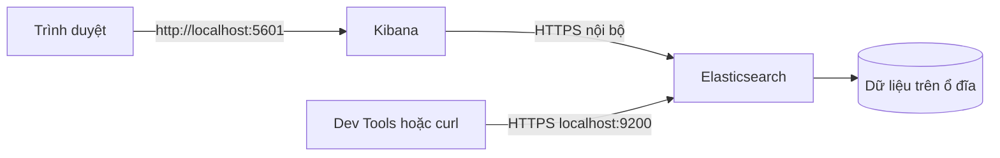

import { Step, Steps } from 'fumadocs-ui/components/steps';

Bài này hướng dẫn cài Elasticsearch và Kibana bằng gói Debian trên Ubuntu hoặc Debian. Cài đặt native phù hợp khi bạn muốn làm quen với `systemd`, file cấu hình và log của dịch vụ. Nếu bạn muốn tạo rồi xóa môi trường nhanh bằng container, hãy xem [Cài đặt bằng Docker Compose](./cai-dat-docker-compose).

<Callout type="warn" title="Chỉ dùng cho máy học tập">
  Các lệnh trong bài giới hạn dịch vụ ở máy local và ưu tiên thao tác đơn giản. Không sao chép nguyên cấu hình này vào production. Môi trường production cần TLS, quản lý secret, backup, phân quyền, giám sát và thiết kế cluster riêng.
</Callout>

## Mục lục

- [Tổng quan và mục tiêu](#tổng-quan-và-mục-tiêu)
- [Chuẩn bị máy](#chuẩn-bị-máy)
  - [Tài nguyên tối thiểu](#tài-nguyên-tối-thiểu)
  - [Kiểm tra phiên bản hệ điều hành](#kiểm-tra-phiên-bản-hệ-điều-hành)
- [Thêm repository chính thức](#thêm-repository-chính-thức)
- [Cài Elasticsearch và Kibana](#cài-elasticsearch-và-kibana)
- [Khởi động Elasticsearch](#khởi-động-elasticsearch)
- [Đặt mật khẩu và kiểm tra API](#đặt-mật-khẩu-và-kiểm-tra-api)
- [Khởi động và đăng nhập Kibana](#khởi-động-và-đăng-nhập-kibana)
- [Các file, thư mục và log quan trọng](#các-file-thư-mục-và-log-quan-trọng)
- [Dừng hoặc gỡ cài đặt](#dừng-hoặc-gỡ-cài-đặt)
- [Troubleshooting](#troubleshooting)
  - [Cổng 9200 hoặc 5601 đã được sử dụng](#cổng-9200-hoặc-5601-đã-được-sử-dụng)
  - [Elasticsearch không đủ bộ nhớ](#elasticsearch-không-đủ-bộ-nhớ)
  - [Service failed khi khởi động](#service-failed-khi-khởi-động)
  - [Lỗi quyền hoặc lỗi chứng chỉ](#lỗi-quyền-hoặc-lỗi-chứng-chỉ)
- [Bước tiếp theo](#bước-tiếp-theo)

## Tổng quan và mục tiêu

Elasticsearch là dịch vụ lưu trữ và tìm kiếm dữ liệu. Kibana là giao diện web dùng để gửi request, khám phá dữ liệu và tạo biểu đồ. Trong bài này, cả hai dịch vụ chạy trên cùng một máy:



Quy trình có bốn phần. Bạn chuẩn bị máy, thêm repository chính thức, cài hai package cùng version, rồi khởi động và kiểm tra từng dịch vụ. Làm theo thứ tự giúp tách lỗi cài đặt khỏi lỗi cấu hình.

<Callout type="info" title="Về version">
  Repository trong ví dụ dùng nhánh `9.x`. Hãy giữ Elasticsearch và Kibana cùng nhánh chính và cùng version package. Nếu dự án của bạn đã chọn một version cụ thể, thay `9.x` trong URL repository bằng nhánh tương ứng và không trộn package giữa các nhánh.
</Callout>

## Chuẩn bị máy

### Tài nguyên tối thiểu

Dùng Ubuntu 22.04/24.04 LTS hoặc Debian 12 trên kiến trúc được Elastic hỗ trợ. Bạn cần một tài khoản có quyền `sudo`, kết nối Internet và một terminal.

Để học local, nên có ít nhất 4 GiB RAM và 10 GiB dung lượng trống. Elasticsearch dùng heap (vùng nhớ JVM dành cho dữ liệu và execution) cùng với bộ nhớ ngoài heap, nên máy chỉ có 2 GiB RAM dễ bị OOM (hết bộ nhớ). Không chạy Elasticsearch bằng tài khoản `root`; package sẽ tạo user dịch vụ riêng.

Kiểm tra nhanh tài nguyên trước khi cài:

```bash
free -h

df -h /

# Elasticsearch dùng memory-mapped files; giá trị này nên là 262144 hoặc cao hơn.
sysctl vm.max_map_count
```

Nếu `vm.max_map_count` nhỏ hơn `262144`, đặt giá trị cho lần khởi động hiện tại và lưu lại sau reboot:

```bash
sudo sysctl -w vm.max_map_count=262144
echo 'vm.max_map_count=262144' | sudo tee /etc/sysctl.d/99-elasticsearch.conf
sudo sysctl --system
```

### Kiểm tra phiên bản hệ điều hành

Xác nhận hệ điều hành và kiến trúc trước khi thêm repository. Hai lệnh này cũng hữu ích khi cần cung cấp thông tin cho việc troubleshooting:

```bash
. /etc/os-release
printf 'OS: %s %s\n' "$ID" "$VERSION_ID"
uname -m
```

Nếu hệ điều hành không phải Ubuntu hoặc Debian, không dùng nguyên các lệnh APT trong bài. Hãy chuyển sang [Cài đặt bằng Docker Compose](./cai-dat-docker-compose) hoặc tài liệu package chính thức cho hệ điều hành của bạn.

## Thêm repository chính thức

Package từ repository của Elastic giúp `apt` nhận bản cập nhật và dependency đúng cách. Ta thêm khóa ký package vào keyring riêng thay vì dùng cách `apt-key` cũ.

<Steps>
<Step>

**1. Cài công cụ APT và tạo keyring.**

```bash
sudo apt-get update
sudo apt-get install -y apt-transport-https ca-certificates curl gnupg

curl -fsSL https://artifacts.elastic.co/GPG-KEY-elasticsearch \
  | sudo gpg --dearmor --yes -o /usr/share/keyrings/elasticsearch-keyring.gpg
```

</Step>
<Step>

**2. Thêm repository của cùng một nhánh version.**

Ví dụ dưới đây dùng nhánh `9.x`. File này chỉ chứa repository chính thức của Elastic:

```bash
echo "deb [signed-by=/usr/share/keyrings/elasticsearch-keyring.gpg] https://artifacts.elastic.co/packages/9.x/apt stable main" \
  | sudo tee /etc/apt/sources.list.d/elastic-9.x.list

sudo apt-get update
apt-cache policy elasticsearch kibana
```

`apt-cache policy` cho biết `Candidate` mà APT sắp cài. Nếu hai package không có candidate cùng nhánh, dừng ở đây và sửa repository trước khi cài.

</Step>
<Step>

**3. Kiểm tra khóa và source list.**

```bash
test -s /usr/share/keyrings/elasticsearch-keyring.gpg
cat /etc/apt/sources.list.d/elastic-9.x.list
```

Không tải package từ mirror không rõ nguồn gốc. Nếu bạn dùng proxy nội bộ, hãy kiểm tra mirror đó vẫn xác thực chữ ký package của Elastic.

</Step>
</Steps>

## Cài Elasticsearch và Kibana

Cài hai package trong cùng một lệnh. Cách này giảm khả năng APT cập nhật một package giữa hai lần cài riêng biệt:

```bash
sudo apt-get install -y elasticsearch kibana
```

Ngay sau đó, kiểm tra version đã cài. Elasticsearch và Kibana phải cùng version đầy đủ, không chỉ cùng major version:

```bash
dpkg-query -W -f='${Package} ${Version}\n' elasticsearch kibana
```

Nếu version khác nhau, xem các version có thể cài và chọn cùng một chuỗi version. Chuỗi version phải lấy từ output thực tế của máy, không đoán bằng cách bỏ phần revision:

```bash
apt-cache madison elasticsearch
apt-cache madison kibana

# Ví dụ cú pháp; thay <VERSION> bằng một version xuất hiện ở cả hai lệnh trên.
sudo apt-get install elasticsearch=<VERSION> kibana=<VERSION>
```

<Callout type="warn" title="Không trộn version">
  Kibana không được chạy với Elasticsearch khác version. Nếu APT đã nâng một package riêng lẻ, hãy pin hai package về cùng version trước khi khởi động dịch vụ.
</Callout>

## Khởi động Elasticsearch

Package tạo service `elasticsearch`, nhưng không tự ý mở service ra Internet. Bật service để khởi động cùng hệ điều hành và chạy ngay trong phiên hiện tại:

```bash
sudo systemctl daemon-reload
sudo systemctl enable --now elasticsearch.service
sudo systemctl status elasticsearch.service --no-pager
```

`active (running)` chỉ cho biết process đang sống. Ta vẫn cần kiểm tra API và log. Nếu service đang `activating`, chờ vài giây rồi kiểm tra lại vì JVM cần thời gian khởi tạo:

```bash
systemctl is-active elasticsearch.service
sudo journalctl -u elasticsearch.service -n 100 --no-pager
```

Trong các bản Elastic hiện đại, security thường được bật mặc định. Package có thể tạo CA HTTP và thông tin xác thực trong lần chạy đầu tiên. Vì vậy, đừng mặc định rằng `http://localhost:9200` là endpoint hợp lệ; hãy kiểm tra scheme và file CA mà package đã tạo.

## Đặt mật khẩu và kiểm tra API

User `elastic` là tài khoản quản trị tích hợp cho cluster. Nếu package chưa in mật khẩu khởi tạo hoặc bạn cần đặt lại mật khẩu, chạy lệnh sau trên chính máy cài Elasticsearch:

```bash
sudo /usr/share/elasticsearch/bin/elasticsearch-reset-password -u elastic
```

Lệnh in một mật khẩu mới. Lưu nó trong password manager, không commit vào Git và không đưa vào shell history nếu máy dùng chung.

CA HTTP thường nằm ở `/etc/elasticsearch/certs/http_ca.crt`. Dùng CA này để kiểm tra endpoint bảo mật:

```bash
export ELASTIC_PASSWORD='thay-bang-mat-khau-vua-nhan'

curl --fail --silent --show-error \
  --cacert /etc/elasticsearch/certs/http_ca.crt \
  -u "elastic:${ELASTIC_PASSWORD}" \
  https://localhost:9200
```

Response thành công chứa các trường như `name`, `cluster_name` và `version`. Gọi health API để biết trạng thái cluster:

```bash
curl --fail --silent --show-error \
  --cacert /etc/elasticsearch/certs/http_ca.crt \
  -u "elastic:${ELASTIC_PASSWORD}" \
  'https://localhost:9200/_cluster/health?pretty'
```

Cluster một node dùng để học thường có trạng thái `yellow` vì replica chưa được phân bổ. `yellow` vẫn cho phép thực hành indexing và search. `red` nghĩa là có shard không khởi động được; hãy xem [Service failed khi khởi động](#service-failed-khi-khởi-động) và log trước khi tiếp tục.

<Callout type="info" title="Nếu môi trường của bạn không dùng TLS">
  Một số cấu hình lab cũ tắt security và HTTP TLS. Khi đó endpoint là `http://localhost:9200` và không cần `--cacert` hoặc `-u`. Chỉ chấp nhận biến thể này trên máy local không chứa dữ liệu quan trọng. Không tắt security để chữa lỗi chứng chỉ mà chưa hiểu tác động.
</Callout>

## Khởi động và đăng nhập Kibana

Kibana cần kết nối đến Elasticsearch trước khi phục vụ giao diện. Với cài đặt package hiện đại, cách an toàn nhất cho lab là dùng enrollment token (mã ghép nối một lần) do Elasticsearch tạo.

<Steps>
<Step>

**1. Tạo enrollment token cho Kibana.**

Chạy trên máy cài Elasticsearch:

```bash
sudo /usr/share/elasticsearch/bin/elasticsearch-create-enrollment-token -s kibana
```

Sao chép token trong thời gian còn hiệu lực. Token chứa thông tin nhạy cảm, nên không ghi vào tài liệu công khai.

</Step>
<Step>

**2. Bật service Kibana.**

```bash
sudo systemctl enable --now kibana.service
sudo systemctl status kibana.service --no-pager
sudo journalctl -u kibana.service -n 100 --no-pager
```

</Step>
<Step>

**3. Hoàn tất enrollment trong trình duyệt.**

Mở [http://localhost:5601](http://localhost:5601). Dán enrollment token khi Kibana yêu cầu, rồi đăng nhập bằng user `elastic` và mật khẩu đã đặt ở bước trước.

Nếu trình duyệt chạy trên một máy khác, `localhost` trỏ về máy của trình duyệt chứ không phải máy server. Với bài lab này, hãy mở trình duyệt ngay trên máy cài đặt hoặc cấu hình mạng có chủ đích. Không bind Kibana ra mọi interface chỉ để vượt qua lỗi này.

</Step>
</Steps>

Khi giao diện tải xong, vào **Discover** hoặc **Dev Tools** để xác nhận Kibana đã nói chuyện được với Elasticsearch. Bài [Kibana Dev Tools](./kibana-dev-tools) sẽ giải thích cách gửi request thuận tiện hơn `curl`.

## Các file, thư mục và log quan trọng

Cài đặt package tách cấu hình, dữ liệu và log. Biết đúng vị trí giúp bạn chẩn đoán lỗi mà không cần sửa file ngẫu nhiên:

| Thành phần | Vị trí thường gặp | Vai trò |
| --- | --- | --- |
| Cấu hình Elasticsearch | `/etc/elasticsearch/elasticsearch.yml` | Tên node, network và các setting của Elasticsearch. |
| Tùy chỉnh JVM | `/etc/elasticsearch/jvm.options.d/` | Override heap và JVM options; ưu tiên tạo file riêng. |
| Cấu hình mặc định package | `/etc/default/elasticsearch` | Biến môi trường lúc service khởi động. |
| Dữ liệu Elasticsearch | `/var/lib/elasticsearch` | Index và metadata; không xóa thủ công khi service đang chạy. |
| Log Elasticsearch | `/var/log/elasticsearch` | Log ứng dụng và startup error. |
| Cấu hình Kibana | `/etc/kibana/kibana.yml` | Endpoint Elasticsearch, port và setting Kibana. |
| Dữ liệu Kibana | `/var/lib/kibana` | Dữ liệu runtime của Kibana. |
| Log Kibana | `/var/log/kibana` | Log khởi động và kết nối Elasticsearch. |

<Callout type="warn" title="Backup trước khi sửa">
  Trước khi sửa `elasticsearch.yml` hoặc `kibana.yml`, hãy tạo bản sao và ghi lại thay đổi. Một lỗi YAML như thụt lề sai có thể khiến service không khởi động. Không sửa quyền sở hữu của thư mục dữ liệu để “chạy cho được”; package cần user dịch vụ riêng.
</Callout>

Xem log bằng `journalctl` thường dễ hơn mở file trực tiếp:

```bash
sudo journalctl -u elasticsearch.service -f
sudo journalctl -u kibana.service -f
```

Nhấn `Ctrl+C` để dừng theo dõi. Chỉ đọc log từ thư mục `/var/log` khi cần đối chiếu; tránh dùng `sudo chmod -R 777` vì cách đó che giấu lỗi quyền và tạo rủi ro bảo mật.

## Dừng hoặc gỡ cài đặt

Dừng service trước khi thao tác package hoặc dữ liệu:

```bash
sudo systemctl disable --now kibana.service
sudo systemctl disable --now elasticsearch.service
```

Gỡ package nhưng giữ lại file cấu hình:

```bash
sudo apt-get remove elasticsearch kibana
```

Gỡ cả package và file cấu hình do package quản lý:

```bash
sudo apt-get purge elasticsearch kibana
sudo apt-get autoremove
```

`purge` không phải lúc nào cũng xóa dữ liệu trong `/var/lib/elasticsearch`. Nếu muốn xóa toàn bộ dữ liệu lab, kiểm tra kỹ đường dẫn rồi mới xóa:

```bash
sudo du -sh /var/lib/elasticsearch /var/lib/kibana 2>/dev/null || true
# Chỉ chạy sau khi đã xác nhận đây là dữ liệu lab có thể mất.
sudo rm -rf /var/lib/elasticsearch /var/lib/kibana
```

<Callout type="error" title="Xóa dữ liệu là không thể hoàn tác">
  Không dùng lệnh `rm -rf` trên máy có dữ liệu cần giữ. Với môi trường thật, hãy dùng quy trình decommission và snapshot đã kiểm thử thay vì xóa thư mục dữ liệu.
</Callout>

## Troubleshooting

### Cổng 9200 hoặc 5601 đã được sử dụng

Xem process đang lắng nghe cổng nào:

```bash
sudo ss -ltnp | grep -E ':(9200|5601)\b' || true
```

Nếu chính service cũ đang chạy, không khởi động thêm một instance thứ hai. Nếu một ứng dụng khác dùng cổng, dừng ứng dụng đó hoặc đổi port có chủ đích trong file cấu hình tương ứng. Sau khi đổi, kiểm tra endpoint mới và cập nhật URL trong Kibana.

### Elasticsearch không đủ bộ nhớ

Dấu hiệu thường gặp là service bị kill, log có `OutOfMemoryError`, hoặc `status=137`. Kiểm tra RAM và log kernel:

```bash
free -h
sudo journalctl -k -n 100 --no-pager | grep -i -E 'oom|killed process' || true
sudo journalctl -u elasticsearch.service -n 150 --no-pager
```

Đừng tăng heap một cách mù quáng. Heap lớn hơn không tạo thêm RAM. Trên máy lab có 4 GiB RAM, có thể đặt heap 1 GiB bằng file riêng:

```bash
sudo install -d -o root -g elasticsearch -m 0750 /etc/elasticsearch/jvm.options.d
printf '%s\n' '-Xms1g' '-Xmx1g' \
  | sudo tee /etc/elasticsearch/jvm.options.d/heap.options
sudo systemctl restart elasticsearch.service
```

Giữ `-Xms` và `-Xmx` bằng nhau để heap không thay đổi trong lúc chạy. Nếu máy vẫn thiếu bộ nhớ, tắt ứng dụng không cần thiết hoặc dùng Docker với giới hạn tài nguyên phù hợp; không cố chạy cluster lớn trên máy nhỏ.

### Service failed khi khởi động

Lấy trạng thái và vài dòng log quanh lỗi đầu tiên:

```bash
sudo systemctl status elasticsearch.service --no-pager -l
sudo journalctl -u elasticsearch.service -b --no-pager -n 200
sudo systemctl status kibana.service --no-pager -l
sudo journalctl -u kibana.service -b --no-pager -n 200
```

Các nguyên nhân thường gặp là YAML sai cú pháp, version hai package không khớp, `vm.max_map_count` thấp, heap quá lớn hoặc thư mục dữ liệu không còn đúng quyền. Sửa một thay đổi mỗi lần, kiểm tra log rồi mới restart. Nếu lỗi xuất hiện ngay sau khi sửa file, hoàn nguyên bản sao gần nhất để xác định nguyên nhân.

### Lỗi quyền hoặc lỗi chứng chỉ

Kiểm tra user của service và quyền đọc file cấu hình/CA:

```bash
systemctl show -p User,Group elasticsearch.service
sudo namei -l /etc/elasticsearch/certs/http_ca.crt
sudo ls -l /etc/elasticsearch/certs/http_ca.crt
```

Dùng `--cacert /etc/elasticsearch/certs/http_ca.crt` thay vì `-k` khi gọi HTTPS. `-k` bỏ qua việc xác minh chứng chỉ và chỉ nên dùng để cô lập lỗi trong một lab tạm thời; nó không phải cách sửa cấu hình.

Nếu `curl` báo `401`, endpoint đã hoạt động nhưng thông tin xác thực sai. Nếu báo lỗi CA, kiểm tra đúng scheme (`https`) và đúng đường dẫn CA trước khi tạo lại password. Nếu Kibana không kết nối được, đọc log Kibana để biết nó đang dùng endpoint nào rồi đối chiếu với `elasticsearch.yml`.

## Bước tiếp theo

Bạn đã có một Elasticsearch node và Kibana chạy dưới `systemd`. Tiếp tục theo lộ trình:

<Cards>
  <Card title="Kibana Dev Tools" href="./kibana-dev-tools" description="Gửi request REST và đọc response ngay trong Kibana." />
  <Card title="Index document đầu tiên" href="./index-document-dau-tien" description="Tạo index và ghi document đầu tiên." />
  <Card title="Truy vấn đầu tiên" href="./truy-van-dau-tien" description="Thực hành Query DSL với dữ liệu đã index." />
</Cards>

<Callout type="info" title="Mermaid trong Fumadocs">
  Site đã cấu hình plugin Mermaid và component render ở phía trình duyệt. Sau khi đổi cấu hình, hãy khởi động lại dev server rồi tải lại trang để sơ đồ được vẽ.
</Callout>
