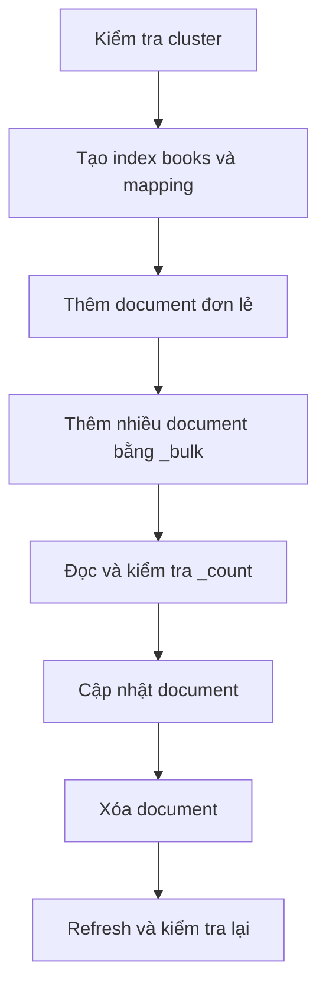

import { Accordion, Accordions } from 'fumadocs-ui/components/accordion';

<Callout type="info" title="Phạm vi bài học">
  Bài này dùng Kibana Dev Tools Console và một Elasticsearch local đang chạy ở `http://localhost:9200`. Bạn sẽ tạo một index sách nhỏ, sau đó thêm, đọc, cập nhật, xóa và đếm document. Các request trong bài đều có thể dán trực tiếp vào Console.
</Callout>

## Mục lục

- [Mô hình dữ liệu trong Elasticsearch](#mô-hình-dữ-liệu-trong-elasticsearch)
  - [Index, document và field](#index-document-và-field)
  - [Luồng thực hành](#luồng-thực-hành)
- [Chuẩn bị và kiểm tra Elasticsearch](#chuẩn-bị-và-kiểm-tra-elasticsearch)
- [Tạo index và mapping tối thiểu](#tạo-index-và-mapping-tối-thiểu)
  - [Mapping là gì](#mapping-là-gì)
  - [Tạo index `books`](#tạo-index-books)
  - [Dynamic mapping trong một ví dụ riêng](#dynamic-mapping-trong-một-ví-dụ-riêng)
- [Thêm document](#thêm-document)
  - [Thêm document với ID tự chọn](#thêm-document-với-id-tự-chọn)
  - [Để Elasticsearch tự sinh ID](#để-elasticsearch-tự-sinh-id)
  - [Đọc lại document](#đọc-lại-document)
- [Thêm nhiều document bằng `_bulk`](#thêm-nhiều-document-bằng-bulk)
- [Cập nhật document](#cập-nhật-document)
- [Xóa document và làm mới kết quả tìm kiếm](#xóa-document-và-làm-mới-kết-quả-tìm-kiếm)
- [Kiểm tra `_count` và xử lý lỗi thường gặp](#kiểm-tra-count-và-xử-lý-lỗi-thường-gặp)
  - [Đếm document](#đếm-document)
  - [Troubleshooting](#troubleshooting)
- [Bước tiếp theo](#bước-tiếp-theo)

## Mô hình dữ liệu trong Elasticsearch

### Index, document và field

**Index** là một không gian chứa các document có mục đích sử dụng gần nhau. Có thể hình dung index giống một bảng trong cơ sở dữ liệu quan hệ, nhưng cách lập chỉ mục và tìm kiếm bên trong khác nhau.

**Document** là một bản ghi dạng JSON. Mỗi document có một `_id` duy nhất trong một index. **Field** là một thuộc tính trong JSON, chẳng hạn `title` hoặc `price`.

Trong bài này, index `books` sẽ chứa các document sách:

```text
books (index)
├── book-001 (document)
│   ├── title (field)
│   ├── author (field)
│   ├── published_at (field)
│   └── price (field)
└── một ID tự sinh (document)
```

Index không phải là một thư mục và document không cần có cùng số lượng field. Tuy nhiên, các field có cùng tên nên có kiểu dữ liệu ổn định. Sự ổn định đó giúp truy vấn, sắp xếp và aggregation (phép tổng hợp như đếm hoặc tính trung bình) hoạt động có thể đoán trước.

### Luồng thực hành

Sơ đồ sau tóm tắt thứ tự các thao tác trong bài:



<Callout type="info" title="Mermaid trong trang này">
  Sơ đồ được chuyển từ code block Mermaid thành component tương tác khi trang được tải. Nếu bạn vừa bật dev server, hãy tải lại trang sau khi cấu hình đã được biên dịch.
</Callout>

## Chuẩn bị và kiểm tra Elasticsearch

Mở **Kibana → Dev Tools → Console**. Console tách request thành hai vùng: vùng bên trái để nhập method, path và body; vùng bên phải để xem response. Nhấn nút chạy request hoặc dùng phím tắt của Kibana.

Kiểm tra cluster trước khi tạo dữ liệu:

```http
GET /
```

Response thành công có dạng tương tự:

```json
{
  "name": "es01",
  "cluster_name": "docker-cluster",
  "cluster_uuid": "...",
  "version": {
    "number": "9.x.y"
  },
  "tagline": "You Know, for Search"
}
```

Trường `version.number` cho biết phiên bản server đang chạy. Tên node và cluster có thể khác tùy cách bạn cài đặt. Nếu Console báo không kết nối được, hãy quay lại [Cài đặt bằng Docker Compose](./cai-dat-docker-compose) hoặc [Cài đặt native](./cai-dat-native) để kiểm tra service.

## Tạo index và mapping tối thiểu

### Mapping là gì

**Mapping** là schema (mô tả kiểu và cách lập chỉ mục của field) của một index. Ví dụ, `title` kiểu `text` được phân tích để tìm từng từ. `author` kiểu `keyword` được giữ nguyên để lọc hoặc nhóm theo tên tác giả.

Một field `text` không phù hợp cho mọi mục đích. Khi cần vừa tìm toàn văn vừa lọc chính xác, ta thường khai báo `text` kèm một subfield `keyword`. Trong mapping dưới đây, `title` có cả hai cách biểu diễn:

- `title`: dùng cho tìm kiếm toàn văn.
- `title.keyword`: dùng cho giá trị chính xác, sort hoặc aggregation.

Các kiểu còn lại phản ánh cách sử dụng trực tiếp: `date` cho ngày, `double` cho giá, và `boolean` cho trạng thái.

### Tạo index `books`

Request sau tạo index mới và khai báo mapping trước khi nạp dữ liệu:

```http
PUT books
{
  "mappings": {
    "properties": {
      "title": {
        "type": "text",
        "fields": {
          "keyword": {
            "type": "keyword"
          }
        }
      },
      "author": {
        "type": "keyword"
      },
      "published_at": {
        "type": "date"
      },
      "price": {
        "type": "double"
      },
      "in_stock": {
        "type": "boolean"
      }
    }
  }
}
```

Response thành công thường là:

```json
{
  "acknowledged": true,
  "shards_acknowledged": true,
  "index": "books"
}
```

`acknowledged` cho biết cluster đã chấp nhận thao tác tạo index. `shards_acknowledged` cho biết các shard (phân vùng dữ liệu) đã được khởi tạo. Nếu chạy lại request, Elasticsearch sẽ trả lỗi `resource_already_exists_exception` vì index đã tồn tại. Khi muốn làm lại từ đầu trong môi trường học tập, xóa index trước bằng `DELETE books`, rồi chạy lại request tạo index.

<Callout type="warn" title="Thói quen an toàn cho schema">
  Trong môi trường thử nghiệm, dynamic mapping giúp khám phá dữ liệu nhanh. Trong ứng dụng thật, hãy thiết kế mapping trước, giới hạn field được phép và kiểm tra dữ liệu đầu vào. Elasticsearch không cho đổi trực tiếp kiểu của một field đã tồn tại; đổi kiểu thường cần tạo index mới và reindex dữ liệu.
</Callout>

### Dynamic mapping trong một ví dụ riêng

**Dynamic mapping** là cơ chế Elasticsearch tự suy ra mapping khi nhận field mới. Cơ chế này tiện cho prototype, nhưng một giá trị không rõ kiểu có thể tạo schema ngoài dự kiến.

Tạo một index riêng để quan sát cơ chế đó:

```http
POST dynamic-books/_doc
{
  "title": "Elasticsearch cho người mới bắt đầu",
  "pages": 320,
  "available": true
}
```

Response có `result: "created"`. Kiểm tra mapping mà Elasticsearch đã suy ra:

```http
GET dynamic-books/_mapping
```

Bạn sẽ thấy `pages` được suy ra là kiểu số, `available` là `boolean`, còn `title` thường là `text` kèm `keyword`. Kết quả chính xác còn phụ thuộc cấu hình dynamic và phiên bản server.

Ví dụ này cho thấy vì sao schema nên được kiểm soát. Nếu document đầu tiên gửi `price` là chuỗi không có quy ước rõ ràng, các document sau có thể không ghi được giá trị số vào cùng field. Với dữ liệu quan trọng, hãy dùng mapping tường minh như index `books` ở trên.

## Thêm document

### Thêm document với ID tự chọn

Dùng `PUT /<index>/_doc/<id>` khi ứng dụng đã có một mã định danh ổn định. ID `book-001` giúp ta đọc, cập nhật hoặc xóa sách mà không phải tìm ID trước.

```http
PUT books/_doc/book-001
{
  "title": "Elasticsearch cho người mới bắt đầu",
  "author": "Nguyễn An",
  "published_at": "2025-01-15",
  "price": 24.5,
  "in_stock": true
}
```

Response thành công có dạng:

```json
{
  "_index": "books",
  "_id": "book-001",
  "_version": 1,
  "result": "created",
  "_shards": {
    "total": 2,
    "successful": 1,
    "failed": 0
  },
  "_seq_no": 0,
  "_primary_term": 1
}
```

`result` là `created` vì đây là document mới. `_version` là phiên bản nội bộ của document. `_seq_no` và `_primary_term` được dùng cho cơ chế đảm bảo thứ tự và kiểm soát xung đột; người mới có thể đọc chúng nhưng không cần tự tính toán.

### Để Elasticsearch tự sinh ID

Dùng `POST /<index>/_doc` khi client chưa có ID. Elasticsearch sẽ tạo một ID chuỗi ngẫu nhiên và trả ID đó trong response.

```http
POST books/_doc
{
  "title": "Tìm kiếm dữ liệu với Query DSL",
  "author": "Trần Bình",
  "published_at": "2024-09-20",
  "price": 31.0,
  "in_stock": true
}
```

Hãy ghi lại giá trị `_id` trong response. Ví dụ:

```json
{
  "_index": "books",
  "_id": "q7L4...",
  "_version": 1,
  "result": "created",
  "_shards": {
    "total": 2,
    "successful": 1,
    "failed": 0
  }
}
```

ID tự sinh phù hợp khi ID chỉ có ý nghĩa trong Elasticsearch. Nếu cần ghi đè đúng một thực thể từ hệ thống khác, nên dùng ID tự chọn.

### Đọc lại document

Dùng ID đã biết để lấy document đầy đủ:

```http
GET books/_doc/book-001
```

Response chứa các trường quan trọng sau:

```json
{
  "_index": "books",
  "_id": "book-001",
  "_version": 1,
  "_seq_no": 0,
  "_primary_term": 1,
  "found": true,
  "_source": {
    "title": "Elasticsearch cho người mới bắt đầu",
    "author": "Nguyễn An",
    "published_at": "2025-01-15",
    "price": 24.5,
    "in_stock": true
  }
}
```

`found: true` xác nhận document tồn tại. `_source` là JSON gốc bạn đã gửi. Nếu ID không tồn tại, response có `found: false` và status HTTP `404`.

## Thêm nhiều document bằng `_bulk`

`_bulk` nhận nhiều thao tác trong một request. Mỗi thao tác gồm **một dòng metadata** và **một dòng document**. Đây là NDJSON (JSON được ngăn cách bằng newline), nên không bọc toàn bộ body trong mảng và không thêm dấu phẩy cuối dòng.

```http
POST _bulk
{ "index": { "_index": "books", "_id": "book-002" } }
{ "title": "Phân tích log với Elasticsearch", "author": "Lê Minh", "published_at": "2025-03-10", "price": 28.0, "in_stock": true }
{ "index": { "_index": "books", "_id": "book-003" } }
{ "title": "Kibana thực hành", "author": "Phạm Hà", "published_at": "2024-11-05", "price": 19.5, "in_stock": false }
```

Response được rút gọn như sau:

```json
{
  "took": 12,
  "errors": false,
  "items": [
    {
      "index": {
        "_index": "books",
        "_id": "book-002",
        "status": 201,
        "result": "created"
      }
    },
    {
      "index": {
        "_index": "books",
        "_id": "book-003",
        "status": 201,
        "result": "created"
      }
    }
  ]
}
```

`errors: false` nghĩa là không có thao tác nào trong batch thất bại. Luôn kiểm tra trường này và từng phần tử trong `items`; HTTP status của cả request không thay thế cho việc kiểm tra từng item. Khi một item lỗi mapping, các item khác vẫn có thể thành công.

<Callout type="idea" title="Mẹo khi soạn NDJSON">
  Trong Dev Tools, đặt con trỏ trong request và kiểm tra từng dòng metadata đi cùng đúng một dòng document. Khi gọi từ script hoặc cURL bên ngoài Console, body `_bulk` còn cần newline ở cuối.
</Callout>

## Cập nhật document

Dùng `_update/<id>` với body `doc` để thay đổi một số field mà không phải gửi lại toàn bộ document:

```http
POST books/_update/book-001
{
  "doc": {
    "price": 22.0,
    "in_stock": false
  }
}
```

Response thành công có `result: "updated"`:

```json
{
  "_index": "books",
  "_id": "book-001",
  "_version": 2,
  "result": "updated",
  "_shards": {
    "total": 2,
    "successful": 1,
    "failed": 0
  }
}
```

Đọc lại `GET books/_doc/book-001` để xác nhận `_source.price` và `_source.in_stock` đã đổi. Nếu muốn thay thế toàn bộ document, dùng lại `PUT books/_doc/book-001` với JSON đầy đủ. Cách thay thế đó có thể làm mất field cũ nếu body mới không chứa chúng.

## Xóa document và làm mới kết quả tìm kiếm

Xóa một document theo ID:

```http
DELETE books/_doc/book-002
```

Response thành công có dạng:

```json
{
  "_index": "books",
  "_id": "book-002",
  "_version": 2,
  "result": "deleted",
  "_shards": {
    "total": 2,
    "successful": 1,
    "failed": 0
  }
}
```

Nếu xóa cùng ID lần nữa, `result` sẽ là `not_found`. Đây không phải lỗi kết nối; chỉ là document đã không còn tồn tại.

Elasticsearch ghi thao tác vào translog (nhật ký thay đổi) trước khi document xuất hiện trong các segment tìm kiếm. **Refresh** là thao tác mở một view tìm kiếm mới để request search nhìn thấy thay đổi. Trong điều kiện bình thường, Elasticsearch tự refresh theo chu kỳ. Khi cần kiểm tra ngay trong bài thực hành, chạy:

```http
POST books/_refresh
```

Response gồm `_shards`, trong đó `successful` cho biết các shard đã xử lý refresh. Với ứng dụng thật, không nên gọi refresh sau từng document vì chi phí I/O cao. Khi cần chờ document có thể tìm thấy trong một request cụ thể, cân nhắc `?refresh=wait_for` thay vì ép refresh toàn index.

## Kiểm tra `_count` và xử lý lỗi thường gặp

### Đếm document

Sau các bước trên, ta đã tạo `book-001`, một document có ID tự sinh, `book-002` và `book-003`, rồi xóa `book-002`. Vì vậy count dự kiến là `3`:

```http
GET books/_count
```

Response:

```json
{
  "count": 3,
  "_shards": {
    "total": 2,
    "successful": 1,
    "skipped": 0,
    "failed": 0
  }
}
```

`count` là số document khớp điều kiện. Không truyền query nghĩa là đếm toàn bộ document trong index. Nếu bạn chạy lại một bước hoặc giữ dữ liệu cũ, con số có thể khác. Để kiểm tra đúng dữ liệu hiện có, chạy thêm:

```http
GET books/_search
{
  "size": 10,
  "sort": [
    { "title.keyword": "asc" }
  ]
}
```

`hits.total.value` trong response search là số lượng khớp theo cách đếm mà Elasticsearch áp dụng. `hits.hits` chứa các document được trả về; `size` chỉ giới hạn số document hiển thị, không làm giảm tổng count.

### Troubleshooting

<Accordions type="single">
  <Accordion title="`resource_already_exists_exception` khi tạo index">
    Index `books` đã tồn tại. Nếu muốn giữ dữ liệu, không chạy lại `PUT books`. Nếu đây chỉ là môi trường học tập, chạy `DELETE books`, sau đó tạo lại mapping và nạp dữ liệu từ đầu. Không xóa index trên môi trường có dữ liệu thật để xử lý một lỗi demo.
  </Accordion>

  <Accordion title="Lỗi `mapper_parsing_exception` khi thêm document">
    Kiểm tra field có đúng kiểu đã khai báo không. Ví dụ `price` phải là số như `24.5`, còn `in_stock` phải là `true` hoặc `false`. Dùng `GET books/_mapping` để xem mapping thực tế. Nếu một field đã bị tạo sai kiểu, tạo index mới với mapping đúng rồi reindex dữ liệu.
  </Accordion>

  <Accordion title="Document đã ghi nhưng search chưa thấy">
    Thử `POST books/_refresh` trong bài học này, rồi chạy lại search. Trong hệ thống thật, hãy hiểu refresh interval và dùng `refresh=wait_for` ở những request cần khả năng đọc ngay. Đừng biến refresh sau từng request thành mặc định.
  </Accordion>

  <Accordion title="`_bulk` báo lỗi dù HTTP request thành công">
    Đọc `errors` và từng object trong `items`. `_bulk` có thể xử lý thành công một phần. Sửa hoặc loại item lỗi, sau đó gửi lại riêng các item đó để tránh tạo bản ghi trùng.
  </Accordion>
</Accordions>

## Bước tiếp theo

Bạn đã có index, mapping và một tập document để thực hành. Hãy chuyển sang [Truy vấn đầu tiên](./truy-van-dau-tien) để dùng `match`, `term`, `bool` và `range` trên index `books`. Nếu muốn quan sát dữ liệu qua giao diện, xem [Sample data](./sample-data) để nạp dataset vào Kibana và mở Discover.

<Cards>
  <Card title="Truy vấn đầu tiên" href="./truy-van-dau-tien" description="Lọc và tìm kiếm document bằng Query DSL." />
  <Card title="Kibana Dev Tools" href="./kibana-dev-tools" description="Làm quen với Console dùng trong các request của bài này." />
  <Card title="Sample data" href="./sample-data" description="Thực hành Discover, dashboard và aggregation với dữ liệu mẫu." />
</Cards>
