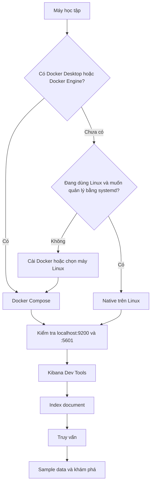

Nhóm **Bắt đầu** đưa bạn từ một máy chưa có Elasticsearch đến một môi trường local có thể index, tìm kiếm và quan sát dữ liệu. Mỗi bài tập đều dùng cùng một luồng: khởi động dịch vụ, gửi request, kiểm tra response rồi ghi lại điều vừa học.

<Callout type="info" title="Phạm vi của nhóm">
  Các hướng dẫn trong nhóm này dành cho học tập và thử nghiệm local. Cấu hình đơn giản, tắt bảo mật hoặc mật khẩu minh họa không được dùng nguyên trạng cho production; hãy chuyển sang tài liệu triển khai và bảo mật trước khi đưa dữ liệu thật vào hệ thống.
</Callout>

## Mục lục

- [Mục tiêu học tập](#mục-tiêu-học-tập)
- [Đối tượng và điều kiện tiên quyết](#đối-tượng-và-điều-kiện-tiên-quyết)
  - [Kiến thức cần có](#kiến-thức-cần-có)
  - [Chuẩn bị môi trường](#chuẩn-bị-môi-trường)
- [Chọn cách cài đặt](#chọn-cách-cài-đặt)
  - [Docker Compose](#docker-compose)
  - [Native trên Linux](#native-trên-linux)
- [Lộ trình thực hành](#lộ-trình-thực-hành)
  - [1. Khởi động Elasticsearch và Kibana](#1-khởi-động-elasticsearch-và-kibana)
  - [2. Gửi request bằng Dev Tools](#2-gửi-request-bằng-dev-tools)
  - [3. Index document đầu tiên](#3-index-document-đầu-tiên)
  - [4. Viết truy vấn đầu tiên](#4-viết-truy-vấn-đầu-tiên)
  - [5. Khám phá sample data](#5-khám-phá-sample-data)
- [Quy ước khi dùng Dev Tools](#quy-ước-khi-dùng-dev-tools)
- [Xử lý lỗi theo một quy trình cố định](#xử-lý-lỗi-theo-một-quy-trình-cố-định)
- [Bước tiếp theo](#bước-tiếp-theo)

## Mục tiêu học tập

Kết thúc nhóm này, bạn có thể:

- phân biệt Elasticsearch (dịch vụ lưu trữ và tìm kiếm) với Kibana (giao diện quản trị và trực quan hóa);
- kiểm tra cluster có sẵn sàng hay chưa bằng một request REST;
- giải thích index, document, field và mapping ở mức đủ để tạo dữ liệu đầu tiên;
- gửi request từ Kibana Dev Tools và đọc các phần quan trọng trong response;
- tạo document, tìm document, cập nhật và xóa dữ liệu bằng Elasticsearch API;
- dùng `match`, `term`, `bool`, `filter` và `range` cho các truy vấn cơ bản;
- nạp sample data để thực hành Discover, dashboard và aggregation.

Mục tiêu không phải là thuộc mọi API. Mục tiêu là hình thành một vòng lặp có thể lặp lại: **đặt câu hỏi → viết request → đọc response → kiểm tra giả thuyết**.

## Đối tượng và điều kiện tiên quyết

Nhóm này phù hợp với người mới làm quen Elasticsearch, developer muốn thử một search engine local hoặc người cần nền tảng trước khi học ingestion và production. Bạn không cần biết trước Lucene hay kiến trúc cluster phân tán.

### Kiến thức cần có

Bạn sẽ học dễ hơn nếu đã biết:

- sử dụng terminal và chạy một lệnh trong thư mục dự án;
- đọc JSON với các cặp key–value và mảng;
- hiểu HTTP ở mức cơ bản: method như `GET` và `POST`, URL, status code và request body.

Ví dụ, `GET /_cluster/health` nghĩa là gửi method `GET` đến endpoint kiểm tra sức khỏe cluster. Phần sau dấu `/` là API path, không phải một file trên máy.

### Chuẩn bị môi trường

Chọn **một** trong hai cách cài đặt ở phần kế tiếp. Sau khi hoàn thành, bạn cần truy cập được:

- Elasticsearch tại `http://localhost:9200`;
- Kibana tại `http://localhost:5601`;
- một terminal để xem log và trạng thái dịch vụ;
- trình duyệt hiện đại nếu muốn dùng giao diện Kibana.

<Callout type="idea" title="Đừng chạy hai cách cùng lúc">
  Docker Compose và native đều có thể chiếm cổng `9200` và `5601`. Nếu đã chạy một cách, hãy dừng nó trước khi khởi động cách còn lại để tránh nhầm endpoint hoặc lỗi bind port.
</Callout>

## Chọn cách cài đặt

Sơ đồ dưới đây giúp chọn điểm bắt đầu. Hai nhánh hội tụ ở cùng một bài Dev Tools, vì các request Elasticsearch về sau không phụ thuộc cách bạn cài dịch vụ.

### Docker Compose

Chọn [cài đặt bằng Docker Compose](./cai-dat-docker-compose) nếu bạn muốn một môi trường có thể tạo, dừng và xóa bằng lệnh. Đây thường là lựa chọn nhanh nhất cho workshop hoặc máy đã có Docker. Container cũng giữ các thiết lập cài đặt tách khỏi hệ điều hành host.

Hạn chế của cách này là bạn cần hiểu volume, log và network cơ bản của Docker. Dữ liệu có thể mất nếu bạn xóa volume theo hướng dẫn dọn dẹp, nên đừng dùng dữ liệu thật trong môi trường học tập.

### Native trên Linux

Chọn [cài đặt native](./cai-dat-native) nếu bạn dùng Linux, muốn học service `systemd`, đường dẫn cấu hình và log của một gói cài đặt trực tiếp. Cách này giúp bạn hiểu rõ hơn tiến trình chạy trên host.

Native đòi hỏi nhiều thao tác hệ thống hơn. Bạn phải tự theo dõi quyền file, bộ nhớ, service và cách gỡ cài đặt. Hãy dùng đúng phiên bản Elasticsearch và Kibana theo cặp được tài liệu cài đặt chỉ rõ.

## Lộ trình thực hành

Đọc theo thứ tự dưới đây nếu đây là lần đầu bạn dùng Elasticsearch. Sau mỗi bài, giữ lại các request đã chạy thành công trong một file ghi chú; đó là “bộ kiểm tra khói” (smoke test — một nhóm kiểm tra nhanh) cho các lần khởi động sau.

### 1. Khởi động Elasticsearch và Kibana

Bắt đầu với [Docker Compose](./cai-dat-docker-compose) hoặc [native](./cai-dat-native). Đừng chuyển sang request khi chưa xác nhận service đã sẵn sàng.

Một kiểm tra tối thiểu là mở `http://localhost:9200` hoặc chạy request `GET /` trong Dev Tools. Response thành công thường có thông tin node và phiên bản. Nếu endpoint yêu cầu xác thực, dùng thông tin đăng nhập mà phương pháp cài đặt đã tạo thay vì tắt bảo mật một cách tùy tiện.

### 2. Gửi request bằng Dev Tools

Đọc [Kibana Dev Tools](./kibana-dev-tools) để biết cách mở Console, chọn một request, chạy từng block và phân biệt request với response. Bài này cũng giới thiệu cách chuyển một request cURL sang cú pháp Console.

Từ đây, ưu tiên chạy request trong Dev Tools. Cách này giảm lỗi copy URL, hiển thị JSON dễ đọc và giúp bạn xem lại lịch sử request. Khi cần tự động hóa, bạn có thể chuyển cùng request sang cURL hoặc client chính thức.

### 3. Index document đầu tiên

Trong [Index document đầu tiên](./index-document-dau-tien), bạn tạo một index (không gian logic chứa các document), thêm vài document JSON và đọc lại chúng. Hãy quan sát `_id`, `_source` và mapping được tạo như thế nào.

Đây là mốc quan trọng: nếu chưa index được một document và kiểm tra được nó bằng `GET`, việc debug query sẽ dễ bị nhầm giữa lỗi dữ liệu và lỗi cú pháp.

### 4. Viết truy vấn đầu tiên

Sau khi có dữ liệu, làm theo [Truy vấn đầu tiên](./truy-van-dau-tien). Bắt đầu bằng `match_all` để chắc chắn index có dữ liệu. Sau đó chuyển sang `match` cho văn bản, `term` cho giá trị chính xác và `bool` để ghép nhiều điều kiện.

Mỗi query nên trả lời một câu hỏi cụ thể. Ví dụ: “document nào có tiêu đề chứa `elasticsearch`?” khác với “document nào có trạng thái chính xác là `published`?”. Hai câu hỏi này thường cần hai loại query khác nhau.

### 5. Khám phá sample data

Cuối cùng, mở [Sample data](./sample-data) để nạp dữ liệu có sẵn trong Kibana. Discover cho bạn góc nhìn từng document; dashboard cho bạn góc nhìn tổng hợp; aggregation (phép tổng hợp) giúp đếm, nhóm hoặc tính toán trên nhiều document.

Sample data là cầu nối từ request nhỏ sang bài toán phân tích. Hãy thử thay đổi time range và lọc một field trước khi học các chủ đề nâng cao.

## Quy ước khi dùng Dev Tools

Dùng các quy ước sau để request dễ đọc và kết quả dễ đối chiếu:

1. Mỗi request bắt đầu ở một dòng có method và path, chẳng hạn `GET /movies/_search`.
2. Đặt JSON body ở các dòng kế tiếp và dùng hai khoảng trắng để thụt lề.
3. Chạy từng request độc lập. Khi cần chạy nhiều request, ngăn cách chúng bằng một dòng trống.
4. Đọc `"status"`, `"error"`, `"hits.total"` và `"hits.hits"` trước khi xem các field chi tiết.
5. Ghi lại index và điều kiện query trong tên ghi chú. `GET /_search` và `GET /movies/_search` có phạm vi rất khác nhau.

<Callout type="warn" title="Cẩn thận với request ghi dữ liệu">
  `PUT`, `POST`, `DELETE` có thể thay đổi dữ liệu. Trong bài học, dùng tên index riêng như `learn-*`, kiểm tra path trước khi chạy và không dán thông tin đăng nhập vào tài liệu công khai.
</Callout>

## Xử lý lỗi theo một quy trình cố định

Khi request thất bại, đừng đổi nhiều thứ cùng lúc. Kiểm tra theo thứ tự này:

1. **Endpoint:** service có đang chạy không? Mở `localhost:9200` và `localhost:5601`.
2. **Xác thực:** response là `401` hoặc `403`? Kiểm tra user, password và cách cài đặt đã chọn.
3. **Tên index:** lỗi `index_not_found_exception` thường có nghĩa index chưa được tạo hoặc bạn gõ sai tên.
4. **Cú pháp body:** dùng JSON hợp lệ, kiểm tra dấu ngoặc và đặt query đúng trong body.
5. **Dữ liệu:** chạy `match_all` hoặc `GET /<index>/_count` để tách lỗi query khỏi việc index đang rỗng.
6. **Log:** xem log Elasticsearch hoặc container khi lỗi liên quan bộ nhớ, cổng, quyền file hay khởi động.

Nếu lỗi vẫn còn, ghi lại request tối thiểu, status code, phần `error.type`, `error.reason` và cách cài đặt. Một báo cáo có đủ bốn thông tin này hữu ích hơn ảnh chụp toàn bộ màn hình.

## Bước tiếp theo

Khi đã hoàn thành năm bước, bạn có thể chuyển sang [Elasticsearch Core](../elasticsearch-core) để học sâu hơn về dữ liệu, mapping và search. Nếu mục tiêu là đưa dữ liệu từ ứng dụng vào cluster, hãy tiếp tục với [Data Ingestion](../data-ingestion).

<Cards>
  <Card title="Cài đặt bằng Docker Compose" href="./cai-dat-docker-compose" description="Tạo môi trường Elasticsearch và Kibana local bằng container." />
  <Card title="Cài đặt native" href="./cai-dat-native" description="Cài đặt trực tiếp trên Linux và quản lý service bằng systemd." />
  <Card title="Kibana Dev Tools" href="./kibana-dev-tools" description="Gửi request REST và đọc response trong Console." />
  <Card title="Index document đầu tiên" href="./index-document-dau-tien" description="Tạo index, thêm document và kiểm tra dữ liệu." />
  <Card title="Truy vấn đầu tiên" href="./truy-van-dau-tien" description="Bắt đầu với Query DSL và các điều kiện tìm kiếm phổ biến." />
  <Card title="Sample data" href="./sample-data" description="Thực hành Discover, dashboard và aggregation với dữ liệu mẫu." />
</Cards>
