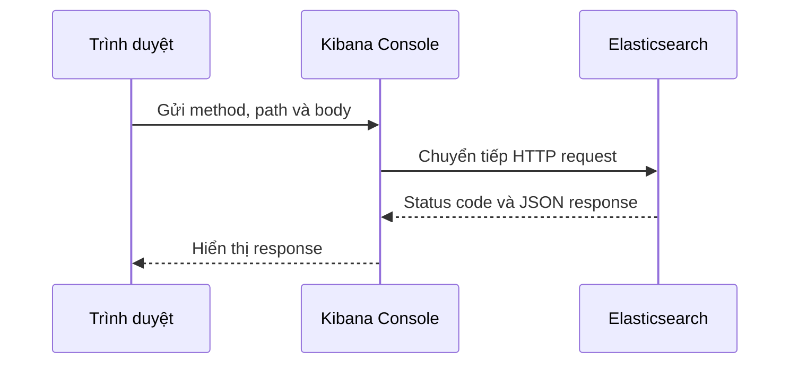

import { Step, Steps } from 'fumadocs-ui/components/steps';
import { Accordion, Accordions } from 'fumadocs-ui/components/accordion';

<Callout type="info" title="Phạm vi bài viết">
  Bài này dùng Console cho môi trường học tập local. Bạn cần có một Elasticsearch và Kibana đang chạy, thường là tại `http://localhost:9200` và `http://localhost:5601`. Không chạy các request tạo hoặc xóa dữ liệu thử nghiệm trên cluster production.
</Callout>

## Mục lục

- [Dev Tools Console là gì?](#dev-tools-console-là-gì)
- [Mở Console](#mở-console)
- [Luồng request và response](#luồng-request-và-response)
- [Đọc một request](#đọc-một-request)
  - [Method, path và body](#method-path-và-body)
- [Gửi request đầu tiên](#gửi-request-đầu-tiên)
  - [Kiểm tra cluster](#kiểm-tra-cluster)
  - [Tạo và xóa index thử nghiệm](#tạo-và-xóa-index-thử-nghiệm)
- [Tính năng giúp viết request nhanh hơn](#tính-năng-giúp-viết-request-nhanh-hơn)
- [Console và curl khác nhau như thế nào?](#console-và-curl-khác-nhau-như-thế-nào)
- [Xử lý lỗi thường gặp](#xử-lý-lỗi-thường-gặp)
- [Bài tập nhỏ](#bài-tập-nhỏ)
- [Bước tiếp theo](#bước-tiếp-theo)

## Dev Tools Console là gì?

**Dev Tools** là nhóm công cụ trong Kibana. Trong nhóm đó, **Console** là trình soạn thảo để gửi request HTTP trực tiếp đến Elasticsearch và hiển thị response ngay bên cạnh. Bạn có thể thử API mà không phải tự viết một ứng dụng hoặc nhớ cú pháp `curl` cho từng request.

Một request HTTP có ba phần quan trọng:

- **Method** mô tả thao tác, chẳng hạn `GET` để đọc và `PUT` để tạo hoặc thay thế.
- **Path** là đường dẫn API, chẳng hạn `/_cluster/health` hoặc `/books/_doc/1`.
- **Body** là JSON đi kèm request khi API cần dữ liệu. Ví dụ, request tạo document có body chứa `title` và `year`.

Console phù hợp để học và debug API. Khi cần chạy tự động trong script hoặc pipeline, bạn thường chuyển request sang client Elasticsearch hoặc `curl`.

## Mở Console

Trước tiên, mở Kibana trong trình duyệt. Với cài đặt local phổ biến, địa chỉ là `http://localhost:5601`.

<Steps>
<Step>

### Đăng nhập Kibana

Đăng nhập bằng tài khoản đã tạo trong bài [cài đặt bằng Docker Compose](./cai-dat-docker-compose) hoặc [cài đặt native](./cai-dat-native). Nếu Kibana không mở được, hãy quay lại bài cài đặt và kiểm tra service trước khi dùng Console.

</Step>
<Step>

### Chọn Dev Tools

Mở menu điều hướng của Kibana, chọn **Dev Tools**, rồi mở **Console**. Tên hoặc vị trí menu có thể thay đổi nhẹ giữa các phiên bản Kibana, nhưng Console luôn nằm trong khu vực Dev Tools.

</Step>
<Step>

### Nhận biết hai vùng làm việc

Editor ở bên trái là nơi viết request. Vùng bên phải hiển thị status code, header và JSON response. Bấm nút chạy hình tam giác của editor, hoặc dùng `Ctrl+Enter` trên hệ điều hành hỗ trợ phím tắt đó, để gửi request đang chọn.

</Step>
</Steps>

<Callout type="idea" title="Mẹo kiểm tra kết nối">
  Hãy gửi `GET /` ngay sau khi mở Console. Nếu request này trả về JSON có thông tin cluster, Console đã liên lạc được với Elasticsearch.
</Callout>

## Luồng request và response

Console không làm cho Elasticsearch trở thành một phần của trình duyệt. Kibana nhận request từ editor rồi chuyển request đó đến Elasticsearch bằng kết nối server-side.



<Callout type="info" title="Về Mermaid">
  Code block Mermaid trong trang này được Fumadocs chuyển thành component Mermaid ở bước biên dịch. Sơ đồ sẽ được vẽ sau khi trình duyệt tải JavaScript; nếu vừa đổi cấu hình, hãy khởi động lại dev server và tải lại trang.
</Callout>

Luồng này giải thích một số hành vi thường gây nhầm lẫn. Trình duyệt của bạn chỉ cần truy cập được Kibana; nó không nhất thiết phải truy cập trực tiếp cổng Elasticsearch. Ngược lại, Kibana phải kết nối được đến Elasticsearch và có quyền thực thi request.

## Đọc một request

Trong Console, một request thường có dạng sau:

```http
GET /books/_search
{
  "query": {
    "match_all": {}
  }
}
```

### Method, path và body

`GET` là method. `/books/_search` là path, trong đó `books` là tên index và `_search` là API tìm kiếm. JSON sau dòng đầu tiên là body. `match_all` yêu cầu Elasticsearch trả về các document phù hợp với mọi điều kiện, tức là không lọc document nào.

Bạn có thể đặt nhiều request trong cùng một editor. Dùng một dòng trống để Console nhận biết ranh giới:

```http
GET /_cluster/health

GET /books/_count
```

Chạy một request cụ thể bằng cách đặt con trỏ bên trong request đó hoặc bôi đen phần request rồi bấm nút chạy. Nếu không chọn đúng request, Console có thể gửi cả khối nhiều request cùng lúc.

Response thường có ba thông tin nên đọc theo thứ tự:

1. **Status code** cho biết request thành công hay thất bại. `200` thường là đọc thành công, `201` thường là tạo document thành công, còn `4xx` thường là lỗi từ request hoặc quyền truy cập.
2. **Body** chứa dữ liệu trả về. Với search, kết quả thường nằm trong `hits.hits`.
3. **Error message** mô tả nguyên nhân khi request thất bại. Đọc phần `reason` trước khi sửa request.

Ví dụ, cùng một request có trạng thái trước và sau như sau:

```http
GET /books/_count
```

Trước khi index `books` tồn tại, response có thể là `404 Not Found` và báo index không tồn tại. Sau khi index có document, response thành công có dạng gần như:

```json
{
  "count": 1,
  "_shards": {
    "total": 1,
    "successful": 1,
    "skipped": 0,
    "failed": 0
  }
}
```

Con số `count` phụ thuộc dữ liệu bạn đã nạp. Đừng so sánh nguyên văn toàn bộ response vì Elasticsearch có thể bổ sung metadata khác nhau giữa các phiên bản.

## Gửi request đầu tiên

### Kiểm tra cluster

Bắt đầu bằng hai request chỉ đọc. Chúng không tạo hoặc sửa dữ liệu:

```http
GET /

GET /_cluster/health?pretty=true
```

Request `GET /` trả về tên cluster và thông tin phiên bản. Request thứ hai trả về sức khỏe cluster. Trong môi trường một node, trạng thái `yellow` có thể là bình thường vì replica chưa được phân bổ. `red` cần được điều tra vì một phần dữ liệu không sẵn sàng.

Ví dụ response rút gọn của request health:

```json
{
  "cluster_name": "local-cluster",
  "status": "yellow",
  "number_of_nodes": 1,
  "active_primary_shards": 1
}
```

Tên cluster, số shard và status trong máy của bạn có thể khác. Điều cần kiểm tra trước tiên là request trả về response JSON, không phải một trang lỗi HTML.

### Tạo và xóa index thử nghiệm

Index là nơi Elasticsearch lưu các document có liên quan. Trong bài thực hành này, dùng tên `devtools-lab` để dễ nhận biết và tránh chạm vào index khác.

Tạo index với một shard chính và không có replica. Cấu hình này tiết kiệm tài nguyên cho máy học tập một node; nó không phải cấu hình production:

```http
PUT /devtools-lab
{
  "settings": {
    "number_of_shards": 1,
    "number_of_replicas": 0
  }
}
```

Response thành công thường có `"acknowledged": true`. Kiểm tra index vừa tạo:

```http
GET /devtools-lab
```

Bây giờ thêm một document với ID cố định. Dùng `PUT` giúp bạn chạy lại ví dụ mà không tạo thêm ID ngẫu nhiên:

```http
PUT /devtools-lab/_doc/1
{
  "title": "Học Console",
  "topic": "elasticsearch",
  "difficulty": "beginner"
}
```

Đọc lại document:

```http
GET /devtools-lab/_doc/1
```

Bạn sẽ thấy dữ liệu trong trường `_source`. Khi đã kiểm tra xong, xóa đúng index thử nghiệm:

```http
DELETE /devtools-lab
```

<Callout type="warn" title="Kiểm tra tên trước khi DELETE">
  `DELETE /devtools-lab` xóa toàn bộ index và document bên trong. Luôn kiểm tra path, chỉ dùng tên `devtools-lab` trong bài này, và không chạy lệnh xóa trên dữ liệu production. Nếu chỉ muốn xóa một document, dùng API `_doc/1` với đúng ID thay vì xóa cả index.
</Callout>

## Tính năng giúp viết request nhanh hơn

Console có các tính năng hỗ trợ việc học API:

- **Autocomplete** gợi ý endpoint, tên field và một số tham số khi bạn gõ. Chọn gợi ý để giảm lỗi chính tả, nhưng vẫn đọc request mà nó chèn vào.
- **Syntax highlighting** tô màu method, path và JSON. Nếu cả body bị tô như một dòng chữ, kiểm tra dấu ngoặc kép và dấu phẩy.
- **History** cho phép xem lại các request đã chạy trong Console. Dùng history để phục hồi một request dài thay vì viết lại từ đầu. Hãy xem lại path trước khi chạy lại request có tác dụng ghi hoặc xóa.
- **Nhiều request trong một editor** giúp bạn lưu một chuỗi kiểm tra liên quan. Dòng trống giữa các request làm ranh giới rõ ràng hơn.

<Callout type="idea" title="Tạo thói quen an toàn">
  Đặt các request đọc như `GET` ở đầu file và request ghi/xóa ở cuối file. Trước khi chạy khối nhiều request, chọn đúng request cần chạy và đọc lại method cùng index.
</Callout>

## Console và curl khác nhau như thế nào?

Hai cách đều gửi HTTP request đến Elasticsearch, nhưng đường đi và cách cung cấp thông tin xác thực khác nhau:

| Tiêu chí | Kibana Console | `curl` |
| --- | --- | --- |
| Điểm bắt đầu | Editor trong Kibana | Terminal hoặc script |
| Kết nối | Kibana chuyển tiếp request đến Elasticsearch | Máy chạy `curl` kết nối trực tiếp đến Elasticsearch |
| Xác thực | Thường dùng phiên đăng nhập Kibana và quyền của người dùng | Bạn phải truyền credential, token hoặc certificate phù hợp |
| Khả năng lặp lại | Tốt cho khám phá API và xem history | Tốt cho script, CI và kiểm thử tự động |
| Header | Console xử lý phần lớn header cho request JSON | Bạn thường phải tự thêm `Content-Type` và thông tin xác thực |

Ví dụ kiểm tra health bằng `curl` trong môi trường local có bảo mật và tài khoản `elastic`:

```bash
export ELASTICSEARCH_URL="https://localhost:9200"
export ELASTIC_PASSWORD="thay-bang-mat-khau-local"

curl --fail-with-body --insecure \
  -u "elastic:${ELASTIC_PASSWORD}" \
  "${ELASTICSEARCH_URL}/_cluster/health?pretty=true"
```

`--insecure` bỏ qua việc kiểm tra certificate. Chỉ dùng tùy chọn này cho certificate local mà bạn hiểu rõ; không dùng nó như giải pháp TLS cho production. Với cài đặt HTTP không bật TLS, đổi URL thành `http://localhost:9200` và bỏ `--insecure`.

Khi chuyển request ghi từ Console sang `curl`, thêm header JSON và body đúng định dạng:

```bash
curl --fail-with-body --insecure \
  -u "elastic:${ELASTIC_PASSWORD}" \
  -H 'Content-Type: application/json' \
  -X PUT "${ELASTICSEARCH_URL}/devtools-lab/_doc/1" \
  -d '{"title":"Học Console","topic":"elasticsearch","difficulty":"beginner"}'
```

Console giúp bạn khám phá request an toàn hơn trong giao diện. `curl` giúp bạn biến cùng request thành lệnh có thể đưa vào script. Trước khi tự động hóa, hãy chạy thử request trong Console và xác nhận response mong đợi.

## Xử lý lỗi thường gặp

<Accordions type="single">
  <Accordion title="401 Unauthorized hoặc 403 Forbidden">
    `401` thường có nghĩa là phiên đăng nhập, mật khẩu hoặc token không hợp lệ. Đăng nhập lại Kibana và thử `GET /` một lần nữa. `403` thường có nghĩa là tài khoản đã được xác thực nhưng thiếu quyền với API hoặc index đó. Hãy dùng tài khoản có quyền phù hợp trong môi trường local; không cấp quyền quản trị rộng hơn cho ứng dụng chỉ để che lỗi.
  </Accordion>
  <Accordion title="Kibana không kết nối được Elasticsearch">
    Nếu Console báo không thể kết nối, kiểm tra Elasticsearch trước: mở `http://localhost:9200` hoặc chạy `curl` tương đương. Với Docker Compose, chạy `docker compose ps` và `docker compose logs elasticsearch`. Với cài đặt native, kiểm tra service bằng `sudo systemctl status elasticsearch`. Sau đó kiểm tra cấu hình kết nối Elasticsearch của Kibana và khởi động lại service nếu vừa đổi cấu hình.
  </Accordion>
  <Accordion title="404 Not Found hoặc index không tồn tại">
    Kiểm tra lại path, tên index và dấu gạch dưới trong API, chẳng hạn `/_cluster/health` và `/devtools-lab/_doc/1`. Nếu index chưa được tạo, chạy `PUT /devtools-lab` trước. `GET /_cat/indices?v` có thể giúp xem các index mà tài khoản hiện tại được phép nhìn thấy.
  </Accordion>
  <Accordion title="400 Bad Request hoặc lỗi JSON">
    Kiểm tra dấu ngoặc `{}`, dấu ngoặc kép và dấu phẩy trong body. Đừng đặt comment kiểu `//` bên trong JSON. Nếu lỗi nhắc đến `Content-Type` khi dùng `curl`, thêm `-H 'Content-Type: application/json'`; trong Console, để body JSON ngay sau dòng method và path.
  </Accordion>
  <Accordion title="Index đã tồn tại hoặc request bị gửi lặp">
    `PUT /devtools-lab` lần thứ hai có thể trả lỗi index đã tồn tại. Đây không nhất thiết là lỗi kết nối. Dùng `GET /devtools-lab` để kiểm tra index, hoặc xóa đúng index thử nghiệm rồi tạo lại. Với document, `PUT /devtools-lab/_doc/1` chạy lại sẽ cập nhật document có ID `1`, nên hãy đọc method và ID trước khi chạy.
  </Accordion>
</Accordions>

## Bài tập nhỏ

Hoàn thành bài tập sau trong một index local riêng. Mục tiêu là đi qua đủ vòng đời request mà không cần dùng dữ liệu có sẵn:

1. Tạo index `devtools-practice` với một shard và không có replica.
2. Thêm hai document vào `devtools-practice/_doc/1` và `devtools-practice/_doc/2`. Mỗi document có `title`, `category` và `published_year`.
3. Dùng `GET /devtools-practice/_search` với `match_all` để đọc hai document.
4. Dùng `GET /devtools-practice/_count` để kiểm tra tổng số document.
5. Xóa một document bằng ID, kiểm tra lại `_count`, rồi xóa cả index `devtools-practice`.

Gợi ý request tìm kiếm:

```http
GET /devtools-practice/_search
{
  "query": {
    "match": {
      "category": "elasticsearch"
    }
  }
}
```

Nếu `category` được tạo động là field văn bản, `match` phù hợp hơn `term` cho bài đầu tiên. Bài [truy vấn đầu tiên](./truy-van-dau-tien) sẽ giải thích rõ hơn sự khác nhau giữa tìm kiếm toàn văn và lọc giá trị chính xác.

## Bước tiếp theo

Bạn đã biết cách mở Console, kiểm tra cluster, tạo document và đọc response. Hãy học theo thứ tự sau:

<Cards>
  <Card title="Index document đầu tiên" href="./index-document-dau-tien" description="Tạo index, thêm document và kiểm tra dữ liệu bằng API cơ bản." />
  <Card title="Truy vấn đầu tiên" href="./truy-van-dau-tien" description="Dùng Query DSL để tìm kiếm và lọc document." />
  <Card title="Cài đặt bằng Docker Compose" href="./cai-dat-docker-compose" description="Dựng lại môi trường Elasticsearch và Kibana local khi cần." />
</Cards>
