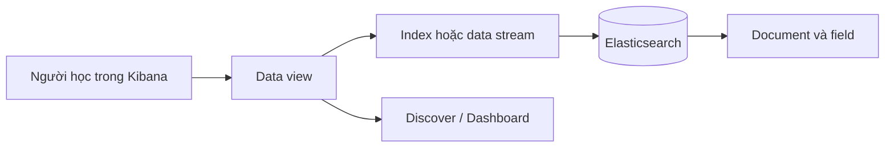

import { Tab, Tabs } from 'fumadocs-ui/components/tabs';
import { Step, Steps } from 'fumadocs-ui/components/steps';

<Callout type="info" title="Phạm vi của bài">
  Bài này dùng các bộ dữ liệu mẫu của Kibana trong môi trường local. Dữ liệu mẫu giúp luyện tập, không đại diện cho dữ liệu production và không nên được nạp vào cluster thật.
</Callout>

## Mục lục

- [Mục tiêu và điều kiện](#mục-tiêu-và-điều-kiện)
- [Phân biệt index, data stream và data view](#phân-biệt-index-data-stream-và-data-view)
  - [Mô hình liên kết](#mô-hình-liên-kết)
- [Nạp sample data tích hợp trong Kibana](#nạp-sample-data-tích-hợp-trong-kibana)
  - [Mở trang Sample data](#mở-trang-sample-data)
  - [Chọn bộ dữ liệu](#chọn-bộ-dữ-liệu)
- [Kiểm tra dữ liệu sau khi nạp](#kiểm-tra-dữ-liệu-sau-khi-nạp)
  - [Kiểm tra bằng Dev Tools](#kiểm-tra-bằng-dev-tools)
  - [Tạo data view](#tạo-data-view)
- [Khám phá bằng Discover và dashboard](#khám-phá-bằng-discover-và-dashboard)
  - [Discover](#discover)
  - [Dashboard](#dashboard)
- [Truy vấn và aggregation minh họa](#truy-vấn-và-aggregation-minh-họa)
  - [Lọc theo thời gian và trường](#lọc-theo-thời-gian-và-trường)
  - [Đếm theo một trường](#đếm-theo-một-trường)
- [Fallback: tạo dataset nhỏ bằng Dev Tools](#fallback-tạo-dataset-nhỏ-bằng-dev-tools)
- [Xóa sample data](#xóa-sample-data)
- [Troubleshooting](#troubleshooting)
  - [Không thấy Sample data hoặc nút Add data](#không-thấy-sample-data-hoặc-nút-add-data)
  - [Kibana chưa kết nối Elasticsearch](#kibana-chưa-kết-nối-elasticsearch)
  - [Data view không có document](#data-view-không-có-document)
- [Bước tiếp theo](#bước-tiếp-theo)

## Mục tiêu và điều kiện

Sau khi hoàn thành, bạn có thể:

- nạp một bộ dữ liệu mẫu có sẵn trong Kibana;
- nhận biết index chứa document và data view giúp Kibana đọc index đó;
- mở dữ liệu trong Discover, đọc dashboard dựng sẵn và chạy truy vấn trong Dev Tools;
- xóa dữ liệu mẫu mà không nhầm với data thật.

Bạn cần một Elasticsearch và Kibana đang chạy. Nếu chưa có môi trường, hãy làm theo [Cài đặt bằng Docker Compose](./cai-dat-docker-compose) hoặc [Cài đặt native](./cai-dat-native). Mở Kibana tại `http://localhost:5601` nếu bạn dùng cổng mặc định.

<Callout type="warn" title="Dữ liệu mẫu có thể tạo nhiều document">
  Bộ dữ liệu Web logs thường lớn hơn hai bộ còn lại. Nếu máy có ít bộ nhớ, hãy bắt đầu bằng Flights hoặc eCommerce. Các tên menu và vị trí nút có thể thay đổi theo phiên bản Kibana, nhưng luồng thao tác vẫn là mở trang thêm dữ liệu, chọn bộ dữ liệu và xác nhận nạp.
</Callout>

## Phân biệt index, data stream và data view

Ba khái niệm này thường xuất hiện cùng nhau nhưng không phải là một:

| Khái niệm | Vai trò | Ví dụ trong bài |
| --- | --- | --- |
| **Index** | Nơi Elasticsearch lưu các document có cấu trúc tương tự. Có thể hình dung đây là một tập dữ liệu có tên. | `kibana_sample_data_ecommerce` |
| **Data stream** | Một đích ghi dữ liệu dạng time series. Elasticsearch quản lý nhiều backing index phía sau và định tuyến document mới vào backing index phù hợp. | Một stream log có tên `logs-my_app-default` |
| **Data view** | Cấu hình ở lớp Kibana, thường chứa một pattern như `kibana_sample_data_*`, để Discover và dashboard biết cần đọc index hoặc data stream nào. Data view không chứa document. | `kibana_sample_data_ecommerce` |

Index và data stream thuộc Elasticsearch. Data view thuộc Kibana. Vì vậy xóa data view chỉ xóa cấu hình hiển thị, không xóa index; ngược lại, xóa index sẽ làm data view không còn dữ liệu để đọc.

### Mô hình liên kết



<Callout type="info" title="Về Mermaid">
  Site đã cấu hình plugin Mermaid của Fumadocs và component render ở phía trình duyệt. Sau khi thay đổi cấu hình, hãy khởi động lại dev server để MDX được biên dịch lại.
</Callout>

## Nạp sample data tích hợp trong Kibana

Kibana cung cấp các bộ dữ liệu kèm data view và dashboard mẫu. Dữ liệu này phù hợp để làm quen với giao diện trước khi tự thiết kế mapping hoặc pipeline.

### Mở trang Sample data

<Steps>
<Step>

### Mở Kibana

Đăng nhập vào Kibana bằng tài khoản của môi trường local. Từ trang Home, tìm nút hoặc liên kết có tên **Add sample data**, **Add data** hoặc **Sample data**. Ở một số phiên bản, mục này nằm trong phần **Analytics** hoặc menu ứng dụng bên trái.

</Step>
<Step>

### Kiểm tra cluster trước khi nạp

Mở [Kibana Dev Tools](./kibana-dev-tools) và chạy:

```http
GET _cluster/health
```

Nếu response có trường `status` là `green` hoặc `yellow`, cluster đã phản hồi. Với cluster một node dùng cho học tập, `yellow` thường chỉ có nghĩa là replica chưa được phân bổ; đây không nhất thiết là lỗi nạp dữ liệu.

</Step>
<Step>

### Mở danh sách dữ liệu mẫu

Quay lại trang Sample data. Đọc mô tả và kích thước ước lượng trước khi chọn. Không cần tự tạo index trước, vì Kibana sẽ tạo index, data view và saved objects cần thiết cho bộ dữ liệu được chọn.

</Step>
</Steps>

### Chọn bộ dữ liệu

Tên chính xác có thể thay đổi theo phiên bản Kibana. Các lựa chọn thường gặp là:

- **Sample eCommerce orders**: đơn hàng và sản phẩm. Đây là lựa chọn tốt để thử `date_histogram`, tổng doanh thu và lọc theo danh mục.
- **Sample flight data**: các chuyến bay, sân bay và độ trễ. Bộ này phù hợp để làm quen với bản đồ và dashboard theo thời gian.
- **Sample web logs**: log truy cập web. Bộ này phù hợp với Discover và phân tích request, nhưng có thể chiếm nhiều dung lượng hơn.

Nhấn **Add data** trên thẻ của bộ muốn dùng và chờ trạng thái chuyển thành đã nạp. Mỗi bộ có thể tạo nhiều thành phần: index, data view và dashboard. Hãy ghi lại tên index hiển thị trong thẻ để dùng khi kiểm tra bằng Dev Tools.

<Callout type="idea" title="Nên bắt đầu từ eCommerce">
  eCommerce có trường ngày và trường số rõ ràng. Bạn có thể học đủ luồng nạp dữ liệu → tạo data view → khám phá → aggregation mà không cần hiểu log format trước.
</Callout>

## Kiểm tra dữ liệu sau khi nạp

Đừng chỉ dựa vào thông báo thành công của giao diện. Hãy kiểm tra trực tiếp Elasticsearch để phân biệt trường hợp index đã có dữ liệu với trường hợp chỉ tạo được cấu hình Kibana.

### Kiểm tra bằng Dev Tools

Ví dụ sau dùng index eCommerce. Nếu bạn chọn Flights hoặc Web logs, thay tên index bằng tên thực tế Kibana hiển thị.

```http
GET kibana_sample_data_ecommerce/_count
```

Response thành công có dạng rút gọn:

```json
{
  "count": 4675,
  "_shards": {
    "total": 1,
    "successful": 1,
    "skipped": 0,
    "failed": 0
  }
}
```

Con số có thể khác giữa các phiên bản. Điều cần kiểm tra là `count` lớn hơn `0`. Tiếp theo, xem một document để biết tên field thật trước khi viết query:

```http
GET kibana_sample_data_ecommerce/_search
{
  "size": 1
}
```

Để xem mapping và biết field nào là `date`, `keyword` hoặc `text`, chạy:

```http
GET kibana_sample_data_ecommerce/_mapping
```

`text` dành cho tìm kiếm toàn văn. `keyword` phù hợp với lọc chính xác và terms aggregation. Nếu một field text có multi-field, field dùng cho aggregation thường có hậu tố `.keyword`. Không đoán tên field khi query; hãy kiểm tra mapping hoặc document mẫu trước.

### Tạo data view

Kibana thường tạo data view tự động khi bạn bấm **Add data**. Nếu Discover chưa nhìn thấy dữ liệu, tạo lại data view theo các bước sau:

<Steps>
<Step>

### Mở màn hình Data Views

Mở **Stack Management → Kibana → Data Views**. Ở một số bản phát hành, bạn có thể bắt đầu từ Discover rồi chọn **Create a data view**.

</Step>
<Step>

### Nhập pattern

Nhập tên index chính xác, chẳng hạn `kibana_sample_data_ecommerce`. Nếu muốn gộp nhiều index cùng quy ước tên, dùng pattern `kibana_sample_data_*`.

</Step>
<Step>

### Chọn trường thời gian

Nếu Kibana nhận ra `order_date`, hãy chọn field đó làm **Timestamp field** cho eCommerce. Với Flights hoặc Web logs, chọn field thời gian mà mapping đánh dấu là `date`. Nếu chỉ đang học tìm kiếm và không cần bộ lọc thời gian, chọn **I don't want to use the time filter**.

</Step>
<Step>

### Lưu và kiểm tra

Nhấn **Create data view**, mở Discover và chọn data view vừa tạo. Chỉnh time range rộng hơn khoảng thời gian của document nếu bảng đang trống.

</Step>
</Steps>

## Khám phá bằng Discover và dashboard

### Discover

Discover hiển thị các document khớp với data view và bộ lọc thời gian. Một cách học hiệu quả là bắt đầu từ một document cụ thể rồi mới tạo filter:

1. Chọn data view `kibana_sample_data_ecommerce`.
2. Đặt time range đủ rộng, chẳng hạn **Last 2 years**, nếu dữ liệu mẫu có ngày cũ hơn ngày hiện tại.
3. Mở một document và quan sát field ở phần chi tiết.
4. Thêm `order_date`, `category`, `manufacturer` hoặc một field số vào danh sách cột.
5. Nhấn vào giá trị của field để tạo filter chính xác, sau đó đọc số document còn lại.

Discover dùng data view để xác định nguồn dữ liệu. Vì thế lỗi data view hoặc time field thường khiến bảng trống dù index vẫn có document.

### Dashboard

Trên thẻ bộ dữ liệu, nhấn **View data** hoặc mở dashboard được Kibana tạo sẵn. Dashboard là tập các visualization đã lưu, chẳng hạn biểu đồ theo ngày, bảng top danh mục hoặc bản đồ. Bạn có thể:

- thay đổi time range để thấy bộ lọc tác động đến toàn bộ biểu đồ;
- nhấn vào một cột hoặc lát cắt để lọc các panel khác;
- mở menu của panel để xem query hoặc chuyển sang Discover;
- dùng dashboard mẫu để học cách một visualization biến aggregation thành biểu đồ.

<Callout type="warn" title="Đừng chỉnh sửa dashboard gốc ngay">
  Khi học, hãy dùng **Save as** để tạo bản sao. Dashboard mẫu có thể bị xóa cùng sample data và việc chỉnh sửa trực tiếp khiến bạn khó đối chiếu với hướng dẫn sau này.
</Callout>

## Truy vấn và aggregation minh họa

Các request dưới đây chạy trong Dev Tools. Chúng dùng eCommerce vì field `order_date` và các trường số thường có sẵn trong bộ dữ liệu này. Nếu mapping của phiên bản bạn khác, thay field sau khi kiểm tra bằng `_mapping`.

### Lọc theo thời gian và trường

Truy vấn sau chỉ lấy tối đa năm đơn hàng trong 90 ngày gần nhất. `range` là query dùng để lọc giá trị nằm trong khoảng; nó không thay đổi document trong index.

```http
GET kibana_sample_data_ecommerce/_search
{
  "size": 5,
  "_source": ["order_date", "category", "manufacturer", "taxful_total_price"],
  "query": {
    "bool": {
      "filter": [
        {
          "range": {
            "order_date": {
              "gte": "now-90d",
              "lte": "now"
            }
          }
        }
      ]
    }
  },
  "sort": [
    {
      "order_date": "desc"
    }
  ]
}
```

`filter` phù hợp với điều kiện cần đúng hoặc sai và không cần tính điểm liên quan. Khi chỉ muốn tìm text, có thể dùng `match`; khi cần so sánh chính xác, ưu tiên field `keyword` nếu mapping cung cấp field đó.

### Đếm theo một trường

Aggregation là phép tính trên tập document sau khi query lọc. Ví dụ này đếm số đơn hàng theo từng ngày và tính tổng doanh thu trong mỗi ngày:

```http
GET kibana_sample_data_ecommerce/_search
{
  "size": 0,
  "aggs": {
    "orders_per_day": {
      "date_histogram": {
        "field": "order_date",
        "calendar_interval": "day"
      },
      "aggs": {
        "revenue": {
          "sum": {
            "field": "taxful_total_price"
          }
        }
      }
    }
  }
}
```

`size: 0` nói cho Elasticsearch không cần trả về từng document; response tập trung vào `aggregations`. `date_histogram` chia ngày thành các bucket, còn `sum` cộng field số trong từng bucket.

Để đếm theo danh mục, hãy kiểm tra mapping trước. Nếu `category` là text có multi-field keyword, dùng:

```http
GET kibana_sample_data_ecommerce/_search
{
  "size": 0,
  "aggs": {
    "orders_by_category": {
      "terms": {
        "field": "category.keyword",
        "size": 10
      }
    }
  }
}
```

Nếu response báo field không tồn tại, xem `_mapping` và thay `category.keyword` bằng field keyword tương ứng. Không bật `fielddata` trên text chỉ để né lỗi trong bài học; đó là thay đổi có chi phí bộ nhớ.

## Fallback: tạo dataset nhỏ bằng Dev Tools

Nếu bản Kibana của bạn không cung cấp sample data, vẫn có thể luyện tập với một index nhỏ. Dataset này dùng ba document và có `@timestamp`, object `service`, số đo thời gian cùng HTTP status.

<Tabs items={["Tạo dữ liệu", "Kiểm tra và aggregation"]}>
  <Tab value="Tạo dữ liệu">

```http
PUT lab-sample/_doc/1?refresh=wait_for
{
  "@timestamp": "2025-01-15T10:00:00Z",
  "service": {
    "name": "checkout"
  },
  "environment": "dev",
  "duration_ms": 120,
  "status_code": 200
}

PUT lab-sample/_doc/2?refresh=wait_for
{
  "@timestamp": "2025-01-15T10:03:00Z",
  "service": {
    "name": "checkout"
  },
  "environment": "dev",
  "duration_ms": 410,
  "status_code": 500
}

PUT lab-sample/_doc/3?refresh=wait_for
{
  "@timestamp": "2025-01-15T10:06:00Z",
  "service": {
    "name": "catalog"
  },
  "environment": "dev",
  "duration_ms": 85,
  "status_code": 200
}
```

  </Tab>
  <Tab value="Kiểm tra và aggregation">

```http
GET lab-sample/_count

GET lab-sample/_search
{
  "size": 0,
  "aggs": {
    "by_service": {
      "terms": {
        "field": "service.name.keyword"
      }
    },
    "average_duration": {
      "avg": {
        "field": "duration_ms"
      }
    }
  }
}
```

  </Tab>
</Tabs>

Sau khi tạo index, hãy tạo data view có pattern `lab-sample` trong Stack Management. Chọn `@timestamp` làm timestamp field, hoặc chọn không dùng time filter nếu time range hiện tại không bao phủ tháng 01/2025. Nếu muốn thử Discover, mở data view này thay vì data view của sample data tích hợp.

<Callout type="info" title="Vì sao dùng refresh=wait_for">
  Elasticsearch thường làm document có thể tìm thấy sau một lần refresh. `refresh=wait_for` khiến mỗi request chờ lần refresh kế tiếp, nên bước kiểm tra ngay sau đó nhìn thấy dữ liệu mà không cần refresh thủ công. Không nên dùng tham số này cho mọi request ghi ở tải production cao.
</Callout>

## Xóa sample data

Chỉ xóa dữ liệu khi bạn chắc chắn đây là index mẫu hoặc index `lab-sample` do chính bạn tạo. Xóa data view không xóa document, nhưng xóa index là thao tác không thể hoàn tác nếu không có snapshot.

Cách an toàn nhất là dùng nút **Remove data** hoặc **Remove** trên đúng thẻ Sample data trong Kibana. Kibana sẽ xóa các index và saved objects liên quan đến bộ dữ liệu đã chọn. Không dùng pattern rộng như `kibana_sample_data_*` nếu bạn còn muốn giữ một bộ dữ liệu khác.

Với dataset fallback, xóa đúng index:

```http
DELETE lab-sample
```

Bạn có thể xóa data view `lab-sample` riêng trong **Stack Management → Data Views** sau đó. Việc này chỉ dọn cấu hình Kibana và không thay thế cho thao tác xóa index.

## Troubleshooting

### Không thấy Sample data hoặc nút Add data

- Kiểm tra bạn đang ở trang Home hoặc menu Analytics, không phải trang Elasticsearch của một cluster khác.
- Tìm các tên thay thế **Add sample data**, **Sample data** hoặc **Try sample data**. Tên menu thay đổi theo phiên bản và quyền truy cập.
- Nếu tính năng đã bị ẩn hoặc bản phát hành không đóng gói dữ liệu mẫu, dùng [fallback bằng Dev Tools](#fallback-tạo-dataset-nhỏ-bằng-dev-tools).
- Nếu bạn dùng Kibana tối giản trong container, kiểm tra log để biết image có khởi động đúng không: `docker compose logs kibana`.

### Kibana chưa kết nối Elasticsearch

Mở Dev Tools hoặc truy cập trang Kibana. Nếu request không chạy, kiểm tra endpoint Elasticsearch từ máy host:

```bash
curl -u elastic:$ELASTIC_PASSWORD http://localhost:9200
```

Trong đó `$ELASTIC_PASSWORD` là mật khẩu của môi trường local, không ghi mật khẩu thật vào git hoặc chia sẻ trong log. Với Docker Compose, kiểm tra container và log:

```bash
docker compose ps
docker compose logs --tail=100 elasticsearch
docker compose logs --tail=100 kibana
```

Elasticsearch phải healthy trước khi Kibana có thể gọi API. Nếu bạn bật TLS hoặc dùng cổng khác, thay URL và tùy chọn xác thực theo cấu hình của môi trường.

### Data view không có document

Kiểm tra theo thứ tự này:

1. Chạy `GET <index>/_count` để xác nhận index thật sự có document.
2. Đối chiếu pattern data view với tên index. `kibana_sample_data_ecommerce` và `kibana_sample_data_*` là hai pattern khác nhau về phạm vi.
3. Mở phần quản lý data view và làm mới danh sách field.
4. Tắt time filter hoặc mở rộng time range. Document mẫu có thể nằm trong quá khứ so với thời điểm hiện tại.
5. Kiểm tra timestamp field. Nếu field không phải kiểu `date`, hãy tạo data view không dùng bộ lọc thời gian.
6. Kiểm tra quyền đọc index của user hiện tại.

Nếu `_count` trả về `0`, lỗi nằm ở bước nạp dữ liệu hoặc tên index, không phải ở Discover. Khi đó quay lại thẻ Sample data hoặc tạo dataset fallback để cô lập lỗi.

## Bước tiếp theo

Bạn đã có dữ liệu để thực hành các thao tác cơ bản. Hãy tiếp tục với [Kibana Dev Tools](./kibana-dev-tools) để hiểu request/response, sau đó làm [Index document đầu tiên](./index-document-dau-tien) và [Truy vấn đầu tiên](./truy-van-dau-tien) bằng chính index `lab-sample` hoặc bộ eCommerce.

<Cards>
  <Card title="Kibana Dev Tools" href="./kibana-dev-tools" description="Gửi request REST và đọc response trong Console." />
  <Card title="Truy vấn đầu tiên" href="./truy-van-dau-tien" description="Lọc document và đọc kết quả Query DSL." />
  <Card title="Index document đầu tiên" href="./index-document-dau-tien" description="Tự tạo index và document để hiểu dữ liệu từ gốc." />
</Cards>
