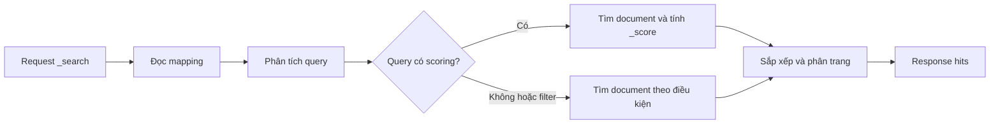

<Callout type="info" title="Mục tiêu và phạm vi">
  Bài này dùng một index nhỏ tên `movies` để bạn chạy trực tiếp trong Kibana Dev Tools. Bạn sẽ học cách viết query, phân biệt tìm kiếm toàn văn với lọc chính xác, rồi đọc `hits`, `total` và `max_score`. Các lệnh chỉ nhằm mục đích học tập trên cluster local.
</Callout>

## Mục lục

- [Chuẩn bị index movies](#chuẩn-bị-index-movies)
  - [Tạo mapping và dữ liệu](#tạo-mapping-và-dữ-liệu)
  - [Kiểm tra dữ liệu đã nạp](#kiểm-tra-dữ-liệu-đã-nạp)
- [Luồng xử lý của một truy vấn](#luồng-xử-lý-của-một-truy-vấn)
- [Truy vấn cơ bản](#truy-vấn-cơ-bản)
  - [match_all: lấy toàn bộ document](#match_all-lấy-toàn-bộ-document)
  - [match: tìm văn bản đã phân tích](#match-tìm-văn-bản-đã-phân-tích)
  - [term: khớp chính xác trên keyword](#term-khớp-chính-xác-trên-keyword)
- [Kết hợp must, filter và must_not](#kết-hợp-must-filter-và-must_not)
  - [Scoring và filter khác nhau thế nào](#scoring-và-filter-khác-nhau-thế-nào)
- [Lọc theo khoảng và sắp xếp](#lọc-theo-khoảng-và-sắp-xếp)
- [Giới hạn trang kết quả](#giới-hạn-trang-kết-quả)
  - [size và from](#size-và-from)
  - [search_after cho các trang sâu](#search_after-cho-các-trang-sâu)
- [Chọn field và đọc response](#chọn-field-và-đọc-response)
  - [Đọc hits, total và max_score](#đọc-hits-total-và-max_score)
- [Xử lý query sai và kiểm tra mapping](#xử-lý-query-sai-và-kiểm-tra-mapping)
- [Bài tập thực hành](#bài-tập-thực-hành)
- [Bước tiếp theo](#bước-tiếp-theo)

## Chuẩn bị index movies

Một **index** là nơi Elasticsearch lưu các document có cùng mục đích tìm kiếm. Trong bài này, mỗi document là một bộ phim. Ta tạo mapping rõ ràng trước để biết field nào là văn bản, field nào là giá trị chính xác và field nào là số.

### Tạo mapping và dữ liệu

Mở **Kibana → Dev Tools → Console** rồi chạy request sau. Request `DELETE` giúp bạn chạy lại bài từ đầu; chỉ dùng nó trên index thực hành này vì nó xóa toàn bộ dữ liệu bên trong.

```http
DELETE movies

PUT movies
{
  "mappings": {
    "properties": {
      "title": {
        "type": "text",
        "fields": {
          "keyword": {
            "type": "keyword"
          }
        }
      },
      "genre": {
        "type": "keyword"
      },
      "year": {
        "type": "integer"
      },
      "rating": {
        "type": "float"
      },
      "available": {
        "type": "boolean"
      }
    }
  }
}
```

`text` được analyzer (bộ phận tách và chuẩn hóa từ) khi index và khi tìm kiếm. Field `title.keyword` là **keyword**, nghĩa là Elasticsearch giữ nguyên cả chuỗi để khớp chính xác hoặc sort. `genre` cũng là keyword vì ta thường lọc theo một giá trị cố định. `year`, `rating` và `available` có kiểu số hoặc Boolean tương ứng.

Tiếp theo, nạp năm document. `_bulk` nhận các cặp dòng metadata và document, nên code block phải giữ nguyên từng dòng JSON và không thêm dấu phẩy cuối dòng.

```http
POST movies/_bulk?refresh=wait_for
{"index":{"_id":"1"}}
{"title":"The Matrix","genre":"sci-fi","year":1999,"rating":8.7,"available":true}
{"index":{"_id":"2"}}
{"title":"Inception","genre":"sci-fi","year":2010,"rating":8.8,"available":true}
{"index":{"_id":"3"}}
{"title":"Spirited Away","genre":"animation","year":2001,"rating":8.6,"available":true}
{"index":{"_id":"4"}}
{"title":"The Dark Knight","genre":"action","year":2008,"rating":9.0,"available":true}
{"index":{"_id":"5"}}
{"title":"Arrival","genre":"sci-fi","year":2016,"rating":8.0,"available":false}
```

Tham số `refresh=wait_for` yêu cầu Elasticsearch đợi đến lần refresh gần nhất trước khi trả response. Nhờ vậy, request search ngay sau đó nhìn thấy dữ liệu. Trong hệ thống thật, không nên ép refresh cho mọi lần ghi vì refresh thường xuyên làm tăng chi phí I/O.

### Kiểm tra dữ liệu đã nạp

Dùng `_count` để kiểm tra số document mà không cần đọc toàn bộ nội dung:

```http
GET movies/_count
```

Kết quả cần có `count: 5`. Nếu count không đúng, xem `errors` trong response của `_bulk`; một document lỗi không nhất thiết làm cả batch thất bại. Bạn cũng có thể xem mapping hiện tại:

```http
GET movies/_mapping
```

<Callout type="warn" title="Tên index trong bài">
  Các ví dụ đều dùng `movies`. Nếu bạn đã có index cùng tên và không muốn xóa nó, hãy đổi tên index trong toàn bộ request, chẳng hạn thành `movies-lab`. Không chạy `DELETE movies` trên dữ liệu thật.
</Callout>

## Luồng xử lý của một truy vấn

Khi nhận một request `_search`, Elasticsearch chọn các document phù hợp với phần `query`, tính điểm liên quan khi query cần scoring, rồi trả về các `hits`. Với filter, Elasticsearch chỉ kiểm tra điều kiện đúng/sai và không cần tính điểm cho điều kiện đó.



<Callout type="info" title="Về Mermaid">
  Site đã cấu hình plugin Mermaid của Fumadocs và component render ở phía trình duyệt. Nếu vừa thay đổi cấu hình, hãy khởi động lại dev server rồi tải lại trang để sơ đồ được vẽ.
</Callout>

## Truy vấn cơ bản

Endpoint `_search` có thể gọi với body JSON. Nếu không có body, Elasticsearch mặc định dùng `match_all`, nhưng nên viết query rõ ràng khi học và khi review code.

### match_all: lấy toàn bộ document

```http
GET movies/_search
{
  "query": {
    "match_all": {}
  }
}
```

`match_all` khớp mọi document trong index. Nó hữu ích để kiểm tra dữ liệu, nhưng không nên dùng để trả hàng triệu document cho một màn hình. Hãy thêm `size`, `_source` hoặc điều kiện lọc khi xây dựng API.

### match: tìm văn bản đã phân tích

`match` là query full-text (tìm kiếm toàn văn). Elasticsearch phân tích chuỗi tìm kiếm rồi so sánh các token với field `text` đã được phân tích. Ví dụ sau tìm bộ phim có token tương ứng với `dark` trong `title`:

```http
GET movies/_search
{
  "query": {
    "match": {
      "title": "dark"
    }
  }
}
```

Với dữ liệu mẫu, `The Dark Knight` được trả về. `match` phù hợp cho ô tìm kiếm người dùng vì người dùng thường không nhập đúng nguyên chuỗi và có thể cần cơ chế phân tích ngôn ngữ. Điểm `_score` cho biết mức độ liên quan tương đối giữa document và query; score cao hơn thường được xếp trước khi không có `sort` khác.

### term: khớp chính xác trên keyword

`term` không phân tích chuỗi truy vấn. Nó tìm đúng một term đã có trong inverted index, nên thường dùng với field `keyword`, số, Boolean hoặc ID. Lọc các phim thuộc thể loại `sci-fi`:

```http
GET movies/_search
{
  "query": {
    "term": {
      "genre": "sci-fi"
    }
  }
}
```

Kết quả gồm `The Matrix`, `Inception` và `Arrival`. Giá trị `genre` phải trùng chính xác. Ví dụ `"Science-Fiction"` hoặc `"SCI-FI"` không khớp với term `sci-fi` hiện có.

Để thấy rõ sự khác nhau, `title` là `text` còn `title.keyword` là keyword:

```http
GET movies/_search
{
  "query": {
    "term": {
      "title.keyword": "The Matrix"
    }
  }
}
```

Request này khớp đúng chuỗi `The Matrix`. Không dùng `term` trên `title` chỉ vì bạn muốn tìm văn bản. `title` đã được tách thành các token, còn `term` không biến đổi input thành cách mà analyzer đã tạo ra. Quy tắc thực hành là dùng `match` cho nội dung `text`, và dùng `term` cho giá trị chính xác trên `keyword`.

<Callout type="idea" title="Một cách ghi nhớ">
  `match` hỏi “văn bản này có những từ nào phù hợp?”. `term` hỏi “giá trị đã lưu có đúng bằng chuỗi này không?”. Khi phân vân, xem mapping rồi chọn query theo kiểu field.
</Callout>

## Kết hợp must, filter và must_not

Query `bool` ghép nhiều điều kiện logic. Ví dụ, tìm phim có chữ `dark` trong tiêu đề, thuộc thể loại `action`, có rating từ 8 trở lên và không bị đánh dấu unavailable:

```http
GET movies/_search
{
  "query": {
    "bool": {
      "must": [
        {
          "match": {
            "title": "dark"
          }
        }
      ],
      "filter": [
        {
          "term": {
            "genre": "action"
          }
        },
        {
          "range": {
            "rating": {
              "gte": 8
            }
          }
        }
      ],
      "must_not": [
        {
          "term": {
            "available": false
          }
        }
      ]
    }
  }
}
```

- `must` là điều kiện bắt buộc và thường tham gia tính `_score`.
- `filter` cũng là điều kiện bắt buộc, nhưng chỉ cần đúng hoặc sai. Nó phù hợp với thể loại, khoảng số, quyền truy cập và trạng thái.
- `must_not` loại các document khớp điều kiện. Nó không cộng điểm.

Với dữ liệu mẫu, kết quả là `The Dark Knight`. Có thể đặt nhiều query trong mỗi mảng; Elasticsearch yêu cầu tất cả phần tử trong `must` và `filter` đều đúng.

### Scoring và filter khác nhau thế nào

Một query văn bản như `match` cần xếp hạng kết quả, nên Elasticsearch tính score. Một filter như `term genre` chỉ trả lời điều kiện có đúng không. Tách hai vai trò giúp query dễ đọc và tránh tính điểm cho dữ liệu vốn chỉ là metadata.

Ví dụ thực tế: một ứng dụng có thể dùng `must` để tìm “matrix” trong tiêu đề, rồi dùng `filter` để giữ lại phim đang available và thuộc thể loại người dùng chọn:

```http
GET movies/_search
{
  "query": {
    "bool": {
      "must": [
        {
          "match": {
            "title": "matrix"
          }
        }
      ],
      "filter": [
        {
          "term": {
            "available": true
          }
        },
        {
          "term": {
            "genre": "sci-fi"
          }
        }
      ]
    }
  }
}
```

Khi kiểm tra response, các hit có thể có `_score` khác nhau do phần `match`. Thay đổi filter không nên được hiểu là thay đổi mức độ liên quan của tiêu đề. Cách tổ chức này cũng tạo cơ hội cho Elasticsearch cache một số kết quả filter; cache cụ thể còn phụ thuộc workload và phiên bản.

## Lọc theo khoảng và sắp xếp

`range` so sánh số, ngày hoặc các kiểu có thứ tự. Các toán tử thường gặp là `gte` (lớn hơn hoặc bằng), `gt` (lớn hơn), `lte` (nhỏ hơn hoặc bằng) và `lt` (nhỏ hơn). Tìm phim phát hành từ năm 2000 đến hết năm 2010:

```http
GET movies/_search
{
  "query": {
    "range": {
      "year": {
        "gte": 2000,
        "lte": 2010
      }
    }
  },
  "sort": [
    {
      "year": "asc"
    }
  ]
}
```

`sort` nhận một mảng để khai báo thứ tự ưu tiên. Query trên sắp theo `year` tăng dần, nên các document năm 2001, 2008 rồi 2010 lần lượt xuất hiện nếu cùng thỏa điều kiện. Với dữ liệu mẫu, thứ tự là `Spirited Away`, `The Dark Knight`, rồi `Inception`. Khi sort bằng field thay vì relevance, `_score` thường là `null` vì score không còn là tiêu chí chính.

Có thể sort theo nhiều field để giảm việc đổi thứ tự khi hai phim cùng năm:

```http
GET movies/_search
{
  "query": {
    "match_all": {}
  },
  "sort": [
    {
      "rating": "desc"
    },
    {
      "year": "desc"
    }
  ]
}
```

Chỉ sort trên field có kiểu phù hợp. `title` là `text` nên không phải lựa chọn sort mặc định; dùng `title.keyword` nếu cần sort theo chuỗi nguyên vẹn.

## Giới hạn trang kết quả

Search trả tối đa một số hit mặc định, không nên mặc định gửi toàn bộ index về ứng dụng. Hai cách phân trang nhập môn là `size`/`from` và `search_after`.

### size và from

`size` là số hit muốn nhận. `from` là số hit bỏ qua trước trang hiện tại. Trang thứ hai, mỗi trang hai phim:

```http
GET movies/_search
{
  "from": 2,
  "size": 2,
  "query": {
    "match_all": {}
  },
  "sort": [
    {
      "rating": "desc"
    },
    {
      "year": "desc"
    }
  ]
}
```

`from` và `size` dễ dùng cho các trang đầu. Tuy nhiên, phân trang sâu khiến Elasticsearch phải giữ và bỏ qua nhiều hit ở mỗi shard. Cluster thường giới hạn tổng độ sâu mặc định ở 10.000 hit thông qua `index.max_result_window`. Khi cần đi xa hơn hoặc xuất dữ liệu lớn, cân nhắc `search_after` hoặc API cuộn phù hợp với workload.

### search_after cho các trang sâu

`search_after` dùng giá trị sort của hit cuối trang trước thay vì đếm số hit cần bỏ qua. Trước hết, chạy trang đầu với `size` và một thứ tự sort ổn định:

```http
GET movies/_search
{
  "size": 2,
  "query": {
    "match_all": {}
  },
  "sort": [
    {
      "rating": "desc"
    },
    {
      "year": "desc"
    }
  ]
}
```

Mỗi hit có mảng `sort`, chẳng hạn `[9, 2008]`. Lấy mảng của hit cuối rồi đặt vào `search_after` trong request kế tiếp:

```http
GET movies/_search
{
  "size": 2,
  "search_after": [
    8.8,
    2010
  ],
  "query": {
    "match_all": {}
  },
  "sort": [
    {
      "rating": "desc"
    },
    {
      "year": "desc"
    }
  ]
}
```

Các field và hướng sort của request sau phải giống request trước. Nếu dữ liệu thay đổi giữa hai request, kết quả có thể dịch chuyển; ứng dụng cần chiến lược nhất quán dữ liệu nếu yêu cầu snapshot chính xác. Với bài nhập môn, hãy nhớ `from` phù hợp cho vài trang đầu, còn `search_after` phù hợp hơn khi duyệt nhiều trang.

## Chọn field và đọc response

Có thể giới hạn `_source` để response nhỏ hơn. `_source` là document gốc được Elasticsearch lưu lại, không phải toàn bộ cấu trúc nội bộ của inverted index.

```http
GET movies/_search
{
  "_source": [
    "title",
    "genre",
    "rating"
  ],
  "query": {
    "term": {
      "genre": "sci-fi"
    }
  },
  "size": 2
}
```

Request này chỉ trả ba field trong `_source`, trong khi query vẫn lọc theo `genre`. Đây là cách đơn giản để API không gửi các field mà UI không cần.

### Đọc hits, total và max_score

Một response search thường có dạng rút gọn như sau:

```json
{
  "took": 3,
  "timed_out": false,
  "hits": {
    "total": {
      "value": 3,
      "relation": "eq"
    },
    "max_score": 1.0,
    "hits": [
      {
        "_index": "movies",
        "_id": "1",
        "_score": 1.0,
        "_source": {
          "title": "The Matrix",
          "genre": "sci-fi",
          "year": 1999,
          "rating": 8.7,
          "available": true
        }
      }
    ]
  }
}
```

- `took` là thời gian Elasticsearch xử lý request, tính theo millisecond. Nó không bao gồm toàn bộ thời gian mạng hoặc thời gian ứng dụng render.
- `hits.total.value` là số document khớp trong phạm vi Elasticsearch đã tính. `relation: "eq"` nghĩa là con số chính xác; `gte` nghĩa là có ít nhất bằng con số đó, thường do giới hạn đếm.
- `hits.hits` là các document của trang hiện tại. Mỗi phần tử có `_id`, `_source` và có thể có `_score` hoặc `sort`.
- `max_score` là score cao nhất trong các hit được trả. Với `match_all` hoặc query filter-only, score có thể là `1.0` hoặc `null` tùy query. Khi có `sort` theo field, đừng dùng `max_score` để suy ra thứ tự.
- `timed_out: true` là dấu hiệu request không hoàn tất theo thời gian chờ. Khi gặp trường hợp này, kiểm tra cluster và workload thay vì chỉ tăng `size`.

Với dữ liệu năm document, `total.value` sẽ nhỏ và `relation` là `eq`. Hãy tập thói quen xem cả `total` lẫn danh sách `hits`: một trang rỗng có thể chỉ là trang nằm ngoài tổng số kết quả, không nhất thiết là query lỗi.

## Xử lý query sai và kiểm tra mapping

Sai kiểu field thường dẫn đến lỗi rõ ràng. Ví dụ, `year` là `integer` nhưng giá trị `gte` không phải số:

```http
GET movies/_search
{
  "query": {
    "range": {
      "year": {
        "gte": "twenty twenty"
      }
    }
  }
}
```

Elasticsearch sẽ trả lỗi kiểu `number_format_exception` hoặc thông báo tương đương, thay vì trả kết quả sai âm thầm. Cách sửa là gửi số `2020`, hoặc kiểm tra dữ liệu đầu vào trước khi xây dựng JSON query.

Kiểm tra kiểu field bằng mapping:

```http
GET movies/_mapping/field/title,genre,year,rating,available
```

Nếu query không lỗi nhưng trả `0` hit, dùng checklist sau:

1. Kiểm tra đúng tên index và field. `genres` khác `genre`.
2. Kiểm tra kiểu field. Dùng `GET movies/_mapping` nếu endpoint field không đủ thông tin.
3. Với `term`, kiểm tra đúng chữ hoa, khoảng trắng và giá trị đã được lưu. `sci-fi` khác `SCI-FI`.
4. Với `match`, nhớ rằng analyzer có thể chuẩn hóa chữ và tách token. Dùng `_analyze` để xem token thực tế:

   ```http
   POST movies/_analyze
   {
     "field": "title",
     "text": "The Dark Knight"
   }
   ```

5. Nếu vừa ghi document, chờ refresh hoặc ghi với `refresh=wait_for` trong môi trường lab.
6. Bỏ từng điều kiện trong `bool` để tìm điều kiện làm kết quả biến mất. Sau đó thêm lại từng điều kiện một.

<Callout type="warn" title="Đừng sửa lỗi bằng cách đổi kiểu query ngẫu nhiên">
  `term` không phải phiên bản “chính xác hơn” của `match`. Trước tiên hãy xem mapping và analyzer. Nếu field cần tìm toàn văn, sửa mapping hoặc dùng `match`; nếu field là mã hoặc trạng thái, giữ keyword và dùng `term`.
</Callout>

## Bài tập thực hành

Sau khi chạy các ví dụ trên, hãy thử tự viết các query sau rồi kiểm tra `hits.total` và `_score`:

1. Tìm các phim có `rating` từ 8.5 trở lên, sắp xếp rating giảm dần.
2. Tìm phim thuộc `sci-fi` nhưng loại phim có `available: false`.
3. Tìm chữ `the` trong `title`, chỉ trả `title` và `year` bằng `_source`.
4. So sánh `match` trên `title` với `term` trên `title.keyword` bằng hai input `dark` và `The Dark Knight`. Ghi lại query nào tìm được `The Dark Knight` và vì sao.
5. Dùng `size: 1`, sort theo `rating` giảm dần, rồi dùng `search_after` để lấy trang kế tiếp.

<Callout type="idea" title="Gợi ý kiểm tra">
  Với mỗi bài, hãy dự đoán số hit trước khi chạy. Sau đó đối chiếu với `total.value`, xem `_source` có đúng field cần thiết không và giải thích `_score` có ý nghĩa hay không.
</Callout>

## Bước tiếp theo

Bạn đã dùng các query nền tảng. Khi cần thiết kế search cho sản phẩm thật, hãy học thêm về analyzer, relevance, phrase và nhiều field.

<Cards>
  <Card title="Query DSL" href="../elasticsearch-core/query-dsl" description="Tổ chức bool logic và các loại query trong Elasticsearch." />
  <Card title="Full-text search" href="../elasticsearch-core/full-text-search" description="Đi sâu vào match, analyzer, relevance và tìm kiếm văn bản." />
  <Card title="Relevance và scoring" href="../advanced-search/relevance-scoring" description="Hiểu BM25, boosting và cách đánh giá chất lượng kết quả." />
</Cards>
