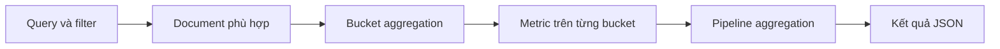

import { Accordion, Accordions } from 'fumadocs-ui/components/accordion';

<Callout type="info" title="Phạm vi của bài viết">
  Bài viết dùng Elasticsearch 8.x làm mốc cú pháp. Các ví dụ dùng dữ liệu đơn hàng nhỏ để giải thích cách nhóm bucket, tính metric và nối kết quả qua pipeline. Aggregation chỉ đọc dữ liệu; nó không thay đổi document trong index.
</Callout>

## Mục lục

- [Aggregation là gì?](#aggregation-là-gì)
  - [Mental model: quét, gom bucket rồi tính metric](#mental-model-quét-gom-bucket-rồi-tính-metric)
  - [Cấu trúc một request](#cấu-trúc-một-request)
- [Chuẩn bị dataset](#chuẩn-bị-dataset)
  - [Mapping](#mapping)
  - [Dữ liệu mẫu](#dữ-liệu-mẫu)
- [Bucket aggregations](#bucket-aggregations)
  - [terms: nhóm theo giá trị](#terms-nhóm-theo-giá-trị)
  - [date histogram: nhóm theo thời gian](#date-histogram-nhóm-theo-thời-gian)
  - [range: nhóm theo khoảng](#range-nhóm-theo-khoảng)
  - [filter: chỉ tính trên tập con](#filter-chỉ-tính-trên-tập-con)
  - [nested và reverse nested](#nested-và-reverse-nested)
- [Metric aggregations](#metric-aggregations)
  - [avg, sum, min và max](#avg-sum-min-và-max)
  - [stats và extended stats](#stats-và-extended-stats)
  - [cardinality](#cardinality)
  - [top hits và top metrics](#top-hits-và-top-metrics)
- [Sub aggregations: phân tích trong từng bucket](#sub-aggregations-phân-tích-trong-từng-bucket)
- [Pipeline aggregations](#pipeline-aggregations)
  - [derivative: độ thay đổi giữa các bucket](#derivative-độ-thay-đổi-giữa-các-bucket)
  - [moving avg và moving fn](#moving-avg-và-moving-fn)
  - [bucket selector: lọc bucket theo metric](#bucket-selector-lọc-bucket-theo-metric)
  - [bucket sort: sắp xếp và giới hạn bucket](#bucket-sort-sắp-xếp-và-giới-hạn-bucket)
- [Composite aggregation và phân trang](#composite-aggregation-và-phân-trang)
- [Hiệu năng, độ chính xác và giới hạn](#hiệu-năng-độ-chính-xác-và-giới-hạn)
  - [keyword thay vì text](#keyword-thay-vì-text)
  - [shard size và cardinality xấp xỉ](#shard-size-và-cardinality-xấp-xỉ)
  - [Memory và giới hạn số bucket](#memory-và-giới-hạn-số-bucket)
- [Chọn aggregation phù hợp](#chọn-aggregation-phù-hợp)
- [Troubleshooting](#troubleshooting)
- [Tóm tắt](#tóm-tắt)

## Aggregation là gì?

Aggregation là cơ chế tính toán trên tập document sau khi Elasticsearch áp dụng query. Kết quả thường dùng cho dashboard, faceting, báo cáo và phân tích xu hướng. Một aggregation có thể trả về **bucket** (nhóm document), **metric** (giá trị thống kê) hoặc kết quả được tính tiếp từ aggregation khác.

Ví dụ, thay vì tải toàn bộ đơn hàng về ứng dụng để tự đếm, ta yêu cầu Elasticsearch nhóm theo `category` và tính `sum` của `amount`. Elasticsearch thực hiện phần lớn công việc gần nơi dữ liệu nằm, sau đó trả về các bucket và số liệu gọn hơn.

### Mental model: quét, gom bucket rồi tính metric

Một request aggregation đi qua các bước khái niệm sau:



Mỗi shard xử lý phần document cục bộ của nó trước. Elasticsearch sau đó hợp nhất kết quả ở coordinating node. Vì vậy, `terms` có thể phải lấy nhiều ứng viên từ mỗi shard trước khi chọn top bucket toàn cluster; đây là lý do `shard_size` ảnh hưởng đến độ chính xác. Pipeline aggregation chạy sau aggregation cha đã tạo bucket, nên không thể dùng nó để giảm chi phí của bước cha.

Hãy giữ ba câu hỏi này khi đọc một request:

1. **Bucket nào?** Document được nhóm theo field, thời gian, khoảng số hay một filter?
2. **Metric nào?** Mỗi bucket cần đếm, cộng, lấy trung bình, hay lấy một document đại diện?
3. **Tính sau cùng gì?** Có cần derivative, tỷ lệ phần trăm, lọc hoặc sắp xếp lại bucket không?

### Cấu trúc một request

Aggregation nằm trong khóa `aggs` (tên cũ `aggregations` cũng được chấp nhận). Tên `by_category` là tên tùy ý để tham chiếu về sau bằng đường dẫn như `by_category>revenue`.

```http
GET orders/_search
{
  "size": 0,
  "query": {
    "range": {
      "ordered_at": {
        "gte": "now-30d/d",
        "lt": "now/d"
      }
    }
  },
  "aggs": {
    "by_category": {
      "terms": {
        "field": "category",
        "size": 10
      },
      "aggs": {
        "revenue": {
          "sum": { "field": "amount" }
        }
      }
    }
  }
}
```

`size: 0` ở cấp search nói rằng ứng dụng chỉ cần aggregation, không cần danh sách hit. Nó không phải là `size` của `terms`; `terms.size` vẫn quyết định số bucket trả về. Query ở trên giới hạn document trong 30 ngày, `terms` tạo một bucket cho mỗi category, rồi `sum` tính doanh thu bên trong từng bucket.

## Chuẩn bị dataset

Các ví dụ dùng index `orders` với đơn vị tiền là USD. `amount` là số tiền của một đơn hàng. Mỗi document biểu diễn một order và có một danh sách `items` để minh họa nested aggregation.

### Mapping

```http
PUT orders
{
  "mappings": {
    "properties": {
      "order_id": { "type": "keyword" },
      "category": { "type": "keyword" },
      "customer_id": { "type": "keyword" },
      "status": { "type": "keyword" },
      "ordered_at": { "type": "date" },
      "amount": { "type": "double" },
      "items": {
        "type": "nested",
        "properties": {
          "sku": { "type": "keyword" },
          "name": { "type": "text", "fields": { "keyword": { "type": "keyword" } } },
          "quantity": { "type": "integer" },
          "unit_price": { "type": "double" }
        }
      }
    }
  }
}
```

`category`, `status`, `customer_id` và `sku` là các giá trị định danh. Chúng được khai báo `keyword` để có thể nhóm, lọc và đếm chính xác. `ordered_at` là `date` để dùng với `date_histogram`. `items` là `nested` vì mỗi phần tử trong mảng phải giữ quan hệ giữa `sku`, `quantity` và `unit_price`.

### Dữ liệu mẫu

Có thể thêm ba document bằng Bulk API như sau:

```http
POST orders/_bulk
{ "index": { "_id": "o-1001" } }
{ "order_id": "o-1001", "category": "books", "customer_id": "c-1", "status": "paid", "ordered_at": "2024-01-03T10:00:00Z", "amount": 32.5, "items": [{ "sku": "book-1", "name": "Elasticsearch Guide", "quantity": 1, "unit_price": 32.5 }] }
{ "index": { "_id": "o-1002" } }
{ "order_id": "o-1002", "category": "electronics", "customer_id": "c-2", "status": "paid", "ordered_at": "2024-01-03T15:00:00Z", "amount": 129.0, "items": [{ "sku": "kbd-1", "name": "Mechanical Keyboard", "quantity": 1, "unit_price": 129.0 }] }
{ "index": { "_id": "o-1003" } }
{ "order_id": "o-1003", "category": "books", "customer_id": "c-1", "status": "refunded", "ordered_at": "2024-01-04T09:00:00Z", "amount": 18.0, "items": [{ "sku": "book-2", "name": "Search Patterns", "quantity": 1, "unit_price": 18.0 }] }
```

Trong môi trường thật, hãy thêm newline cuối request Bulk và kiểm tra `errors` trong response. Các response aggregation tiếp theo chỉ mang tính minh họa; số liệu phụ thuộc dữ liệu thực tế trong index.

## Bucket aggregations

Bucket aggregation không trả về một con số duy nhất. Nó phân chia document thành các nhóm và thường có trường `doc_count`. Có thể đặt metric hoặc bucket con trong mỗi bucket.

### terms: nhóm theo giá trị

`terms` tạo bucket theo từng giá trị khác nhau của một field. Đây là aggregation phổ biến nhất cho bộ lọc category hoặc bảng “top N”.

```http
GET orders/_search
{
  "size": 0,
  "aggs": {
    "categories": {
      "terms": {
        "field": "category",
        "size": 10,
        "order": { "revenue": "desc" }
      },
      "aggs": {
        "revenue": { "sum": { "field": "amount" } }
      }
    }
  }
}
```

Một phần response có dạng:

```json
{
  "aggregations": {
    "categories": {
      "doc_count_error_upper_bound": 0,
      "sum_other_doc_count": 0,
      "buckets": [
        { "key": "electronics", "doc_count": 1, "revenue": { "value": 129.0 } },
        { "key": "books", "doc_count": 2, "revenue": { "value": 50.5 } }
      ]
    }
  }
}
```

`terms.size` là số bucket trả về, không phải số giá trị được scan. Nếu cần tất cả giá trị với khả năng phân trang, dùng `composite` thay vì đặt `size` thật lớn. Khi order theo metric con, tên metric phải nằm trong `order` và metric đó phải là loại có thể dùng để sắp xếp.

### date histogram: nhóm theo thời gian

`date_histogram` gom document vào các khoảng thời gian đều nhau. Dùng `calendar_interval` cho đơn vị theo lịch như tháng hoặc ngày, và `fixed_interval` cho khoảng cố định như `24h` hoặc `15m`.

```http
GET orders/_search
{
  "size": 0,
  "aggs": {
    "orders_per_day": {
      "date_histogram": {
        "field": "ordered_at",
        "calendar_interval": "day",
        "time_zone": "Asia/Ho_Chi_Minh",
        "min_doc_count": 0,
        "extended_bounds": {
          "min": "2024-01-01",
          "max": "2024-01-07"
        }
      },
      "aggs": {
        "daily_revenue": { "sum": { "field": "amount" } }
      }
    }
  }
}
```

`min_doc_count: 0` tạo cả bucket rỗng trong khoảng biên. Điều này hữu ích cho biểu đồ nhưng làm tăng số bucket. `time_zone` quyết định lúc cắt ngày; nếu bỏ qua, việc chuyển từ UTC sang múi giờ của người dùng có thể làm doanh thu rơi vào ngày hiển thị không đúng.

Không dùng `fixed_interval: 1M` để biểu diễn tháng. Tháng có độ dài thay đổi, nên chọn `calendar_interval: month`.

### range: nhóm theo khoảng

`range` cho phép đặt các ngưỡng có ý nghĩa nghiệp vụ. Biên `from` là bao gồm, còn `to` là loại trừ.

```http
GET orders/_search
{
  "size": 0,
  "aggs": {
    "amount_ranges": {
      "range": {
        "field": "amount",
        "keyed": true,
        "ranges": [
          { "key": "small", "to": 50 },
          { "key": "medium", "from": 50, "to": 200 },
          { "key": "large", "from": 200 }
        ]
      }
    }
  }
}
```

Với `keyed: true`, response dùng object theo key thay vì mảng bucket. Một order đúng bằng `50` nằm trong `medium`, vì bucket `small` có `to: 50` loại trừ 50.

### filter: chỉ tính trên tập con

`filter` tạo một bucket duy nhất chứa document khớp query bên trong. Nó thích hợp khi cần tính một metric cho một phân khúc cụ thể bên cạnh metric toàn bộ.

```http
GET orders/_search
{
  "size": 0,
  "aggs": {
    "paid_orders": {
      "filter": { "term": { "status": "paid" } },
      "aggs": {
        "paid_revenue": { "sum": { "field": "amount" } },
        "paid_average": { "avg": { "field": "amount" } }
      }
    }
  }
}
```

Nếu mọi aggregation đều cần cùng một bộ lọc, đặt query ở cấp search thường dễ đọc và tiết kiệm hơn. Dùng filter aggregation khi chỉ một nhánh cần điều kiện riêng.

### nested và reverse nested

Field `nested` được lưu như các hidden document để Elasticsearch không ghép nhầm field của hai item khác nhau. Muốn aggregate `items.sku`, phải đi vào nested context trước.

```http
GET orders/_search
{
  "size": 0,
  "aggs": {
    "items_context": {
      "nested": { "path": "items" },
      "aggs": {
        "popular_skus": {
          "terms": { "field": "items.sku", "size": 5 },
          "aggs": {
            "quantity": { "sum": { "field": "items.quantity" } },
            "back_to_orders": {
              "reverse_nested": {},
              "aggs": {
                "customers": { "cardinality": { "field": "customer_id" } }
              }
            }
          }
        }
      }
    }
  }
}
```

`nested` chuyển context từ order sang item. `reverse_nested` đi ngược về document order để tính `customer_id` hoặc `amount` của order. Nếu aggregate field ở sai context, kết quả thường là lỗi field không hợp lệ hoặc `doc_count` bằng 0.

## Metric aggregations

Metric aggregation tính số trên field số, date hoặc giá trị có thể đếm. Metric có thể đứng ở cấp root hoặc nằm trong bucket con.

### avg, sum, min và max

Bốn metric cơ bản lần lượt tính trung bình, tổng, nhỏ nhất và lớn nhất. Document thiếu field sẽ không được tính vào metric đó.

```http
GET orders/_search
{
  "size": 0,
  "aggs": {
    "revenue": { "sum": { "field": "amount" } },
    "average_order": { "avg": { "field": "amount" } },
    "smallest_order": { "min": { "field": "amount" } },
    "largest_order": { "max": { "field": "amount" } }
  }
}
```

Kết quả rút gọn:

```json
{
  "aggregations": {
    "revenue": { "value": 179.5 },
    "average_order": { "value": 59.8333333333 },
    "smallest_order": { "value": 18.0 },
    "largest_order": { "value": 129.0 }
  }
}
```

Nếu cần tính trên giá trị đã biến đổi, có thể dùng `script`, nhưng script làm tăng chi phí CPU. Ưu tiên index sẵn field cần phân tích khi công thức được dùng thường xuyên.

### stats và extended stats

`stats` trả về `count`, `min`, `max`, `avg` và `sum` trong một aggregation. `extended_stats` bổ sung `sum_of_squares`, `variance` và `std_deviation`, hữu ích khi theo dõi độ phân tán của giá trị.

```http
GET orders/_search
{
  "size": 0,
  "aggs": {
    "amount_stats": { "stats": { "field": "amount" } },
    "amount_distribution": {
      "extended_stats": {
        "field": "amount",
        "sigma": 2
      }
    }
  }
}
```

`std_deviation_bounds` trong response được tính từ `avg ± sigma * std_deviation`. Đây là mô tả thống kê, không tự động chứng minh một order là bất thường. Với dữ liệu lệch mạnh hoặc có outlier, hãy chọn ngưỡng nghiệp vụ sau khi xem phân phối thật.

### cardinality

`cardinality` đếm số giá trị khác nhau, chẳng hạn số khách hàng duy nhất. Đây là phép đếm **xấp xỉ** dựa trên HyperLogLog++ để dùng ít bộ nhớ hơn so với việc lưu mọi giá trị.

```http
GET orders/_search
{
  "size": 0,
  "aggs": {
    "unique_customers": {
      "cardinality": {
        "field": "customer_id",
        "precision_threshold": 3000
      }
    }
  }
}
```

`precision_threshold` tăng độ chính xác kỳ vọng đến một ngưỡng và cũng tăng bộ nhớ. Nó không biến phép đếm thành chính xác tuyệt đối. Nếu báo cáo tài chính bắt buộc số chính xác, cần cân nhắc mô hình dữ liệu hoặc quy trình tính riêng thay vì xem `cardinality` như số tuyệt đối.

### top hits và top metrics

`top_hits` trả về một hoặc vài document đứng đầu trong mỗi bucket. Nó hữu ích khi muốn hiển thị sản phẩm mẫu, nhưng response có thể lớn vì chứa `_source`, highlight và metadata.

```http
GET orders/_search
{
  "size": 0,
  "aggs": {
    "by_category": {
      "terms": { "field": "category", "size": 10 },
      "aggs": {
        "latest_order": {
          "top_hits": {
            "size": 1,
            "sort": [{ "ordered_at": "desc" }],
            "_source": ["order_id", "ordered_at", "amount"]
          }
        }
      }
    }
  }
}
```

`top_metrics` nhẹ hơn khi chỉ cần giá trị của một hoặc vài field đã sort, không cần cả hit. Ví dụ sau lấy amount của order mới nhất trong mỗi category:

```http
GET orders/_search
{
  "size": 0,
  "aggs": {
    "by_category": {
      "terms": { "field": "category", "size": 10 },
      "aggs": {
        "latest_amount": {
          "top_metrics": {
            "metrics": { "field": "amount" },
            "sort": { "ordered_at": "desc" }
          }
        }
      }
    }
  }
}
```

Hãy chọn `top_metrics` cho bảng tóm tắt gọn và `top_hits` khi giao diện thực sự cần `_source`, `_id` hoặc nhiều metadata của document.

## Sub aggregations: phân tích trong từng bucket

Sub-aggregation là aggregation lồng trong bucket cha. Ví dụ, `date_histogram` có `sum` doanh thu trong từng ngày, hoặc `terms` category có `cardinality` khách hàng trong từng category.

```http
GET orders/_search
{
  "size": 0,
  "aggs": {
    "by_day": {
      "date_histogram": {
        "field": "ordered_at",
        "calendar_interval": "day"
      },
      "aggs": {
        "by_category": {
          "terms": { "field": "category", "size": 5 },
          "aggs": {
            "revenue": { "sum": { "field": "amount" } },
            "customers": { "cardinality": { "field": "customer_id" } }
          }
        }
      }
    }
  }
}
```

Cây kết quả có dạng `by_day > by_category > revenue`. Khi dùng pipeline, path phải trỏ đúng tên aggregation. Mỗi tầng bucket làm tăng số tổ hợp có thể tạo; hãy tránh lồng nhiều `terms` có cardinality cao nếu dashboard không cần toàn bộ ma trận.

## Pipeline aggregations

Pipeline aggregation không quét document lần nữa. Nó đọc output của bucket hoặc metric aggregation khác, rồi tính một giá trị mới, lọc bucket hoặc sắp xếp bucket. Vì chạy ở bước sau, pipeline không làm giảm công việc mà aggregation cha đã thực hiện.

### derivative: độ thay đổi giữa các bucket

`derivative` tính chênh lệch giữa metric hiện tại và metric liền trước. Nó thường đi cùng `date_histogram` để xem doanh thu tăng hay giảm theo ngày.

```http
GET orders/_search
{
  "size": 0,
  "aggs": {
    "by_day": {
      "date_histogram": {
        "field": "ordered_at",
        "calendar_interval": "day",
        "min_doc_count": 0
      },
      "aggs": {
        "daily_revenue": { "sum": { "field": "amount" } },
        "revenue_change": {
          "derivative": { "buckets_path": "daily_revenue" }
        }
      }
    }
  }
}
```

Bucket đầu tiên không có giá trị derivative vì không có bucket trước đó. Nếu cần phần trăm thay đổi, dùng `bucket_script` để chia derivative cho metric trước đó và xử lý mẫu số bằng điều kiện an toàn.

### moving avg và moving fn

Các phiên bản Elasticsearch hiện đại dùng `moving_fn` để tính cửa sổ trượt tùy ý. Tên `moving_avg` xuất hiện trong tài liệu cũ, nhưng không nên dùng cho cluster mới; hãy chuyển sang `moving_fn` với `MovingFunctions.unweightedAvg`.

```http
GET orders/_search
{
  "size": 0,
  "aggs": {
    "by_day": {
      "date_histogram": {
        "field": "ordered_at",
        "calendar_interval": "day",
        "min_doc_count": 0
      },
      "aggs": {
        "daily_revenue": { "sum": { "field": "amount" } },
        "seven_day_average": {
          "moving_fn": {
            "buckets_path": "daily_revenue",
            "window": 7,
            "script": "MovingFunctions.unweightedAvg(values)"
          }
        }
      }
    }
  }
}
```

`window: 7` nghĩa là dùng tối đa bảy giá trị gần nhất theo thứ tự bucket. Những bucket đầu tiên có thể dùng ít giá trị hơn. Nếu yêu cầu trung bình trượt theo lịch cố định, hãy bảo đảm histogram có bucket rỗng bằng `min_doc_count: 0`.

<Callout type="warn" title="Cú pháp cũ">
  Không copy nguyên ví dụ `moving_avg` từ bài viết Elasticsearch 7.x vào cluster mới. Với Elasticsearch 8.x, kiểm tra API theo phiên bản đang chạy và ưu tiên `moving_fn`; nếu cần tương thích hệ thống cũ, hãy kiểm thử request trên đúng cluster trước khi triển khai.
</Callout>

### bucket selector: lọc bucket theo metric

`bucket_selector` giữ lại bucket khi một script trả về `true`. Trong ví dụ, chỉ giữ category có doanh thu từ 100 USD trở lên.

```http
GET orders/_search
{
  "size": 0,
  "aggs": {
    "by_category": {
      "terms": { "field": "category", "size": 100 },
      "aggs": {
        "revenue": { "sum": { "field": "amount" } },
        "revenue_threshold": {
          "bucket_selector": {
            "buckets_path": { "total": "revenue" },
            "script": "params.total >= 100"
          }
        }
      }
    }
  }
}
```

Hãy đặt `terms.size` đủ lớn để bucket có thể được xét. `bucket_selector` chạy sau khi `terms` đã chọn top bucket, nên nó không biến aggregation thành một phép lọc sớm và không bảo đảm tìm được mọi category đạt ngưỡng nếu `terms.size` quá nhỏ.

### bucket sort: sắp xếp và giới hạn bucket

`bucket_sort` sắp xếp các bucket đã được tạo bởi aggregation cha. Có thể dùng `from` và `size` để lấy một trang nhỏ trong danh sách đó.

```http
GET orders/_search
{
  "size": 0,
  "aggs": {
    "by_category": {
      "terms": {
        "field": "category",
        "size": 100
      },
      "aggs": {
        "revenue": { "sum": { "field": "amount" } },
        "top_revenue": {
          "bucket_sort": {
            "sort": [{ "revenue": { "order": "desc" } }],
            "from": 0,
            "size": 10
          }
        }
      }
    }
  }
}
```

`bucket_sort` phù hợp để sắp xếp và cắt một tập bucket nhỏ đã được thu thập. Nó không phải cơ chế phân trang ổn định cho hàng triệu giá trị; khi cần duyệt toàn bộ bucket, dùng composite aggregation.

## Composite aggregation và phân trang

`composite` tạo bucket từ một hoặc nhiều nguồn và trả về `after_key`. Client gửi `after` của response trước vào request tiếp theo để lấy trang kế tiếp.

```http
GET orders/_search
{
  "size": 0,
  "aggs": {
    "orders_by_day_and_category": {
      "composite": {
        "size": 2,
        "sources": [
          { "day": { "date_histogram": { "field": "ordered_at", "calendar_interval": "day" } } },
          { "category": { "terms": { "field": "category" } } }
        ]
      },
      "aggs": {
        "revenue": { "sum": { "field": "amount" } }
      }
    }
  }
}
```

Response mẫu:

```json
{
  "aggregations": {
    "orders_by_day_and_category": {
      "buckets": [
        { "key": { "day": 1704240000000, "category": "books" }, "doc_count": 1, "revenue": { "value": 32.5 } },
        { "key": { "day": 1704240000000, "category": "electronics" }, "doc_count": 1, "revenue": { "value": 129.0 } }
      ],
      "after_key": { "day": 1704326400000, "category": "books" }
    }
  }
}
```

Request trang kế tiếp chỉ cần thêm `after`:

```http
GET orders/_search
{
  "size": 0,
  "aggs": {
    "orders_by_day_and_category": {
      "composite": {
        "size": 2,
        "after": { "day": 1704326400000, "category": "books" },
        "sources": [
          { "day": { "date_histogram": { "field": "ordered_at", "calendar_interval": "day" } } },
          { "category": { "terms": { "field": "category" } } }
        ]
      },
      "aggs": { "revenue": { "sum": { "field": "amount" } } }
    }
  }
}
```

Luôn dùng `after_key` mà Elasticsearch trả về thay vì tự lấy key cuối cùng trong `buckets`. Nếu dữ liệu index thay đổi giữa các request, thứ tự hoặc kết quả có thể thay đổi; với báo cáo cần snapshot ổn định, hãy cân nhắc chiến lược nhất quán dữ liệu phù hợp.

## Hiệu năng, độ chính xác và giới hạn

Aggregation có thể nhẹ hơn việc tải document về ứng dụng, nhưng không miễn phí. Chi phí phụ thuộc số shard, số document khớp, cardinality của field, số tầng sub-aggregation và kích thước response.

### keyword thay vì text

Không thể dùng trực tiếp `terms`, `sort` hoặc aggregation thông thường trên `text` vì text đã được phân tích thành token và fielddata bị tắt mặc định. Dùng field `keyword`:

```http
GET orders/_search
{
  "size": 0,
  "aggs": {
    "by_status": { "terms": { "field": "status" } }
  }
}
```

Nếu đang có `title` là `text` với multi-field, field để nhóm thường là `title.keyword`. Không bật `fielddata` trên text chỉ để chữa nhanh lỗi này: fielddata có thể ngốn heap lớn. Hãy sửa mapping và reindex nếu field cần phân tích chưa có sub-field keyword.

### shard size và cardinality xấp xỉ

Với `terms`, Elasticsearch lấy các ứng viên từ từng shard rồi hợp nhất. `terms.size` chỉ là số bucket cuối cùng. Tăng `shard_size` giúp coordinator nhận thêm ứng viên, nhờ đó giảm nguy cơ bỏ sót top bucket toàn cluster, nhưng làm tăng network và bộ nhớ.

```http
GET orders/_search
{
  "size": 0,
  "aggs": {
    "top_categories": {
      "terms": {
        "field": "category",
        "size": 10,
        "shard_size": 100
      }
    }
  }
}
```

Response của `terms` có `doc_count_error_upper_bound` và `sum_other_doc_count` để giúp đánh giá phần sai số và số document nằm ngoài bucket trả về. Không nên mặc định `shard_size` thật lớn. Hãy đo latency, memory và độ chính xác trên phân bố dữ liệu thật.

`cardinality` cũng là xấp xỉ. Tăng `precision_threshold` có thể cải thiện kết quả trong phạm vi hỗ trợ nhưng tốn memory hơn. Nếu chỉ cần xu hướng hoặc số hiển thị trên dashboard, sai số nhỏ thường chấp nhận được; nếu cần đối soát, phải ghi rõ tính chất xấp xỉ hoặc dùng cách tính chính xác khác.

### Memory và giới hạn số bucket

Mỗi bucket, sub-bucket và metadata đều tiêu tốn bộ nhớ. Nhiều `terms` lồng nhau có thể tạo ra tích số bucket rất lớn. Elasticsearch có giới hạn `search.max_buckets` để ngăn response vượt mức an toàn; khi vượt giới hạn, request thất bại thay vì trả kết quả một phần.

Các biện pháp thực tế:

- Giảm `terms.size`, số tầng lồng và số field trong `top_hits`.
- Đặt query filter ở cấp search để giảm số document phải xử lý.
- Dùng `composite` với trang nhỏ khi phải duyệt nhiều bucket.
- Tránh `min_doc_count: 0` cho khoảng thời gian quá dài nếu không cần bucket rỗng.
- Theo dõi heap, thời gian tìm kiếm và slow logs sau khi thay đổi aggregation.

<Callout type="warn" title="Pipeline không làm giảm chi phí bucket cha">
  `bucket_selector` và `bucket_sort` chạy sau khi bucket cha đã được tạo. Ví dụ, `terms.size: 10000` rồi lọc còn 10 bucket vẫn có chi phí tạo và tính metric cho tập lớn. Hãy tối ưu aggregation cha trước, hoặc thiết kế lại query và index.
</Callout>

## Chọn aggregation phù hợp

| Mục tiêu | Aggregation nên bắt đầu | Lưu ý |
| --- | --- | --- |
| Top category/status | `terms` | Field phải là `keyword`; kiểm tra sai số theo shard |
| Doanh thu theo ngày/tháng | `date_histogram` + `sum` | Chọn đúng `time_zone` và interval |
| Nhóm theo ngưỡng giá | `range` | `to` là biên loại trừ |
| Metric cho một phân khúc | `filter` + metric | Đặt filter ở query nếu toàn bộ nhánh cùng dùng |
| Số khách hàng duy nhất | `cardinality` | Kết quả xấp xỉ |
| Duyệt mọi tổ hợp theo trang | `composite` | Dùng `after_key`, không dùng `from` |
| Thay đổi giữa các kỳ | `derivative` | Cần bucket cha có thứ tự |
| Làm mượt chuỗi thời gian | `moving_fn` | `moving_avg` là cú pháp cũ |
| Lấy document đại diện | `top_hits` hoặc `top_metrics` | `top_metrics` nhẹ hơn nếu chỉ cần field |

## Troubleshooting

<Accordions type="single">
  <Accordion title="Vì sao terms báo fielddata disabled trên text?">
    Field là `text`, nên không phù hợp cho nhóm hoặc sort. Dùng multi-field `field.keyword` đã được mapping sẵn, hoặc tạo mapping đúng rồi reindex. Chỉ bật fielddata sau khi đã đánh giá kỹ chi phí heap.
  </Accordion>
  <Accordion title="Vì sao tổng số doc_count của các terms bucket không bằng tổng document?">
    `terms` chỉ trả top bucket theo `size`; phần còn lại nằm trong `sum_other_doc_count`. Tăng `size` hoặc dùng `composite` nếu cần duyệt tất cả giá trị. Với nhiều shard, xem thêm `doc_count_error_upper_bound`.
  </Accordion>
  <Accordion title="Vì sao bucket_selector không tìm thấy category đạt ngưỡng?">
    Pipeline chỉ lọc các bucket mà aggregation cha đã tạo. Nếu <code>terms.size</code> quá nhỏ, category đạt ngưỡng nhưng không nằm trong top ứng viên sẽ không được xét. Tăng size có kiểm soát hoặc thiết kế query khác.
  </Accordion>
  <Accordion title="Vì sao derivative hoặc moving_fn có null ở đầu chuỗi?">
    Bucket đầu tiên chưa có bucket trước đó, còn moving window ban đầu chưa đủ số giá trị. Đây là hành vi bình thường. Ở tầng ứng dụng, hiển thị khoảng đầu chuỗi là chưa đủ dữ liệu thay vì coi là số 0.
  </Accordion>
</Accordions>

## Tóm tắt

- **Bucket** trả lời câu hỏi “document thuộc nhóm nào?”, còn **metric** trả lời “mỗi nhóm có giá trị thống kê gì?”.
- Dùng `keyword` cho field cần `terms`, filter, sort hoặc aggregation. Dùng `text` cho nội dung cần full-text search.
- Dùng sub-aggregation để đi từ thời gian đến category rồi đến metric; kiểm soát số bucket ở từng tầng.
- Dùng `derivative`, `moving_fn`, `bucket_selector` và `bucket_sort` để tính hoặc biến đổi kết quả đã có. Chúng không thay thế bước lọc sớm.
- Dùng `composite` và `after_key` để phân trang bucket lớn. Đừng tăng `terms.size` vô hạn.
- Trước khi đưa vào production, kiểm tra `shard_size`, sai số `cardinality`, `search.max_buckets`, heap và latency trên dữ liệu phân bố thật.

Nói ngắn gọn: bắt đầu bằng mapping đúng, viết query filter hẹp nhất có thể, chọn bucket theo câu hỏi nghiệp vụ, rồi thêm metric và pipeline từng bước. Kiểm tra response và đo chi phí thay vì đoán aggregation sẽ nhẹ hay chính xác tuyệt đối.
