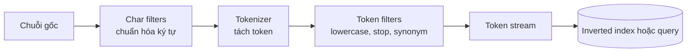

import { Step, Steps } from 'fumadocs-ui/components/steps';

<Callout type="info" title="Phạm vi của bài viết">
  Analyzer quyết định văn bản được biến đổi như thế nào trước khi Elasticsearch lập chỉ mục và trước khi xử lý câu truy vấn. Bài viết đi từ char filter, tokenizer và token filter đến analyzer dựng sẵn, analyzer tùy chỉnh, tìm kiếm tiếng Việt và quy trình reindex khi thay đổi cấu hình.
</Callout>

## Mục lục

- [Analyzer là gì?](#analyzer-là-gì)
  - [Pipeline char filter, tokenizer và token filter](#pipeline-char-filter-tokenizer-và-token-filter)
  - [Analyzer dựng sẵn quan trọng](#analyzer-dựng-sẵn-quan-trọng)
- [Các thành phần của analyzer](#các-thành-phần-của-analyzer)
  - [Char filter](#char-filter)
  - [Tokenizer](#tokenizer)
  - [Token filter](#token-filter)
- [Dùng analyzer dựng sẵn hay tạo analyzer tùy chỉnh](#dùng-analyzer-dựng-sẵn-hay-tạo-analyzer-tùy-chỉnh)
  - [Ví dụ analyzer tùy chỉnh](#ví-dụ-analyzer-tùy-chỉnh)
  - [Gắn analyzer vào mapping](#gắn-analyzer-vào-mapping)
- [Index analyzer và search analyzer](#index-analyzer-và-search-analyzer)
- [Phân tích tiếng Việt](#phân-tích-tiếng-việt)
- [Kiểm thử token bằng Analyze API](#kiểm-thử-token-bằng-analyze-api)
  - [Kiểm tra analyzer của index](#kiểm-tra-analyzer-của-index)
  - [Đọc kết quả và kiểm thử hồi quy](#đọc-kết-quả-và-kiểm-thử-hồi-quy)
- [Liên hệ với autocomplete và search as you type](#liên-hệ-với-autocomplete-và-search-as-you-type)
- [Thay đổi analyzer và migration](#thay-đổi-analyzer-và-migration)
  - [Tạo index version mới](#tạo-index-version-mới)
  - [Reindex document](#reindex-document)
  - [Chuyển alias và dọn index cũ](#chuyển-alias-và-dọn-index-cũ)
- [Các lỗi thường gặp](#các-lỗi-thường-gặp)
  - [Dùng `keyword` cho văn bản dài](#dùng-keyword-cho-văn-bản-dài)
  - [Nhầm `normalizer` với analyzer](#nhầm-normalizer-với-analyzer)
  - [Đặt synonym ở index time mà không có kế hoạch reindex](#đặt-synonym-ở-index-time-mà-không-có-kế-hoạch-reindex)
  - [Bỏ stop word rồi dùng phrase query](#bỏ-stop-word-rồi-dùng-phrase-query)
  - [Cấu hình analyzer nhưng quên reindex](#cấu-hình-analyzer-nhưng-quên-reindex)
- [Tóm tắt](#tóm-tắt)

## Analyzer là gì?

Analyzer là pipeline biến đổi một chuỗi văn bản thành các **token** (đơn vị có thể được tìm kiếm). Elasticsearch chạy pipeline này ở hai thời điểm:

- **Index time:** phân tích giá trị của document rồi lưu token vào inverted index.
- **Search time:** phân tích chuỗi người dùng nhập để tạo các token dùng trong query.

Ví dụ, chuỗi `Máy Ảnh Sony` có thể được chuẩn hóa thành `máy`, `ảnh`, `sony`. Khi query cũng tạo ra các token tương thích, `match` query có thể tìm document mà không cần so sánh nguyên chuỗi.

### Pipeline char filter, tokenizer và token filter

Một analyzer có ba lớp chính. Char filter và token filter là tùy chọn; tokenizer là thành phần bắt buộc.



Pipeline ví dụ với chuỗi `Elasticsearch & Search`:

1. Char filter có thể thay `&` bằng từ `and` hoặc xóa HTML tag.
2. Tokenizer tách chuỗi thành `Elasticsearch`, `and`, `Search`.
3. Token filter đổi chữ thường và bỏ stop word `and`.

Analyzer không lưu nguyên văn bản đã xử lý thay cho `_source`. `_source` vẫn giữ document gốc; token stream chỉ phục vụ lập chỉ mục, truy vấn, scoring và phrase matching.

### Analyzer dựng sẵn quan trọng

Elasticsearch cung cấp nhiều analyzer dựng sẵn. Bắt đầu bằng analyzer dựng sẵn giúp cấu hình đơn giản và giảm sai khác giữa các môi trường.

| Analyzer | Thành phần chính | Phù hợp khi |
| --- | --- | --- |
| `standard` | Tách theo quy tắc Unicode, lowercase | Tìm kiếm văn bản tự nhiên nói chung |
| `simple` | Tách theo ký tự không phải chữ, lowercase | Văn bản chữ cái đơn giản, không cần số |
| `whitespace` | Chỉ tách theo khoảng trắng | Muốn giữ dấu câu và không dùng quy tắc tách phức tạp |
| `keyword` | Coi cả chuỗi là một token | Giá trị cần tìm như một đơn vị, không phải văn bản dài |
| `english` | Standard, lowercase và các bộ lọc tiếng Anh | Nội dung tiếng Anh, khi stemming tiếng Anh là phù hợp |

`standard` không tự động là analyzer tối ưu cho mọi ngôn ngữ. Đặc biệt, nó không cung cấp stemming tiếng Việt. Hãy dùng Analyze API trên dữ liệu thật trước khi quyết định.

## Các thành phần của analyzer

### Char filter

Char filter nhận chuỗi gốc trước tokenizer. Nó có thể thay thế hoặc loại bỏ ký tự, đồng thời cố gắng giữ offset để highlight và thông báo vị trí khớp vẫn hữu ích.

Các char filter thường dùng:

- `html_strip`: loại HTML tag và giải mã một số entity HTML.
- `mapping`: thay chuỗi theo bảng ánh xạ, chẳng hạn `&` thành ` and `.
- `pattern_replace`: thay chuỗi bằng biểu thức chính quy.

```json
{
  "settings": {
    "analysis": {
      "char_filter": {
        "ampersand_to_and": {
          "type": "mapping",
          "mappings": ["& => and"]
        }
      }
    }
  }
}
```

Đừng dùng `pattern_replace` để xử lý mọi logic ngôn ngữ. Regex phức tạp có thể làm tăng chi phí index và tạo offset khó đoán. Nếu ứng dụng đã có bước làm sạch dữ liệu ổn định, hãy giữ analyzer đơn giản và dễ kiểm thử.

### Tokenizer

Tokenizer đọc chuỗi đã qua char filter và tạo token. Nó cũng tạo metadata như vị trí (`position`) và offset của token trong chuỗi.

| Tokenizer | Hành vi | Ví dụ use case |
| --- | --- | --- |
| `standard` | Tách theo quy tắc Unicode | Văn bản tự nhiên đa ngôn ngữ |
| `whitespace` | Tách tại khoảng trắng | Mã hoặc chuỗi cần giữ dấu câu |
| `keyword` | Một token duy nhất cho cả chuỗi | Mã định danh hoặc field không phân tích |
| `ngram` | Tạo token n-gram | Autocomplete tùy chỉnh, cần cân nhắc kích thước index |
| `pattern` | Tách theo regex | Dữ liệu có delimiter riêng |

Tokenizer `keyword` không giống field `keyword` một cách tuyệt đối. `keyword` field dùng type và có hành vi exact/filter/sort riêng; một custom analyzer với `keyword` tokenizer vẫn là analyzer trên một field thường được mapping kiểu `text`.

### Token filter

Token filter nhận token stream và biến đổi token, bỏ token hoặc sinh thêm token. Một số filter quan trọng:

- `lowercase`: chuẩn hóa chữ thường để `Elastic` và `elastic` có thể cùng khớp.
- `asciifolding`: chuyển một số ký tự có dấu thành dạng ASCII tương đương. Có thể dùng `preserve_original` để giữ cả token gốc và token đã chuyển đổi, nhưng số token tăng.
- `stop`: loại các từ quá phổ biến như `the` hoặc một danh sách stop word tự định nghĩa.
- `synonym_graph`: mở rộng hoặc thay thế cụm từ đồng nghĩa trong dạng token graph, phù hợp nhất ở search time cho query có phrase.

Thứ tự filter ảnh hưởng trực tiếp đến kết quả. `lowercase` thường nên chạy trước synonym để luật đồng nghĩa không phải liệt kê nhiều biến thể hoa/thường. Stop word và synonym cần được thiết kế cùng nhau vì một filter có thể làm thay đổi token hoặc vị trí mà filter sau nhìn thấy.

<Callout type="warn" title="Synonym không phải phép thay thế chuỗi đơn giản">
  Luật synonym được phân tích theo các filter đứng trước nó. Nếu đổi lowercase, stop word hoặc tokenizer mà không kiểm tra lại luật, synonym có thể không còn khớp hoặc bị lỗi khi index mở. Với cụm từ nhiều token, dùng `synonym_graph` ở search analyzer và kiểm tra query phrase bằng dữ liệu thật.
</Callout>

## Dùng analyzer dựng sẵn hay tạo analyzer tùy chỉnh

Dùng analyzer dựng sẵn khi hành vi mặc định đã đáp ứng yêu cầu. Custom analyzer phù hợp khi cần kiểm soát rõ tokenizer, char filter và thứ tự token filter.

### Ví dụ analyzer tùy chỉnh

Ví dụ sau tạo analyzer cho tiêu đề sản phẩm. Analyzer này bỏ HTML, tách từ Unicode, lowercase và chuyển đổi ký tự có dấu sang ASCII. `search_analyzer` thêm synonym ở thời điểm tìm kiếm để không nhân bản token synonym trong index.

```http
PUT products_v1
{
  "settings": {
    "analysis": {
      "char_filter": {
        "strip_markup": {
          "type": "html_strip"
        }
      },
      "filter": {
        "product_synonyms": {
          "type": "synonym_graph",
          "lenient": true,
          "synonyms": [
            "điện thoại, smartphone",
            "tv, television"
          ]
        }
      },
      "analyzer": {
        "product_index": {
          "type": "custom",
          "char_filter": ["strip_markup"],
          "tokenizer": "standard",
          "filter": ["lowercase", "asciifolding"]
        },
        "product_search": {
          "type": "custom",
          "char_filter": ["strip_markup"],
          "tokenizer": "standard",
          "filter": ["lowercase", "asciifolding", "product_synonyms"]
        }
      }
    }
  },
  "mappings": {
    "properties": {
      "name": {
        "type": "text",
        "analyzer": "product_index",
        "search_analyzer": "product_search",
        "fields": {
          "keyword": { "type": "keyword", "ignore_above": 256 }
        }
      }
    }
  }
}
```

`lenient: true` có thể giúp synonym không làm hỏng việc mở index khi có khác biệt nhỏ trong luật. Tuy nhiên, nó không thay thế việc validate synonym. Với danh sách đồng nghĩa do người dùng quản lý, nên kiểm tra và triển khai như một thay đổi có kiểm soát.

### Gắn analyzer vào mapping

Trong mapping, `analyzer` là analyzer dùng khi index field `text`; `search_analyzer` là analyzer mặc định dùng khi search field đó. Nếu không chỉ định `search_analyzer`, Elasticsearch thường dùng analyzer index cho search time.

```json
{
  "mappings": {
    "properties": {
      "title": {
        "type": "text",
        "analyzer": "product_index",
        "search_analyzer": "product_search"
      },
      "status": {
        "type": "keyword"
      }
    }
  }
}
```

Giữ field `keyword` cho `status`, mã đơn hàng và các giá trị dùng để filter hoặc sort. Đừng cố dùng analyzer để biến một field định danh thành full-text field.

## Index analyzer và search analyzer

Index analyzer quyết định token đã tồn tại trong inverted index. Search analyzer chỉ quyết định token của query hiện tại. Hai analyzer thường chia sẻ phần chuẩn hóa cơ bản nhưng không nhất thiết giống nhau hoàn toàn.

Mẫu thiết kế thường gặp là:

- Index: tokenizer ổn định + `lowercase` + `asciifolding`.
- Search: cùng chuẩn hóa + `synonym_graph` hoặc một bước mở rộng query.

Ví dụ document chứa `Điện thoại Android`. Query `smartphone android` chỉ mở rộng được từ `smartphone` thành `điện thoại` nếu search analyzer có synonym phù hợp. Index không cần lưu thêm token synonym, nên index nhỏ hơn và việc thay đổi danh sách synonym không buộc phải reindex toàn bộ document trong một số cách triển khai.

<Callout type="info" title="Đừng đánh đồng token với văn bản hiển thị">
  Người dùng vẫn thấy `_source` nguyên gốc. Token lowercase hoặc ASCII-folded chỉ là biểu diễn phục vụ tìm kiếm. Nếu cần hiển thị giá trị chuẩn hóa, hãy tạo field dữ liệu riêng thay vì đọc token stream.
</Callout>

Có thể ghi đè analyzer cho một query cụ thể bằng tham số `analyzer` nếu query type hỗ trợ. Chỉ nên làm vậy khi có lý do rõ ràng; một query dùng analyzer không tương thích với index analyzer có thể cho kết quả bất ngờ.

## Phân tích tiếng Việt

Analyzer `standard` có thể tách Unicode và `lowercase` có thể chuẩn hóa chữ hoa/chữ thường cho tiếng Việt. Tuy nhiên, đây không phải bộ phân tích ngôn ngữ tiếng Việt hoàn chỉnh.

Các giới hạn cần nói rõ:

- Tokenizer không nhất thiết nhận biết đầy đủ ranh giới từ ghép tiếng Việt. Ví dụ một cụm có thể được tìm theo âm tiết thay vì theo từ ngữ nghĩa.
- Elasticsearch không tự hứa hẹn stemming tiếng Việt. Không nên dùng analyzer `english` hoặc suy ra rằng `standard` sẽ đưa các biến thể tiếng Việt về cùng một gốc từ.
- `asciifolding` có thể giúp tìm không dấu, nhưng cũng làm mất khác biệt dấu. Chỉ dùng khi sản phẩm chấp nhận hành vi đó.
- Nếu cần word segmentation, stemming hoặc bộ từ vựng chuyên ngành, phải đánh giá plugin hoặc tiền xử lý bên ngoài theo phiên bản Elasticsearch và yêu cầu vận hành cụ thể.

Một cấu hình cơ bản, an toàn để bắt đầu là `standard` tokenizer cùng `lowercase`. Có thể thêm `asciifolding` nếu UX yêu cầu tìm không dấu:

```http
PUT vietnamese_articles_v1
{
  "settings": {
    "analysis": {
      "analyzer": {
        "vi_basic": {
          "type": "custom",
          "tokenizer": "standard",
          "filter": ["lowercase", "asciifolding"]
        }
      }
    }
  },
  "mappings": {
    "properties": {
      "title": {
        "type": "text",
        "analyzer": "vi_basic",
        "search_analyzer": "vi_basic"
      }
    }
  }
}
```

Hãy kiểm tra các câu tiếng Việt thực tế gồm dấu, không dấu, viết hoa, từ ghép, tên riêng và mã sản phẩm. Kết luận về chất lượng nên dựa trên tập query của sản phẩm, không chỉ trên một ví dụ ngắn.

## Kiểm thử token bằng Analyze API

Analyze API cho thấy từng token, vị trí và offset mà analyzer tạo ra. Đây là cách nhanh nhất để phát hiện tokenizer hoặc filter không làm điều bạn nghĩ.

### Kiểm tra analyzer của index

Có thể phân tích bằng analyzer dựng sẵn:

```http
POST _analyze
{
  "analyzer": "standard",
  "text": "Máy ảnh Sony Alpha"
}
```

Hoặc gọi custom analyzer đã khai báo trong index:

```http
POST vietnamese_articles_v1/_analyze
{
  "analyzer": "vi_basic",
  "text": "Máy Ảnh không dấu"
}
```

Để cô lập từng thành phần, gửi trực tiếp tokenizer và token filters:

```http
POST _analyze
{
  "char_filter": ["html_strip"],
  "tokenizer": "standard",
  "filter": ["lowercase", "asciifolding"],
  "text": "<p>Điện thoại & phụ kiện</p>"
}
```

Phản hồi rút gọn có dạng:

```json
{
  "tokens": [
    { "token": "dien", "position": 0, "start_offset": 3, "end_offset": 7 },
    { "token": "thoai", "position": 1, "start_offset": 8, "end_offset": 14 }
  ]
}
```

Offset trong kết quả chịu ảnh hưởng bởi char filter. Đừng coi offset là vị trí byte trong chuỗi; chúng phục vụ các tính năng như highlight và được Elasticsearch quản lý theo văn bản đầu vào.

### Đọc kết quả và kiểm thử hồi quy

Khi kiểm tra, hãy đối chiếu bốn điều:

1. **Token:** từ cần tìm có thực sự xuất hiện không?
2. **Position:** các token của cụm từ có quan hệ vị trí đúng không?
3. **Offset:** highlight có trỏ đúng vùng văn bản không?
4. **Số lượng token:** filter như `asciifolding` với `preserve_original` hoặc synonym có làm tăng token ngoài dự kiến không?

Nên lưu một bộ test nhỏ gồm các câu đại diện cho dữ liệu thật. Sau mỗi thay đổi analyzer, chạy lại `_analyze`, query `match` và query phrase. Analyzer không chỉ là cấu hình; nó là một phần của hợp đồng tìm kiếm cần được kiểm thử hồi quy.

## Liên hệ với autocomplete và search as you type

Autocomplete là bài toán tìm kết quả khi người dùng mới nhập một phần từ. Analyzer thông thường không tự biến mọi text field thành autocomplete field.

`search_as_you_type` là field type được Elasticsearch thiết kế cho use case này. Nó tạo các sub-field phục vụ prefix và phrase-prefix query. Ví dụ:

```http
PUT products_autocomplete_v1
{
  "mappings": {
    "properties": {
      "name": {
        "type": "search_as_you_type"
      }
    }
  }
}

POST products_autocomplete_v1/_search
{
  "query": {
    "multi_match": {
      "query": "dien tho",
      "type": "bool_prefix",
      "fields": [
        "name",
        "name._2gram",
        "name._3gram",
        "name._index_prefix"
      ]
    }
  }
}
```

Nếu cần kiểm soát n-gram, có thể tạo field `text` với tokenizer `edge_ngram` cho index time và analyzer thường cho search time. Cách này làm index lớn hơn và cần chọn `min_gram`, `max_gram` cẩn thận. Trước khi tự xây n-gram, hãy thử `search_as_you_type` và đo latency trên dữ liệu thật.

## Thay đổi analyzer và migration

Analyzer của một index không thể được thay đổi tùy ý sau khi index đã chứa document. Thêm cấu hình analysis có thể thực hiện trong một số trường hợp, nhưng field mapping và token đã index không tự được tạo lại.

Quy trình migration an toàn dùng index mới và alias:

<Steps>
<Step>

### Tạo index version mới

Tạo `products_v2` với analyzer và mapping mới. Không sửa trực tiếp cấu hình của `products_v1` rồi kỳ vọng token cũ thay đổi.

</Step>
<Step>

### Reindex document

```http
POST _reindex
{
  "source": { "index": "products_v1" },
  "dest": { "index": "products_v2" }
}
```

Kiểm tra số document, Analyze API và một tập query trước khi chuyển traffic.

</Step>
<Step>

### Chuyển alias và dọn index cũ

```http
POST _aliases
{
  "actions": [
    { "remove": { "alias": "products", "index": "products_v1" } },
    { "add": { "alias": "products", "index": "products_v2", "is_write_index": true } }
  ]
}
```

Giữ index cũ cho đến khi đã xác nhận kết quả và có kế hoạch rollback. Với dữ liệu tiếp tục phát sinh, cần xử lý đồng bộ phần ghi trong lúc reindex, chẳng hạn dùng write alias hoặc quy trình dual-write phù hợp.

</Step>
</Steps>

<Callout type="warn" title="Đổi search analyzer vẫn cần kiểm thử">
  Đổi analyzer chỉ ở search time có thể không cần reindex token, nhưng vẫn có thể thay đổi recall, precision và ranking. Hãy chạy tập query hồi quy và đo trước khi phát hành. Đổi index analyzer hoặc tokenizer thì cần tạo token mới, vì vậy hãy reindex.
</Callout>

## Các lỗi thường gặp

### Dùng `keyword` cho văn bản dài

Field `keyword` giữ nguyên giá trị thành một token. `match` trên field đó không tạo tìm kiếm theo từng từ như field `text`. Dùng multi-field nếu cần cả hai hành vi:

```json
"title": {
  "type": "text",
  "fields": {
    "raw": { "type": "keyword" }
  }
}
```

### Nhầm `normalizer` với analyzer

`normalizer` dành cho `keyword`. Nó không có tokenizer và luôn tạo đúng một token, nên phù hợp cho lowercase hoặc ASCII folding phục vụ exact filter, sort và aggregation.

```json
{
  "settings": {
    "analysis": {
      "normalizer": {
        "case_insensitive": {
          "type": "custom",
          "filter": ["lowercase", "asciifolding"]
        }
      }
    }
  },
  "mappings": {
    "properties": {
      "code": {
        "type": "keyword",
        "normalizer": "case_insensitive"
      }
    }
  }
}
```

Không dùng `normalizer` để thay cho analyzer của `text`. Những token filter cần token graph hoặc cần nhiều token không phù hợp với normalizer.

### Đặt synonym ở index time mà không có kế hoạch reindex

Nếu synonym được mở rộng khi index, token mở rộng đã trở thành dữ liệu của inverted index. Thay đổi danh sách synonym sau đó không sửa token cũ. Đặt synonym ở search time thường dễ vận hành hơn, đặc biệt khi business cần cập nhật từ đồng nghĩa thường xuyên.

### Bỏ stop word rồi dùng phrase query

Stop filter có thể làm mất token và ảnh hưởng vị trí. Phrase query với stop word có thể cho kết quả khác với trực giác, tùy `position_increment_gap` và cách filter được cấu hình. Hãy kiểm tra `position` từ Analyze API thay vì đoán.

### Cấu hình analyzer nhưng quên reindex

Thấy settings mới trong template không có nghĩa document cũ đã được phân tích lại. Chỉ document được index sau khi cấu hình có hiệu lực mới nhận token theo pipeline mới. Khi thay đổi index analyzer, luôn lập kế hoạch version index, `_reindex`, kiểm tra và chuyển alias.

## Tóm tắt

- Analyzer gồm char filter tùy chọn, một tokenizer bắt buộc và các token filter.
- `standard`, `whitespace` và `keyword` giải quyết những nhu cầu khác nhau; hãy chọn theo cách field được tìm kiếm.
- `lowercase`, `asciifolding`, `stop` và `synonym_graph` phải được sắp xếp, kiểm thử theo dữ liệu thật.
- Tách index analyzer và search analyzer khi cần synonym hoặc logic query khác với lúc index.
- Tiếng Việt cần đánh giá giới hạn tách từ; Elasticsearch mặc định không hứa hẹn stemming tiếng Việt.
- Analyze API giúp kiểm tra token, position và offset trước khi debug relevance.
- `keyword` field dùng normalizer, không dùng analyzer; `search_as_you_type` là một lựa chọn thực dụng cho autocomplete.
- Thay đổi tokenizer hoặc index analyzer cần reindex sang index version mới rồi chuyển alias.
