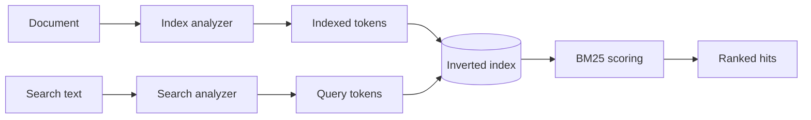

<Callout type="info" title="Phạm vi của bài viết">
  Bài viết tập trung vào **lexical search** — tìm kiếm dựa trên các token trong văn bản đã được phân tích. Bạn sẽ đi từ mapping và analyzer đến cách chọn query, xử lý autocomplete, kiểm tra relevance và tránh các lỗi thường gặp.
</Callout>

## Mục lục

- [Full-text search là gì?](#full-text-search-là-gì)
  - [Luồng xử lý từ document đến kết quả](#luồng-xử-lý-từ-document-đến-kết-quả)
  - [Full-text search khác exact search như thế nào?](#full-text-search-khác-exact-search-như-thế-nào)
- [Chuẩn bị mapping cho văn bản](#chuẩn-bị-mapping-cho-văn-bản)
  - [Ví dụ mapping](#ví-dụ-mapping)
  - [Index analyzer và search analyzer](#index-analyzer-và-search-analyzer)
- [Các query full-text quan trọng](#các-query-full-text-quan-trọng)
  - [match: điểm bắt đầu mặc định](#match-điểm-bắt-đầu-mặc-định)
  - [match phrase và match phrase prefix](#match-phrase-và-match-phrase-prefix)
  - [multi match: tìm trên nhiều field](#multi-match-tìm-trên-nhiều-field)
  - [combined fields: coi nhiều field như một field](#combined-fields-coi-nhiều-field-như-một-field)
  - [Kết hợp tìm kiếm với bool và filter](#kết-hợp-tìm-kiếm-với-bool-và-filter)
- [Tìm kiếm từ ô nhập của người dùng](#tìm-kiếm-từ-ô-nhập-của-người-dùng)
  - [simple query string](#simple-query-string)
  - [query string](#query-string)
- [Autocomplete và search as you type](#autocomplete-và-search-as-you-type)
  - [Mapping với search as you type](#mapping-với-search-as-you-type)
  - [Query bool prefix](#query-bool-prefix)
- [Điều khiển relevance và hiển thị kết quả](#điều-khiển-relevance-và-hiển-thị-kết-quả)
  - [Hiểu score ở mức thực hành](#hiểu-score-ở-mức-thực-hành)
  - [Boost field quan trọng](#boost-field-quan-trọng)
  - [Highlight phần văn bản khớp](#highlight-phần-văn-bản-khớp)
- [Debug và đánh giá query](#debug-và-đánh-giá-query)
  - [Kiểm tra token bằng Analyze API](#kiểm-tra-token-bằng-analyze-api)
  - [Kiểm tra query đã được rewrite](#kiểm-tra-query-đã-được-rewrite)
  - [Đo relevance trên tập dữ liệu thật](#đo-relevance-trên-tập-dữ-liệu-thật)
- [Bảng chọn query nhanh](#bảng-chọn-query-nhanh)
- [Các lỗi thường gặp](#các-lỗi-thường-gặp)
- [Tóm tắt](#tóm-tắt)

## Full-text search là gì?

Full-text search dùng để tìm các field chứa ngôn ngữ tự nhiên, chẳng hạn `title`, `description` hoặc `body`. Elasticsearch không so sánh nguyên chuỗi theo kiểu “có giống hoàn toàn hay không”. Thay vào đó, Elasticsearch phân tích văn bản thành các **token** — những đơn vị nhỏ mà bộ phân tích có thể tìm kiếm — rồi truy vấn các token đó trong inverted index.

Ví dụ, người dùng nhập `Elasticsearch tìm kiếm nhanh`. Query có thể được tách thành các token `elasticsearch`, `tìm`, `kiếm`, `nhanh`. Một document vẫn có thể khớp dù câu trong document có thêm từ khác hoặc khác thứ tự, tùy loại query được chọn.

### Luồng xử lý từ document đến kết quả



Có hai thời điểm phân tích quan trọng:

1. **Khi index document:** index analyzer tách và chuẩn hóa nội dung trước khi ghi token vào index.
2. **Khi search:** search analyzer xử lý chuỗi người dùng nhập trước khi tạo query.

Hai phía cần tạo ra các token tương thích. Nếu lúc index lưu `elasticsearch` nhưng lúc search không chuẩn hóa chữ hoa hoặc dùng một analyzer khác, kết quả có thể thấp hơn kỳ vọng dù document nhìn bằng mắt vẫn có vẻ khớp.

### Full-text search khác exact search như thế nào?

Hãy phân biệt `text` và `keyword` ngay từ mapping:

| Kiểu field | Cách Elasticsearch lưu và tìm | Use case |
| --- | --- | --- |
| `text` | Phân tích thành token, phù hợp với `match` và `match_phrase` | Tiêu đề, nội dung, mô tả |
| `keyword` | Giữ một giá trị nguyên vẹn, phù hợp với `term`, filter và sort | Category, status, mã đơn hàng |

Ví dụ, với field `title` có giá trị `Elasticsearch Guide`:

- `match` có thể tìm `elasticsearch guide` sau khi analyzer chuẩn hóa văn bản.
- `term` không phân tích chuỗi truy vấn. `term: { "title": "elasticsearch guide" }` chỉ khớp nếu chính token đó tồn tại theo đúng cách được index.
- `term` đặc biệt phù hợp với `category: "search"` khi `category` là `keyword`.

<Callout type="warn" title="Đừng dùng term để thay thế match">
  `term` là exact term query và không chạy analyzer. Với field `text`, hãy bắt đầu bằng `match` hoặc một full-text query phù hợp. Dùng `term` cho các giá trị có tính định danh như status, tag hoặc ID.
</Callout>

## Chuẩn bị mapping cho văn bản

Mapping quyết định field nào được phân tích và field nào được giữ nguyên. Mapping nên phản ánh cách ứng dụng sử dụng dữ liệu, thay vì chỉ dựa vào dynamic mapping.

### Ví dụ mapping

Ví dụ sau tạo một index bài viết. `title` có thêm multi-field `title.keyword`: một field gốc để full-text search và một sub-field exact để sort hoặc aggregation.

```http
PUT articles
{
  "mappings": {
    "properties": {
      "title": {
        "type": "text",
        "fields": {
          "keyword": {
            "type": "keyword",
            "ignore_above": 256
          }
        }
      },
      "body": {
        "type": "text"
      },
      "author": {
        "type": "text",
        "fields": {
          "keyword": {
            "type": "keyword"
          }
        }
      },
      "category": {
        "type": "keyword"
      },
      "published_at": {
        "type": "date"
      }
    }
  }
}
```

Index một vài document để chạy các ví dụ tiếp theo:

```http
POST articles/_bulk?refresh
{"index":{"_id":"1"}}
{"title":"Elasticsearch cho tìm kiếm văn bản","body":"Học cách phân tích văn bản và xếp hạng kết quả tìm kiếm.","author":"An","category":"search","published_at":"2026-01-10"}
{"index":{"_id":"2"}}
{"title":"Thiết kế hệ thống tìm kiếm phân tán","body":"Một hệ thống search tốt cần mapping rõ ràng, query phù hợp và cách đo relevance.","author":"Bình","category":"architecture","published_at":"2026-02-05"}
{"index":{"_id":"3"}}
{"title":"Vận hành Elasticsearch trong production","body":"Theo dõi latency, shard và lỗi khi triển khai cụm Elasticsearch.","author":"Chi","category":"operations","published_at":"2026-02-20"}
```

Các dòng trong Bulk API phải là các JSON object riêng biệt. Khi gửi bằng cURL, cần giữ newline giữa từng dòng và thêm header `Content-Type: application/x-ndjson`.

### Index analyzer và search analyzer

**Analyzer** là chuỗi các bước biến text thành token. Một analyzer thường gồm:

- **Character filter:** sửa hoặc loại bỏ ký tự trước khi tokenize.
- **Tokenizer:** chia chuỗi thành token.
- **Token filter:** chuẩn hóa token, chẳng hạn lowercase, stop words, stemming hoặc synonyms.

Nếu không cấu hình riêng, field `text` dùng analyzer mặc định của index. Bạn có thể chọn analyzer cho field và chọn analyzer khác ở search time qua `search_analyzer`.

Ví dụ sau đặt tên riêng cho analyzer khi index và search. Trong hệ thống thật, chỉ nên tách hai analyzer khi bạn hiểu rõ tác động đến token và đã kiểm thử relevance.

```http
PUT articles-v2
{
  "settings": {
    "analysis": {
      "analyzer": {
        "content_index": {
          "type": "standard"
        },
        "content_search": {
          "type": "standard"
        }
      }
    }
  },
  "mappings": {
    "properties": {
      "title": {
        "type": "text",
        "analyzer": "content_index",
        "search_analyzer": "content_search"
      },
      "body": {
        "type": "text",
        "analyzer": "content_index",
        "search_analyzer": "content_search"
      }
    }
  }
}
```

Trong ví dụ này hai analyzer thực chất giống nhau. Cấu hình được viết tách ra để làm rõ hai thời điểm. Nếu thay đổi analyzer hoặc mapping của field đã có dữ liệu, bạn thường cần tạo index mới và reindex dữ liệu; không thể sửa tùy ý analyzer của field đã được index.

Để đi sâu vào tokenizer, token filter và custom analyzer, xem [Analyzers và tokenizers](./analyzers-tokenizers). Phần còn lại của bài viết giả định mapping có `title` và `body` là `text`.

## Các query full-text quan trọng

Elasticsearch có nhiều full-text query. Lựa chọn đúng query quan trọng hơn việc thêm thật nhiều option vào một query duy nhất.

### match: điểm bắt đầu mặc định

`match` là query chuẩn cho một field `text`. Elasticsearch phân tích giá trị trong `query`, sau đó tạo các clause tìm token tương ứng.

```http
GET articles/_search
{
  "query": {
    "match": {
      "body": "tìm kiếm văn bản"
    }
  }
}
```

Mặc định, nhiều token được nối bằng `OR`. Vì vậy document chứa một phần của câu tìm kiếm vẫn có thể được trả về. Khi cần mọi token đều xuất hiện, dùng `operator: "and"`:

```http
GET articles/_search
{
  "query": {
    "match": {
      "body": {
        "query": "tìm kiếm văn bản",
        "operator": "and"
      }
    }
  }
}
```

`operator: "and"` là quy tắc cứng. Nếu muốn linh hoạt hơn, `minimum_should_match` yêu cầu một tỷ lệ hoặc số lượng token tối thiểu phải khớp:

```http
GET articles/_search
{
  "query": {
    "match": {
      "body": {
        "query": "elasticsearch tìm kiếm văn bản",
        "minimum_should_match": "75%"
      }
    }
  }
}
```

Fuzzy matching cho phép sai khác nhỏ về ký tự. `AUTO` là lựa chọn khởi đầu phổ biến, nhưng fuzzy query có thể mở rộng thành nhiều term và làm tăng latency.

```http
GET articles/_search
{
  "query": {
    "match": {
      "title": {
        "query": "elastcisearch",
        "fuzziness": "AUTO",
        "prefix_length": 2
      }
    }
  }
}
```

Hãy dùng fuzziness để tăng recall — tìm được nhiều kết quả phù hợp hơn — khi người dùng dễ gõ sai. Không nên bật nó mặc định cho mọi field và mọi query mà chưa đo chi phí.

### match phrase và match phrase prefix

`match_phrase` yêu cầu các token xuất hiện theo đúng thứ tự và gần nhau. Đây là lựa chọn phù hợp khi người dùng đặt một cụm từ trong dấu ngoặc kép hoặc khi thứ tự từ có ý nghĩa.

```http
GET articles/_search
{
  "query": {
    "match_phrase": {
      "title": "tìm kiếm văn bản"
    }
  }
}
```

`slop` cho phép một số vị trí chen giữa các token. `slop: 1` không có nghĩa là “bỏ qua một ký tự”; nó cho phép khoảng cách vị trí trong phrase rộng hơn một bước theo cách Lucene tính vị trí token.

```http
GET articles/_search
{
  "query": {
    "match_phrase": {
      "body": {
        "query": "hệ thống tìm kiếm",
        "slop": 2
      }
    }
  }
}
```

`match_phrase_prefix` giống phrase query, nhưng token cuối được xử lý như prefix. Nó hữu ích khi người dùng đang gõ một cụm có thứ tự, ví dụ `hệ thống tì`. Prefix càng rộng thì số term mở rộng càng lớn; đặt `max_expansions` và đo latency nếu query chạy trên dữ liệu lớn.

```http
GET articles/_search
{
  "query": {
    "match_phrase_prefix": {
      "title": {
        "query": "hệ thống tì",
        "max_expansions": 50
      }
    }
  }
}
```

Phrase query không phải là lựa chọn thay thế cho mọi autocomplete. Nếu cần tìm nhanh trong khi người dùng nhập và không bắt buộc thứ tự tuyệt đối, `search_as_you_type` kết hợp `bool_prefix` thường phù hợp hơn.

### multi match: tìm trên nhiều field

`multi_match` mở rộng `match` cho nhiều field. Boost bằng ký hiệu `^` để ưu tiên field quan trọng hơn.

```http
GET articles/_search
{
  "query": {
    "multi_match": {
      "query": "tìm kiếm Elasticsearch",
      "fields": [
        "title^3",
        "body",
        "author"
      ],
      "type": "best_fields"
    }
  }
}
```

`title^3` không bắt buộc document phải khớp `title`. Nó chỉ làm điểm của match trên `title` có ảnh hưởng lớn hơn khi xếp hạng.

Các `type` thường gặp:

| `type` | Cách hoạt động | Khi nên dùng |
| --- | --- | --- |
| `best_fields` | Tạo một match query cho mỗi field và ưu tiên field có điểm cao nhất | Câu tìm kiếm nên xuất hiện trọn vẹn trong một field; đây là mặc định |
| `most_fields` | Cộng điểm từ nhiều field | Một nội dung có các biến thể phân tích, ví dụ field gốc, stemmed và shingles |
| `cross_fields` | Xử lý theo từng term và cho phép term nằm ở các field khác nhau | Document có các field ngắn liên quan như `first_name` và `last_name` |
| `phrase` | Chạy `match_phrase` trên từng field | Tìm một cụm có thứ tự trên nhiều field |
| `phrase_prefix` | Chạy `match_phrase_prefix` trên từng field | Phrase autocomplete đơn giản |
| `bool_prefix` | Chạy `match_bool_prefix` trên từng field | Search-as-you-type |

Một điểm dễ nhầm là `operator` của `best_fields` và `most_fields` được áp dụng **trên từng field**. Với query `Will Smith` và `operator: "and"`, document cần có cả `will` và `smith` trong cùng một field. Nếu muốn mỗi term có thể nằm ở một field khác nhau, cân nhắc `combined_fields` hoặc `cross_fields`.

### combined fields: coi nhiều field như một field

`combined_fields` có cách nhìn **term-centric**: phân tích câu truy vấn thành từng term rồi tìm mỗi term trong bất kỳ field nào được chỉ định. Query sau có thể khớp document có `database` trong `title` và `systems` trong `body`:

```http
GET articles/_search
{
  "query": {
    "combined_fields": {
      "query": "tìm kiếm phân tán",
      "fields": [
        "title",
        "body"
      ],
      "operator": "and"
    }
  }
}
```

`combined_fields` phù hợp khi nhiều field thật sự tạo thành một vùng nội dung logic. Query yêu cầu tất cả field phải là `text` và dùng cùng search analyzer. Cách tính điểm dựa trên mô hình gần với BM25F, giúp việc kết hợp thống kê term giữa các field dễ giải thích hơn `cross_fields` trong nhiều trường hợp.

Chọn giữa hai query như sau:

- Dùng `combined_fields` khi các field là `text`, có cùng analyzer và bạn muốn áp dụng `operator` hoặc `minimum_should_match` theo từng term.
- Dùng `multi_match` khi danh sách field có thể chứa nhiều kiểu field hoặc analyzer khác nhau, hoặc bạn cần các mode như `best_fields`, `phrase` hay `bool_prefix`.
- Dùng `cross_fields` cho các field ngắn như tên và họ khi bạn hiểu rõ cách nó blend term statistics. Với thiết kế mới, hãy thử `combined_fields` trước nếu các điều kiện của nó phù hợp.

### Kết hợp tìm kiếm với bool và filter

Một search thực tế thường có hai phần:

1. Full-text query để tính relevance.
2. Filter để giới hạn tập document theo category, trạng thái hoặc thời gian.

Đặt chúng vào `bool`. Clause trong `must` hoặc `should` tham gia tính `_score`; clause trong `filter` chỉ quyết định document có được giữ lại hay không.

```http
GET articles/_search
{
  "query": {
    "bool": {
      "must": [
        {
          "multi_match": {
            "query": "tìm kiếm Elasticsearch",
            "fields": ["title^3", "body"]
          }
        }
      ],
      "filter": [
        {
          "term": {
            "category": "search"
          }
        },
        {
          "range": {
            "published_at": {
              "gte": "2026-01-01"
            }
          }
        }
      ]
    }
  }
}
```

`filter` không cần tính score nên thường rẻ và ổn định hơn cho điều kiện không liên quan đến độ phù hợp. Vì `category` là `keyword`, `term` trong ví dụ này là đúng. Nếu cần match nhiều giá trị exact, dùng `terms` hoặc nhiều clause trong `filter` tùy logic.

<Callout type="idea" title="Mẫu query nên bắt đầu từ đây">
  Tách phần “document có được phép xuất hiện không?” vào `filter`. Tách phần “document nào phù hợp hơn?” vào `must` hoặc `should`. Cách này giúp query dễ đọc, dễ debug và tránh dùng relevance score cho những điều kiện vốn là boolean.
</Callout>

## Tìm kiếm từ ô nhập của người dùng

Khi người dùng nhập trực tiếp vào search box, bạn cần quyết định có cho phép cú pháp query hay không. Không nên đưa một chuỗi người dùng vào `query_string` một cách vô điều kiện nếu ứng dụng không muốn hỗ trợ cú pháp Lucene.

### simple query string

`simple_query_string` là lựa chọn an toàn hơn cho ô tìm kiếm phổ thông. Nó hỗ trợ một tập cú pháp đơn giản và thường bỏ qua cú pháp không hợp lệ thay vì trả về lỗi parse.

Một số toán tử thường dùng:

| Cú pháp | Ý nghĩa |
| --- | --- |
| `+term` | Term bắt buộc phải khớp |
| `-term` | Loại document chứa term |
| `"cụm từ"` | Tìm theo phrase |
| `term1 term2` | Kết hợp theo operator mặc định |
| `term1 \| term2` | OR giữa hai term |

```http
GET articles/_search
{
  "query": {
    "simple_query_string": {
      "query": "Elasticsearch +tìm kiếm -Logstash",
      "fields": [
        "title^3",
        "body"
      ],
      "default_operator": "and"
    }
  }
}
```

Hãy giới hạn `fields` vào những field mà người dùng thực sự được tìm kiếm. Nếu chỉ cần tìm text không có cú pháp, một `multi_match` được xây dựng từ input đã kiểm soát thường dễ dự đoán hơn.

### query string

`query_string` hỗ trợ cú pháp Lucene đầy đủ hơn, bao gồm chỉ rõ field, nhóm điều kiện và các toán tử boolean:

```http
GET articles/_search
{
  "query": {
    "query_string": {
      "query": "title:(Elasticsearch OR Lucene) AND body:\"full text\"",
      "fields": [
        "title",
        "body"
      ]
    }
  }
}
```

Query này mạnh nhưng dễ lỗi khi input chứa ký tự đặc biệt hoặc cú pháp không hoàn chỉnh. Hãy dùng nó cho người dùng đã được hướng dẫn về query syntax hoặc cho use case nội bộ. Với search box công khai, ưu tiên `simple_query_string` hoặc query có cấu trúc rõ ràng.

## Autocomplete và search as you type

Autocomplete có hai nhu cầu khác nhau:

- **Prefix completion:** hoàn thành phần đầu của một term hoặc cụm.
- **Infix completion:** khớp text đang gõ ở nhiều vị trí trong nội dung.

Field `search_as_you_type` tạo sẵn các sub-field dùng shingle — nhóm liên tiếp gồm 2 đến 4 token — và một sub-field prefix. Nhờ đó bạn không phải tự xây toàn bộ `edge_ngram` mapping cho use case thông thường.

### Mapping với search as you type

```http
PUT articles-autocomplete
{
  "mappings": {
    "properties": {
      "title": {
        "type": "search_as_you_type",
        "max_shingle_size": 3
      },
      "body": {
        "type": "text"
      }
    }
  }
}
```

Với mapping trên, Elasticsearch tự tạo các field phụ tương tự:

```text
title
├── title._2gram
├── title._3gram
└── title._index_prefix
```

`max_shingle_size` có giá trị từ `2` đến `4`, mặc định là `3`. Kích thước lớn hơn có thể cải thiện match cho phrase dài hơn nhưng làm index lớn hơn. Hãy giữ mặc định trừ khi benchmark cho thấy cần thay đổi.

### Query bool prefix

Mẫu query thường dùng cho `search_as_you_type` là `multi_match` với `type: "bool_prefix"`:

```http
GET articles-autocomplete/_search
{
  "query": {
    "multi_match": {
      "query": "tìm kiếm Elas",
      "type": "bool_prefix",
      "fields": [
        "title",
        "title._2gram",
        "title._3gram"
      ]
    }
  }
}
```

Các term hoàn chỉnh được xử lý như term query. Term cuối được xử lý như prefix query. Shingle field giúp document có các term theo đúng thứ tự nhận điểm cao hơn, trong khi query vẫn có thể match các term theo cách linh hoạt hơn.

Nếu yêu cầu thứ tự phrase chặt chẽ, dùng `match_phrase_prefix` trên field gốc:

```http
GET articles-autocomplete/_search
{
  "query": {
    "match_phrase_prefix": {
      "title": "tìm kiếm Elas"
    }
  }
}
```

Autocomplete nên được giới hạn bằng độ dài input tối thiểu hoặc debounce ở client. Không nên gửi một request mới cho từng ký tự đầu tiên khi index lớn; điều đó vừa tạo tải không cần thiết vừa cho kết quả kém ổn định.

## Điều khiển relevance và hiển thị kết quả

Full-text query thường trả về `_score`, một điểm tương đối dùng để xếp hạng document trong cùng một request. Relevance không phải là một nhãn đúng/sai tuyệt đối. Bạn cần kiểm tra query trên các ví dụ mà sản phẩm coi là đúng và sai.

### Hiểu score ở mức thực hành

Với similarity mặc định BM25, ba trực giác quan trọng là:

- **Term frequency:** một term xuất hiện nhiều hơn trong document có thể góp nhiều hơn vào điểm, nhưng tác động có giới hạn.
- **Inverse document frequency:** term hiếm trong toàn bộ index thường có giá trị phân biệt cao hơn term xuất hiện ở hầu hết document.
- **Field length normalization:** cùng số term khớp trong một field ngắn thường có ý nghĩa khác với field rất dài.

Đừng so sánh `_score` của hai query khác nhau như thể chúng cùng một thang đo. Hãy dùng score để xếp hạng các hit trong cùng query, sau đó đánh giá thứ hạng bằng bộ truy vấn mẫu của sản phẩm.

### Boost field quan trọng

Field boost là cách đơn giản để diễn đạt ưu tiên nghiệp vụ. Ví dụ, match trong tiêu đề nên quan trọng hơn match trong nội dung:

```http
GET articles/_search
{
  "query": {
    "multi_match": {
      "query": "Elasticsearch",
      "fields": [
        "title^4",
        "body"
      ]
    }
  }
}
```

Boost không đảm bảo một document khớp title luôn đứng đầu. Những yếu tố khác như độ hiếm của term, độ dài field và số term khớp vẫn ảnh hưởng đến `_score`. Sau khi boost, hãy kiểm tra các case dễ bị đảo thứ hạng thay vì chọn hệ số chỉ bằng cảm giác.

`minimum_should_match` cũng là công cụ điều khiển relevance. Nó loại bớt các hit chỉ chứa một term quá phổ biến, nhưng giá trị quá cao có thể làm mất document tốt do synonym, stop word hoặc cách diễn đạt khác.

### Highlight phần văn bản khớp

Highlight giúp UI hiển thị đoạn text khiến document được trả về. Nó không thay đổi thứ hạng và không phải bằng chứng rằng toàn bộ document phù hợp.

```http
GET articles/_search
{
  "query": {
    "multi_match": {
      "query": "tìm kiếm văn bản",
      "fields": ["title^3", "body"]
    }
  },
  "highlight": {
    "fields": {
      "title": {},
      "body": {
        "fragment_size": 160,
        "number_of_fragments": 2
      }
    }
  }
}
```

Analyzer, `index_options`, term vectors và cách lưu offset có thể ảnh hưởng đến khả năng highlight. Nếu highlight không giống text người dùng mong đợi, hãy kiểm tra analyzer trước khi tăng các tham số của highlight.

## Debug và đánh giá query

Khi kết quả không đúng, đừng đoán từ `_score`. Hãy kiểm tra lần lượt token, query đã rewrite và kết quả trên dữ liệu thật.

### Kiểm tra token bằng Analyze API

Dùng Analyze API để xem chuỗi được tách thành token nào. Khi kiểm tra field cụ thể, truyền `field` để Elasticsearch dùng analyzer của field đó:

```http
POST articles/_analyze
{
  "field": "title",
  "text": "Elasticsearch tìm kiếm văn bản"
}
```

Bạn cũng có thể kiểm tra một analyzer đã đặt tên:

```http
POST articles/_analyze
{
  "analyzer": "standard",
  "text": "Elasticsearch tìm kiếm văn bản"
}
```

Nếu token ở index time và search time không tương thích, `match` không thể sửa được vấn đề đó. Hãy sửa mapping hoặc search analyzer, tạo index mới và reindex khi cần.

### Kiểm tra query đã được rewrite

Validate API với `explain: true` giúp xem Elasticsearch rewrite query như thế nào:

```http
GET articles/_validate/query?explain=true
{
  "query": {
    "multi_match": {
      "query": "Will Smith",
      "fields": ["title", "body"],
      "operator": "and"
    }
  }
}
```

Để biết một document cụ thể được cộng điểm ra sao, có thể dùng `explain: true` trong Search API:

```http
GET articles/_search
{
  "explain": true,
  "query": {
    "match": {
      "body": "tìm kiếm"
    }
  }
}
```

`explain` trả về nhiều thông tin và tốn chi phí. Chỉ bật khi debug trên một tập nhỏ, không bật mặc định cho traffic production.

### Đo relevance trên tập dữ liệu thật

Một query tốt cần được kiểm chứng bằng dữ liệu đại diện. Tạo một tập query mẫu gồm:

- Query phổ biến trong production.
- Query có typo và khác cách viết.
- Query một term và nhiều term.
- Query có phrase, stop word hoặc synonym.
- Các document mà sản phẩm đánh dấu là kết quả tốt, chấp nhận được và không liên quan.

Sau mỗi thay đổi analyzer, boost hoặc query, so sánh thứ hạng của tập mẫu. Theo dõi thêm p95 latency, số hit và tỷ lệ không có kết quả. Relevance tăng nhưng latency vượt SLO vẫn chưa phải là một cải thiện có thể triển khai.

<Callout type="idea" title="Đo trước khi tinh chỉnh">
  Hãy bắt đầu bằng một query đơn giản, lưu các case kết quả chưa tốt, rồi thay đổi từng yếu tố một. Khi thay đổi đồng thời analyzer, fuzziness và boost, bạn sẽ khó biết yếu tố nào thực sự cải thiện kết quả.
</Callout>

## Bảng chọn query nhanh

| Nhu cầu | Query nên thử trước | Ghi chú |
| --- | --- | --- |
| Tìm text trên một field | `match` | Điểm bắt đầu cho hầu hết field `text` |
| Tất cả token phải xuất hiện | `match` với `operator: "and"` | Chặt hơn OR mặc định |
| Tìm đúng thứ tự cụm từ | `match_phrase` | Dùng `slop` nếu cho phép khoảng cách |
| Người dùng đang gõ phrase | `match_phrase_prefix` | Đúng thứ tự, nhưng có thể mở rộng nhiều term |
| Tìm title và body | `multi_match` | Dùng boost để ưu tiên title |
| Nhiều field cùng tạo một nội dung | `combined_fields` | Các field phải là `text` và cùng search analyzer |
| Search box có cú pháp đơn giản | `simple_query_string` | Phù hợp hơn với input trực tiếp từ người dùng |
| Search box cho người dùng chuyên sâu | `query_string` | Cần xử lý cú pháp và lỗi parse |
| Autocomplete linh hoạt | `search_as_you_type` + `bool_prefix` | Tối ưu cho search-as-you-type |
| Filter status/category | `bool.filter` + `term` | Dùng field `keyword`, không dùng full-text score |

## Các lỗi thường gặp

### Dùng sai field `keyword`

`keyword` giữ nguyên toàn bộ giá trị. Tìm `hệ thống tìm kiếm` trong một field `keyword` không hoạt động như tìm từng từ trong field `text`. Nếu cần cả hai nhu cầu, dùng multi-field: field gốc là `text`, sub-field `.keyword` là `keyword`.

### Đổi analyzer nhưng không reindex

Analyzer chạy khi document được index. Cập nhật cấu hình analyzer không biến các token cũ trong inverted index thành token mới. Quy trình an toàn là tạo index version mới, kiểm tra mapping, reindex, rồi chuyển alias sang index mới.

### Dùng `operator: and` trong `multi_match` sai mục đích

Với `best_fields` hoặc `most_fields`, `operator` được áp dụng theo từng field. Nếu query có nhiều từ và các từ có thể nằm ở nhiều field, dùng `combined_fields` hoặc `cross_fields` sau khi hiểu điều kiện analyzer.

### Bật fuzziness và prefix không kiểm soát

Fuzzy matching và prefix matching có thể mở rộng một term thành nhiều term. Trên index lớn, điều này làm tăng CPU và latency. Giới hạn field, đặt ngưỡng độ dài input, dùng `prefix_length` hoặc `max_expansions`, và đo p95 trước khi bật rộng.

### Coi `_score` là sự thật tuyệt đối

`_score` là kết quả của analyzer, similarity, query structure và dữ liệu hiện tại. Nó không tự biết document nào đúng theo nghiệp vụ. Hãy dùng query mẫu, đánh giá thứ hạng và kiểm tra bằng `explain` khi cần.

### Đưa mọi cú pháp người dùng vào `query_string`

`query_string` rất mạnh nhưng dễ lỗi parse và có thể khiến người dùng truy vấn những field bạn không định expose. Nếu không cần Lucene syntax, dùng `match` hoặc `simple_query_string` với danh sách field được allowlist.

## Tóm tắt

Full-text search hiệu quả bắt đầu từ mapping đúng và analyzer nhất quán, không bắt đầu từ một query phức tạp. Quy trình thực tế có thể là:

1. Chọn `text` cho nội dung cần phân tích và `keyword` cho giá trị exact.
2. Kiểm tra token bằng Analyze API.
3. Dùng `match` cho một field, `multi_match` cho nhiều field.
4. Dùng `match_phrase` khi thứ tự và khoảng cách có ý nghĩa.
5. Dùng `combined_fields` khi nhiều field cần được coi như một vùng text chung.
6. Tách điều kiện lọc vào `bool.filter`.
7. Dùng `search_as_you_type` và `bool_prefix` cho autocomplete.
8. Tinh chỉnh boost, `minimum_should_match` và fuzziness dựa trên tập query mẫu.
9. Đo cả chất lượng kết quả lẫn latency trước khi triển khai.

<Cards>
  <Card title="Analyzers và tokenizers" href="./analyzers-tokenizers" description="Hiểu tokenization, token filter và custom analyzer." />
  <Card title="Query DSL" href="./query-dsl" description="Tổ chức query, bool logic và các loại query khác trong Elasticsearch." />
  <Card title="Mapping và data types" href="./mapping-datatypes" description="Thiết kế mapping và chọn data type cho document." />
</Cards>
