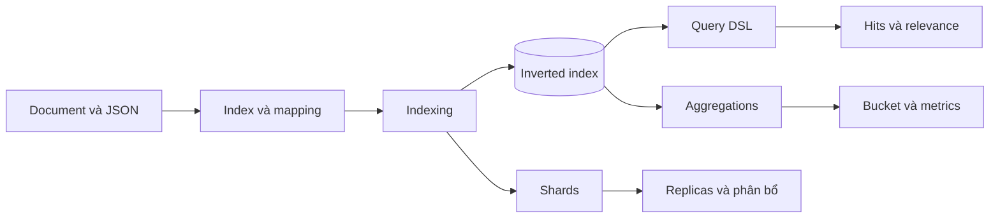

import { Step, Steps } from 'fumadocs-ui/components/steps';

<Callout type="info" title="Phạm vi của chuyên mục">
  Chuyên mục này giải thích các cơ chế và API nền tảng cần dùng khi xây dựng ứng dụng trên Elasticsearch. Bạn sẽ đi từ một document được lập chỉ mục đến truy vấn, tổng hợp và vận hành dữ liệu trên nhiều shard.
</Callout>

## Mục lục

- [Chuyên mục này dành cho ai?](#chuyên-mục-này-dành-cho-ai)
- [Điều kiện cần trước khi bắt đầu](#điều-kiện-cần-trước-khi-bắt-đầu)
- [Bản đồ khái niệm](#bản-đồ-khái-niệm)
- [Lộ trình học đề xuất](#lộ-trình-học-đề-xuất)
  - [1. Hiểu index và document](#1-hiểu-index-và-document)
  - [2. Thiết kế mapping và data type](#2-thiết-kế-mapping-và-data-type)
  - [3. Thực hành ghi dữ liệu](#3-thực-hành-ghi-dữ-liệu)
  - [4. Xây dựng query](#4-xây-dựng-query)
  - [5. Phân tích và tổng hợp kết quả](#5-phân-tích-và-tổng-hợp-kết-quả)
  - [6. Hiểu khả năng mở rộng](#6-hiểu-khả-năng-mở-rộng)
- [Các bài trong nhóm](#các-bài-trong-nhóm)
  - [Nền tảng dữ liệu](#nền-tảng-dữ-liệu)
  - [Ghi và tìm document](#ghi-và-tìm-document)
  - [Phân tích và tổng hợp](#phân-tích-và-tổng-hợp)
  - [Phân phối dữ liệu](#phân-phối-dữ-liệu)
- [Cách sử dụng tài liệu](#cách-sử-dụng-tài-liệu)
- [Tóm tắt](#tóm-tắt)

## Chuyên mục này dành cho ai?

Đây là điểm bắt đầu phù hợp nếu bạn đã biết một chút về HTTP và JSON, nhưng muốn hiểu Elasticsearch thay vì chỉ sao chép query mẫu. Nội dung hướng tới:

- Developer xây dựng chức năng tìm kiếm, lọc hoặc báo cáo trong ứng dụng.
- Data engineer thiết kế index, mapping và luồng ghi dữ liệu.
- Platform engineer cần nắm shard, replica và các yếu tố ảnh hưởng đến độ sẵn sàng.
- Người học Elastic muốn có một lộ trình từ khái niệm đến API thực hành.

Bạn không cần đọc toàn bộ các bài theo thứ tự nếu đã quen với một phần. Tuy nhiên, mapping và Query DSL là hai nền tảng nên nắm trước khi tối ưu tìm kiếm hoặc aggregation.

## Điều kiện cần trước khi bắt đầu

Bạn nên chuẩn bị:

- Kiến thức cơ bản về JSON object, array và kiểu dữ liệu.
- Hiểu HTTP method như `GET`, `POST`, `PUT` và `DELETE`.
- Một Elasticsearch local hoặc cluster thử nghiệm. Bạn có thể dùng [cài đặt bằng Docker Compose](../bat-dau/cai-dat-docker-compose) và chạy request trong [Kibana Dev Tools](../bat-dau/kibana-dev-tools).
- Một bộ dữ liệu nhỏ để lặp lại các ví dụ. Không nên thử các thao tác xóa hoặc thay đổi mapping trên dữ liệu production.

<Callout type="warn" title="Lưu ý về phiên bản">
  API và hành vi mặc định có thể thay đổi theo phiên bản Elasticsearch. Khi áp dụng vào hệ thống thật, hãy đối chiếu ví dụ với phiên bản cluster đang chạy và tài liệu API tương ứng.
</Callout>

## Bản đồ khái niệm

Các bài trong nhóm nối với nhau theo luồng của một request Elasticsearch. Mapping mô tả dữ liệu; indexing ghi dữ liệu vào cấu trúc tìm kiếm; Query DSL đọc dữ liệu; aggregation biến các document thành số liệu; shard và replica quyết định dữ liệu được phân phối và bảo vệ ra sao.

Một quyết định ở đầu luồng thường ảnh hưởng đến các phần phía sau. Ví dụ, chọn `text` hay `keyword` trong mapping sẽ quyết định analyzer, loại query và khả năng sort hoặc aggregation. Vì vậy, hãy đọc phần mô hình dữ liệu trước khi tối ưu query.

## Lộ trình học đề xuất

<Steps>
<Step>

### 1. Hiểu index và document

Bắt đầu với [Indices và documents](./indices-documents) để biết index, document, `_id`, refresh và vòng đời cơ bản của dữ liệu.

</Step>
<Step>

### 2. Thiết kế mapping và data type

Đọc [Mapping và data types](./mapping-datatypes). Tập trung vào khác biệt giữa `text` và `keyword`, multi-fields, dynamic mapping và lý do mapping đã tạo không thể sửa tùy ý.

</Step>
<Step>

### 3. Thực hành ghi dữ liệu

Dùng [CRUD và Bulk API](./crud-bulk) để tạo, đọc, cập nhật, xóa document và nạp nhiều document trong một request. Hãy chú ý xử lý từng item trong bulk response thay vì chỉ kiểm tra HTTP status.

</Step>
<Step>

### 4. Xây dựng query

Học [Query DSL](./query-dsl) để kết hợp `bool`, query context và filter context. Sau đó chuyển sang [Full-text search](./full-text-search) khi cần tìm văn bản tự nhiên, relevance hoặc autocomplete.

</Step>
<Step>

### 5. Phân tích và tổng hợp kết quả

Đọc [Analyzers và tokenizers](./analyzers-tokenizers) để kiểm soát cách văn bản trở thành token. Tiếp theo, dùng [Aggregations](./aggregations) cho facet, thống kê và báo cáo.

</Step>
<Step>

### 6. Hiểu khả năng mở rộng

Kết thúc bằng [Shards và replicas](./shards-replicas). Bài này giúp bạn liên hệ số shard, replica, phân bổ dữ liệu và khả năng chịu lỗi với hiệu năng thực tế.

</Step>
</Steps>

## Các bài trong nhóm

### Nền tảng dữ liệu

- [Indices và documents](./indices-documents) — Tạo và quản lý index; hiểu document, `_id`, refresh và các thao tác trên dữ liệu.
- [Mapping và data types](./mapping-datatypes) — Chọn data type, thiết kế field và kiểm soát dynamic mapping.

### Ghi và tìm document

- [CRUD và Bulk API](./crud-bulk) — Thực hiện create, read, update, delete và ghi dữ liệu hàng loạt.
- [Query DSL](./query-dsl) — Tổ chức query để tìm kiếm, lọc và kết hợp điều kiện.
- [Full-text search](./full-text-search) — Dùng `match`, phrase query, `multi_match`, `combined_fields`, autocomplete và các kỹ thuật kiểm tra relevance.

### Phân tích và tổng hợp

- [Analyzers và tokenizers](./analyzers-tokenizers) — Tìm hiểu char filter, tokenizer, token filter và cách tùy chỉnh analyzer cho ngôn ngữ.
- [Aggregations](./aggregations) — Tạo bucket, metric và pipeline aggregation để phân tích dữ liệu.

### Phân phối dữ liệu

- [Shards và replicas](./shards-replicas) — Hiểu phân mảnh, bản sao, phân bổ dữ liệu và các đánh đổi về hiệu năng, dung lượng và độ sẵn sàng.

## Cách sử dụng tài liệu

Mỗi bài nên được đọc cùng với một index thử nghiệm riêng. Với từng khái niệm, hãy lặp lại chu trình sau:

1. Tạo mapping tối thiểu cho use case.
2. Index vài document đại diện cho dữ liệu thật, gồm cả trường hợp biên.
3. Chạy request trong Kibana Dev Tools và quan sát response.
4. Dùng `_mapping`, `_analyze`, `_explain` hoặc profile query khi cần kiểm tra nguyên nhân.
5. Ghi lại trade-off trước khi chuyển thiết kế sang production.

<Callout type="idea" title="Mẹo học nhanh">
  Đừng đánh giá query chỉ bằng một document khớp hoặc không khớp. Hãy tạo tập dữ liệu nhỏ nhưng có các giá trị gần nhau, rồi kiểm tra cả kết quả, `_score`, thời gian phản hồi và số lượng shard được truy vấn.
</Callout>

Chuyên mục này tập trung vào Elasticsearch core. Các chủ đề như ingestion với Beats và Logstash, triển khai cluster, bảo mật, backup hoặc tích hợp client được trình bày ở các nhóm tài liệu khác trong sidebar.

## Tóm tắt

- **Mapping** quyết định dữ liệu được lập chỉ mục và loại thao tác có thể thực hiện.
- **CRUD và Bulk API** là nền tảng để ghi dữ liệu an toàn và hiệu quả.
- **Query DSL** và full-text search giúp đọc dữ liệu theo điều kiện hoặc theo ngôn ngữ tự nhiên.
- **Aggregations** tạo các góc nhìn thống kê từ tập document.
- **Shards và replicas** ảnh hưởng trực tiếp đến khả năng mở rộng và chịu lỗi.

<Cards>
  <Card title="Bắt đầu với Elasticsearch" href="../bat-dau" description="Cài đặt môi trường và chạy request đầu tiên." />
  <Card title="Full-text search" href="./full-text-search" description="Thiết kế tìm kiếm văn bản và kiểm tra relevance." />
  <Card title="Aggregations" href="./aggregations" description="Tổng hợp dữ liệu cho facet, thống kê và báo cáo." />
</Cards>
