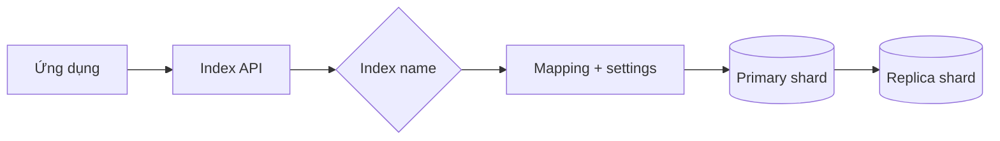
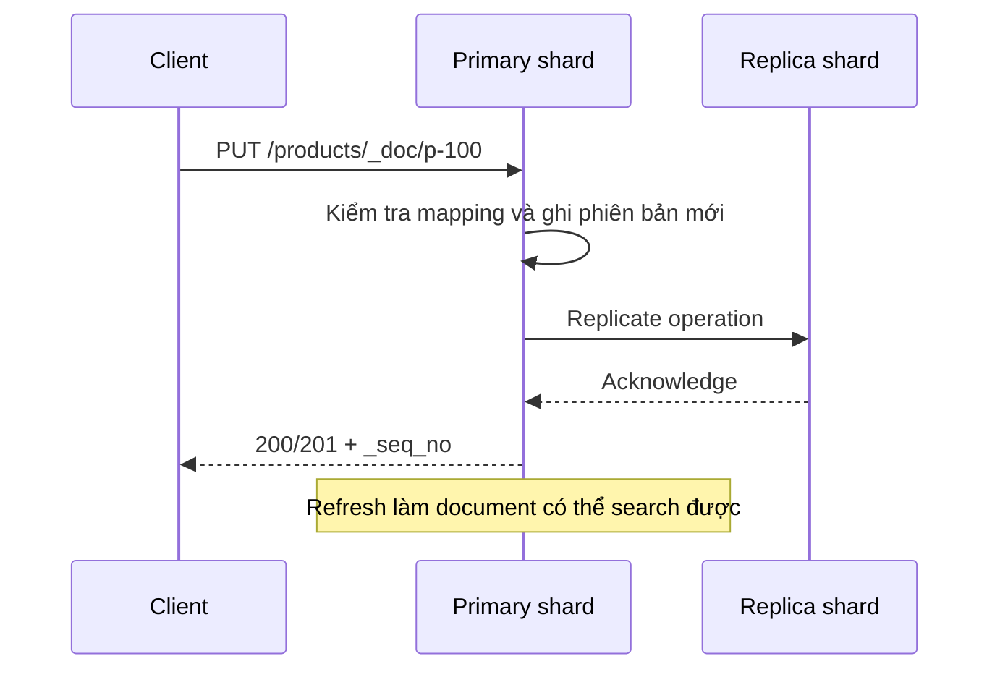

import { Accordion, Accordions } from 'fumadocs-ui/components/accordion';

<Callout type="info" title="Phạm vi của bài viết">
  Bài viết dùng Elasticsearch 8.x làm ngữ cảnh. Các ví dụ HTTP có thể chạy trong Kibana Dev Tools; khi gọi bằng `curl`, thay `$ES_URL` và thông tin xác thực bằng giá trị của môi trường bạn.
</Callout>

## Mục lục

- [Index, document và `_source`](#index-document-và-_source)
  - [Index là gì?](#index-là-gì)
  - [Document và `_source`](#document-và-_source)
- [Luồng ghi document](#luồng-ghi-document)
  - [Tạo index một cách tường minh](#tạo-index-một-cách-tường-minh)
  - [Ghi document và chọn ID](#ghi-document-và-chọn-id)
- [Settings và mapping của index](#settings-và-mapping-của-index)
  - [Các index settings quan trọng](#các-index-settings-quan-trọng)
- [ID, versioning và optimistic concurrency](#id-versioning-và-optimistic-concurrency)
  - [Auto-generated ID hay ID do ứng dụng chọn?](#auto-generated-id-hay-id-do-ứng-dụng-chọn)
  - [Bảo vệ cập nhật bằng sequence number](#bảo-vệ-cập-nhật-bằng-sequence-number)
- [Cập nhật và xóa document](#cập-nhật-và-xóa-document)
  - [Replace và partial update](#replace-và-partial-update)
  - [Refresh và tính nhất quán khi đọc](#refresh-và-tính-nhất-quán-khi-đọc)
- [Alias và data stream](#alias-và-data-stream)
  - [Alias cho tên logic](#alias-cho-tên-logic)
  - [Khi nào dùng data stream?](#khi-nào-dùng-data-stream)
- [Troubleshooting thực tế](#troubleshooting-thực-tế)
  - [Index không tồn tại hoặc mapping conflict](#index-không-tồn-tại-hoặc-mapping-conflict)
  - [Lỗi `409 Conflict` và ghi thất bại](#lỗi-409-conflict-và-ghi-thất-bại)
  - [Shard không được phân bổ hoặc disk đầy](#shard-không-được-phân-bổ-hoặc-disk-đầy)
- [Tóm tắt](#tóm-tắt)
- [Bước tiếp theo](#bước-tiếp-theo)

## Index, document và `_source`

Elasticsearch lưu dữ liệu dưới dạng các **document** JSON trong **index**. Index là một không gian tên logic cho những document có mục đích và mapping tương tự. Khác với bảng quan hệ, một index được phân tán thành các shard để nhiều node có thể cùng lưu và tìm kiếm dữ liệu.

### Index là gì?

Một index có ba lớp khái niệm thường gặp:

- **Index name:** tên dùng trong API, ví dụ `products-v1`. Tên này nên viết thường và không chứa khoảng trắng.
- **Mapping:** khai báo cách Elasticsearch hiểu từng field, chẳng hạn `title` là `text` còn `price` là `float`.
- **Settings:** cấu hình hành vi của index, chẳng hạn số primary shard, số replica và analyzer mặc định.



Primary shard là bản phân vùng dữ liệu gốc. Replica shard là bản sao của primary để tăng khả năng đọc và chịu lỗi. Khi tạo index, số primary shard thường là quyết định khó thay đổi về sau; hãy xem thêm bài [Shards và replicas](./shards-replicas) trước khi đưa index lớn vào production.

### Document và `_source`

Document là một đối tượng JSON đại diện cho một thực thể hoặc một sự kiện. Ví dụ, một sản phẩm có thể là:

```json
{
  "name": "Bàn phím cơ",
  "category": "keyboard",
  "price": 1290000,
  "available": true,
  "updated_at": "2025-01-15T08:30:00Z"
}
```

Elasticsearch lưu bản JSON ban đầu trong field metadata `_source` theo mặc định. `_source` giúp trả lại dữ liệu cho ứng dụng và hỗ trợ reindex, nhưng nó không phải là cấu trúc duy nhất dùng để tìm kiếm. Elasticsearch còn tạo các cấu trúc nội bộ như inverted index và doc values dựa trên mapping.

<Callout type="warn" title="Đừng nhầm `_source` với index search">
  `_source` không được dùng để thực hiện mọi tìm kiếm theo kiểu quét JSON tùy ý. Query hoạt động dựa trên field đã được mapping và các cấu trúc chỉ mục tương ứng. Nếu tắt `_source`, việc đọc lại document và reindex sẽ khó hơn đáng kể.
</Callout>

Một document có metadata `_index`, `_id`, `_version`, `_seq_no` và `_primary_term` trong kết quả tìm kiếm. Các metadata này không phải field thông thường trong JSON của bạn. Chúng cho biết document nằm ở đâu và giúp kiểm soát cập nhật đồng thời.

## Luồng ghi document

Khi ứng dụng gửi document, Elasticsearch chọn primary shard dựa trên hash của `_id`, ghi phiên bản mới vào primary, rồi chuyển tiếp thay đổi tới các replica. Sau khi request thành công, document thường được đọc lại trong lần refresh kế tiếp.



### Tạo index một cách tường minh

Nên tạo index với mapping và settings rõ ràng trước khi ghi document. Cách này tránh dynamic mapping suy đoán sai kiểu dữ liệu từ document đầu tiên.

```http
PUT /products-v1
{
  "settings": {
    "number_of_shards": 1,
    "number_of_replicas": 1,
    "refresh_interval": "1s"
  },
  "mappings": {
    "dynamic": "strict",
    "properties": {
      "name": { "type": "text", "fields": { "keyword": { "type": "keyword" } } },
      "category": { "type": "keyword" },
      "price": { "type": "scaled_float", "scaling_factor": 100 },
      "available": { "type": "boolean" },
      "updated_at": { "type": "date" }
    }
  }
}
```

`dynamic: strict` khiến request thất bại khi payload chứa field chưa khai báo. Đây là lựa chọn an toàn cho schema ổn định, nhưng ứng dụng phải xử lý lỗi mapping. Với dữ liệu có field mở rộng không kiểm soát, có thể dùng `dynamic: false` hoặc dynamic templates sau khi cân nhắc chi phí.

Kiểm tra index sau khi tạo:

```http
GET /products-v1
GET /products-v1/_mapping
GET /products-v1/_settings
```

Nếu cần tạo qua `curl`, phiên bản tương đương là:

```bash
curl -X PUT "$ES_URL/products-v1" \
  -H 'Content-Type: application/json' \
  -u "$ES_USER:$ES_PASSWORD" \
  --data-binary @- <<'JSON'
{
  "settings": { "number_of_shards": 1, "number_of_replicas": 1 },
  "mappings": {
    "properties": {
      "name": { "type": "text" },
      "category": { "type": "keyword" },
      "price": { "type": "scaled_float", "scaling_factor": 100 }
    }
  }
}
JSON
```

### Ghi document và chọn ID

Dùng `PUT /<index>/_doc/<id>` khi ứng dụng đã có định danh ổn định. Request sau tạo document có ID `p-100`, hoặc thay thế toàn bộ document nếu ID này đã tồn tại:

```http
PUT /products-v1/_doc/p-100
{
  "name": "Bàn phím cơ",
  "category": "keyboard",
  "price": 1290000,
  "available": true,
  "updated_at": "2025-01-15T08:30:00Z"
}
```

Nếu không cần tự chọn ID, dùng `POST` để Elasticsearch sinh ID:

```http
POST /products-v1/_doc
{
  "name": "Chuột không dây",
  "category": "mouse",
  "price": 490000,
  "available": true
}
```

Response cho biết `_index`, `_id`, `result` (`created` hoặc `updated`) và `_shards`. Kiểm tra `_shards.failed` khi client hoặc proxy báo request thành công nhưng cluster có dấu hiệu bất thường.

Đọc document theo ID:

```http
GET /products-v1/_doc/p-100
GET /products-v1/_source/p-100
```

`GET _doc` trả cả metadata và `_source`; endpoint `_source` chỉ trả payload `_source`. Hai API này là đọc theo ID, không phải full-text search.

## Settings và mapping của index

Mapping nên được xem như một hợp đồng giữa dữ liệu và query. `text` được phân tích để tìm kiếm ngôn ngữ tự nhiên. `keyword` giữ giá trị nguyên vẹn để filter, sort và aggregation. Data type đã tạo thường không thể đổi trực tiếp nếu thay đổi làm xung đột với dữ liệu cũ; khi đó cần tạo index mới và reindex.

### Các index settings quan trọng

| Setting | Ý nghĩa | Lưu ý production |
| --- | --- | --- |
| `number_of_shards` | Số primary shard khi tạo index | Ước lượng kích thước và throughput; không thể đổi trực tiếp như replica |
| `number_of_replicas` | Số bản sao của mỗi primary | Tăng khả năng đọc và chịu lỗi, nhưng tốn disk/network |
| `refresh_interval` | Chu kỳ làm dữ liệu mới có thể search | Refresh quá ngắn làm tăng I/O; bulk ingestion thường có thể nới dài |
| `index.default_pipeline` | Ingest pipeline mặc định | Xác nhận pipeline tồn tại trước khi ghi |
| `index.lifecycle.name` | ILM policy gắn với index | Phù hợp cho dữ liệu có vòng đời như log |

Có thể đổi replica và refresh interval trên index đang hoạt động:

```http
PUT /products-v1/_settings
{
  "index": {
    "number_of_replicas": 1,
    "refresh_interval": "5s"
  }
}
```

Không nên tắt `_source` chỉ để giảm một phần dung lượng. Hãy đo kích thước index trước, dùng `_source` filtering khi response lớn, và thiết kế mapping tránh field không cần thiết.

## ID, versioning và optimistic concurrency

Elasticsearch dùng phiên bản nội bộ để nhận biết thứ tự thay đổi. `seq_no` là sequence number của operation trong shard. `primary_term` thay đổi khi primary shard mới được bầu. Cặp giá trị này giúp client phát hiện dữ liệu đã bị một writer khác thay đổi.

### Auto-generated ID hay ID do ứng dụng chọn?

Chọn ID do ứng dụng quản lý khi document là thực thể có khóa tự nhiên, chẳng hạn `order-2025-0001` hoặc UUID đã tồn tại trong database. Retry cùng một `PUT` sẽ ghi vào cùng document thay vì tạo bản sao. Đây là cách đơn giản để đạt hành vi idempotent — gửi lại cùng operation không tạo thêm bản ghi.

Dùng auto-generated ID cho event append-only, nơi mỗi request là một sự kiện mới. Không dùng auto ID cho thao tác retry tạo một thực thể duy nhất nếu client không có cơ chế idempotency riêng.

Có thể ngăn `PUT` ghi đè document hiện hữu bằng `op_type=create`:

```http
PUT /products-v1/_create/p-100
{
  "name": "Bàn phím cơ",
  "category": "keyboard",
  "price": 1290000,
  "available": true
}
```

Nếu `p-100` đã tồn tại, Elasticsearch trả `409 Conflict` thay vì thay thế document. Client có thể coi đây là dấu hiệu duplicate và quyết định xử lý theo nghiệp vụ.

### Bảo vệ cập nhật bằng sequence number

Giả sử hai request cùng đọc `p-100`. Request A cập nhật trước. Khi request B gửi dữ liệu cũ, ứng dụng không muốn B ghi đè thay đổi của A. Hãy đọc `_seq_no` và `_primary_term`, rồi gửi chúng vào điều kiện `if_seq_no` và `if_primary_term`:

```http
GET /products-v1/_doc/p-100
```

Ví dụ response rút gọn:

```json
{
  "_index": "products-v1",
  "_id": "p-100",
  "_version": 3,
  "_seq_no": 12,
  "_primary_term": 1,
  "found": true,
  "_source": { "name": "Bàn phím cơ", "price": 1290000 }
}
```

Dùng cặp giá trị đã đọc trong request cập nhật:

```http
PUT /products-v1/_doc/p-100?if_seq_no=12&if_primary_term=1
{
  "name": "Bàn phím cơ",
  "category": "keyboard",
  "price": 1390000,
  "available": true
}
```

Nếu document đã đổi, request trả `409`. Client nên đọc lại document, merge theo quy tắc nghiệp vụ rồi thử lại có giới hạn. Không nên dùng `_version` cũ để tự xây dựng logic concurrency mới; optimistic concurrency hiện đại của Elasticsearch dùng `_seq_no` và `_primary_term`.

## Cập nhật và xóa document

### Replace và partial update

`PUT /_doc/<id>` thay thế toàn bộ `_source`. Nếu bỏ quên một field trong payload, field đó sẽ biến mất. Với thay đổi một vài field, dùng Update API:

```http
POST /products-v1/_update/p-100
{
  "doc": {
    "available": false,
    "updated_at": "2025-01-16T10:00:00Z"
  }
}
```

Có thể cập nhật bằng painless script khi cần phép tính nguyên tử tại shard:

```http
POST /products-v1/_update/p-100
{
  "script": {
    "lang": "painless",
    "source": "ctx._source.price = params.price; ctx._source.updated_at = params.updated_at",
    "params": {
      "price": 1490000,
      "updated_at": "2025-01-16T10:00:00Z"
    }
  }
}
```

Xóa theo ID:

```http
DELETE /products-v1/_doc/p-100
```

Xóa theo query có thể tác động đến rất nhiều document. Luôn chạy `_search` với cùng query trước, giới hạn phạm vi bằng index/alias cụ thể, và cân nhắc snapshot trước thao tác destructive:

```http
POST /products-v1/_delete_by_query
{
  "query": {
    "term": { "category": "discontinued" }
  }
}
```

### Refresh và tính nhất quán khi đọc

Ghi thành công không có nghĩa document lập tức xuất hiện trong mọi search request. Refresh làm segment mới có thể tìm kiếm được. Mặc định Elasticsearch refresh định kỳ, thường khoảng một giây, tùy settings và tải.

Khi một workflow cần search ngay sau khi ghi, có thể yêu cầu refresh cho request đó:

```http
PUT /products-v1/_doc/p-101?refresh=wait_for
{
  "name": "Tai nghe",
  "category": "audio",
  "price": 790000,
  "available": true
}
```

`refresh=wait_for` chờ refresh kế tiếp và thường ít gây áp lực hơn `refresh=true`. Không gắn `refresh=true` vào mọi request bulk production; refresh quá thường xuyên làm tăng merge và I/O.

## Alias và data stream

### Alias cho tên logic

Alias là tên thay thế trỏ tới một hoặc nhiều index. Ứng dụng dùng alias thay vì phụ thuộc vào tên index vật lý. Mô hình phổ biến là `products-read` cho đọc và `products-write` cho ghi.

```http
POST /_aliases
{
  "actions": [
    { "add": { "index": "products-v1", "alias": "products-read" } },
    { "add": { "index": "products-v1", "alias": "products-write", "is_write_index": true } }
  ]
}
```

Khi phát hành `products-v2`, có thể chuyển alias trong một request nguyên tử:

```http
POST /_aliases
{
  "actions": [
    { "remove": { "index": "products-v1", "alias": "products-read" } },
    { "add": { "index": "products-v2", "alias": "products-read" } },
    { "remove": { "index": "products-v1", "alias": "products-write" } },
    { "add": { "index": "products-v2", "alias": "products-write", "is_write_index": true } }
  ]
}
```

Alias giúp zero-downtime reindex, nhưng mapping của index mới phải tương thích với ứng dụng trước khi đổi traffic. Kiểm tra alias bằng `GET /_alias/products-read` và tránh để write alias trỏ tới nhiều index mà không đặt `is_write_index` rõ ràng.

### Khi nào dùng data stream?

Data stream dành cho dữ liệu append-only theo thời gian, như log, metric và event. Data stream quản lý các backing index và thường kết hợp index template cùng ILM để rollover. Ghi vào data stream cần có timestamp field (mặc định là `@timestamp`) và nên dùng auto-generated ID hoặc ID không gây cập nhật ngược event.

Không dùng data stream cho catalog cần cập nhật tùy ý theo ID như `products`. Với catalog, index + alias thường dễ hiểu hơn. Với log liên tục, data stream giúp ứng dụng ghi vào một tên ổn định trong khi Elasticsearch tự quản lý backing index.

## Troubleshooting thực tế

### Index không tồn tại hoặc mapping conflict

Lỗi `index_not_found_exception` thường có nghĩa tên index/alias sai, index chưa được tạo hoặc wildcard bị hạn chế. Kiểm tra:

```http
GET /_cat/indices/products*?v
GET /_resolve/index/products*
```

Lỗi `mapper_parsing_exception` hoặc `illegal_argument_exception` thường xuất hiện khi giá trị không phù hợp mapping. Ví dụ field `price` đã là số nhưng payload gửi chuỗi không chuyển đổi được. Lấy mapping hiện tại trước khi sửa producer:

```http
GET /products-v1/_mapping/field/price
```

Nếu kiểu field cần đổi từ `text` sang `keyword` hoặc từ `long` sang `date`, không thể sửa trực tiếp một cách an toàn. Tạo index v2 với mapping đúng, dùng `_reindex`, kiểm thử, rồi chuyển alias.

<Callout type="error" title="Dynamic mapping có thể tạo schema sai">
  Nếu document đầu tiên gửi `customer_id` dưới dạng số, Elasticsearch có thể tạo mapping số. Những document sau gửi ID có tiền tố chữ sẽ thất bại. Với field quan trọng, khai báo mapping trước khi ingest.
</Callout>

### Lỗi `409 Conflict` và ghi thất bại

Có ba nguyên nhân thực hành thường gặp:

1. Request dùng `_create` nhưng ID đã tồn tại. Đây có thể là duplicate hợp lệ, không nhất thiết là lỗi hạ tầng.
2. Request dùng `if_seq_no`/`if_primary_term` cũ. Đọc lại document, merge và retry theo chính sách của ứng dụng.
3. Cluster đang chuyển primary hoặc shard chưa sẵn sàng. Kiểm tra cluster health và allocation thay vì retry vô hạn.

Retry phải có exponential backoff, giới hạn số lần và phân loại lỗi. Không retry mù các lỗi mapping hoặc `400`; gửi lại payload sai chỉ làm log và tải tăng lên.

### Shard không được phân bổ hoặc disk đầy

Kiểm tra sức khỏe cluster và lý do allocation:

```http
GET /_cluster/health/products-v1?level=shards
GET /_cat/shards/products-v1?v
POST /_cluster/allocation/explain
{
  "index": "products-v1",
  "shard": 0,
  "primary": false
}
```

Nếu disk vượt watermark, Elasticsearch có thể ngăn allocation hoặc chuyển shard sang node khác. Hãy xử lý nguyên nhân: xóa dữ liệu hết hạn qua ILM, tăng dung lượng, cân bằng shard hoặc giảm tốc độ ingest. Không xóa ngẫu nhiên thư mục data của node; điều đó có thể làm mất dữ liệu và phá vỡ metadata cluster.

<Accordions type="single">
  <Accordion title="Checklist trước khi đưa index vào production">
    - Mapping cho các field dùng để search, filter, sort và aggregation đã được khai báo.
    - Số primary shard dựa trên kích thước dự kiến và throughput, không chỉ dựa trên số node hiện tại.
    - Ứng dụng có retry có kiểm soát cho lỗi tạm thời và xử lý `409` theo nghiệp vụ.
    - Alias hoặc data stream đã được chọn theo mô hình dữ liệu và có quy trình rollover/reindex.
    - Có snapshot, cảnh báo disk/cluster health và cách kiểm tra mapping khi ingest lỗi.
  </Accordion>
</Accordions>

## Tóm tắt

- **Index** là không gian tên chứa các document có mapping và settings liên quan.
- **Document** là JSON; `_source` giữ payload ban đầu để đọc lại và reindex, còn search dựa trên cấu trúc được tạo từ mapping.
- Tạo index với mapping tường minh trước khi ingest giúp tránh dynamic mapping sai.
- Dùng ID ổn định và `PUT` để retry an toàn cho thực thể duy nhất. Dùng `_create` khi cần từ chối duplicate.
- Dùng `_seq_no` và `_primary_term` để bảo vệ cập nhật đồng thời. Xử lý `409` bằng đọc lại, merge và retry có giới hạn.
- Alias phù hợp cho tên logic và chuyển phiên bản index. Data stream phù hợp cho event append-only theo thời gian.
- Khi có lỗi, kiểm tra mapping, index resolution, cluster health, shard allocation và disk watermark theo thứ tự.

## Bước tiếp theo

<Cards>
  <Card title="Mapping và data types" href="./mapping-datatypes" description="Thiết kế mapping và chọn data type trước khi ingest." />
  <Card title="CRUD và Bulk API" href="./crud-bulk" description="Ghi, cập nhật và ingest nhiều document hiệu quả." />
  <Card title="Shards và replicas" href="./shards-replicas" description="Ước lượng shard và thiết kế khả năng chịu lỗi." />
</Cards>
