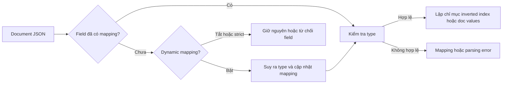

<Callout type="info" title="Phạm vi của bài viết">
  Mapping là hợp đồng mô tả cách Elasticsearch lưu và lập chỉ mục field trong document. Bài viết này dùng Elasticsearch 8.x và tập trung vào thiết kế mapping cho dữ liệu ứng dụng, từ lúc tạo index đến khi cần thay đổi schema.
</Callout>

## Mục lục

- [Mapping là gì?](#mapping-là-gì)
  - [Luồng từ document đến mapping](#luồng-từ-document-đến-mapping)
  - [Static và dynamic mapping](#static-và-dynamic-mapping)
- [Tạo và kiểm tra mapping](#tạo-và-kiểm-tra-mapping)
  - [Tạo index với static mapping](#tạo-index-với-static-mapping)
  - [Đọc mapping hiện tại](#đọc-mapping-hiện-tại)
- [Các data type quan trọng](#các-data-type-quan-trọng)
  - [Text và keyword](#text-và-keyword)
  - [Numeric, boolean và date](#numeric-boolean-và-date)
  - [Object, nested và flattened](#object-nested-và-flattened)
  - [Arrays và null](#arrays-và-null)
- [Multi-fields và runtime fields](#multi-fields-và-runtime-fields)
  - [Dùng multi-fields cho nhiều cách truy cập](#dùng-multi-fields-cho-nhiều-cách-truy-cập)
  - [Dùng runtime fields cho dữ liệu tính tại thời điểm truy vấn](#dùng-runtime-fields-cho-dữ-liệu-tính-tại-thời-điểm-truy-vấn)
- [Dynamic templates](#dynamic-templates)
- [Bảng chọn type nhanh](#bảng-chọn-type-nhanh)
- [Giới hạn và các gotcha](#giới-hạn-và-các-gotcha)
  - [Không thể đổi type trực tiếp](#không-thể-đổi-type-trực-tiếp)
  - [Type conflict giữa các document](#type-conflict-giữa-các-document)
  - [Giới hạn số field](#giới-hạn-số-field)
  - [Reindex khi schema thay đổi](#reindex-khi-schema-thay-đổi)
- [Chiến lược thiết kế mapping](#chiến-lược-thiết-kế-mapping)
- [Tóm tắt](#tóm-tắt)

## Mapping là gì?

**Mapping** là schema của một index. Schema này khai báo tên field, data type, analyzer và cách Elasticsearch lập chỉ mục dữ liệu. Elasticsearch dùng mapping để biết `price` là số có thể range query, còn `title` là văn bản cần phân tích.

Một document JSON không có schema bắt buộc ở phía ứng dụng. Tuy nhiên, khi Elasticsearch nhận field lần đầu, nó phải quyết định cách lập chỉ mục field đó. Quyết định này có thể đến từ mapping bạn khai báo trước hoặc từ dynamic mapping.

Mapping không chỉ ảnh hưởng việc dữ liệu được lưu. Nó còn quyết định query nào, sort nào và aggregation nào có thể chạy hiệu quả.

### Luồng từ document đến mapping



Ví dụ, document sau làm `price` trở thành một field số nếu index đang dùng dynamic mapping:

```json
{
  "title": "Bàn phím cơ",
  "price": 1290000,
  "available": true,
  "published_at": "2025-01-15T09:30:00Z"
}
```

Nếu `price` được gửi ở document sau dưới dạng chuỗi không thể parse thành số, request có thể thất bại. Vì vậy, mapping rõ ràng và validation ở ứng dụng giúp lỗi xuất hiện sớm hơn.

### Static và dynamic mapping

**Static mapping** là mapping do bạn khai báo trước khi index document. Đây là lựa chọn an toàn cho field quan trọng vì bạn kiểm soát được type, index, doc values và giới hạn của field.

**Dynamic mapping** cho phép Elasticsearch tự tạo mapping khi thấy field mới. Cách này tiện khi thử nghiệm hoặc ingest dữ liệu chưa ổn định, nhưng có thể tạo schema ngoài ý muốn. Chẳng hạn chuỗi `"2025-01-15"` thường được nhận diện là `date`, trong khi một mã sản phẩm có hình dạng tương tự lại chỉ nên là `keyword`.

Bạn có thể kiểm soát dynamic mapping ở cấp index hoặc object:

```http
PUT events-strict
{
  "mappings": {
    "dynamic": "strict",
    "properties": {
      "event_id": { "type": "keyword" },
      "message": { "type": "text" }
    }
  }
}
```

Ba chế độ thường dùng là:

| Chế độ | Khi gặp field chưa khai báo | Khi nên dùng |
| --- | --- | --- |
| `true` | Tự suy ra type và thêm field vào mapping | Prototype hoặc dữ liệu đơn giản, đã kiểm soát |
| `false` | Không lập chỉ mục field mới nhưng vẫn giữ field trong `_source` | Muốn linh hoạt nhưng không để schema phình to |
| `strict` | Từ chối document có field chưa khai báo | Production cần hợp đồng dữ liệu chặt chẽ |

<Callout type="warn" title="Dynamic mapping không phải validation">
  Dynamic mapping chỉ suy ra cách lập chỉ mục. Nó không kiểm tra business rule như giá tiền phải dương, email phải hợp lệ hoặc status phải thuộc một tập giá trị. Hãy validate dữ liệu ở ingest pipeline hoặc application layer.
</Callout>

## Tạo và kiểm tra mapping

### Tạo index với static mapping

Nên tạo index với mapping trước khi ghi document đầu tiên. Ví dụ sau mô tả một catalog sản phẩm:

```http
PUT products-v1
{
  "settings": {
    "number_of_shards": 1,
    "number_of_replicas": 1
  },
  "mappings": {
    "dynamic": "strict",
    "properties": {
      "product_id": { "type": "keyword" },
      "name": {
        "type": "text",
        "fields": {
          "keyword": { "type": "keyword", "ignore_above": 256 }
        }
      },
      "description": { "type": "text" },
      "price": { "type": "scaled_float", "scaling_factor": 100 },
      "stock": { "type": "integer" },
      "available": { "type": "boolean" },
      "categories": { "type": "keyword" },
      "attributes": { "type": "flattened" },
      "created_at": { "type": "date" }
    }
  }
}
```

`scaled_float` lưu số thực bằng cách nhân với `scaling_factor`. Với giá tiền có hai chữ số thập phân, `100` giúp tránh một số sai số của số thực và vẫn hỗ trợ aggregation, sort và range query.

Sau đó, index document bằng ID ổn định:

```http
PUT products-v1/_doc/p-1001
{
  "product_id": "p-1001",
  "name": "Bàn phím cơ 75%",
  "description": "Bàn phím nhỏ gọn, switch tactile và kết nối không dây.",
  "price": 1290000,
  "stock": 42,
  "available": true,
  "categories": ["keyboard", "wireless"],
  "attributes": {
    "switch": "tactile",
    "layout": "75%",
    "wireless": "true"
  },
  "created_at": "2025-01-15T09:30:00Z"
}
```

Với `dynamic: strict`, thêm một field như `discount` mà chưa có trong mapping sẽ trả về lỗi. Bạn có thể cập nhật mapping để **thêm** field mới, nhưng không thể đổi type của field đã được lập chỉ mục.

### Đọc mapping hiện tại

Dùng Mapping API để kiểm tra schema thực tế thay vì đoán từ document:

```http
GET products-v1/_mapping
```

Chỉ xem mapping của một field:

```http
GET products-v1/_mapping/field/name
```

Khi debug một field, hãy kiểm tra đồng thời mapping và document mẫu. `GET products-v1/_mapping` cho biết type và thuộc tính lập chỉ mục; `_source` cho biết giá trị gốc được lưu. Hai thông tin này không phải lúc nào cũng giống nhau về hình thức, vì analyzer biến đổi token nhưng không thay đổi `_source`.

## Các data type quan trọng

### Text và keyword

`text` dành cho nội dung ngôn ngữ tự nhiên. Elasticsearch chạy analyzer trên giá trị `text` để tạo token, sau đó các query như `match` tìm theo token đó.

`keyword` giữ giá trị như một chuỗi nguyên vẹn. Nó phù hợp cho ID, status, category, mã sản phẩm, filter, sort và aggregation.

```http
PUT products-v1/_search
{
  "query": {
    "bool": {
      "must": {
        "match": { "name": "bàn phím không dây" }
      },
      "filter": [
        { "term": { "categories": "wireless" } },
        { "range": { "price": { "lte": 2000000 } } }
      ]
    }
  },
  "sort": [{ "price": "asc" }]
}
```

Trong ví dụ trên, `name` cần là `text`, còn `categories` và `price` cần type có thể filter/sort. Nếu cần vừa tìm kiếm vừa sort tên, dùng multi-field `name` và `name.keyword` thay vì cố dùng một type cho cả hai mục đích.

<Callout type="error" title="Sai lầm phổ biến với keyword">
  `keyword` không tự tách câu thành token. Query `term` với giá trị `Bàn Phím` không tương đương với tìm kiếm full-text không phân biệt hoa thường. Nếu người dùng cần tìm theo từ trong câu, hãy dùng `text` và analyzer phù hợp.
</Callout>

### Numeric, boolean và date

Chọn numeric type theo miền giá trị, không chỉ theo kiểu dữ liệu của ngôn ngữ lập trình:

- `byte`, `short`, `integer`, `long`: số nguyên với miền tăng dần.
- `unsigned_long`: số nguyên không âm rất lớn.
- `half_float`, `float`, `double`: số thực với độ chính xác khác nhau.
- `scaled_float`: số thực được nhân với hệ số rồi lưu như số nguyên, hữu ích cho tiền tệ.

`boolean` nhận `true` hoặc `false` và phù hợp cho cờ trạng thái. Tránh dùng chuỗi `"true"`/`"false"` cho field boolean nếu có thể kiểm soát producer.

`date` hỗ trợ giá trị dạng ISO-8601, epoch milliseconds hoặc format bạn khai báo. Một field date có thể query theo khoảng thời gian:

```http
GET products-v1/_search
{
  "query": {
    "range": {
      "created_at": {
        "gte": "now-30d/d",
        "lt": "now+1d/d"
      }
    }
  }
}
```

Elasticsearch lưu date dưới dạng số đại diện cho thời điểm. Mapping date vẫn nên khai báo format phù hợp để từ chối dữ liệu sai thay vì để parser tự đoán quá rộng.

### Object, nested và flattened

JSON object mặc định được lập chỉ mục dưới dạng `object`. Các field con trở thành field có đường dẫn như `customer.name`. Với object chứa mảng object, Elasticsearch làm phẳng các giá trị thành các mảng song song. Cách này có thể làm mất quan hệ giữa các thuộc tính trong cùng một phần tử.

Ví dụ document sau có hai sản phẩm trong giỏ hàng:

```json
{
  "items": [
    { "sku": "A", "quantity": 1 },
    { "sku": "B", "quantity": 5 }
  ]
}
```

Nếu `items` là `object` mặc định, query `sku: A AND quantity: 5` có thể ghép `sku` của phần tử đầu với `quantity` của phần tử thứ hai. Dùng `nested` để giữ mỗi phần tử như một hidden nested document:

```http
PUT orders-v1
{
  "mappings": {
    "properties": {
      "items": {
        "type": "nested",
        "properties": {
          "sku": { "type": "keyword" },
          "quantity": { "type": "integer" }
        }
      }
    }
  }
}
```

Query nested phải chứa một `nested` query:

```http
GET orders-v1/_search
{
  "query": {
    "nested": {
      "path": "items",
      "query": {
        "bool": {
          "filter": [
            { "term": { "items.sku": "A" } },
            { "range": { "items.quantity": { "gte": 5 } } }
          ]
        }
      }
    }
  }
}
```

Dùng `flattened` cho object có nhiều key động, chẳng hạn metadata do nhiều hệ thống gửi về. `flattened` giới hạn việc tạo hàng nghìn field riêng trong mapping, nhưng các giá trị được xử lý như keyword và không thay thế được mapping numeric/date chi tiết. Chọn `nested` khi quan hệ giữa các thuộc tính trong từng phần tử là quan trọng; chọn `flattened` khi số key không biết trước quan trọng hơn các truy vấn kiểu số.

### Arrays và null

Elasticsearch không có data type `array` riêng. Một field có thể chứa một giá trị hoặc nhiều giá trị cùng type:

```json
{
  "tags": ["elasticsearch", "search"],
  "scores": [3, 4, 5]
}
```

Mapping của `tags` vẫn là `keyword`, còn `scores` vẫn là numeric. Query `term` trên `tags` khớp khi một phần tử khớp.

Mảng nên đồng nhất type. Một field không nên lúc là số, lúc là object, vì document sau có thể gây parsing error hoặc type conflict.

`null` không tạo token và không được xem là giá trị có thể query. Dùng `exists` để kiểm tra field có giá trị đã được lập chỉ mục:

```http
GET products-v1/_search
{
  "query": {
    "bool": {
      "must_not": [{ "exists": { "field": "description" } }]
    }
  }
}
```

Nếu cần phân biệt “field không có”, “field null” và “field có giá trị rỗng”, hãy chuẩn hóa dữ liệu ở ingest hoặc thêm field trạng thái riêng. `null_value` có thể thay `null` bằng một giá trị lập chỉ mục, nhưng không áp dụng cho mảng rỗng và phải chọn giá trị không nhầm với dữ liệu thật.

## Multi-fields và runtime fields

### Dùng multi-fields cho nhiều cách truy cập

Multi-field cho phép một giá trị được lập chỉ mục theo nhiều cách. Mẫu phổ biến nhất là `text` kèm `keyword`:

```json
"title": {
  "type": "text",
  "fields": {
    "keyword": {
      "type": "keyword",
      "ignore_above": 256
    }
  }
}
```

Dùng `title` cho `match`, `title.keyword` cho sort, aggregation hoặc exact filter. Có thể thêm analyzer khác, chẳng hạn một sub-field không dấu hoặc autocomplete, nhưng mỗi sub-field làm tăng chi phí index và storage.

Kiểm tra field nào có thể sort hoặc aggregation bằng field capabilities API:

```http
GET products-*/_field_caps?fields=name,name.keyword,price
```

### Dùng runtime fields cho dữ liệu tính tại thời điểm truy vấn

Runtime field là field được tính khi query hoặc aggregation chạy, thay vì lập chỉ mục từ trước. Nó hữu ích để thử một cách diễn giải dữ liệu, tạo field dẫn xuất ít được truy cập hoặc tương thích tạm thời trong khi chờ reindex.

Ví dụ tính `price_with_tax` từ `price`:

```http
GET products-v1/_search
{
  "runtime_mappings": {
    "price_with_tax": {
      "type": "double",
      "script": {
        "source": "emit(doc['price'].value * 1.1)"
      }
    }
  },
  "fields": ["price_with_tax"],
  "query": {
    "range": { "price_with_tax": { "lte": 2000000 } }
  }
}
```

Runtime field không cần reindex khi thay đổi script, nhưng chi phí tính toán chuyển sang thời điểm đọc. Với field được dùng trong mọi request hoặc cần độ trễ thấp, materialize field bằng ingest pipeline và reindex thường phù hợp hơn.

## Dynamic templates

Dynamic templates cho phép áp quy tắc mapping theo tên field hoặc kiểu mà dynamic mapping suy ra. Ví dụ, mọi field kết thúc bằng `_id` phải là `keyword`, còn chuỗi thông thường phải là `text` kèm `keyword`:

```http
PUT logs-v1
{
  "mappings": {
    "dynamic_templates": [
      {
        "ids_as_keywords": {
          "match": "*_id",
          "match_mapping_type": "string",
          "mapping": {
            "type": "keyword",
            "ignore_above": 256
          }
        }
      },
      {
        "strings_with_search_and_exact": {
          "match_mapping_type": "string",
          "mapping": {
            "type": "text",
            "fields": {
              "keyword": { "type": "keyword", "ignore_above": 256 }
            }
          }
        }
      }
    ]
  }
}
```

Template được xét theo thứ tự. Template đầu tiên khớp sẽ được dùng. Vì vậy, quy tắc cụ thể như `*_id` phải đứng trước quy tắc tổng quát cho mọi string.

Có thể dùng `path_match` để giới hạn theo đường dẫn, hoặc `unmatch` để loại trừ tên field. Hãy gửi document mẫu qua một index thử nghiệm và gọi `GET index/_mapping` trước khi áp template vào production.

## Bảng chọn type nhanh

| Dữ liệu hoặc nhu cầu | Type nên chọn | Ghi chú |
| --- | --- | --- |
| Tiêu đề, mô tả, nội dung tìm theo từ | `text` | Chọn analyzer; thường thêm `keyword` multi-field |
| ID, mã đơn hàng, status, tag | `keyword` | Dùng cho exact filter, sort và aggregation |
| Tiền tệ có số chữ số thập phân cố định | `scaled_float` | Đặt `scaling_factor` phù hợp |
| Số nguyên thông thường | `integer` hoặc `long` | Chọn theo miền giá trị |
| Boolean | `boolean` | Chuẩn hóa producer về `true`/`false` |
| Thời điểm hoặc ngày | `date` | Khai báo format nếu format không chuẩn |
| Object đơn giản, query field con độc lập | `object` | Mảng object sẽ bị làm phẳng |
| Mảng object cần giữ quan hệ từng phần tử | `nested` | Query và aggregation phải chỉ rõ `path` |
| Object có rất nhiều key động | `flattened` | Tiết kiệm field; khả năng query có giới hạn hơn |
| Giá trị tính thử hoặc ít truy cập | `runtime` field | Không tốn index upfront nhưng tốn CPU khi đọc |
| IP, tọa độ, địa chỉ địa lý | `ip`, `geo_point`, `geo_shape` | Dùng type chuyên biệt cho query tương ứng |

## Giới hạn và các gotcha

### Không thể đổi type trực tiếp

Sau khi field đã được lập chỉ mục, không thể đổi `keyword` thành `text`, `object` thành `nested` hoặc `integer` thành `long` ngay trên cùng index. Inverted index và doc values đã được xây dựng theo type cũ.

Bạn vẫn có thể thêm field mới hoặc một số thuộc tính mapping cho field chưa được index, nhưng không nên xem thao tác `PUT _mapping` là migration schema tổng quát.

### Type conflict giữa các document

Dynamic mapping có thể tạo lỗi khi cùng một field xuất hiện với nhiều hình dạng. Ví dụ, document đầu gửi `user` là object:

```json
{ "user": { "id": "u-1", "name": "Lan" } }
```

Document sau gửi `user` là chuỗi:

```json
{ "user": "Lan" }
```

Một field không thể vừa là object vừa là scalar trong cùng index. Lỗi tương tự xảy ra khi một field có lúc là số, lúc là chuỗi không parse được hoặc khi các index trong một data view dùng type khác nhau.

Giải pháp là chuẩn hóa payload, dùng ingest pipeline để đổi tên hoặc chuyển đổi field, và kiểm tra `_field_caps` trước khi query trên nhiều index.

### Giới hạn số field

Mỗi field và multi-field đều góp vào `index.mapping.total_fields.limit`, mặc định thường là `1000`. Object có nhiều key động có thể nhanh chóng chạm giới hạn này; mỗi lần chạm giới hạn làm document mới thất bại hoặc làm cluster khó quản lý.

Không nên chỉ tăng limit để che lỗi thiết kế. Trước tiên hãy dùng `dynamic: false`/`strict`, dynamic templates hoặc `flattened` cho metadata có schema mở. Theo dõi số field bằng Mapping API và cảnh báo trước khi đạt giới hạn.

### Reindex khi schema thay đổi

Khi cần đổi type, analyzer, số shard hoặc cấu trúc `object`/`nested`, hãy tạo index mới rồi reindex dữ liệu:

```http
PUT products-v2
{
  "mappings": {
    "properties": {
      "product_id": { "type": "keyword" },
      "name": { "type": "text", "fields": { "keyword": { "type": "keyword" } } },
      "price": { "type": "scaled_float", "scaling_factor": 100 }
    }
  }
}

POST _reindex
{
  "source": { "index": "products-v1" },
  "dest": { "index": "products-v2" }
}
```

Trong production, dùng alias để chuyển traffic sau khi xác nhận index mới:

```http
POST _aliases
{
  "actions": [
    { "remove": { "alias": "products", "index": "products-v1" } },
    { "add": { "alias": "products", "index": "products-v2", "is_write_index": true } }
  ]
}
```

Nếu dữ liệu cần biến đổi, thêm `script` hoặc ingest pipeline vào `_reindex`. Hãy kiểm tra số document, query mẫu và aggregation trước khi chuyển alias. Reindex không tự động cập nhật mapping cũ và có thể cần chạy lại khi dữ liệu nguồn thay đổi trong lúc migration.

## Chiến lược thiết kế mapping

1. **Bắt đầu từ query và aggregation.** Viết các query quan trọng trước, rồi chọn type đáp ứng chúng. Field hiển thị cho người dùng thường là `text`; field lọc hoặc nhóm thường là `keyword`, numeric hoặc date.
2. **Khai báo static mapping cho dữ liệu ổn định.** Đặc biệt khai báo trước ID, timestamp, tiền tệ, field dùng sort và các object lồng nhau.
3. **Giới hạn dynamic mapping.** Dùng `strict` cho schema đóng. Dùng `false` hoặc dynamic templates cho payload có phần mở đã dự đoán.
4. **Giữ payload nhất quán.** Một field nên có một kiểu và một ý nghĩa. Chuẩn hóa tên field, timezone và đơn vị đo ở producer hoặc ingest pipeline.
5. **Không lập chỉ mục mọi thứ.** Với field chỉ cần trả lại trong `_source`, cân nhắc `index: false`. Với field không cần sort/aggregation, cân nhắc `doc_values: false` khi đã hiểu rõ trade-off.
6. **Dùng multi-field có chọn lọc.** `text` + `keyword` là mẫu hữu ích, nhưng nhiều analyzer/sub-field làm tăng storage và thời gian index.
7. **Chọn object đúng ngữ nghĩa.** Dùng `nested` khi cần query từng phần tử độc lập. Dùng `flattened` cho metadata có key động và chấp nhận giới hạn query.
8. **Version hóa mapping.** Đặt tên `orders-v1`, `orders-v2` và trỏ ứng dụng qua alias. Mọi thay đổi phá vỡ tương thích nên đi qua reindex có kiểm thử.
9. **Kiểm tra bằng dữ liệu thật.** Dùng `_mapping`, `_field_caps`, `_analyze` và query mẫu trước khi chốt schema. Một mapping đúng cú pháp vẫn có thể sai với workload thực tế.

<Callout type="idea" title="Quy tắc thực dụng">
  Nếu chưa biết một field sẽ được truy vấn thế nào, đừng để dynamic mapping tự quyết định trong index production. Ghi nhận use case, chọn type, thử với dữ liệu đại diện rồi mới phát hành mapping.
</Callout>

## Tóm tắt

- Mapping là hợp đồng giữa document và cách Elasticsearch lập chỉ mục, query, sort và aggregation dữ liệu.
- Dùng static mapping cho field quan trọng; dùng dynamic templates để kiểm soát phần dữ liệu mở.
- `text` phục vụ full-text search, còn `keyword` phục vụ exact filter, sort và aggregation.
- `nested` giữ quan hệ giữa các object trong mảng; `flattened` phù hợp với object có nhiều key động.
- Arrays không có type riêng và `null` không tạo token; dữ liệu trong cùng field phải nhất quán.
- Không thể đổi type đã lập chỉ mục tại chỗ. Khi schema phá vỡ tương thích, tạo index mới, reindex và chuyển alias.
- Theo dõi giới hạn field và kiểm tra mapping thực tế bằng Mapping API trước khi đưa vào production.
