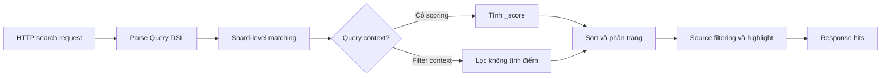

<Callout type="info" title="Phạm vi của bài viết">
  Bài viết dùng Elasticsearch Query DSL qua REST API. Các ví dụ giả sử index `products` có các field `title` và `description` kiểu `text`, `category` và `status` kiểu `keyword`, `price` kiểu số, `published_at` kiểu `date`, cùng `variants` kiểu `nested`.
</Callout>

## Mục lục

- [Query DSL là gì?](#query-dsl-là-gì)
  - [Mental model của một search request](#mental-model-của-một-search-request)
  - [Query context và filter context](#query-context-và-filter-context)
- [Chuẩn bị dữ liệu và chọn loại query](#chuẩn-bị-dữ-liệu-và-chọn-loại-query)
  - [Mapping của index products](#mapping-của-index-products)
  - [Dữ liệu mẫu](#dữ-liệu-mẫu)
  - [Term-level query](#term-level-query)
  - [Full-text query](#full-text-query)
- [Bool query và cách ghép điều kiện](#bool-query-và-cách-ghép-điều-kiện)
  - [must và filter](#must-và-filter)
  - [should và quy tắc số lượng khớp](#should-và-quy-tắc-số-lượng-khớp)
  - [must not: loại kết quả](#must-not-loại-kết-quả)
- [Các query thường dùng](#các-query-thường-dùng)
  - [exists](#exists)
  - [range](#range)
  - [ids](#ids)
  - [terms](#terms)
  - [match](#match)
  - [match phrase](#match-phrase)
  - [multi match](#multi-match)
  - [nested](#nested)
- [Sắp xếp và phân trang](#sắp-xếp-và-phân-trang)
  - [Sort kết quả](#sort-kết-quả)
  - [from và size cho trang nhỏ](#from-và-size-cho-trang-nhỏ)
  - [search after kết hợp PIT](#search-after-kết-hợp-pit)
- [Kiểm soát dữ liệu trả về](#kiểm-soát-dữ-liệu-trả-về)
  - [Source filtering](#source-filtering)
  - [Highlight](#highlight)
  - [Đặt tên query với tham số name](#đặt-tên-query-với-tham-số-name)
- [Validate, profile và debug query](#validate-profile-và-debug-query)
  - [Validate query trước khi chạy](#validate-query-trước-khi-chạy)
  - [Profile execution](#profile-execution)
  - [Đọc matched queries và giải thích score](#đọc-matched-queries-và-giải-thích-score)
- [Các lỗi thường gặp](#các-lỗi-thường-gặp)
  - [Dùng term trên field text](#dùng-term-trên-field-text)
  - [Đặt điều kiện lọc vào must](#đặt-điều-kiện-lọc-vào-must)
  - [should vô tình trở thành tùy chọn](#should-vô-tình-trở-thành-tùy-chọn)
  - [Phân trang deep bằng from](#phân-trang-deep-bằng-from)
  - [Sort trên text hoặc thiếu tie-breaker](#sort-trên-text-hoặc-thiếu-tie-breaker)
  - [Query nhầm nested và object](#query-nhầm-nested-và-object)
  - [Tin rằng filter luôn được cache](#tin-rằng-filter-luôn-được-cache)
  - [Bỏ qua input người dùng trong query string](#bỏ-qua-input-người-dùng-trong-query-string)
- [Checklist chọn Query DSL](#checklist-chọn-query-dsl)

## Query DSL là gì?

Query DSL là JSON khai báo điều kiện tìm kiếm mà Elasticsearch gửi tới search engine. Một request thường có ba lớp:

- `query`: document nào được phép xuất hiện và được tính điểm như thế nào.
- `sort`, `from`, `size`: thứ tự và số lượng hit trả về.
- `_source`, `highlight`: phần dữ liệu hiển thị cho ứng dụng.

Ví dụ tối thiểu sau tìm các sản phẩm có từ `camera` trong `title` và chỉ trả về hai hit đầu tiên:

```http
GET /products/_search
{
  "query": {
    "match": {
      "title": "camera"
    }
  },
  "size": 2
}
```

Query DSL không phải là SQL được viết lại bằng JSON. Mỗi query có quy tắc phân tích, scoring và yêu cầu mapping riêng. Vì vậy, hãy bắt đầu từ ý nghĩa của dữ liệu (`text`, `keyword`, số, ngày hay `nested`) rồi mới chọn query.

### Mental model của một search request

Elasticsearch thực hiện search trên từng shard rồi hợp nhất các hit ở coordinator node. Query có thể lọc candidate documents, tính `_score`, sắp xếp và cắt kết quả trước khi response về ứng dụng.



Có hai nguyên tắc thực hành quan trọng:

1. Đưa điều kiện bắt buộc nhưng không cần xếp hạng, như `status` hoặc khoảng ngày, vào `filter`.
2. Đưa điều kiện ngôn ngữ tự nhiên cần relevance, như `title` hoặc `description`, vào `must` hoặc `should`.

Cách phân tách này làm query dễ đọc hơn và giúp Elasticsearch tránh tính điểm cho các điều kiện chỉ dùng để lọc.

### Query context và filter context

**Query context** trả lời câu hỏi “document khớp tốt đến mức nào?”. Query như `match` phân tích văn bản và thường sinh `_score`. Score mặc định thường dựa trên BM25, một mô hình xếp hạng xét tần suất term trong document và độ hiếm của term trong tập dữ liệu.

**Filter context** chỉ trả lời “document có khớp điều kiện hay không?”. Các clause trong `filter` và `must_not` không tính `_score`. Kết quả lọc có thể được Elasticsearch cache theo segment khi phù hợp, nhưng query cache không phải là cam kết cho mọi filter hoặc mọi request.

Ví dụ kết hợp hai context:

```http
GET /products/_search
{
  "query": {
    "bool": {
      "must": [
        {
          "match": {
            "title": "camera không gương lật"
          }
        }
      ],
      "filter": [
        {
          "term": {
            "status": "published"
          }
        },
        {
          "range": {
            "price": {
              "gte": 500,
              "lte": 3000
            }
          }
        }
      ]
    }
  }
}
```

Trong ví dụ này, `match` quyết định độ phù hợp của tiêu đề. `status` và `price` cắt bỏ document không hợp lệ mà không làm thay đổi điểm relevance.

<Callout type="idea" title="Quy tắc ngắn gọn">
  Nếu điều kiện chỉ là đúng hoặc sai, ưu tiên `filter`. Nếu người dùng cần kết quả được xếp hạng theo mức độ liên quan, dùng query context cho điều kiện văn bản.
</Callout>

## Chuẩn bị dữ liệu và chọn loại query

Query chỉ dễ hiểu khi biết chính xác mapping của field. Toàn bộ ví dụ phía dưới dùng cùng một index `products` và mapping được khai báo trong phần này.

### Mapping của index products

Tạo index bằng mapping tường minh trước khi thêm document:

```http
PUT /products
{
  "mappings": {
    "properties": {
      "title": {
        "type": "text",
        "fields": {
          "keyword": {
            "type": "keyword",
            "ignore_above": 256
          }
        }
      },
      "description": {
        "type": "text"
      },
      "brand": {
        "type": "text",
        "fields": {
          "keyword": {
            "type": "keyword",
            "ignore_above": 256
          }
        }
      },
      "category": {
        "type": "keyword"
      },
      "status": {
        "type": "keyword"
      },
      "price": {
        "type": "double"
      },
      "published_at": {
        "type": "date"
      },
      "tie_breaker_id": {
        "type": "keyword"
      },
      "variants": {
        "type": "nested",
        "properties": {
          "color": {
            "type": "keyword"
          },
          "stock": {
            "type": "integer"
          }
        }
      }
    }
  }
}
```

Mapping này chủ động tách hai nhu cầu tìm kiếm:

| Field | Kiểu dữ liệu | Query hoặc thao tác phù hợp |
| --- | --- | --- |
| `title`, `description`, `brand` | `text` | `match`, `match_phrase`, `multi_match`, highlight |
| `title.keyword`, `brand.keyword` | `keyword` multi-field | Exact match, sort hoặc aggregation trên toàn bộ giá trị |
| `category`, `status` | `keyword` | `term`, `terms` và `bool.filter` |
| `price` | `double` | `range` và sort theo giá |
| `published_at` | `date` | `range`, sort và phân trang theo thời gian |
| `tie_breaker_id` | `keyword` | Sort phụ ổn định cho `search_after` |
| `variants` | `nested` | `nested` query để giữ quan hệ giữa `color` và `stock` của cùng một variant |

`title` là một **multi-field**: Elasticsearch index cùng một giá trị theo hai cách. Field `title` kiểu `text` được analyzer tách thành token để full-text search. Field `title.keyword` giữ nguyên chuỗi để exact match hoặc sort.

Có thể kiểm tra mapping Elasticsearch đang sử dụng bằng:

```http
GET /products/_mapping
```

<Callout type="warn" title="Tạo mapping trước khi ingest">
  Nếu `products` đã tồn tại với kiểu field khác, lệnh `PUT /products` sẽ không thay thế mapping cũ. Khi học theo bài này, hãy dùng một index mới hoặc xóa index thử nghiệm rồi tạo lại. Không xóa index production chỉ để thay mapping.
</Callout>

### Dữ liệu mẫu

Thêm hai document để các query phía dưới có dữ liệu nhất quán:

```http
POST /products/_bulk?refresh=wait_for
{"index":{"_id":"sku-100"}}
{"title":"Camera Mirrorless X1","description":"Camera nhẹ cho du lịch và quay video","brand":"Lumina","category":"camera","status":"published","price":1299.0,"published_at":"2025-01-20T10:30:00Z","tie_breaker_id":"sku-100","variants":[{"color":"black","stock":8},{"color":"silver","stock":0}]}
{"index":{"_id":"sku-101"}}
{"title":"Tripod Travel T2","description":"Tripod gọn nhẹ dành cho camera du lịch","brand":"Lumina","category":"tripod","status":"published","price":149.0,"published_at":"2025-01-18T08:00:00Z","tie_breaker_id":"sku-101","variants":[{"color":"black","stock":12}]}
```

Bulk API dùng định dạng **NDJSON**: mỗi action nằm trên một dòng, document tương ứng nằm ở dòng kế tiếp và payload phải có ký tự xuống dòng ở cuối. `refresh=wait_for` chờ dữ liệu có thể được search mà không buộc refresh ngay lập tức.

Bây giờ có thể chọn query dựa trên mapping. Field `text` cần full-text query vì analyzer xử lý input. Field `keyword`, số và ngày thường dùng term-level query để so sánh giá trị chính xác hoặc khoảng giá trị. Dùng sai loại query có thể không gây lỗi JSON, nhưng thường trả về kết quả rỗng hoặc relevance khó đoán.

### Term-level query

Term-level query không phân tích chuỗi đầu vào. Các query cơ bản gồm `term`, `terms`, `range`, `exists` và `ids`. Chúng phù hợp với giá trị đã chuẩn hóa như `status: "published"`, mã sản phẩm, số hoặc ngày.

```http
GET /products/_search
{
  "query": {
    "term": {
      "category": "camera"
    }
  }
}
```

Ở đây `category` nên là `keyword`. Không dùng `term` để tìm câu tự nhiên trên field `text`. Query `term` với chuỗi `Camera Mirrorless` sẽ không tự tách thành các token `camera`, `mirrorless`.

Nếu mapping dùng multi-field, có thể lọc bằng `title.keyword` nhưng không phải `title`:

```http
GET /products/_search
{
  "query": {
    "term": {
      "title.keyword": "Camera Mirrorless X1"
    }
  }
}
```

### Full-text query

Full-text query chạy search analyzer trên input trước khi tìm. `match` là điểm bắt đầu cho văn bản tự nhiên; `match_phrase` giữ thứ tự và khoảng cách token; `multi_match` tìm trên nhiều field.

```http
GET /products/_search
{
  "query": {
    "match": {
      "description": {
        "query": "camera nhẹ cho du lịch",
        "operator": "and"
      }
    }
  }
}
```

`operator: "and"` yêu cầu mọi token sau phân tích phải xuất hiện. Đây là lựa chọn chặt hơn mặc định `or`, nhưng có thể làm giảm recall khi input dài hoặc analyzer loại bỏ nhiều stop word. Hãy đo trên dữ liệu thật thay vì chỉ nhìn một query mẫu.

## Bool query và cách ghép điều kiện

`bool` là bộ kết hợp trung tâm của Query DSL. Nó cho phép đặt nhiều clause theo vai trò của chúng, thay vì viết một JSON lồng nhau khó kiểm soát.

```http
GET /products/_search
{
  "query": {
    "bool": {
      "must": {
        "match": {
          "title": "camera"
        }
      },
      "filter": [
        { "term": { "status": "published" } },
        { "range": { "price": { "lte": 2000 } } }
      ],
      "must_not": {
        "term": {
          "category": "used"
        }
      }
    }
  }
}
```

`bool` có thể lồng trong `bool`. Khi query trở nên dài, giữ mỗi nhóm logic ở một cấp rõ ràng và đặt comment trong tài liệu ứng dụng, không đặt comment vào JSON gửi tới Elasticsearch.

### must và filter

- `must`: mọi clause phải khớp; clause thường chạy trong query context và có thể đóng góp vào `_score`.
- `filter`: mọi clause phải khớp; không tính `_score`, thường phù hợp cho điều kiện chính xác hoặc phạm vi.

Hai câu sau có cùng điều kiện khớp, nhưng khác ý nghĩa scoring:

```http
GET /products/_search
{
  "query": {
    "bool": {
      "must": [
        { "term": { "status": "published" } }
      ]
    }
  }
}
```

```http
GET /products/_search
{
  "query": {
    "bool": {
      "filter": [
        { "term": { "status": "published" } }
      ]
    }
  }
}
```

Với `term` cho status, dùng `filter` thường diễn đạt đúng ý định hơn. Nếu query chỉ gồm filter, `_score` thường là `0`; ứng dụng nên dựa vào `sort` rõ ràng nếu thứ tự có ý nghĩa.

### should và quy tắc số lượng khớp

`should` biểu diễn điều kiện ưu tiên hoặc “ít nhất một trong các lựa chọn”. Mỗi clause khớp có thể tăng score. `minimum_should_match` biến quy tắc này thành điều kiện bắt buộc rõ ràng.

```http
GET /products/_search
{
  "query": {
    "bool": {
      "filter": [
        { "term": { "status": "published" } }
      ],
      "should": [
        { "match": { "title": { "query": "camera", "boost": 3 } } },
        { "match": { "description": "camera" } },
        { "term": { "category": "camera" } }
      ],
      "minimum_should_match": 1
    }
  }
}
```

Khi `bool` có `must` hoặc `filter`, mặc định `should` là tùy chọn (`minimum_should_match` mặc định là `0`). Khi `bool` chỉ có `should`, mặc định cần ít nhất một clause khớp. Đừng dựa vào mặc định trong query quan trọng; ghi rõ `minimum_should_match` khi ý định cần dễ review.

Giá trị có thể là số tuyệt đối như `2`, phần trăm như `75%`, hoặc quy tắc kết hợp. Ví dụ `"minimum_should_match": "2<-25%"` yêu cầu ít nhất 2 clause với nhóm nhỏ và cho phép tối đa 25% clause không khớp khi nhóm lớn. Với phần lớn ứng dụng, số nguyên hoặc phần trăm đơn giản dễ bảo trì hơn.

### must not: loại kết quả

`must_not` loại document khớp clause. Nó chạy trong filter context và không đóng góp score.

```http
GET /products/_search
{
  "query": {
    "bool": {
      "filter": {
        "term": { "status": "published" }
      },
      "must_not": [
        { "term": { "category": "refurbished" } },
        { "range": { "price": { "lt": 0 } } }
      ]
    }
  }
}
```

`must_not` không khớp với field bị thiếu theo cách bạn có thể tưởng tượng. Nếu cần “field tồn tại và không có giá trị X”, kết hợp `exists` trong `filter` với `must_not` cho giá trị X.

## Các query thường dùng

Phần này tập trung vào các query có thể ghép bên trong `bool`. Các ví dụ dùng endpoint `_search`, nên không làm thay đổi dữ liệu.

### exists

`exists` tìm document có indexed value cho field. Giá trị `null` và mảng rỗng được xem là không có giá trị; chuỗi rỗng và giá trị số `0` vẫn được xem là tồn tại.

```http
GET /products/_search
{
  "query": {
    "exists": {
      "field": "published_at"
    }
  }
}
```

Nếu field có `index: false` hoặc dynamic mapping không tạo field như dự kiến, `exists` có thể không trả về document. Kiểm tra mapping khi kết quả khác với dữ liệu `_source`.

### range

`range` lọc số, ngày hoặc các field hỗ trợ range. Các toán tử gồm `gt`, `gte`, `lt` và `lte`.

```http
GET /products/_search
{
  "query": {
    "range": {
      "published_at": {
        "gte": "now-30d/d",
        "lt": "now+1d/d"
      }
    }
  }
}
```

Với date, biểu thức `now-30d/d` nghĩa là lùi 30 ngày rồi làm tròn về đầu ngày theo timezone mặc định của Elasticsearch. Nếu nghiệp vụ phụ thuộc timezone cụ thể, truyền `time_zone` và thống nhất cách lưu ngày.

```http
GET /products/_search
{
  "query": {
    "range": {
      "price": {
        "gte": 100,
        "lt": 500
      }
    }
  }
}
```

Dùng cận mở (`gt`, `lt`) hoặc cận đóng (`gte`, `lte`) theo quy tắc nghiệp vụ. Viết rõ cận giúp tránh đếm trùng khi chia dữ liệu thành các khoảng liên tiếp.

### ids

`ids` chọn document theo giá trị `_id`. Đây là cách tiện lợi khi đã có danh sách ID từ một request khác.

```http
GET /products/_search
{
  "query": {
    "ids": {
      "values": ["sku-100", "sku-101", "sku-102"]
    }
  }
}
```

`ids` không phân tích ID và không thay thế `terms` trên một field nghiệp vụ. Nếu cần giữ thứ tự danh sách ID đầu vào, phải sắp xếp ở ứng dụng hoặc dùng một field sort phù hợp; Elasticsearch không cam kết trả theo thứ tự `values`.

### terms

`terms` yêu cầu một field khớp một hoặc nhiều giá trị chính xác. Nó phù hợp với filter `keyword` như nhiều category hoặc nhiều trạng thái.

```http
GET /products/_search
{
  "query": {
    "terms": {
      "category": ["camera", "lens", "tripod"]
    }
  }
}
```

Các giá trị trong `terms` không được analyzer xử lý. Số lượng term cũng có giới hạn cấu hình (`index.max_terms_count`, mặc định thường là 65.536). Với danh sách lớn, cân nhắc `terms lookup`, chia request hoặc thiết kế lại luồng lọc thay vì gửi một JSON khổng lồ.

### match

`match` phân tích query text theo search analyzer của field. Mặc định các token có thể được nối bằng `or`, vì vậy document chỉ cần khớp một phần input.

```http
GET /products/_search
{
  "query": {
    "match": {
      "title": {
        "query": "máy ảnh mirrorless",
        "operator": "and",
        "minimum_should_match": "75%"
      }
    }
  }
}
```

Trong một `match` không nên lạm dụng đồng thời `operator: "and"` và `minimum_should_match`: `and` đã yêu cầu toàn bộ token khớp. Chọn quy tắc dựa trên recall và precision mong muốn, rồi kiểm thử với typo, stop word và từ đồng nghĩa.

### match phrase

`match_phrase` phân tích input rồi yêu cầu các token xuất hiện theo cùng thứ tự và trong khoảng cách cho phép. Mặc định `slop` là `0`.

```http
GET /products/_search
{
  "query": {
    "match_phrase": {
      "title": {
        "query": "máy ảnh không gương lật",
        "slop": 1
      }
    }
  }
}
```

`slop: 1` cho phép một khoảng cách hoặc hoán vị nhỏ tùy vị trí token. Phrase query chính xác hơn `match` nhưng có thể ít kết quả hơn và tốn công xử lý hơn. Dùng nó cho tên sản phẩm, cụm từ hoặc tiêu đề khi thứ tự từ quan trọng.

### multi match

`multi_match` chạy full-text query trên nhiều field. Kiểu mặc định `best_fields` lấy field có điểm tốt nhất, sau đó kết hợp theo quy tắc của query.

```http
GET /products/_search
{
  "query": {
    "multi_match": {
      "query": "camera du lịch",
      "fields": [
        "title^3",
        "description",
        "brand^2"
      ],
      "type": "best_fields",
      "operator": "and"
    }
  }
}
```

`^3` boost `title` để một match tại tiêu đề quan trọng hơn match tương đương tại description. Boost không phải điểm tuyệt đối và không nên được hiểu là “title luôn thắng”; hãy kiểm tra `_score` và kết quả thực tế.

Khi các field là các phần của cùng một nội dung, `type: "cross_fields"` hoặc query `combined_fields` có thể phù hợp hơn. `cross_fields` phụ thuộc cách analyzer và field mapping hoạt động. Hãy dùng `combined_fields` khi phiên bản Elasticsearch và mapping của dự án hỗ trợ, đồng thời benchmark với dữ liệu thật.

### nested

Mảng object thông thường có thể làm mất mối liên hệ giữa các thuộc tính của cùng một phần tử. Kiểu `nested` lưu mỗi object con như một hidden Lucene document, nên `nested` query có thể yêu cầu các điều kiện khớp trong cùng một phần tử.

Trong [mapping `products` đã tạo ở đầu bài](#mapping-của-index-products), `variants` là `nested`; `variants.color` là `keyword` và `variants.stock` là `integer`. Vì vậy, query có thể yêu cầu màu sắc và tồn kho cùng khớp trên một variant.

Tìm sản phẩm có **một variant vừa màu đen vừa còn hàng**:

```http
GET /products/_search
{
  "query": {
    "nested": {
      "path": "variants",
      "score_mode": "none",
      "query": {
        "bool": {
          "filter": [
            { "term": { "variants.color": "black" } },
            { "range": { "variants.stock": { "gt": 0 } } }
          ]
        }
      },
      "inner_hits": {
        "size": 3,
        "_source": ["variants.color", "variants.stock"]
      }
    }
  }
}
```

`score_mode: "none"` phù hợp khi nested clause chỉ là điều kiện lọc. Nếu score của nested children cần góp vào parent, có thể dùng `avg`, `sum`, `min` hoặc `max`. `inner_hits` tùy chọn giúp response chỉ ra object con nào khớp, nhưng làm response lớn hơn.

<Callout type="warn" title="Đừng bỏ qua path nested">
  Query `term` trực tiếp trên `variants.color` không bảo toàn quan hệ giữa các thuộc tính của cùng object nếu field là `nested`. Luôn bọc điều kiện bằng `nested` và dùng đúng `path`.
</Callout>

## Sắp xếp và phân trang

Scoring chỉ là một chiến lược xếp hạng. Kết quả hiển thị cho người dùng thường cần sort theo điểm, giá, ngày hoặc một tie-breaker ổn định.

### Sort kết quả

Dùng mảng `sort` để đặt thứ tự. Giá trị trong response `sort` sẽ được dùng lại cho `search_after`.

```http
GET /products/_search
{
  "query": {
    "match": {
      "title": "camera"
    }
  },
  "sort": [
    { "_score": "desc" },
    { "published_at": "desc" },
    { "tie_breaker_id": "asc" }
  ],
  "size": 20
}
```

Field dùng để sort cần có doc values, thường là `keyword`, số hoặc date. Không sort trực tiếp trên field `text`; hãy sort trên multi-field như `title.keyword`. Thêm một field tie-breaker có giá trị duy nhất giúp thứ tự ổn định khi nhiều document có cùng score hoặc cùng timestamp.

Nếu muốn ưu tiên kết quả mới nhất thay vì relevance, đặt date trước `_score` hoặc bỏ `_score` theo đúng UX:

```http
GET /products/_search
{
  "query": { "term": { "status": "published" } },
  "sort": [
    { "published_at": "desc" },
    { "tie_breaker_id": "asc" }
  ],
  "track_total_hits": false,
  "size": 20
}
```

### from và size cho trang nhỏ

`from` bỏ qua số hit đầu tiên và `size` giới hạn số hit trả về. Đây là lựa chọn đơn giản cho trang đầu hoặc số trang nhỏ.

```http
GET /products/_search
{
  "from": 20,
  "size": 20,
  "query": {
    "match": { "title": "camera" }
  },
  "sort": [
    { "_score": "desc" },
    { "tie_breaker_id": "asc" }
  ]
}
```

`from + size` không phù hợp cho deep pagination. Mỗi shard phải giữ và gửi thêm các hit trung gian cho coordinator. Elasticsearch cũng giới hạn tổng số hit có thể truy cập theo cách này bằng `index.max_result_window` (mặc định thường là 10.000).

### search after kết hợp PIT

`search_after` dùng sort values của hit cuối trang trước để lấy trang tiếp theo, thay vì bỏ qua toàn bộ hit trước đó. PIT (Point In Time) giữ một snapshot nhất quán trong khoảng thời gian ngắn, tránh việc thêm hoặc xóa document làm thay đổi thứ tự giữa các trang.

Bước 1: mở PIT với thời gian sống đủ cho một phiên phân trang:

```http
POST /products/_pit?keep_alive=2m
```

Response chứa một chuỗi `id`. Bước 2: dùng PIT và sort ổn định:

```http
GET /_search
{
  "pit": {
    "id": "PIT_ID_DUOC_TRA_VE",
    "keep_alive": "2m"
  },
  "size": 20,
  "query": {
    "bool": {
      "filter": [
        { "term": { "status": "published" } }
      ]
    }
  },
  "sort": [
    { "published_at": "desc" },
    { "tie_breaker_id": "asc" }
  ]
}
```

Sau khi nhận response, lấy mảng `sort` của hit cuối cùng và gửi nguyên thứ tự giá trị đó trong request tiếp theo:

```http
GET /_search
{
  "pit": {
    "id": "PIT_ID_DUOC_TRA_VE",
    "keep_alive": "2m"
  },
  "size": 20,
  "query": {
    "bool": {
      "filter": [
        { "term": { "status": "published" } }
      ]
    }
  },
  "sort": [
    { "published_at": "desc" },
    { "tie_breaker_id": "asc" }
  ],
  "search_after": ["2025-01-20T10:30:00.000Z", "sku-12345"]
}
```

Không dùng `from` đồng thời với `search_after`. Giữ nguyên query, sort và PIT trong suốt phiên. Khi không còn dùng PIT, đóng nó để giải phóng tài nguyên:

```http
DELETE /_pit
{
  "id": "PIT_ID_DUOC_TRA_VE"
}
```

<Callout type="warn" title="PIT không phải là cache vô hạn">
  PIT giữ các segment cần thiết và có thể làm tăng tài nguyên đĩa nếu giữ quá lâu. Đặt `keep_alive` ngắn, gia hạn khi thật sự đọc trang tiếp theo và luôn đóng PIT khi người dùng rời luồng phân trang.
</Callout>

## Kiểm soát dữ liệu trả về

Một search request có thể trả về rất nhiều dữ liệu nếu giữ nguyên `_source`. Hãy để query quyết định document nào khớp, còn response options quyết định phần nào ứng dụng thực sự cần.

### Source filtering

`_source` với `includes` và `excludes` giảm payload khi response có field lớn như `description`, vector hoặc dữ liệu debug.

```http
GET /products/_search
{
  "_source": {
    "includes": ["title", "price", "category", "published_at"],
    "excludes": ["internal_notes", "embedding"]
  },
  "query": {
    "term": { "status": "published" }
  }
}
```

Source filtering chỉ thay đổi dữ liệu `_source` được trả về; nó không biến field thành không được index và không làm query nhanh hơn một cách tự động. Nếu cần response cực nhỏ, có thể dùng `stored_fields`, `docvalue_fields` hoặc `fields` theo mapping, nhưng phải kiểm tra format trả về với client.

### Highlight

`highlight` trả về các đoạn text có token khớp để UI hiển thị. Field được highlight thường là `text` và nên dùng cùng analyzer với query.

```http
GET /products/_search
{
  "query": {
    "multi_match": {
      "query": "camera nhẹ",
      "fields": ["title^2", "description"]
    }
  },
  "highlight": {
    "pre_tags": ["<mark>"],
    "post_tags": ["</mark>"],
    "fields": {
      "title": {},
      "description": {
        "fragment_size": 150,
        "number_of_fragments": 2
      }
    }
  }
}
```

Giá trị trong `highlight` là text do Elasticsearch trả về. Khi đưa vào HTML, ứng dụng phải xử lý an toàn và không mặc định tin mọi tag nếu dữ liệu nguồn có thể chứa nội dung không đáng tin.

### Đặt tên query với tham số name

Thêm `_name` vào query clause để response cho biết clause nào đã khớp trong `matched_queries`. Đây là cách hữu ích để giải thích badge hoặc debug logic bool.

```http
GET /products/_search
{
  "query": {
    "bool": {
      "should": [
        {
          "match": {
            "title": {
              "query": "camera",
              "_name": "title_match"
            }
          }
        },
        {
          "term": {
            "category": {
              "value": "camera",
              "_name": "category_exact"
            }
          }
        }
      ],
      "minimum_should_match": 1
    }
  }
}
```

Trong hit, Elasticsearch có thể trả:

```json
{
  "_id": "sku-123",
  "_score": 2.17,
  "matched_queries": ["title_match", "category_exact"]
}
```

Tên query phải duy nhất trong cùng request. Trùng `_name` có thể dẫn tới kết quả `matched_queries` không xác định, nên đặt tên theo vai trò nghiệp vụ và kiểm thử response sau khi thay đổi query.

## Validate, profile và debug query

Query hợp lệ về JSON vẫn có thể sai field, sai cấu trúc hoặc không cho kết quả như mong muốn. Dùng các API debug trước khi tối ưu cảm tính.

### Validate query trước khi chạy

`_validate/query` kiểm tra query có hợp lệ hay không. Thêm `explain=true` để nhận giải thích bằng text.

```http
GET /products/_validate/query?explain=true
{
  "query": {
    "bool": {
      "filter": [
        { "term": { "status": "published" } },
        { "range": { "price": { "gte": 100 } } }
      ],
      "must": [
        { "match": { "title": "camera" } }
      ]
    }
  }
}
```

API này xác nhận cấu trúc query nhưng không chứng minh relevance đúng với người dùng. Sau validate, chạy `_search` trên tập dữ liệu mẫu và kiểm tra cả hit lẫn score.

### Profile execution

`profile: true` hiển thị thời gian và rewrite của query trên từng shard. Dùng nó để tìm clause tốn thời gian trong một request cụ thể.

```http
GET /products/_search
{
  "profile": true,
  "size": 10,
  "query": {
    "bool": {
      "must": [
        { "multi_match": { "query": "camera du lịch", "fields": ["title", "description"] } }
      ],
      "filter": [
        { "term": { "status": "published" } },
        { "range": { "price": { "lte": 3000 } } }
      ]
    }
  }
}
```

Kết quả profile có overhead và không đại diện hoàn hảo cho latency production. Không bật profile cho mọi request của người dùng. Dùng nó trên query đã tái hiện, sau đó so sánh với latency ngoài client và các metric của cluster.

### Đọc matched queries và giải thích score

Dùng `explain: true` trên một request nhỏ để xem vì sao một document có score cụ thể:

```http
GET /products/_search
{
  "explain": true,
  "size": 1,
  "query": {
    "match": {
      "title": "camera"
    }
  }
}
```

`explain` cũng có overhead lớn, nên chỉ dùng cho debug. Khi điều tra score, kiểm tra theo thứ tự:

1. Mapping và analyzer của field.
2. Query đã rewrite thành gì.
3. Clause nào khớp qua `_name` và `matched_queries`.
4. Score có bị thay đổi bởi boost, function hoặc filter hay không.

Nếu query chỉ chứa filter, `_score` bằng hoặc gần `0` là bình thường. Đừng cố tối ưu một score không được dùng để xếp hạng.

## Các lỗi thường gặp

### Dùng term trên field text

`term` không chạy analyzer. Dùng `match` cho nội dung tự nhiên hoặc `field.keyword` cho exact value. Kiểm tra bằng Analyze API nếu không chắc token được tạo ra thế nào.

### Đặt điều kiện lọc vào must

Đặt `status`, tenant hoặc khoảng thời gian trong `must` không nhất thiết làm query sai, nhưng khiến ý định scoring kém rõ và có thể tính điểm không cần thiết. Chuyển các điều kiện nhị phân sang `filter`.

### should vô tình trở thành tùy chọn

`bool` có `filter` hoặc `must` sẽ mặc định cho phép `should` không khớp. Nếu business rule là “phải khớp ít nhất một lựa chọn”, đặt `minimum_should_match: 1`.

### Phân trang deep bằng from

Tăng `from` lên hàng chục nghìn làm coordinator phải giữ nhiều hit trung gian và có thể vượt `max_result_window`. Với export hoặc duyệt nhiều trang, dùng PIT và `search_after`; với export toàn bộ dữ liệu, cân nhắc `scroll` theo use case phù hợp.

### Sort trên text hoặc thiếu tie-breaker

Sort trên `text` thường bị từ chối vì không có doc values. Sort trên `keyword`, số hoặc date. Nếu nhiều hit có cùng sort value, thêm field tie-breaker duy nhất để tránh thứ tự thay đổi.

### Query nhầm nested và object

Nếu mapping là `nested`, query các field con trực tiếp sẽ không đảm bảo các điều kiện thuộc cùng object. Kiểm tra `_mapping`, sau đó dùng `nested` với `path` chính xác.

### Tin rằng filter luôn được cache

Filter context không tính score và thường thân thiện với caching, nhưng cache phụ thuộc segment, tần suất và chi phí. Không thay đổi query để “ép cache” mà chưa đo; hãy dùng profile và metric thực tế.

### Bỏ qua input người dùng trong query string

`query_string` hỗ trợ cú pháp đặc biệt và có thể gây lỗi khi input chứa ký tự điều khiển. Với ô tìm kiếm thông thường, ưu tiên `match`, `multi_match` hoặc `simple_query_string`; nếu buộc dùng `query_string`, xử lý và giới hạn input rõ ràng.

## Checklist chọn Query DSL

- Field là `keyword`, số, ngày hoặc ID: bắt đầu bằng `term`, `terms`, `range`, `exists` hoặc `ids` trong `filter`.
- Field là văn bản tự nhiên: bắt đầu bằng `match`; dùng `match_phrase` khi thứ tự token quan trọng.
- Tìm trên nhiều field: dùng `multi_match` và boost field quan trọng một cách có chủ đích.
- Có nhiều điều kiện: dùng `bool`, phân tách `must`, `filter`, `should` và `must_not` theo mục tiêu.
- Có mảng object cần giữ quan hệ thuộc tính: mapping phải là `nested`, rồi dùng `nested` query.
- Có danh sách lớn hoặc phân trang sâu: dùng sort ổn định, PIT và `search_after`.
- Cần payload nhỏ: cấu hình `_source.includes` và `_source.excludes`.
- Cần điều tra: thêm `_name`, chạy `_validate/query`, sau đó dùng `profile` hoặc `explain` trên request nhỏ.

Query tốt không chỉ là JSON chạy được. Nó phải phản ánh đúng mapping, tách scoring khỏi filtering, có thứ tự phân trang ổn định và được kiểm chứng trên dữ liệu thật.
