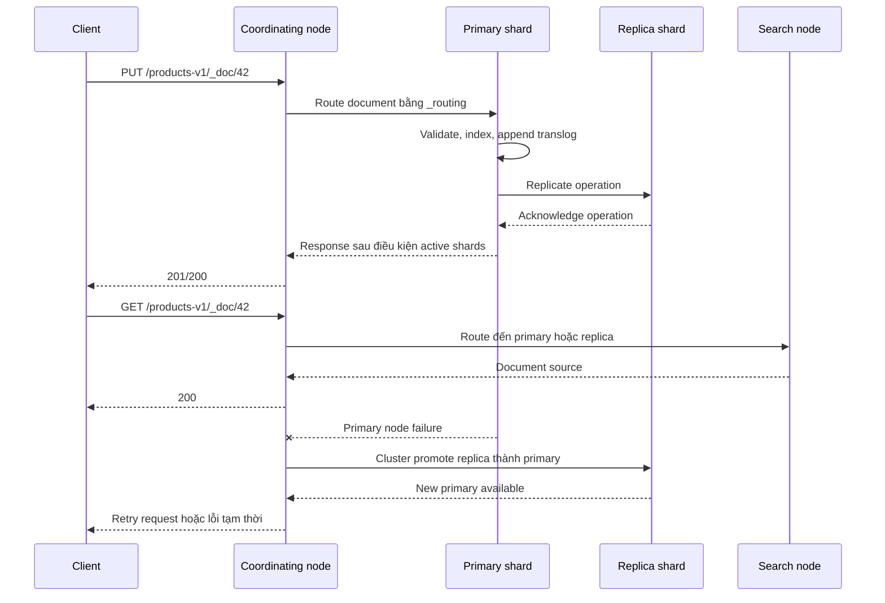
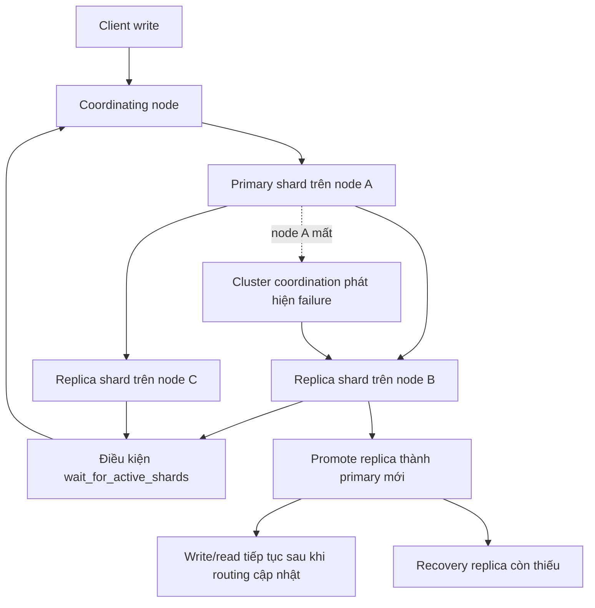

<Callout type="info" title="Phạm vi của bài viết">
  Bài viết giải thích cách Elasticsearch phân mảnh index, sao chép dữ liệu, định tuyến request và phục hồi khi node gặp sự cố. Các ví dụ dùng Elasticsearch 8.x và có thể chạy trong Console của Kibana hoặc với `curl`.
</Callout>

## Mục lục

- [Mô hình shard và replica](#mô-hình-shard-và-replica)
  - [Primary shard và replica shard](#primary-shard-và-replica-shard)
  - [Shard không phải là backup](#shard-không-phải-là-backup)
- [Routing request đến shard](#routing-request-đến-shard)
  - [Routing mặc định](#routing-mặc-định)
  - [Custom routing với `_routing`](#custom-routing-với-_routing)
- [Replication và tính nhất quán](#replication-và-tính-nhất-quán)
  - [Luồng ghi và đọc](#luồng-ghi-và-đọc)
  - [Quorum và `wait_for_active_shards`](#quorum-và-wait_for_active_shards)
  - [Thứ tự ghi, version conflict và refresh](#thứ-tự-ghi-version-conflict-và-refresh)
- [Allocation, recovery và relocation](#allocation-recovery-và-relocation)
  - [Node và cluster allocation](#node-và-cluster-allocation)
  - [Recovery sau khi node khởi động](#recovery-sau-khi-node-khởi-động)
  - [Relocation khi cân bằng cluster](#relocation-khi-cân-bằng-cluster)
  - [Kiểm tra allocation bằng API](#kiểm-tra-allocation-bằng-api)
- [Failover và cluster coordination hiện đại](#failover-và-cluster-coordination-hiện-đại)
  - [Promote replica khi primary hỏng](#promote-replica-khi-primary-hỏng)
  - [Split-brain và quorum của master](#split-brain-và-quorum-của-master)
- [Sizing shard và chọn số replica](#sizing-shard-và-chọn-số-replica)
  - [Trade-off của số lượng shard](#trade-off-của-số-lượng-shard)
  - [Chiến lược theo môi trường](#chiến-lược-theo-môi-trường)
- [Đọc cluster health: green, yellow và red](#đọc-cluster-health-green-yellow-và-red)
- [Quyết định production và anti-patterns](#quyết-định-production-và-anti-patterns)
- [Tóm tắt](#tóm-tắt)

## Mô hình shard và replica

Một **index** là không gian logic mà ứng dụng dùng để lưu document. Elasticsearch chia index đó thành các **primary shard** (phân vùng dữ liệu chính). Mỗi primary có thể có một hoặc nhiều bản sao gọi là **replica shard**.

Ví dụ index có hai primary và một replica cho mỗi primary sẽ có bốn shard copy:

```text
products
├── shard 0: primary ── replica 0
└── shard 1: primary ── replica 1
```

Mỗi document chỉ thuộc về một primary shard. Replica chứa bản sao của primary tương ứng, không phải bản sao của toàn bộ index ở một file duy nhất.

### Primary shard và replica shard

Khi tạo index, số primary shard được khai báo bằng `index.number_of_shards`. Giá trị này không thể thay đổi trực tiếp sau khi index đã tạo, vì thuật toán routing phụ thuộc vào số primary. Số replica được khai báo bằng `index.number_of_replicas` và có thể tăng hoặc giảm trong lúc index đang chạy.

```http
PUT products-v1
{
  "settings": {
    "number_of_shards": 3,
    "number_of_replicas": 1
  },
  "mappings": {
    "properties": {
      "name": { "type": "text" },
      "category": { "type": "keyword" },
      "price": { "type": "scaled_float", "scaling_factor": 100 }
    }
  }
}
```

Trong ví dụ này:

- Có ba primary shard, đánh số từ `0` đến `2`.
- Mỗi primary có một replica nên tổng cộng có sáu shard copy.
- Số replica là thuộc tính của index, không phải của từng document.

Primary giữ vai trò điều phối thay đổi dữ liệu cho shard. Replica nhận các thao tác tương ứng và có thể phục vụ search. Khi tăng replica lên `2`, Elasticsearch tạo thêm một copy cho mỗi primary. Điều đó cải thiện khả năng chịu lỗi và năng lực đọc, nhưng cũng tăng dung lượng lưu trữ, chi phí merge và lưu lượng mạng.

<Callout type="warn" title="Không đặt primary và replica trên cùng một node">
  Elasticsearch cố gắng không đặt primary shard và replica của cùng một shard lên cùng node. Nếu cluster chỉ có một node, replica không thể được allocate và health thường là `yellow`. Thêm replica không tạo thêm khả năng chịu lỗi cho đến khi có node khác đủ điều kiện nhận replica.
</Callout>

### Shard không phải là backup

Replica giúp cluster tiếp tục phục vụ khi một node hoặc shard copy bị mất. Replica **không** thay thế snapshot hoặc backup:

- Một lần xóa nhầm document được replication sang mọi replica.
- Corruption do lỗi logic, mapping sai hoặc ứng dụng ghi dữ liệu sai cũng có thể lan sang replica.
- Mất cả cluster, mất vùng khả dụng hoặc lỗi vận hành có thể làm primary và replica biến mất cùng nhau.

Hãy dùng Snapshot Lifecycle Management (SLM) để chụp snapshot vào repository bền vững, tốt nhất ở storage hoặc failure domain khác. Replica phục vụ availability và throughput; snapshot phục vụ khôi phục dữ liệu và point-in-time backup.

## Routing request đến shard

**Shard routing** là quá trình chọn primary shard chứa một document hoặc cần xử lý một query. Với routing mặc định, Elasticsearch tính hash từ `_routing` và chia cho số primary shard:

```text
primary_shard = hash(_routing) % number_of_primary_shards
```

Công thức này giải thích vì sao thay đổi số primary shard sau khi tạo index không phải là thao tác đơn giản. Cùng một routing value có thể đi tới shard khác nếu mẫu số thay đổi.

### Routing mặc định

Nếu request không chỉ định routing, `_routing` mặc định là `_id` của document. Vì vậy mỗi document được phân bố tương đối đều nếu ID có tính đa dạng.

```http
PUT products-v1/_doc/product-42
{
  "name": "Tai nghe chống ồn",
  "category": "audio"
}
```

Request trên được đưa tới primary shard được tính từ `product-42`. Với thao tác lấy document, Elasticsearch có thể tính cùng routing từ ID:

```http
GET products-v1/_doc/product-42
```

Search trên nhiều document thường được fan out đến một shard copy của tất cả primary rồi reduce (gộp và xếp hạng kết quả) ở node điều phối. Vì vậy thêm primary shard không tự động làm mọi query nhanh hơn. Nó có thể khiến một query phải chờ nhiều task hơn và tốn nhiều heap để merge kết quả.

### Custom routing với `_routing`

Custom routing gom các document có cùng một giá trị vào cùng primary shard. Ví dụ, ứng dụng multi-tenant có thể route theo `tenant_id`:

```http
PUT orders-v1
{
  "settings": {
    "number_of_shards": 6,
    "number_of_replicas": 1
  },
  "mappings": {
    "_routing": {
      "required": true
    },
    "properties": {
      "tenant_id": { "type": "keyword" },
      "order_id": { "type": "keyword" },
      "total": { "type": "scaled_float", "scaling_factor": 100 }
    }
  }
}
```

Ghi document và đọc document phải truyền cùng `routing`:

```http
PUT orders-v1/_doc/order-100?routing=tenant-acme
{
  "tenant_id": "tenant-acme",
  "order_id": "order-100",
  "total": 129.50
}

GET orders-v1/_doc/order-100?routing=tenant-acme
```

Nếu không truyền routing trong GET, Elasticsearch có thể tìm sai shard và trả `404`. Search có thể dùng `routing=tenant-acme` để chỉ fan out đến shard của tenant đó:

```http
GET orders-v1/_search?routing=tenant-acme
{
  "query": {
    "term": { "tenant_id": "tenant-acme" }
  }
}
```

Custom routing có lợi khi tenant hoặc entity thường được truy vấn cùng nhau. Nó cũng tạo rủi ro **hot shard** (một shard nhận quá nhiều dữ liệu hoặc request). Một tenant lớn có thể chiếm gần như toàn bộ lưu lượng dù tổng dung lượng của index được phân bố trông có vẻ cân bằng.

<Callout type="error" title="Custom routing phải được coi là một phần của API">
  Routing value không tự động được lấy từ field `tenant_id`. Client phải truyền query parameter `routing` trong từng request, hoặc ứng dụng phải đóng gói quy tắc này trong repository/client chung. Đừng bật custom routing nếu chưa có cách kiểm soát việc đọc, cập nhật và xóa nhất quán.
</Callout>

## Replication và tính nhất quán

Elasticsearch dùng mô hình primary-based replication: một request ghi được gửi tới primary shard, primary kiểm tra và áp dụng thao tác, sau đó phối hợp với các replica đang hoạt động. Replica không tự quyết định thứ tự ghi độc lập.

### Luồng ghi và đọc

Sơ đồ dưới đây minh họa luồng cơ bản. Chi tiết transport nội bộ có thể thay đổi theo phiên bản, nhưng nguyên tắc primary điều phối vẫn giữ nguyên.



Replica có thể phục vụ search, nhưng mọi copy cần hội tụ cùng lịch sử thao tác. Khi một replica bị offline, primary vẫn có thể nhận ghi nếu điều kiện `wait_for_active_shards` thỏa mãn. Elasticsearch sẽ recovery replica sau khi node trở lại hoặc khi cluster allocate shard sang node khác.

Một request trả thành công không có nghĩa là dữ liệu đã được refresh để search thấy ngay lập tức. **Refresh** mở một segment mới cho search. Mặc định refresh là định kỳ; dùng `refresh=wait_for` khi cần chờ refresh mà không ép refresh ngay cho mọi request.

### Quorum và `wait_for_active_shards`

Trong các phiên bản Elasticsearch cũ, tài liệu thường nhắc đến tham số `consistency=quorum`. Đây không còn là cơ chế quorum có thể cấu hình trong Elasticsearch hiện đại. Không nên đưa `consistency=quorum` vào API mới.

Thay vào đó, `wait_for_active_shards` chỉ định số shard copy đang active mà write phải chờ trước khi được xác nhận. Ví dụ với một primary và một replica:

```http
PUT products-v1/_doc/42?wait_for_active_shards=2
{
  "name": "Tai nghe chống ồn",
  "stock": 7
}
```

Các giá trị thường dùng:

| Giá trị | Ý nghĩa | Khi dùng |
| --- | --- | --- |
| `1` | Chỉ cần primary active | Mặc định cho nhiều request; ưu tiên availability và độ trễ |
| `2`, `3`, ... | Chờ đúng số copy active | Khi muốn hạn chế ghi thành công lúc cluster đang suy giảm |
| `all` | Chờ toàn bộ primary và replica của shard | Dữ liệu quan trọng, chấp nhận timeout khi replica chưa sẵn sàng |

Tham số này là điều kiện chờ, không biến Elasticsearch thành hệ cơ sở dữ liệu transaction quorum. Nếu đặt `all` trên index có replica chưa allocate, write có thể timeout hoặc bị từ chối. Cấu hình mặc định cho index có thể đặt bằng `index.write.wait_for_active_shards`.

<Callout type="idea" title="Takeaway về write consistency">
  Chọn `wait_for_active_shards` theo RPO/RTO và hành vi ứng dụng. Không coi `all` là backup, và không dùng tham số quorum cũ như một lời đảm bảo transaction giữa các document.
</Callout>

### Thứ tự ghi, version conflict và refresh

Elasticsearch gắn sequence number (`_seq_no`) và primary term cho thao tác ghi. Cặp giá trị này giúp node nhận biết lịch sử thao tác và hỗ trợ kiểm tra optimistic concurrency control (OCC — kiểm soát xung đột bằng phiên bản).

Ví dụ chỉ cập nhật nếu document vẫn là phiên bản mà client đã đọc:

```http
PUT products-v1/_doc/42?if_seq_no=17&if_primary_term=3
{
  "name": "Tai nghe chống ồn",
  "stock": 6
}
```

Nếu document đã bị cập nhật, Elasticsearch trả lỗi `409 Conflict`. Ứng dụng nên đọc lại, hợp nhất thay đổi theo nghiệp vụ rồi thử lại có giới hạn. Không nên retry mù một thao tác update có thể không idempotent.

Có ba khái niệm dễ bị trộn lẫn:

- **Replication:** truyền thao tác từ primary sang replica.
- **Durability:** ghi vào translog theo `index.translog.durability`, thường là `request`, trước khi xác nhận phù hợp với điều kiện request.
- **Visibility:** refresh segment để search thấy document.

Nói ngắn gọn: write thành công, bền vững và search thấy ngay là ba câu hỏi khác nhau.

## Allocation, recovery và relocation

**Allocation** là quyết định shard copy nào nằm trên node nào. Cluster state (trạng thái metadata và routing của cluster) chứa quyết định này. Master node điều phối thay đổi cluster state; node dữ liệu thực thi việc mở, đóng và phục vụ shard.

### Node và cluster allocation

Một allocation hợp lệ phải thỏa các điều kiện như:

- Node có role phù hợp và còn đủ disk watermark.
- Replica không nằm cùng node với primary tương ứng.
- Các allocation filter, tier preference và awareness rules không cấm vị trí đó.
- Cluster không bị block bởi trạng thái read-only do vượt disk watermark.

Có thể đặt awareness theo zone để các copy đi qua failure domain khác nhau:

```http
PUT _cluster/settings
{
  "persistent": {
    "cluster.routing.allocation.awareness.attributes": "zone"
  }
}
```

Mỗi data node cần khai báo attribute tương ứng, thường qua `elasticsearch.yml` hoặc cơ chế triển khai:

```yaml
node.attr.zone: zone-a
```

Awareness không tạo ra node hoặc zone mới. Nếu cluster chỉ có một zone mà cấu hình bắt buộc phân tán, một số replica có thể không allocate. Hãy kiểm tra allocation sau mỗi thay đổi topology.

Có thể dùng allocation filter có chủ đích, nhưng không nên pin thủ công từng shard trong vận hành thường ngày:

```http
PUT _cluster/settings
{
  "persistent": {
    "cluster.routing.allocation.exclude._name": "data-node-03"
  }
}
```

Filter này khiến shard rời node bị exclude. Sau khi bảo trì xong, xóa setting bằng `null` thay vì để lại cấu hình cũ:

```http
PUT _cluster/settings
{
  "persistent": {
    "cluster.routing.allocation.exclude._name": null
  }
}
```

### Recovery sau khi node khởi động

Recovery là quá trình mở shard hoặc dựng lại một shard copy. Có hai nguồn recovery phổ biến:

1. **Existing store recovery:** node trở lại và dùng dữ liệu local còn hợp lệ, sau đó đồng bộ phần thao tác thiếu từ translog hoặc peer.
2. **Peer recovery:** node mới nhận dữ liệu từ primary hoặc một shard copy khác qua mạng.

Peer recovery tạo I/O, CPU và network traffic. Nếu quá nhiều shard phục hồi đồng thời, latency của workload chính có thể tăng. Các giới hạn recovery và disk watermark cần được theo dõi thay vì chỉ tăng số replica để chữa mọi sự cố.

### Relocation khi cân bằng cluster

Relocation là chuyển một shard copy từ node nguồn sang node đích. Elasticsearch thường tạo shard đích, copy dữ liệu, đồng bộ các thay đổi mới rồi chuyển vai trò phục vụ sang copy đích. Trong thời gian đó, cluster có thể tiêu tốn thêm disk tạm thời và băng thông.

Các nguyên nhân thường gặp gồm node mới tham gia, node bị exclude, disk watermark, thay đổi tier hoặc cân bằng shard. Tắt allocation toàn cluster để “cho ổn định” có thể ngăn cả failover và recovery. Nếu cần bảo trì, hãy thay đổi phạm vi hẹp và đặt lại setting sau khi hoàn tất.

### Kiểm tra allocation bằng API

Bắt đầu bằng health tổng quan và danh sách shard:

```http
GET _cluster/health/products-v1?level=shards
GET _cat/shards/products-v1?v&s=state,index,shard
```

Muốn biết vì sao một shard chưa allocate, dùng Allocation Explain. Request cần chỉ rõ index và shard; `primary: false` giúp kiểm tra replica:

```http
POST _cluster/allocation/explain
{
  "index": "products-v1",
  "shard": 0,
  "primary": false,
  "include_yes_decisions": true,
  "include_disk_info": true
}
```

Tập trung vào `unassigned_info.reason`, `allocate_explanation` và `node_allocation_decisions`. Đừng chỉ đọc một dòng `YES`: allocation chỉ xảy ra khi mọi quyết định bắt buộc đều cho phép.

Các API hỗ trợ chẩn đoán recovery và routing:

```http
GET products-v1/_recovery?active_only=true&detailed=true
GET _cat/recovery/products-v1?v
GET _cluster/state/routing_table/products-v1
GET _nodes/stats/indices,fs,jvm?filter_path=nodes.*.name,nodes.*.indices.recovery,nodes.*.fs,nodes.*.jvm.mem
```

<Callout type="warn" title="Không ép allocation bằng tay trước khi hiểu nguyên nhân">
  `allocate_stale_primary` có thể gây mất dữ liệu và chỉ nên dùng trong quy trình khẩn cấp đã được phê duyệt. Với replica unassigned, trước hết kiểm tra node role, disk watermark, allocation filter, zone awareness và số node thực tế.
</Callout>

## Failover và cluster coordination hiện đại

### Promote replica khi primary hỏng

Khi node chứa primary mất, master đủ điều kiện sẽ cập nhật cluster state và chọn một replica active của shard đó làm primary mới. Client có thể thấy lỗi tạm thời trong khoảng thời gian phát hiện node hỏng và cập nhật routing. Client Elasticsearch chính thức nên có retry policy với backoff và giới hạn thời gian.

Replica được promote không nhất thiết là bản sao “mới nhất” theo nghĩa mọi request đã được client gửi. Hệ thống chỉ xác nhận write theo điều kiện đã cấu hình. Với write đã được acknowledge, sequence number và cơ chế replication giúp cluster xử lý lịch sử thao tác phù hợp; với write timeout, ứng dụng phải coi kết quả là không chắc chắn và kiểm tra idempotently.

Sau failover, Elasticsearch có thể để một replica khác ở trạng thái unassigned cho đến khi node mới được chọn. Khi node cũ trở lại, node đó không mặc nhiên lấy lại primary. Cluster ưu tiên an toàn dữ liệu và việc allocation hợp lệ hơn việc giữ nguyên vị trí cũ.



### Split-brain và quorum của master

**Split-brain** là tình trạng các phần của cluster cùng tưởng mình là cluster độc lập. Điều này từng là rủi ro nổi bật khi cluster coordination dựa vào cấu hình thủ công như `discovery.zen.minimum_master_nodes`.

Elasticsearch hiện đại dùng cluster coordination dựa trên voting configuration và quorum của các node master-eligible. Một cluster cần đa số node master-eligible để bầu master và commit thay đổi cluster state. Cấu hình ba node master-eligible độc lập thường chịu được một node mất; hai node không tạo được quorum tốt khi mất một node.

Không thêm `discovery.zen.minimum_master_nodes` vào Elasticsearch 8.x. Không chạy nhiều master-eligible node với cùng hostname hoặc cùng VM failure domain rồi giả định đó là độc lập. Hãy phân bố chúng qua các zone, dùng discovery/bootstrap settings đúng cho lần khởi tạo cluster đầu tiên và không giữ `cluster.initial_master_nodes` sau bootstrap trong cấu hình quản lý lâu dài.

<Callout type="error" title="Đừng khởi tạo lại cluster để chữa mất quorum">
  Xóa data path hoặc thay đổi cluster name/bootstrap có thể tạo cluster mới và khiến dữ liệu cũ không còn được nhận diện như mong đợi. Khi mất master quorum, khôi phục topology và làm theo runbook của phiên bản đang dùng; không bootstrap lại tùy tiện.
</Callout>

## Sizing shard và chọn số replica

### Trade-off của số lượng shard

Mỗi shard là một Lucene index riêng. Nhiều shard hơn có thể tăng khả năng phân tán dung lượng và parallelism, nhưng cũng tạo chi phí cố định:

- Mỗi shard dùng file handles, heap metadata, thread và cluster-state overhead.
- Search toàn index fan out đến nhiều shard rồi reduce kết quả.
- Bulk indexing phải điều phối nhiều shard và có thể tạo nhiều segment merge đồng thời.
- Recovery, relocation và snapshot lâu hơn khi tổng số shard lớn.
- Shard quá lớn làm recovery và relocation lâu, khiến failure window rộng hơn.

Không có kích thước shard đúng cho mọi workload. Hãy ước lượng dung lượng sau merge, tốc độ ingest, retention, số node và thời gian recovery chấp nhận được. Sau đó kiểm tra bằng dữ liệu gần production.

```http
GET _cat/indices/products-v1?v&bytes=gb
GET _cat/shards/products-v1?v&bytes=gb
```

Nếu index đã tạo có số primary không phù hợp, thường dùng rollover hoặc reindex sang index mới với số shard mới:

```http
POST _reindex?wait_for_completion=false
{
  "source": { "index": "products-v1" },
  "dest": { "index": "products-v2" }
}
```

`_split` và `_shrink` có điều kiện vận hành riêng. Không dùng chúng như cách chữa cháy trước khi hiểu routing và trạng thái index.

### Chiến lược theo môi trường

Một số nguyên tắc thực tế:

| Mục tiêu | Gợi ý | Đánh đổi |
| --- | --- | --- |
| Development một node | `0` replica và ít primary | Không chịu lỗi node; health có thể xanh hơn |
| Production tối thiểu hai failure domain | Ít nhất `1` replica, đặt copy khác zone | Tốn thêm dung lượng và network |
| Đọc nhiều, ghi vừa phải | Cân nhắc thêm replica sau benchmark | Thêm replica làm write và recovery đắt hơn |
| Dữ liệu lớn theo thời gian | Data stream + rollover, mỗi backing index vừa phải | Cần quản lý lifecycle và alias |
| Tenant query rõ ràng | Chỉ dùng custom routing khi đã đo hot shard | GET/update/search phải truyền routing |

Số replica không sửa được thiết kế primary shard. Nếu cần mở rộng năng lực đọc, replica giúp thêm shard copy để search phân phối. Nếu bottleneck là một primary hot do custom routing hoặc một query nặng, thêm replica có thể không giải quyết được điểm nghẽn đó.

## Đọc cluster health: green, yellow và red

Kiểm tra nhanh:

```http
GET _cluster/health
GET _cluster/health/products-v1?wait_for_status=yellow&timeout=30s
```

| Trạng thái | Ý nghĩa |
| --- | --- |
| `green` | Mọi primary và replica đã được allocate |
| `yellow` | Mọi primary hoạt động nhưng ít nhất một replica chưa allocate |
| `red` | Ít nhất một primary chưa allocate; một phần dữ liệu hoặc request có thể không phục vụ được |

`yellow` trên cluster một node với replica `1` là dễ hiểu, nhưng không nên bỏ qua `yellow` trên production nhiều node. Nó có thể báo disk đầy, filter sai, thiếu zone hoặc node hỏng. `red` cần xác định primary nào bị ảnh hưởng trước khi thay đổi cấu hình.

```http
GET _cluster/health/products-v1?level=indices
GET _cat/shards/products-v1?v&h=index,shard,prirep,state,unassigned.reason,node
POST _cluster/allocation/explain
{
  "index": "products-v1",
  "shard": 0,
  "primary": true,
  "include_yes_decisions": true,
  "include_disk_info": true
}
```

`wait_for_status` chỉ làm request chờ tới trạng thái mong muốn hoặc timeout. Nó không sửa allocation. Trong alerting, nên theo dõi thêm số primary unassigned, số replica unassigned, disk watermark, recovery time và latency của ứng dụng.

## Quyết định production và anti-patterns

Trước khi đưa index vào production, hãy ghi lại các quyết định sau:

1. **Failure domain:** primary và replica phải có thể nằm ở zone hoặc rack khác nhau.
2. **RPO/RTO:** replica xử lý mất node; snapshot xử lý mất dữ liệu hoặc lỗi logic.
3. **Shard budget:** đặt giới hạn tổng shard theo node và capacity dự kiến, không chỉ theo dung lượng hôm nay.
4. **Recovery budget:** đo thời gian phục hồi một shard lớn và ảnh hưởng đến ingest/search.
5. **Routing contract:** nếu dùng custom routing, enforce routing trong client và kiểm thử cả GET, update, delete, bulk.
6. **Client retry:** retry timeout/failover phải có backoff, idempotency và cơ chế kiểm tra kết quả không chắc chắn.
7. **Observability:** lưu metric health, unassigned shards, allocation, disk, JVM, merge và indexing pressure.

Các anti-pattern thường gặp:

- Tạo hàng trăm hoặc hàng nghìn primary shard nhỏ cho một index vì “nhiều shard sẽ nhanh hơn”.
- Đặt `number_of_replicas` cao hơn số node hoặc số failure domain có thể nhận shard.
- Dùng replica như backup, nhưng không có snapshot repository và restore drill.
- Dùng custom routing theo tenant mà không đo phân bố kích thước và lưu lượng từng tenant.
- Đặt allocation exclude lâu dài rồi quên xóa, khiến cluster thiếu chỗ cho replica.
- Ép `allocate_stale_primary` để health xanh mà không đánh giá dữ liệu mất.
- Tắt allocation hoặc tăng concurrency recovery tùy tiện trong giờ cao điểm.
- Dùng `wait_for_active_shards=all` cho mọi request mà không chuẩn bị timeout và hành vi retry.
- Khởi tạo lại cluster khi mất quorum, hoặc dùng setting discovery cũ của Elasticsearch 6/7 trong Elasticsearch 8.

<Callout type="idea" title="Quy tắc vận hành ngắn gọn">
  Thiết kế shard theo workload và failure domain, đo recovery bằng benchmark, giữ snapshot độc lập, rồi mới tối ưu replica. Khi cluster không khỏe, đọc Allocation Explain trước khi thay đổi allocation.
</Callout>

## Tóm tắt

- Primary shard là đơn vị sở hữu dữ liệu và điều phối write; replica là bản sao dùng cho availability và có thể phục vụ search.
- Routing mặc định dựa trên `_id`; custom routing có thể giảm fan-out nhưng dễ tạo hot shard và là một phần bắt buộc của API.
- `wait_for_active_shards` là điều kiện số copy active cần chờ, không phải backup và không phải quorum transaction kiểu cũ.
- Recovery và relocation tiêu tốn tài nguyên. Cần theo dõi chúng cùng disk watermark và thời gian phục hồi.
- Cluster coordination hiện đại dùng quorum của master-eligible nodes để tránh split-brain; hãy phân bố chúng qua failure domain và không bootstrap lại cluster tùy tiện.
- `green`, `yellow`, `red` chỉ là điểm bắt đầu. Dùng `_cat/shards`, `_cluster/allocation/explain`, `_recovery` và cluster health để tìm nguyên nhân.

<Cards>
  <Card title="Indices và documents" href="/docs/elasticsearch-core/indices-documents" description="Vòng đời index và document trong Elasticsearch." />
  <Card title="Mapping và data types" href="/docs/elasticsearch-core/mapping-datatypes" description="Thiết kế mapping trước khi index dữ liệu." />
  <Card title="Snapshots và restore" href="/docs/production/snapshots-restore" description="Sao lưu và khôi phục dữ liệu độc lập với replica." />
</Cards>
