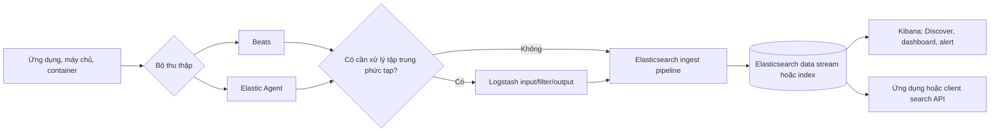

<Callout type="info" title="Phạm vi của bài viết">
  Trang này là bản đồ khái niệm cho người mới bắt đầu với hệ sinh thái Elastic. Bài viết tập trung vào log analytics và luồng dữ liệu; cấu hình chi tiết của từng thành phần được tách sang các trang liên quan.
</Callout>

## Mục lục

- [Elastic Stack và ELK là gì?](#elastic-stack-và-elk-là-gì)
  - [Elastic Stack](#elastic-stack)
  - [ELK](#elk)
  - [Vì sao tên gọi khác nhau?](#vì-sao-tên-gọi-khác-nhau)
- [Các thành phần và ranh giới trách nhiệm](#các-thành-phần-và-ranh-giới-trách-nhiệm)
  - [Elasticsearch: lưu trữ, lập chỉ mục và truy vấn](#elasticsearch-lưu-trữ-lập-chỉ-mục-và-truy-vấn)
  - [Kibana: giao diện và lớp phân tích](#kibana-giao-diện-và-lớp-phân-tích)
  - [Logstash: pipeline xử lý phía máy chủ](#logstash-pipeline-xử-lý-phía-máy-chủ)
  - [Beats: shipper nhẹ tại nguồn](#beats-shipper-nhẹ-tại-nguồn)
  - [Elastic Agent: agent hợp nhất](#elastic-agent-agent-hợp-nhất)
- [Luồng dữ liệu end-to-end](#luồng-dữ-liệu-end-to-end)
  - [Sơ đồ luồng tổng quát](#sơ-đồ-luồng-tổng-quát)
  - [Ingest, lưu trữ và truy vấn](#ingest-lưu-trữ-và-truy-vấn)
- [Chọn Logstash, Beats hay Elastic Agent](#chọn-logstash-beats-hay-elastic-agent)
  - [Bảng so sánh nhanh](#bảng-so-sánh-nhanh)
  - [Quy tắc chọn công cụ](#quy-tắc-chọn-công-cụ)
- [Ví dụ kiến trúc log analytics](#ví-dụ-kiến-trúc-log-analytics)
  - [Bài toán](#bài-toán)
  - [Luồng triển khai](#luồng-triển-khai)
- [Các thành phần mở rộng](#các-thành-phần-mở-rộng)
  - [APM](#apm)
  - [Elastic Security](#elastic-security)
- [Lưu ý vận hành và bảo mật](#lưu-ý-vận-hành-và-bảo-mật)
  - [Độ tin cậy và khả năng vận hành](#độ-tin-cậy-và-khả-năng-vận-hành)
  - [Bảo mật dữ liệu và quyền truy cập](#bảo-mật-dữ-liệu-và-quyền-truy-cập)
  - [Chi phí và vòng đời dữ liệu](#chi-phí-và-vòng-đời-dữ-liệu)
- [Next steps](#next-steps)

## Elastic Stack và ELK là gì?

### Elastic Stack

**Elastic Stack** là tên gọi cho một hệ sinh thái các sản phẩm của Elastic dùng để thu thập, xử lý, lưu trữ, tìm kiếm và trực quan hóa dữ liệu. Dữ liệu có thể là log, metric, trace, sự kiện bảo mật hoặc dữ liệu tìm kiếm của ứng dụng.

Trong một kiến trúc điển hình:

- **Elasticsearch** lưu trữ dữ liệu đã lập chỉ mục và thực hiện search, aggregation (tổng hợp dữ liệu) cùng các phép phân tích.
- **Kibana** cung cấp giao diện để khám phá dữ liệu, tạo dashboard, quản trị và vận hành.
- **Logstash**, **Beats** và **Elastic Agent** đưa dữ liệu vào hệ thống theo những cách khác nhau.

Elastic Stack không bắt buộc phải có đủ mọi thành phần. Một ứng dụng có thể gửi document trực tiếp tới Elasticsearch và dùng Kibana để quan sát. Một hệ thống log khác có thể thêm Agent hoặc Beats ở máy nguồn, rồi thêm Logstash ở lớp trung tâm để biến đổi dữ liệu.

### ELK

**ELK** là chữ viết tắt của ba sản phẩm ban đầu:

- **E**lasticsearch — lưu trữ, lập chỉ mục và truy vấn.
- **L**ogstash — thu thập, biến đổi và chuyển tiếp dữ liệu.
- **K**ibana — khám phá và trực quan hóa dữ liệu.

ELK thường được dùng để chỉ mô hình log analytics dựa trên ba thành phần này. Từ “ELK” xuất hiện trước khi hệ sinh thái có nhiều công cụ thu thập chuyên dụng như Beats và Elastic Agent.

> **ELK không phải một sản phẩm duy nhất.** Đây là tên viết tắt của một tổ hợp hoặc một kiểu kiến trúc. Elasticsearch, Logstash và Kibana là các sản phẩm có thể triển khai, nâng cấp và mở rộng riêng.

### Vì sao tên gọi khác nhau?

Tên gọi khác nhau phản ánh **phạm vi** chứ không phải hai công nghệ hoàn toàn tách biệt:

| Tên gọi | Phạm vi thường được hiểu | Khi nên dùng cách gọi này |
| --- | --- | --- |
| **ELK** | Bộ ba Elasticsearch, Logstash, Kibana, thường trong bài toán log | Khi mô tả kiến trúc kinh điển hoặc một pipeline có Logstash |
| **Elastic Stack** | Hệ sinh thái rộng hơn, gồm cả Beats, Elastic Agent, Fleet, APM, Elastic Security và nhiều tính năng khác | Khi nói về nền tảng hoặc giải pháp có nhiều loại dữ liệu |
| **Elastic** | Cách gọi ngắn cho công ty, sản phẩm hoặc hệ sinh thái; cần xem ngữ cảnh để tránh mơ hồ | Khi tài liệu đã định nghĩa rõ sản phẩm đang nói tới |

Vì vậy, một hệ thống có Elastic Agent, Elasticsearch và Kibana vẫn có thể được gọi là một hệ thống thuộc Elastic Stack, nhưng không nhất thiết là “ELK” theo nghĩa chặt chẽ vì không dùng Logstash. Ngược lại, nhiều tài liệu vẫn gọi tổng thể là ELK theo thói quen dù kiến trúc đã có thêm Beats hoặc Agent.

## Các thành phần và ranh giới trách nhiệm

Hãy tách hệ thống thành ba nhóm trách nhiệm để dễ thiết kế:

1. **Thu thập và vận chuyển:** Beats, Elastic Agent, hoặc các client/producer khác.
2. **Xử lý và tiếp nhận:** Logstash và ingest pipeline của Elasticsearch.
3. **Lưu trữ, truy vấn và trình bày:** Elasticsearch và Kibana.

Một thành phần có thể hỗ trợ nhiều bước, nhưng không nên đánh đồng các vai trò. Ví dụ, Kibana hiển thị dashboard nhưng không phải nơi lưu log; Logstash biến đổi dữ liệu nhưng không phải search engine.

### Elasticsearch: lưu trữ, lập chỉ mục và truy vấn

[Elasticsearch](./elasticsearch-la-gi) là công cụ tìm kiếm và phân tích phân tán dựa trên document. Nó nhận document JSON, lập chỉ mục các field để tìm kiếm nhanh, lưu dữ liệu trên các shard (phân vùng logic của index), rồi trả về kết quả search hoặc aggregation.

Trong Elastic Stack, Elasticsearch là **điểm lưu trữ và truy vấn chính**. Nó chịu trách nhiệm cho các việc sau:

- Nhận dữ liệu qua API, client, Logstash, Beats hoặc Elastic Agent.
- Áp dụng mapping và [ingest pipeline](../data-ingestion/ingest-pipeline) trước khi index nếu pipeline được chỉ định.
- Phân phối document trên primary shard và replica shard trong cluster.
- Xử lý full-text search, filter, aggregation, geo search và các phân tích khác.
- Cung cấp API để Kibana và ứng dụng truy vấn.

Elasticsearch không tự đọc file log trên từng máy chủ. Nó cũng không thay thế một agent thu thập hoặc một pipeline ETL (Extract, Transform, Load) phức tạp. Muốn hiểu sâu hơn về cluster, node và shard, xem [Kiến trúc Elasticsearch](./kien-truc-elasticsearch).

### Kibana: giao diện và lớp phân tích

Kibana là giao diện web và lớp ứng dụng làm việc với Elasticsearch. Người dùng có thể dùng Kibana để:

- Khám phá document trong Discover.
- Viết truy vấn bằng KQL hoặc ES|QL tùy bài toán.
- Tạo biểu đồ, Lens visualization và dashboard.
- Theo dõi log, metric, trace và tình trạng dịch vụ.
- Quản trị data view, alert, rule, user và một số cấu hình của Elastic Stack.

Kibana gửi truy vấn tới Elasticsearch và đọc kết quả để hiển thị. Kibana không phải là nơi xử lý mọi log trước khi lưu, và việc mở Kibana ra Internet không thay thế cho bảo vệ Elasticsearch bằng TLS, xác thực và phân quyền.

### Logstash: pipeline xử lý phía máy chủ

[Logstash](../data-ingestion/logstash) là một dịch vụ pipeline chạy tập trung hoặc theo nhóm. Pipeline thường có ba phần:

- **Input:** nhận dữ liệu từ Beats, HTTP, TCP, queue, database hoặc nhiều nguồn khác.
- **Filter:** parse (tách cấu trúc), chuẩn hóa, enrich (bổ sung thông tin), loại bỏ field hoặc định tuyến event.
- **Output:** gửi event tới Elasticsearch, một queue, object storage hoặc hệ thống đích khác.

Logstash phù hợp khi cần xử lý tập trung và có logic phức tạp. Ví dụ, một pipeline có thể đọc nhiều định dạng log, chọn parser theo `service.name`, thêm trường môi trường, rồi đưa từng loại event vào data stream khác nhau.

Logstash là lớp xử lý và vận chuyển, không phải kho lưu trữ bền vững cuối cùng. Có thể bật persistent queue hoặc dùng message broker để tăng khả năng chống gián đoạn, nhưng các cơ chế đó vẫn cần được thiết kế và giám sát riêng.

### Beats: shipper nhẹ tại nguồn

**Beats** là họ các chương trình thu thập chuyên dụng, thường chạy gần nguồn dữ liệu. Ví dụ:

- **Filebeat** đọc file log và một số nguồn log phổ biến.
- **Metricbeat** thu thập metric hệ điều hành và dịch vụ.
- **Packetbeat** quan sát một số lưu lượng mạng ở lớp được hỗ trợ.
- **Heartbeat** kiểm tra tính sẵn sàng của endpoint.

Beats được thiết kế nhẹ, có footprint nhỏ và có thể gửi thẳng tới Elasticsearch hoặc gửi tới Logstash. Chúng thường làm tốt việc đọc nguồn ổn định, thêm metadata cơ bản và vận chuyển event. Chúng không phải lựa chọn mặc định cho mọi logic biến đổi phức tạp hoặc cho việc quản trị tập trung nhiều loại dữ liệu.

Xem [Beats](../data-ingestion/beats) để đi sâu vào Filebeat, Metricbeat và cách chọn module phù hợp.

### Elastic Agent: agent hợp nhất

**Elastic Agent** là một agent hợp nhất để thu thập nhiều loại dữ liệu trên cùng một máy: log, metric, trace hoặc dữ liệu từ integration (tích hợp nguồn). Khi kết hợp với [Fleet](../data-ingestion/fleet), policy và integration có thể được quản lý tập trung qua Kibana.

Agent thường là lựa chọn ưu tiên cho một triển khai mới khi tổ chức muốn:

- Quản lý một agent thay vì nhiều Beats riêng lẻ.
- Bật integration cho hệ điều hành, container, cloud service hoặc ứng dụng.
- Quản lý policy, phiên bản và trạng thái agent tập trung.
- Mở rộng từ log sang metric, APM hoặc dữ liệu bảo mật mà không đổi mô hình quản trị.

Elastic Agent không làm cho Logstash trở nên thừa trong mọi hệ thống. Agent có thể gửi trực tiếp tới Elasticsearch để có đường đi đơn giản, hoặc gửi qua Logstash khi cần một lớp xử lý trung tâm. Agent cũng không tự biến Elasticsearch thành hệ thống SIEM hay APM; các năng lực đó thuộc những integration và sản phẩm/tính năng tương ứng.

## Luồng dữ liệu end-to-end

### Sơ đồ luồng tổng quát

Một luồng log có thể có hoặc không có Logstash. Điểm quyết định là mức độ xử lý tập trung cần thiết, không phải tên gọi của stack.



Sơ đồ trên mô tả một đường đi phổ biến, không phải topology bắt buộc. Một producer có thể gửi trực tiếp tới Elasticsearch. Logstash cũng có thể nhận dữ liệu từ nhiều nguồn không phải Beats hoặc Agent. Với dữ liệu trace, APM Server hoặc APM integration có thể đảm nhận lớp tiếp nhận riêng trước khi dữ liệu được index.

### Ingest, lưu trữ và truy vấn

Có thể đọc luồng dữ liệu theo năm bước sau:

1. **Nguồn phát sinh:** ứng dụng ghi log, web server ghi access log, hệ điều hành phát sinh event, hoặc dịch vụ cloud xuất sự kiện.
2. **Thu thập và vận chuyển:** Beats hoặc Agent đọc dữ liệu gần nguồn. Chúng thêm metadata như hostname, service và environment, rồi gửi event qua kết nối được cấu hình. Bước này thường cần queue hoặc retry để chịu được mất kết nối ngắn hạn.
3. **Xử lý:** Logstash có thể parse và route event bằng filter. Elasticsearch có thể chạy ingest pipeline để xử lý nhẹ hơn ngay trước lúc index. Hai lớp này có thể dùng cùng nhau, nhưng nên phân định logic để tránh parse trùng hoặc khó debug.
4. **Lưu trữ và lập chỉ mục:** Elasticsearch ghi document vào data stream hoặc index. Document đi vào primary shard và được đồng bộ sang replica theo chính sách của cluster. [Data stream](../data-ingestion/data-streams) thường phù hợp với dữ liệu append-only theo thời gian như log và metric.
5. **Search và trực quan hóa:** Kibana hoặc client gọi API search và aggregation. Kibana biến kết quả thành bảng, biểu đồ, dashboard, alert hoặc màn hình điều tra.

`Ingest` trong ngữ cảnh này là giai đoạn dữ liệu được tiếp nhận và chuẩn hóa trước khi trở thành document có thể truy vấn. Nó không đồng nghĩa với việc Logstash luôn phải có mặt. Ingest pipeline của Elasticsearch có thể xử lý các bước như rename, set, grok hoặc date tùy nhu cầu.

## Chọn Logstash, Beats hay Elastic Agent

### Bảng so sánh nhanh

| Tiêu chí | Beats | Elastic Agent | Logstash |
| --- | --- | --- | --- |
| Vị trí chạy | Gần nguồn, thường trên từng host | Gần nguồn, trên host hoặc workload cần thu thập | Lớp trung tâm hoặc các worker pipeline |
| Vai trò chính | Thu thập một nhóm dữ liệu chuyên dụng và vận chuyển | Thu thập hợp nhất nhiều loại dữ liệu, có integration | Nhận, biến đổi, enrich và định tuyến event |
| Footprint | Thường nhẹ | Một agent thay cho nhiều collector; footprint phụ thuộc integration | Lớn hơn collector nhẹ vì chạy runtime và pipeline |
| Quản trị | Có thể quản lý riêng hoặc qua cơ chế phù hợp | Fleet cho policy tập trung; cũng có standalone mode | Quản lý pipeline, worker, queue và plugin |
| Chọn khi | Cần ship log/metric đơn giản, ổn định, ít phụ thuộc | Triển khai mới, nhiều loại dữ liệu hoặc cần quản trị tập trung | Cần parser, routing, enrichment, output hoặc giao thức phức tạp |
| Đánh đổi | Nhiều loại dữ liệu có thể dẫn tới nhiều agent riêng | Cần làm quen với policy/integration và mô hình quản trị | Tốn tài nguyên hơn và tạo thêm lớp phải vận hành |

### Quy tắc chọn công cụ

Bắt đầu bằng câu hỏi về **nơi cần xử lý** và **độ phức tạp**, thay vì bắt đầu bằng câu hỏi “ELK có bắt buộc dùng Logstash không?”.

- Chọn **Elastic Agent** cho triển khai mới khi cần thu thập log và metric từ nhiều integration, muốn quản lý policy tập trung, hoặc dự kiến mở rộng sang observability và security.
- Chọn **Beats** khi một host chỉ cần một shipper nhỏ, use case đã rõ, và đội vận hành muốn kiểm soát từng loại collector. Đây cũng là lựa chọn hợp lý cho hệ thống đang có Beats ổn định và chưa cần di chuyển.
- Chọn **Logstash** khi cần parse nhiều định dạng, route theo điều kiện, enrich từ nguồn khác, nhận nhiều giao thức, hoặc gửi cùng event tới nhiều output.
- Kết hợp **Agent/Beats với Logstash** khi cần collector gần nguồn và một lớp xử lý trung tâm. Khi đó hãy xác định rõ nơi parse và retry để không biến cùng một event thành nhiều bản ghi hoặc làm mất khả năng truy vết lỗi.
- Gửi **trực tiếp tới Elasticsearch** khi producer đã tạo JSON/ECS hợp lệ và không cần lớp trung gian. Đường đi ngắn hơn nhưng producer phải tự xử lý retry, backpressure và thay đổi schema phù hợp.

Nói ngắn gọn: Agent và Beats giải quyết bài toán **đọc dữ liệu gần nơi phát sinh**; Logstash giải quyết bài toán **xử lý và điều phối dữ liệu tập trung**. Không có một lựa chọn đúng cho mọi nguồn.

## Ví dụ kiến trúc log analytics

### Bài toán

Một nền tảng thương mại điện tử có các thành phần sau:

- Nhiều VM chạy API và worker.
- Nginx ở lớp edge.
- Một số workload chạy trong Kubernetes.
- Log ứng dụng ở JSON, còn access log của Nginx ở dạng text.
- Đội vận hành cần tìm lỗi theo `service.name`, `environment`, `trace.id` và khoảng thời gian.

Mục tiêu là giữ log có cấu trúc, tập trung truy vấn trong Elasticsearch, và tạo dashboard/alert trong Kibana. Đội không muốn mỗi ứng dụng tự duy trì logic gửi dữ liệu khác nhau.

### Luồng triển khai

Một kiến trúc cân bằng có thể là:

```text
VM/Kubernetes
  ├─ Elastic Agent (hoặc Beats ở các host cũ)
  │    └─ đọc log, thêm metadata, retry khi endpoint tạm thời lỗi
  ▼
Logstash cluster
  ├─ parse Nginx text bằng grok
  ├─ chuẩn hóa field theo ECS và gắn environment
  ├─ route logs ứng dụng, Nginx và audit vào data stream tương ứng
  └─ gửi qua TLS tới Elasticsearch
  ▼
Elasticsearch cluster
  ├─ ingest pipeline: chuẩn hóa date, user-agent hoặc geo nếu cần
  ├─ data stream: logs-app.*, logs-nginx.*, logs-audit.*
  └─ primary/replica shard, lifecycle và retention
  ▼
Kibana
  ├─ Discover và KQL để điều tra
  ├─ dashboard latency/error rate
  └─ alert khi error rate hoặc ingest delay vượt ngưỡng
```

Trong ví dụ này, Agent/Beats chịu trách nhiệm đọc log tại host. Logstash chịu trách nhiệm xử lý định dạng khác nhau và route tập trung. Elasticsearch lưu trữ và lập chỉ mục dữ liệu. Kibana chỉ đọc dữ liệu đã index để phục vụ điều tra và trực quan hóa.

Nếu log đã là JSON theo ECS và không cần enrichment phức tạp, có thể bỏ Logstash để giảm một lớp vận hành:

```text
Elastic Agent → Elasticsearch ingest pipeline → data stream → Kibana
```

Đây là khác biệt thực tế giữa một triển khai thuộc Elastic Stack và kiến trúc “ELK” kinh điển. Cả hai đều dùng Elasticsearch và Kibana; chỉ pipeline thu thập/xử lý là khác.

## Các thành phần mở rộng

Elastic Stack còn có những năng lực vượt ra ngoài log analytics. Phần này chỉ định vị để biết khi nào cần đọc tiếp, không thay thế tài liệu triển khai chuyên sâu.

### APM

[APM (Application Performance Monitoring)](../observability-security/apm) theo dõi hiệu năng ứng dụng ở mức transaction và service. APM agent được cài hoặc instrument trong ứng dụng để gửi trace, transaction, span, error và metric liên quan. Dữ liệu này giúp trả lời câu hỏi “request chậm ở service nào hoặc dependency nào?”, trong khi log thường trả lời “đã xảy ra sự kiện gì?”.

Một hệ thống có thể liên kết log với trace qua các field như `trace.id` và `transaction.id`, nếu ứng dụng và pipeline giữ lại các field đó. APM có thể cần APM Server hoặc APM integration làm lớp tiếp nhận, tùy kiểu triển khai. Không nên đồng nhất APM với việc chỉ thu thập file log.

### Elastic Security

[Elastic Security](../observability-security/elastic-security) dùng dữ liệu endpoint, network, authentication và các nguồn khác để phát hiện, điều tra và phản ứng với sự kiện bảo mật. Kibana cung cấp giao diện cho alert, timeline, rule và investigation; Elasticsearch là lớp lưu trữ và truy vấn dữ liệu bên dưới.

Log analytics có thể là nguồn đầu vào cho security analytics, nhưng “có Elasticsearch và Kibana” chưa có nghĩa là hệ thống đã là một triển khai Elastic Security đầy đủ. Cần thêm schema phù hợp, nguồn dữ liệu, detection rule, quyền truy cập và quy trình phản ứng sự cố.

## Lưu ý vận hành và bảo mật

### Độ tin cậy và khả năng vận hành

- Xác định mục tiêu mất dữ liệu chấp nhận được. Retry của collector, persistent queue của Logstash và replica của Elasticsearch giải quyết các failure mode khác nhau; không cơ chế nào tự thay thế hoàn toàn cơ chế còn lại.
- Theo dõi ingest rate, queue depth, rejected request, indexing latency, disk watermark, JVM pressure và cluster health. Dashboard đẹp trong Kibana không chứng minh pipeline đang nhận đủ dữ liệu.
- Đặt giới hạn kích thước event và kiểm soát field động. Một log bất thường có thể tạo mapping không mong muốn hoặc làm tăng chi phí lưu trữ.
- Kiểm tra timestamp, timezone và pipeline parsing. Nếu timestamp sai, truy vấn theo thời gian và retention sẽ cho kết quả sai dù document vẫn tồn tại.
- Thiết kế data stream, shard và lifecycle theo tốc độ ghi, kích thước dữ liệu và thời gian giữ lại. Xem thêm [mô hình dữ liệu](./mo-hinh-du-lieu), [chiến lược shard](../production/scaling-shard-strategy) và [ILM/SLM](../production/ilm-slm).

### Bảo mật dữ liệu và quyền truy cập

- Dùng TLS cho kết nối giữa collector, Logstash, Elasticsearch và Kibana. Xác thực certificate và hostname thay vì bỏ qua việc kiểm tra certificate để “sửa nhanh” lỗi kết nối.
- Cấp quyền theo role và index/data stream. Người dùng chỉ cần xem log ứng dụng không nên mặc nhiên có quyền đọc audit log hoặc dữ liệu nhạy cảm.
- Không ghi password, token, session cookie hoặc dữ liệu cá nhân nguyên gốc vào log. Redact (che hoặc loại bỏ) dữ liệu nhạy cảm trước khi index, tốt nhất ở nơi có thể kiểm soát và kiểm thử được.
- Tách credential cho từng pipeline hoặc integration. Dùng secret store và rotation thay vì hard-code credential trong cấu hình hoặc image.
- Giới hạn network exposure của Elasticsearch. Thông thường chỉ Kibana, Logstash hoặc client được phép kết nối tới endpoint cần thiết; không mở cổng cluster cho Internet.

Các nguyên tắc về TLS, RBAC (phân quyền theo vai trò) và hardening được trình bày thêm trong [bảo mật TLS và RBAC](../production/security-tls-rbac). Hãy kiểm thử quyền truy cập bằng một tài khoản ít quyền, không chỉ bằng tài khoản quản trị.

### Chi phí và vòng đời dữ liệu

Chi phí không chỉ đến từ dung lượng index. Nó còn gồm CPU/RAM cho Logstash và Agent, lưu trữ replica, traffic mạng, retention, snapshot, vận hành Kibana và thời gian xử lý sự cố.

Hãy quyết định trước:

- Log nào cần truy vấn nóng trong vài ngày hoặc vài tuần.
- Log nào chỉ cần lưu để audit và có thể chuyển sang tier rẻ hơn.
- Dữ liệu nào có thể sample, aggregate hoặc loại bỏ sau khi đã kiểm tra.
- Ai được phép thay đổi retention và ai chịu trách nhiệm khôi phục dữ liệu.

Đừng bật verbose logging cho mọi service vô thời hạn. Hãy đo ingest volume và kiểm tra chi phí sau mỗi thay đổi về nguồn dữ liệu hoặc retention.

## Next steps

- Bắt đầu với [Elasticsearch là gì?](./elasticsearch-la-gi) để nắm document, index và search.
- Đọc [Data ingestion](../data-ingestion/index) rồi chọn một hướng: [Logstash](../data-ingestion/logstash), [Beats](../data-ingestion/beats) hoặc [Elastic Agent](../data-ingestion/elastic-agent).
- Thực hành gửi document và truy vấn trong [index document đầu tiên](../bat-dau/index-document-dau-tien) và [truy vấn đầu tiên](../bat-dau/truy-van-dau-tien).
- Khi cần thiết kế production, xem [các topology cluster](../deployment/cluster-topologies), [monitoring](../production/monitoring) và [backup/khôi phục](../production/backup-disaster-recovery).
- Với bài toán cụ thể, đối chiếu [use case và lựa chọn giải pháp](./use-cases-va-lua-chon) trước khi chốt kiến trúc.

<Callout type="idea" title="Nguyên tắc bắt đầu">
  Chọn đường đi đơn giản nhất vẫn đáp ứng yêu cầu về định dạng, độ tin cậy, bảo mật và khả năng mở rộng. Thêm Logstash, nhiều loại Beats hoặc các sản phẩm mở rộng khi có yêu cầu đo được, không chỉ vì tên gọi “ELK” thường xuất hiện trong các ví dụ.
</Callout>
