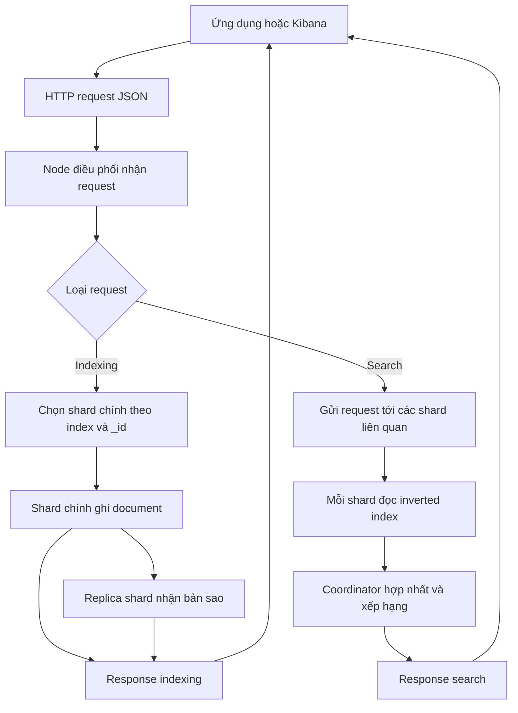

Elasticsearch là một công cụ tìm kiếm và phân tích phân tán. Nó nhận dữ liệu dạng document JSON, lập chỉ mục dữ liệu đó và trả về kết quả tìm kiếm gần như theo thời gian thực. Elasticsearch thường được dùng cho tìm kiếm toàn văn, lọc dữ liệu, phân tích log và các màn hình quan sát hệ thống.

<Callout type="info" title="Phạm vi của bài">
  Bài này xây dựng mô hình tư duy trước khi đi vào API và Query DSL. Bạn không cần biết trước về shard hoặc Lucene, nhưng nên quen với JSON và HTTP request.
</Callout>

## Mục lục

- [Elasticsearch là gì](#elasticsearch-là-gì)
- [Vấn đề Elasticsearch giải quyết](#vấn-đề-elasticsearch-giải-quyết)
  - [Tìm kiếm văn bản](#tìm-kiếm-văn-bản)
  - [Lọc và phân tích cùng một tập dữ liệu](#lọc-và-phân-tích-cùng-một-tập-dữ-liệu)
- [Mô hình search engine hướng document](#mô-hình-search-engine-hướng-document)
  - [Document index và field](#document-index-và-field)
  - [Vì sao mô hình này phù hợp với tìm kiếm](#vì-sao-mô-hình-này-phù-hợp-với-tìm-kiếm)
- [Inverted index bằng một ví dụ](#inverted-index-bằng-một-ví-dụ)
  - [Ví dụ ba document](#ví-dụ-ba-document)
  - [Điều inverted index làm và không làm](#điều-inverted-index-làm-và-không-làm)
- [Request indexing và search flow](#request-indexing-và-search-flow)
  - [Indexing flow](#indexing-flow)
  - [Search flow](#search-flow)
- [Cluster và shard ở mức nền tảng](#cluster-và-shard-ở-mức-nền-tảng)
  - [Cluster và node](#cluster-và-node)
  - [Shard chính và replica](#shard-chính-và-replica)
- [Điểm mạnh giới hạn và khi nào không nên chọn](#điểm-mạnh-giới-hạn-và-khi-nào-không-nên-chọn)
  - [Điểm mạnh](#điểm-mạnh)
  - [Giới hạn](#giới-hạn)
  - [Khi nào không nên chọn](#khi-nào-không-nên-chọn)
- [Ví dụ request tối thiểu](#ví-dụ-request-tối-thiểu)
  - [Ghi một document](#ghi-một-document)
  - [Tìm document](#tìm-document)
- [Thuật ngữ cần nhớ](#thuật-ngữ-cần-nhớ)
- [Next steps](#next-steps)

## Elasticsearch là gì

Elasticsearch được xây dựng trên Apache Lucene, một thư viện cung cấp các cấu trúc và thuật toán tìm kiếm. Elasticsearch bổ sung lớp API, mô hình phân tán và khả năng vận hành để nhiều node có thể cùng lưu trữ và tìm kiếm dữ liệu.

Có thể hình dung Elasticsearch qua ba đặc điểm:

- **Search engine:** tối ưu cho việc tìm các document phù hợp với từ khóa, điều kiện hoặc cách sắp xếp. Kết quả thường có điểm liên quan (`_score`) khi dùng tìm kiếm toàn văn.
- **Document-oriented:** dữ liệu được gửi và trả về dưới dạng document JSON gồm các field. Ứng dụng không thao tác với hàng và cột theo cách của một cơ sở dữ liệu quan hệ.
- **Phân tán:** một index có thể được chia thành nhiều shard trên nhiều node. Việc phân tán này hỗ trợ tăng dung lượng và thông lượng, nhưng cũng làm hệ thống cần được thiết kế và giám sát cẩn thận.

Elasticsearch có HTTP API và nhiều client cho các ngôn ngữ phổ biến. Vì vậy, một ứng dụng có thể ghi document, tìm kiếm và chạy các phép tổng hợp qua cùng một giao diện request/response JSON.

## Vấn đề Elasticsearch giải quyết

### Tìm kiếm văn bản

Một truy vấn tìm chuỗi bằng cách quét từng bản ghi thường không phù hợp khi dữ liệu lớn hoặc khi người dùng muốn tìm theo ý nghĩa gần đúng của từ. Tìm kiếm toàn văn cần tách văn bản thành các token, tìm các document chứa token đó và xếp hạng kết quả.

Ví dụ, với danh mục sản phẩm, người dùng gõ `tai nghe khong day` có thể muốn thấy các sản phẩm có những từ liên quan trong tên hoặc mô tả. Elasticsearch dùng analyzer để xử lý văn bản khi lập chỉ mục và khi tìm kiếm. Nó có thể kết hợp kết quả từ nhiều field, tính điểm liên quan và trả về các hit phù hợp.

Tên gọi hoặc cách viết của token phụ thuộc vào analyzer và mapping. Vì vậy, không nên giả định rằng mọi ngôn ngữ đều được phân tích tốt với cấu hình mặc định. Phần [analyzers và tokenizers](../elasticsearch-core/analyzers-tokenizers) đi sâu hơn vào quyết định này.

### Lọc và phân tích cùng một tập dữ liệu

Tìm kiếm không chỉ là tìm từ khóa. Một màn hình sản phẩm có thể cần lọc `category = "audio"`, giới hạn khoảng giá và đếm số sản phẩm theo thương hiệu. Với log, người vận hành có thể lọc theo service hoặc mức độ lỗi rồi xem số lượng theo thời gian.

Elasticsearch hỗ trợ kết hợp tìm kiếm văn bản, filter và aggregation trong một request. Filter trả lời câu hỏi document có thỏa điều kiện hay không. Aggregation tóm tắt nhiều document thành bucket hoặc giá trị thống kê. Đây là lý do Elasticsearch thường xuất hiện phía sau ô tìm kiếm và các màn hình phân tích.

## Mô hình search engine hướng document

### Document index và field

Một **document** là một đơn vị dữ liệu độc lập, thường được biểu diễn bằng JSON. Ví dụ một sản phẩm có thể là:

```json
{
  "name": "Tai nghe không dây",
  "category": "audio",
  "price": 1290000,
  "available": true
}
```

Một **field** là một thuộc tính như `name`, `price` hoặc `available`. Các field có thể là chuỗi, số, boolean, ngày tháng, object hoặc những kiểu dữ liệu khác. **Index** là một tập hợp logic của các document có mục đích sử dụng tương tự, chẳng hạn `products` hoặc `orders`.

**Mapping** mô tả cách Elasticsearch diễn giải field. Ví dụ, `price` nên được hiểu là số để có thể lọc theo khoảng; `name` thường cần một dạng được phân tích để tìm toàn văn. Một chuỗi cũng có thể cần dạng exact để lọc hoặc sắp xếp.

Trong mô hình document-oriented, dữ liệu liên quan thường được gộp vào document nếu chúng được đọc cùng nhau. Đây là cách giảm nhu cầu join khi search, nhưng có thể tạo dữ liệu lặp và làm cập nhật phức tạp hơn. Xem [Mô hình dữ liệu](./mo-hinh-du-lieu) để tìm hiểu cách chọn cấu trúc document và mapping.

### Vì sao mô hình này phù hợp với tìm kiếm

Một request search thường cần trả về cả document và các thuộc tính liên quan của nó. Lưu dữ liệu gần với hình dạng response giúp một truy vấn đọc được nhiều thông tin cần thiết mà không phải ghép nhiều bảng.

Đổi lại, index tìm kiếm thường không phải nguồn dữ liệu chuẩn duy nhất. Một ứng dụng có thể giữ dữ liệu giao dịch trong cơ sở dữ liệu quan hệ, sau đó đồng bộ một phiên bản phù hợp cho tìm kiếm vào Elasticsearch. Cách này tách rõ hai nhiệm vụ: hệ thống nguồn đảm bảo nghiệp vụ và Elasticsearch phục vụ việc đọc, tìm kiếm, phân tích.

## Inverted index bằng một ví dụ

Một bảng tra cứu thông thường đi từ document đến nội dung của document. **Inverted index** đảo chiều quan hệ đó: từ một term đã được phân tích, nó trỏ đến danh sách document có term.

### Ví dụ ba document

Giả sử có ba document sau:

| Document | Nội dung `name` |
| --- | --- |
| `1` | `Tai nghe không dây` |
| `2` | `Loa không dây` |
| `3` | `Tai nghe có chống ồn` |

Sau khi analyzer biến văn bản thành các token minh họa dưới đây, inverted index có thể được hình dung như sau:

| Term | Document chứa term |
| --- | --- |
| `tai` | `1`, `3` |
| `nghe` | `1`, `3` |
| `không` | `1`, `2` |
| `dây` | `1`, `2` |
| `loa` | `2` |
| `có` | `3` |
| `chống` | `3` |
| `ồn` | `3` |

Khi người dùng tìm `tai nghe`, hệ thống có thể lấy danh sách của `tai` và `nghe`, sau đó xác định các document phù hợp. Document `1` và `3` là ứng viên vì đều chứa hai term. Tần suất term, vị trí term và các tín hiệu khác có thể ảnh hưởng đến điểm liên quan.

Đây là ví dụ để hiểu cơ chế, không phải cam kết về token thực tế. Lowercase, stop word, stemming và các xử lý ngôn ngữ khác phụ thuộc vào analyzer được cấu hình.

### Điều inverted index làm và không làm

Inverted index giúp tránh quét toàn bộ nội dung của mọi document cho mỗi từ khóa. Nó đặc biệt hữu ích cho việc tìm document có các term cụ thể.

Nó không làm cho mọi truy vấn đều rẻ. Query có wildcard rộng, regexp, sorting trên field chưa được chuẩn bị phù hợp hoặc aggregation trên dữ liệu lớn vẫn có thể tốn CPU, bộ nhớ và thời gian. Tốc độ thực tế còn phụ thuộc vào mapping, shard, kích thước dữ liệu, cache và cách viết query.

Nói ngắn gọn: hãy thiết kế index theo kiểu truy vấn cần phục vụ và đo bằng dữ liệu gần với sản xuất, thay vì coi inverted index là một lời hứa về độ trễ cố định.

## Request indexing và search flow

Một request thường đi qua node nhận request, các shard liên quan và quay lại dưới dạng response JSON. Hai luồng cơ bản khác nhau ở chỗ indexing chọn một shard chính để ghi, còn search thường fan out đến nhiều shard rồi coordinator hợp nhất kết quả.



Sơ đồ minh họa các bước phối hợp, không phải thứ tự xác nhận giống nhau cho mọi request. `wait_for_active_shards` quyết định request ghi phải chờ bao nhiêu shard copy; mặc định thường yêu cầu primary đang hoạt động. Refresh lại quyết định thời điểm document xuất hiện trong search.

### Indexing flow

1. Ứng dụng gửi document tới endpoint của một index. Request có thể chỉ rõ `_id`, hoặc để hệ thống/client tạo một định danh.
2. Node nhận request xác định index và shard đích. Cách route phổ biến dựa trên `_id`, để các lần ghi và đọc cùng một document đi tới cùng shard.
3. Shard chính kiểm tra mapping, phân tích các field phù hợp và ghi dữ liệu vào cấu trúc của Lucene. Elasticsearch cũng duy trì cơ chế log nội bộ để hỗ trợ tính bền vững và khôi phục.
4. Thay đổi được chuyển tới các replica shard theo chính sách của cluster. Khi request được xác nhận, điều đó không đồng nghĩa document đã xuất hiện ngay trong mọi kết quả search.
5. Sau một lần **refresh**, dữ liệu mới trở nên có thể tìm kiếm. Vì refresh và thao tác ghi là hai việc khác nhau, Elasticsearch thường được gọi là hệ thống tìm kiếm gần như thời gian thực, không phải tức thời tuyệt đối.

Nếu cần đọc ngay sau khi ghi, ứng dụng phải chọn chính sách refresh phù hợp với yêu cầu và chi phí vận hành. Không nên bật refresh cưỡng bức cho mọi request ghi nếu không thật sự cần.

### Search flow

1. Ứng dụng gửi query tới index hoặc một mẫu index.
2. Node điều phối gửi query đến các shard có dữ liệu liên quan. Có thể dùng shard chính hoặc một replica tương đương để phục vụ việc đọc.
3. Mỗi shard thực thi query trên dữ liệu cục bộ. Shard tạo danh sách hit và, nếu cần, tính điểm hoặc giá trị aggregation cục bộ.
4. Node điều phối nhận các kết quả cục bộ, chọn và sắp xếp top hit toàn cục, rồi hợp nhất aggregation trước khi trả response.

Mỗi shard bổ sung chi phí fan-out và hợp nhất. Vì vậy, thêm shard không tự động làm mọi query nhanh hơn. Cần cân bằng dung lượng, thông lượng và chi phí phối hợp; các quyết định triển khai chi tiết thuộc bài [Kiến trúc Elasticsearch](./kien-truc-elasticsearch).

## Cluster và shard ở mức nền tảng

### Cluster và node

**Cluster** là một nhóm các node Elasticsearch cùng phối hợp và quản lý các index. **Node** là một tiến trình Elasticsearch tham gia cluster và đảm nhiệm một hoặc nhiều vai trò, chẳng hạn nhận request, lưu dữ liệu hoặc quản lý trạng thái cluster.

Khi request đi vào bất kỳ node phù hợp nào, node đó có thể đóng vai trò coordinator để chuyển request tới nơi cần thiết. Ở quy mô nhỏ, một node có thể vừa nhận request vừa lưu dữ liệu. Ở quy mô lớn, các vai trò và topology cần được tách theo tải, yêu cầu sẵn sàng và giới hạn tài nguyên.

### Shard chính và replica

Một index được chia thành các **primary shard**. Mỗi primary shard chứa một phần document của index. **Replica shard** là bản sao của primary shard để tăng khả năng phục vụ đọc và giúp dữ liệu còn khả dụng khi một node gặp sự cố.

Khi indexing, request của một document được route tới primary shard rồi mới được sao chép sang replica. Khi search, coordinator có thể gửi request tới các bản sao phù hợp và hợp nhất kết quả. Replica không thay thế cho backup: snapshot và quy trình khôi phục vẫn cần thiết để xử lý xóa nhầm, lỗi logic hoặc sự cố rộng hơn.

Số lượng shard, kích thước document, số replica và cách phân bổ node ảnh hưởng trực tiếp đến hiệu năng. Ở bài nhập môn này, chỉ cần nhớ: index là lớp logic mà ứng dụng nhìn thấy; shard là đơn vị lưu trữ và thực thi ở bên dưới. Đọc thêm [Shards và replicas](../elasticsearch-core/shards-replicas) và [Kiến trúc Elasticsearch](./kien-truc-elasticsearch) trước khi thiết kế cluster production.

## Điểm mạnh giới hạn và khi nào không nên chọn

### Điểm mạnh

- Tìm kiếm toàn văn có phân tích token và xếp hạng liên quan.
- Kết hợp text search, filter, sort và aggregation trong một API.
- Mô hình JSON phù hợp với dữ liệu cần trả về cho ứng dụng hoặc dashboard.
- Có thể mở rộng bằng cách phân phối index qua shard và node.
- Có hệ sinh thái client, ingest và giao diện để xây dựng các bài toán search, log analytics và observability.

### Giới hạn

- Dữ liệu chỉ tìm kiếm được sau refresh, nên có độ trễ nhỏ giữa lúc ghi và lúc thấy trong search.
- Hệ thống phân tán cần theo dõi cluster health, phân bổ shard, dung lượng và tài nguyên. Cấu hình sai có thể làm query chậm hoặc cluster mất ổn định.
- Mapping và analyzer ảnh hưởng lớn tới kết quả. Đổi cách phân tích field đã có dữ liệu thường cần lập chỉ mục lại sang index mới.
- Sao chép dữ liệu từ hệ thống nguồn tạo thêm pipeline, xử lý lỗi và câu hỏi về độ trễ đồng bộ.
- Elasticsearch không phải lựa chọn mặc định cho transaction phức tạp, ràng buộc quan hệ chặt chẽ hoặc các thao tác cập nhật nhiều bản ghi cần tính nguyên tử.

<Callout type="warn" title="Đừng dùng Elasticsearch như bản sao duy nhất">
  Nếu dữ liệu là nguồn sự thật cho nghiệp vụ, hãy xác định rõ hệ thống sở hữu dữ liệu đó. Elasticsearch có thể là read model hoặc search index được đồng bộ từ nguồn khác; replica trong cluster không phải là backup và cũng không giải quyết mọi yêu cầu transaction.
</Callout>

### Khi nào không nên chọn

Không nên chọn Elasticsearch làm kho dữ liệu chính nếu bài toán chủ yếu là:

- ghi giao dịch tài chính hoặc nghiệp vụ cần commit/rollback trên nhiều thực thể;
- truy vấn quan hệ với nhiều join, foreign key và ràng buộc toàn vẹn;
- lưu một tập dữ liệu nhỏ chỉ cần tìm theo vài cột đơn giản mà cơ sở dữ liệu hiện tại đã đáp ứng tốt;
- cập nhật liên tục với yêu cầu đọc ngay lập tức và không chấp nhận độ trễ refresh.

Trong các trường hợp này, cơ sở dữ liệu quan hệ hoặc một hệ thống chuyên biệt có thể phù hợp hơn. Elasticsearch vẫn có thể được thêm như một lớp tìm kiếm phụ nếu lợi ích của full-text search và phân tích lớn hơn chi phí đồng bộ, vận hành và lưu trữ.

## Ví dụ request tối thiểu

Ví dụ sau minh họa vòng đời cơ bản: ghi một sản phẩm, rồi tìm sản phẩm bằng full-text query. Đây là ví dụ khái niệm; một môi trường có thể yêu cầu tạo index và mapping trước, hoặc tắt cơ chế tự tạo index.

### Ghi một document

```http
PUT /products/_doc/1
Content-Type: application/json

{
  "name": "Tai nghe không dây",
  "category": "audio",
  "price": 1290000
}
```

`products` là tên index, còn `1` là `_id` của document. `PUT` với `_id` cố định giúp request có thể lặp lại và ghi vào đúng document. Response thành công thường cho biết thao tác đã được chấp nhận, nhưng document có thể cần chờ refresh trước khi xuất hiện trong search.

### Tìm document

```http
GET /products/_search
Content-Type: application/json

{
  "query": {
    "match": {
      "name": "tai nghe"
    }
  }
}
```

`match` là full-text query: giá trị tìm kiếm được phân tích theo cách phù hợp với field rồi đối chiếu với inverted index. Kết quả thường nằm trong `hits`; mỗi hit có thể chứa `_id`, `_score` và dữ liệu gốc trong `_source`.

Query này không có nghĩa là so sánh chuỗi nguyên văn. Nếu cần lọc một giá trị chính xác như `category`, cần dùng field và query phù hợp với mapping của field đó. Bài [Truy vấn đầu tiên](../bat-dau/truy-van-dau-tien) và [Query DSL](../elasticsearch-core/query-dsl) sẽ giải thích các lựa chọn này mà không cần đưa toàn bộ DSL vào bài nhập môn.

## Thuật ngữ cần nhớ

| Thuật ngữ | Ý nghĩa ngắn gọn |
| --- | --- |
| Cluster | Nhóm node cùng phối hợp để cung cấp Elasticsearch. |
| Node | Một tiến trình Elasticsearch tham gia cluster. |
| Index | Tập hợp logic của các document có mục đích sử dụng tương tự. |
| Document | Đơn vị dữ liệu JSON được lập chỉ mục. |
| Field | Thuộc tính bên trong document. |
| Mapping | Quy tắc diễn giải field và data type của field. |
| Inverted index | Cấu trúc ánh xạ từ term tới các document chứa term. |
| Analyzer | Thành phần biến văn bản thành token khi index và search. |
| Primary shard | Phân mảnh chính chứa một phần dữ liệu của index và nhận ghi ban đầu. |
| Replica shard | Bản sao của primary shard để hỗ trợ khả năng phục vụ và chịu lỗi. |
| Coordinator | Node nhận request và điều phối request tới các shard liên quan. |
| Refresh | Thao tác làm thay đổi mới có thể được search; không đồng nghĩa với backup. |
| Hit | Một kết quả document được trả về từ search. |
| Aggregation | Phép tổng hợp để tính bucket hoặc thống kê trên nhiều document. |

## Next steps

Bạn có thể đi tiếp theo thứ tự sau:

- [Elastic Stack và ELK](./elastic-stack-va-elk) để đặt Elasticsearch vào bối cảnh các thành phần liên quan.
- [Index document đầu tiên](../bat-dau/index-document-dau-tien) để thực hành tạo index và ghi dữ liệu.
- [Truy vấn đầu tiên](../bat-dau/truy-van-dau-tien) để gửi query và đọc response.
- [Mô hình dữ liệu](./mo-hinh-du-lieu) để tìm hiểu sâu hơn về index, document và mapping.
- [Indices và documents](../elasticsearch-core/indices-documents) để học vòng đời document.
- [Full-text search](../elasticsearch-core/full-text-search) để đi sâu vào các loại tìm kiếm văn bản.
- [Kiến trúc Elasticsearch](./kien-truc-elasticsearch) để hiểu node, coordinator, shard và data path ở mức triển khai.
