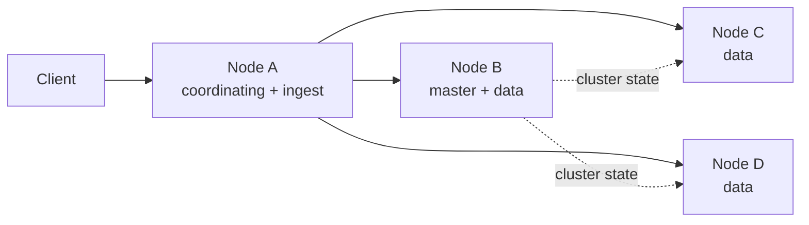
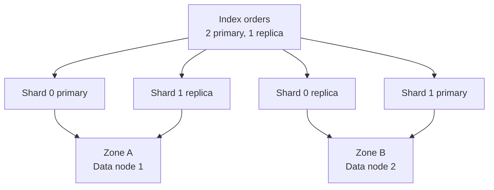
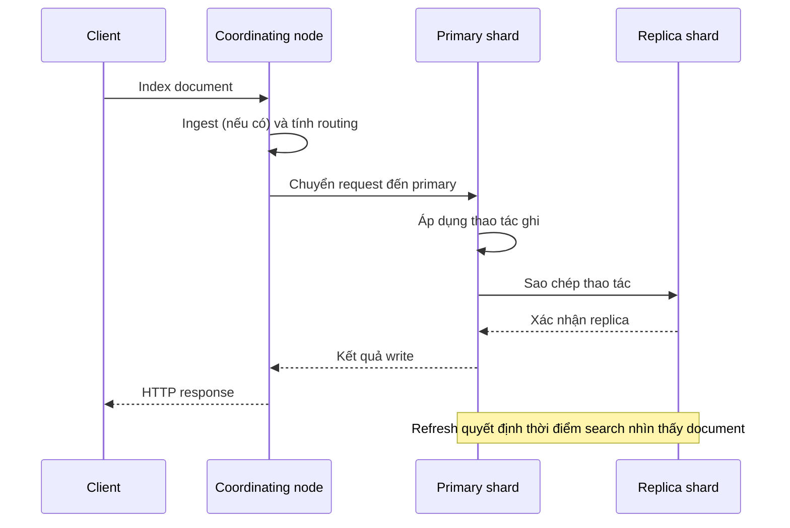
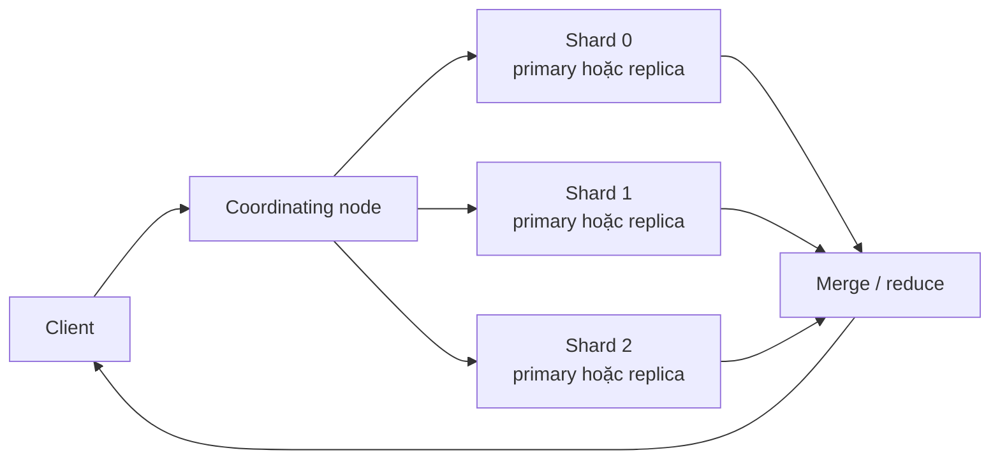
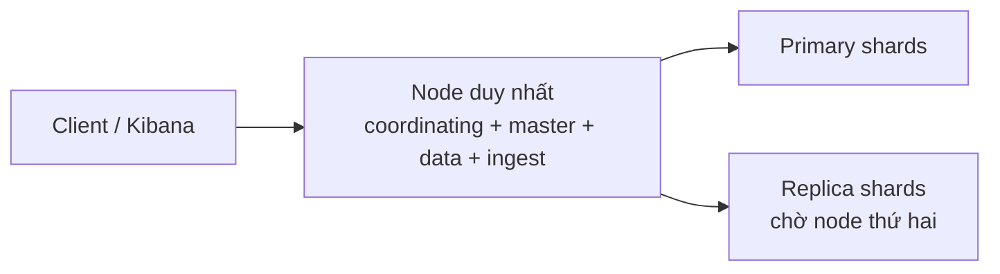
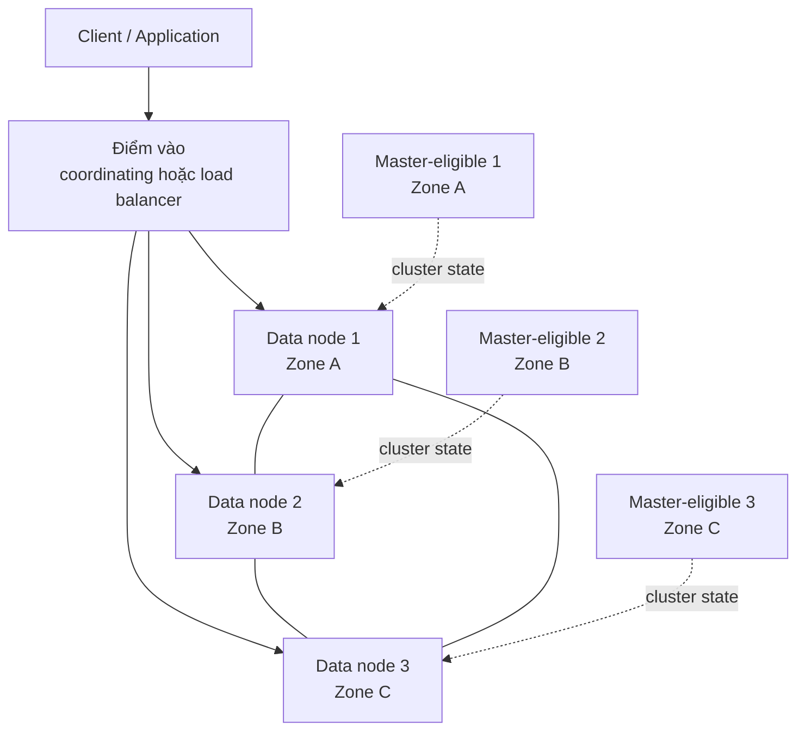

Elasticsearch là một hệ thống phân tán. Một request đi qua nhiều lớp: client gửi request đến một node, cluster chọn shard phù hợp, rồi các node phối hợp để ghi hoặc tìm dữ liệu. Nắm được đường đi này giúp bạn đọc đúng các chỉ số health, chọn topology phù hợp và giải thích được các trade-off về độ trễ, dung lượng và khả năng chịu lỗi.

<Callout type="info" title="Phạm vi của bài">
  Bài này mô tả mô hình kiến trúc ở mức khái niệm. Tên role và cách phân bổ cụ thể có thể thay đổi theo phiên bản, vì vậy các ví dụ không đưa ra một bộ cấu hình cố định cho mọi deployment.
</Callout>

## Mục lục

- [Elasticsearch nhìn từ hai lớp: logic và vật lý](#elasticsearch-nhìn-từ-hai-lớp-logic-và-vật-lý)
  - [Mô hình logic](#mô-hình-logic)
  - [Triển khai vật lý](#triển-khai-vật-lý)
- [Cluster và node](#cluster-và-node)
  - [Cluster](#cluster)
  - [Node](#node)
- [Các node role hiện đại](#các-node-role-hiện-đại)
  - [Master-eligible và elected master](#master-eligible-và-elected-master)
  - [Data và các data tier](#data-và-các-data-tier)
  - [Ingest](#ingest)
  - [Coordinating](#coordinating)
  - [Một số role hỗ trợ](#một-số-role-hỗ-trợ)
- [Index, shard primary và replica](#index-shard-primary-và-replica)
  - [Primary shard](#primary-shard)
  - [Replica shard](#replica-shard)
  - [Phân bổ shard lên node](#phân-bổ-shard-lên-node)
- [Discovery, cluster state và phân phối](#discovery-cluster-state-và-phân-phối)
  - [Discovery và bầu master](#discovery-và-bầu-master)
  - [Cluster state](#cluster-state)
  - [Phân phối và tái cân bằng](#phân-phối-và-tái-cân-bằng)
- [Đường đi của write và index request](#đường-đi-của-write-và-index-request)
  - [Bước 1: nhận request và xác định shard](#bước-1-nhận-request-và-xác-định-shard)
  - [Bước 2: chuyển request đến primary](#bước-2-chuyển-request-đến-primary)
  - [Bước 3: primary ghi và replica sao chép](#bước-3-primary-ghi-và-replica-sao-chép)
  - [Bước 4: phản hồi và khả năng nhìn thấy dữ liệu](#bước-4-phản-hồi-và-khả-năng-nhìn-thấy-dữ-liệu)
- [Đường đi của search request](#đường-đi-của-search-request)
  - [Scatter đến các shard](#scatter-đến-các-shard)
  - [Reduce kết quả](#reduce-kết-quả)
- [Routing và phạm vi fan-out](#routing-và-phạm-vi-fan-out)
  - [Routing mặc định](#routing-mặc-định)
  - [Routing trong write](#routing-trong-write)
  - [Routing trong search](#routing-trong-search)
- [Health, resilience và các trade-off](#health-resilience-và-các-trade-off)
  - [Đọc trạng thái health](#đọc-trạng-thái-health)
  - [Khi node hoặc shard bị mất](#khi-node-hoặc-shard-bị-mất)
  - [Replica không thay thế backup](#replica-không-thay-thế-backup)
  - [Các trade-off cơ bản](#các-trade-off-cơ-bản)
- [Ví dụ topology nhỏ](#ví-dụ-topology-nhỏ)
  - [Topology học tập](#topology-học-tập)
  - [Topology production tối thiểu](#topology-production-tối-thiểu)
  - [Cách đọc topology](#cách-đọc-topology)
- [Nguyên tắc thiết kế production](#nguyên-tắc-thiết-kế-production)
  - [Tách vai trò khi workload đủ lớn](#tách-vai-trò-khi-workload-đủ-lớn)
  - [Chọn shard theo dữ liệu và throughput](#chọn-shard-theo-dữ-liệu-và-throughput)
  - [Thiết kế cho zone failure](#thiết-kế-cho-zone-failure)
  - [Theo dõi và kiểm thử](#theo-dõi-và-kiểm-thử)
  - [Sao lưu và khôi phục](#sao-lưu-và-khôi-phục)
- [Liên kết tiếp theo](#liên-kết-tiếp-theo)

## Elasticsearch nhìn từ hai lớp: logic và vật lý

Trước hết, hãy tách hai cách nhìn thường bị trộn lẫn khi nói về Elasticsearch.

### Mô hình logic

Ở mô hình logic, một **cluster** là nhóm node cùng quản lý một không gian dữ liệu và một cluster state. Dữ liệu được chia vào các **index**. Mỗi index lại được chia thành một số **primary shard**. Mỗi primary có thể có một hoặc nhiều **replica shard**.

Shard là đơn vị lưu trữ và xử lý phân tán. Một shard chứa một phần dữ liệu của index, không phải một bản sao của toàn bộ index. Primary và các replica của cùng một shard chứa cùng tập dữ liệu logic, nhưng nằm trên các bản sao Lucene độc lập.

Ví dụ, một index có hai primary và một replica cho mỗi primary có tổng cộng bốn shard copy:

```text
index logs
├── shard 0: primary + replica
└── shard 1: primary + replica
```

### Triển khai vật lý

Ở mô hình vật lý, node là tiến trình Elasticsearch chạy trên máy ảo, máy vật lý hoặc container. Nhiều node có thể nằm trong cùng một zone hoặc phân bố qua nhiều zone. Một máy chủ cũng có thể chạy nhiều tiến trình, nhưng cách này làm tăng nguy cơ tranh chấp tài nguyên và failure domain trùng nhau.

Một shard có thể được đặt trên một node cụ thể tại một thời điểm. Cluster có thể chuyển shard sang node khác khi node hỏng, tài nguyên thay đổi hoặc chính sách allocation yêu cầu. Vì vậy, tên node vật lý không phải là một phần cố định của mô hình dữ liệu.

<Callout type="warn" title="Gotcha: shard không phải là node">
  Index, shard và node là ba khái niệm khác nhau. Index là đơn vị logic người dùng truy vấn; shard là phần dữ liệu được phân tán; node là tiến trình cung cấp CPU, bộ nhớ và đĩa để xử lý shard. Tăng số node không tự động làm một index có thêm shard.
</Callout>

## Cluster và node

### Cluster

Cluster cung cấp một không gian điều phối chung cho các node. Nó biết index nào tồn tại, mỗi shard đang ở đâu, node nào đang tham gia và các thay đổi metadata nào đã được chấp nhận.

Cluster không phải là một database đơn lẻ nằm trên một máy trung tâm. Dữ liệu và việc xử lý được phân tán. Một node có thể nhận request từ client rồi chuyển request đến các node khác.

Trong Elasticsearch, các node có role `master` có thể tham gia bầu chọn; một node trong số đó được bầu làm **elected master**. Elected master quản lý các thay đổi cần sự đồng thuận của cluster, chẳng hạn tạo index, cập nhật mapping hoặc thay đổi phân bổ shard. Nó không phải là nơi duy nhất lưu toàn bộ dữ liệu và cũng không bắt buộc phải xử lý mọi query.

### Node

Node là một thành viên của cluster. Khi khởi động, node dùng cơ chế discovery để tìm các node phù hợp, xác nhận cluster mà nó thuộc về và nhận cluster state.

Một node có thể mang nhiều role cùng lúc. Ví dụ, một node có thể vừa là master-eligible, vừa là data và ingest. Ở cluster nhỏ, việc gộp role làm kiến trúc đơn giản hơn. Ở cluster lớn, tách role giúp workload điều phối, ingest, search và lưu trữ ít tranh chấp hơn.



Mũi tên nét liền mô tả một request có thể được chuyển tiếp. Mũi tên nét đứt mô tả việc cluster state được lan truyền, không phải luồng dữ liệu của một document cụ thể.

## Các node role hiện đại

Role nên được hiểu là trách nhiệm chính của node, không phải một loại máy bắt buộc. Tên role trong tài liệu và API cần được đối chiếu với phiên bản Elasticsearch đang chạy.

### Master-eligible và elected master

Node có role `master` là **master-eligible node**: node có thể tham gia bầu chọn và trở thành elected master. Elected master hiện tại điều phối các thay đổi cluster state và theo dõi thành viên cluster. Một số hệ thống search khác dùng cụm “cluster manager”, nhưng cấu hình Elasticsearch vẫn dùng role `master`.

Một cluster production thường cần nhiều node có khả năng bầu chọn để chịu được việc mất một node mà vẫn đạt đa số. Các node này không cần nhận phần lớn search traffic. Có thể dành riêng chúng cho nhiệm vụ điều phối khi cluster đủ lớn.

<Callout type="warn" title="Gotcha: elected master không phải database primary">
  Elected master không phải primary shard và cũng không phải “master” của mọi request. Primary shard quyết định việc ghi dữ liệu của chính shard đó; elected master quyết định metadata và điều phối cluster. Hai khái niệm này độc lập.
</Callout>

### Data và các data tier

Data node lưu shard và thực hiện phần lớn công việc đọc, ghi, merge segment và quản lý cache. Các data role chuyên biệt thường thể hiện ý định đặt dữ liệu theo vòng đời hoặc loại workload:

- **Data content**: dữ liệu cần truy cập thường xuyên, không nhất thiết tuân theo vòng đời time-series.
- **Data hot**: dữ liệu mới, có tần suất ghi và đọc cao.
- **Data warm**: dữ liệu cũ hơn, thường ít ghi hơn nhưng vẫn cần truy cập.
- **Data cold**: dữ liệu ít truy cập, ưu tiên tiết kiệm tài nguyên hơn độ trễ.
- **Data frozen**: dữ liệu rất ít truy cập, có thể dùng cơ chế lưu trữ phù hợp để giảm chi phí nóng trong bộ nhớ và trên đĩa.

Các tier này là mô hình phân loại và allocation. Chúng không biến một shard thành nhiều shard nhỏ hơn. Với workload không cần data tier, một nhóm data node dùng chung thường dễ vận hành hơn.

### Ingest

Ingest node chạy ingest pipeline trước khi document được ghi vào shard. Pipeline có thể chuẩn hóa field, parse nội dung hoặc bổ sung metadata.

Ingest là công việc CPU và bộ nhớ. Nếu pipeline nặng, node nhận request có thể trở thành nút thắt. Có thể tách ingest thành nhóm node riêng khi lưu lượng hoặc độ phức tạp pipeline đủ lớn. Tuy nhiên, request vẫn cần được điều phối đến primary shard sau bước ingest.

### Coordinating

Mọi node đều có khả năng coordinating ở một mức độ nào đó: nhận request, xác định shard đích, gửi request fan-out và gộp phản hồi. **Coordinating-only node** là node không giữ các role chuyên biệt như data hoặc master-eligible, được dùng chủ yếu làm điểm vào và lớp điều phối.

Coordinating-only node có thể giảm việc client kết nối trực tiếp vào data node. Đổi lại, nó cần đủ CPU, bộ nhớ và băng thông để gộp kết quả search hoặc điều phối bulk request. Thêm nhiều coordinating node không tự động làm query nhanh hơn; nếu bottleneck nằm ở shard hoặc disk, lớp này chỉ thêm một hop.

### Một số role hỗ trợ

Elasticsearch còn có các role cho những chức năng như machine learning, transform, remote cluster hoặc các tác vụ nền khác. Không nên đưa các role này vào mọi node theo mặc định. Hãy tách chúng khi chức năng tương ứng có tải đáng kể hoặc có yêu cầu cô lập tài nguyên.

Tên role không thay thế cho việc đo workload. Cùng một role có thể phù hợp với cluster thử nghiệm nhưng gây tranh chấp tài nguyên trong production.

## Index, shard primary và replica

### Primary shard

Mỗi document của một index thuộc về đúng một primary shard. Primary là bản sao được chọn làm nơi nhận thao tác ghi hiện tại của shard đó. “Primary” là trạng thái hiện thời của một shard copy; nếu node chứa primary hỏng, một replica có thể được thăng cấp thành primary.

Số primary của một index tạo ra mức độ song song và cách phân vùng dữ liệu. Số này thường là quyết định cần cân nhắc sớm, vì thay đổi số primary của index hiện hữu không phải là thao tác đơn giản như đổi một nhãn. Có thể dùng index mới, rollover hoặc cơ chế reindex phù hợp để thay đổi cách phân vùng.

### Replica shard

Replica là bản sao của primary shard nhằm tăng khả năng chịu lỗi và cung cấp thêm shard copy cho việc đọc. Một primary có thể có nhiều replica, tùy yêu cầu về độ sẵn sàng và throughput đọc.

Primary và replica không phải hai phần dữ liệu khác nhau. Chúng đại diện cho cùng một shard logic. Một shard copy chỉ được xem là bản sao hợp lệ khi quá trình phục hồi và đồng bộ của nó hoàn tất.

Replica không nhận một write độc lập từ client. Write được chuyển đến primary hiện tại, sau đó primary phối hợp với các replica đủ điều kiện trước khi phản hồi theo chính sách xác nhận của request.

### Phân bổ shard lên node

Cluster cố gắng tránh đặt primary và replica của cùng một shard trên cùng node. Nếu làm vậy, một node hỏng có thể làm mất cả primary lẫn replica trong một lần. Chính sách allocation và awareness có thể giúp phân tán shard theo node, zone hoặc thuộc tính phần cứng.



Trong ví dụ, các copy của shard 0 và shard 1 được đặt lệch zone. Đây là mục tiêu phân bổ, không phải cam kết tự động cho mọi deployment. Cần kiểm tra failure domain thực tế và allocation rules.

<Callout type="warn" title="Gotcha: replica không tăng vô hạn khả năng ghi">
  Mỗi write vẫn đi qua một primary và phải được sao chép đến replica. Tăng replica thường tăng độ an toàn và có thể tăng khả năng đọc, nhưng cũng tăng lưu lượng mạng, I/O và chi phí lưu trữ. Replica không phải cách miễn phí để tăng throughput ghi.
</Callout>

## Discovery, cluster state và phân phối

### Discovery và bầu master

Discovery là quá trình node tìm các node khác và xác định thành viên cluster. Một node mới phải tìm đúng cluster; nếu không, nó có thể đứng riêng hoặc gia nhập nhầm cluster. Vì vậy, nhận diện cluster và danh sách node có thể bầu chọn cần được quản lý cẩn thận.

Khi elected master hiện tại mất kết nối, các node master-eligible sẽ dùng cơ chế bầu chọn để chọn elected master mới. Việc bầu chọn cần đa số các node có quyền biểu quyết. Đây là lý do cluster production không nên phụ thuộc vào một node điều phối duy nhất.

### Cluster state

Cluster state là metadata dùng chung để các node hiểu cluster hiện tại. Nó bao gồm thông tin như index và mapping, trạng thái shard, node membership và các thiết lập liên quan đến việc phân bổ.

Elected master tạo và công bố các thay đổi cluster state. Các node khác nhận thay đổi rồi dùng state đó để định tuyến request và quản lý shard cục bộ. Cluster state không đồng nghĩa với nội dung toàn bộ document; document vẫn nằm trong các shard trên data node.

### Phân phối và tái cân bằng

Sau khi cluster biết vị trí shard, nó có thể phân phối request đến node đang giữ shard copy phù hợp. Khi node rời cluster hoặc một shard cần chuyển chỗ, cơ chế allocation sẽ phục hồi shard từ replica hoặc từ dữ liệu bền vững khác, rồi tái cân bằng để phân bố tải.

Tái cân bằng giúp dùng tài nguyên đều hơn nhưng tiêu tốn disk và mạng. Trong lúc phục hồi, search hoặc write có thể chịu độ trễ cao hơn. Không nên đánh giá cluster chỉ qua số node; hãy quan sát cả shard đang relocating, pending tasks và lưu lượng phục hồi.

## Đường đi của write và index request

Một index request có thể là thêm document mới, cập nhật document hoặc xóa document. Ví dụ dưới đây dùng một request ghi đơn để minh họa. Bulk request lặp lại cùng nguyên tắc cho nhiều item, nhưng mỗi item có thể được route đến shard khác nhau.

### Bước 1: nhận request và xác định shard

Client gửi request đến bất kỳ node nào có endpoint Elasticsearch. Node nhận request đóng vai trò coordinating node cho request đó. Nếu có ingest pipeline, document được xử lý ở bước ingest trước khi định tuyến dữ liệu.

Sau đó coordinating node lấy số primary shard của index và tính shard đích từ `_routing` của document. Nếu không chỉ định routing, giá trị mặc định thường dựa trên document ID. Kết quả là cùng một document ID trong cùng index sẽ đi đến cùng primary shard, miễn là số primary của index không thay đổi.

### Bước 2: chuyển request đến primary

Coordinating node dùng cluster state để biết primary shard hiện tại đang ở node nào. Nếu node nhận request không giữ primary đó, nó chuyển request đến node đang giữ primary. Nếu chính nó giữ primary, nó có thể xử lý cục bộ.

Primary là nơi quyết định thứ tự và kết quả của thao tác ghi trong shard. Một request không được ghi song song độc lập vào primary và từng replica, vì như vậy các bản sao có thể áp dụng thao tác theo thứ tự khác nhau.

### Bước 3: primary ghi và replica sao chép

Primary kiểm tra phiên bản document, áp dụng thao tác vào shard và ghi thông tin cần thiết cho khả năng phục hồi. Nó gửi thao tác đến các replica đang hoạt động của shard. Replica áp dụng cùng thao tác trên shard copy của mình.

Mức độ chờ replica trước khi phản hồi phụ thuộc vào semantics của request và trạng thái cluster. Nếu replica không sẵn sàng, request có thể chờ, thất bại hoặc phản hồi theo mức xác nhận đã chọn. Đừng suy ra rằng HTTP success luôn có nghĩa mọi replica vật lý đã được đồng bộ trong mọi tình huống; hãy hiểu semantics của API và theo dõi lỗi từng item trong bulk.

### Bước 4: phản hồi và khả năng nhìn thấy dữ liệu

Sau khi hoàn tất điều kiện xác nhận, primary trả kết quả về coordinating node. Node này chuyển phản hồi cho client.

Ghi thành công và đọc thấy ngay là hai khái niệm khác nhau. Elasticsearch dùng refresh để mở các segment mới cho search. Document đã được ghi bền vững có thể chưa xuất hiện trong search ngay trước lần refresh phù hợp. Tham số refresh của request có thể thay đổi hành vi và chi phí, nhưng ép refresh cho mọi request thường làm giảm throughput.



Sơ đồ cho thấy replica nhận thao tác ghi, không có nghĩa request luôn phải chờ mọi replica trước khi phản hồi. Tham số `wait_for_active_shards` quyết định mức xác nhận cần chờ; mặc định thường yêu cầu primary đang hoạt động. Nếu cần đảm bảo nhiều shard copy đã sẵn sàng, hãy cấu hình tham số này theo yêu cầu và đo chi phí.

## Đường đi của search request

Search request thường có hai pha: **scatter** (phân tán truy vấn đến các shard) và **reduce** (gộp, sắp xếp hoặc tổng hợp kết quả). Một search có thể dùng primary hoặc replica của mỗi shard. Việc chọn shard copy phụ thuộc trạng thái và chiến lược cân bằng tải.

### Scatter đến các shard

Client gửi search đến một node bất kỳ. Node đó trở thành coordinating node, đọc cluster state rồi xác định các shard cần tham gia.

Nếu search không có điều kiện routing hoặc giới hạn shard, request thường fan-out đến một shard copy của mọi primary trong index hoặc data stream liên quan. Với nhiều shard, fan-out làm tăng số task, kết nối mạng và bộ nhớ để giữ kết quả tạm thời.

Mỗi shard thực hiện phần truy vấn cục bộ. Với truy vấn có sort hoặc top hits, shard thường gửi các ứng viên tốt nhất cùng metadata cần thiết thay vì gửi toàn bộ document ngay từ đầu.

### Reduce kết quả

Coordinating node nhận phản hồi từ các shard, merge kết quả theo sort, tính aggregation và thực hiện các bước cần thiết để lấy đủ nội dung document. Sau đó nó trả kết quả cuối cùng cho client.



Trong thực tế, query phức tạp có thể có thêm pha lấy document và nhiều bước reduce. Sơ đồ chỉ nhấn mạnh rằng coordinating node phải chờ và gộp kết quả từ nhiều shard.

## Routing và phạm vi fan-out

Routing trả lời câu hỏi: một document hoặc một search cần đi đến shard nào? Đây là cầu nối giữa mô hình dữ liệu và chi phí phân tán.

### Routing mặc định

Với routing mặc định, Elasticsearch dùng giá trị routing của document, thường là `_id`, để tính shard. Công thức khái niệm có thể hình dung như sau:

```text
shard = hash(_routing) mod số_primary_shard
```

Đây là mô hình giải thích, không phải lời hứa về hàm hash cụ thể. Điểm quan trọng là cùng một routing value sẽ xác định cùng một primary trong index đó.

### Routing trong write

Khi tạo hoặc cập nhật document, client có thể cung cấp routing key thay cho ID. Ví dụ, nếu mọi document của một tenant dùng cùng tenant ID làm routing, chúng có thể được gom vào một shard để truy vấn theo tenant chỉ cần fan-out hẹp hơn.

Cách này đánh đổi khả năng tối ưu search lấy nguy cơ **hot shard**. Một tenant quá lớn hoặc một key có tần suất ghi cao sẽ dồn tải lên một shard. Routing key cũng phải được gửi nhất quán cho mọi thao tác đọc, cập nhật và xóa liên quan; thiếu key có thể khiến request không tìm thấy document hoặc phải tìm rộng hơn.

### Routing trong search

Search có routing chỉ nhắm vào shard tương ứng với routing value. Đây là tối ưu mạnh cho workload có khóa truy cập rõ ràng như tenant, user hoặc partition logic.

Không nên dùng routing chỉ vì muốn giảm số shard được truy vấn. Trước tiên hãy kiểm tra phân bố dữ liệu và tải. Nếu cần tìm toàn bộ tenant, routing không giúp giảm fan-out của truy vấn đó. Nếu dữ liệu phân bố lệch, hãy ưu tiên thiết kế lại index, rollover hoặc phân vùng logic thay vì che giấu hot shard bằng tăng tài nguyên ngẫu nhiên.

<Callout type="warn" title="Gotcha: routing là một phần của hợp đồng ứng dụng">
  Routing tùy chỉnh làm thay đổi nơi document được lưu và nơi search được gửi. Ứng dụng phải giữ cùng routing key qua toàn bộ vòng đời document. Hãy đưa routing vào test và quy ước API, không xem nó là chi tiết nội bộ có thể bỏ qua.
</Callout>

## Health, resilience và các trade-off

### Đọc trạng thái health

Health thường được tóm tắt thành ba trạng thái:

- **Green**: các shard primary và replica cần thiết đã được phân bổ.
- **Yellow**: primary đã được phân bổ nhưng ít nhất một replica chưa được phân bổ.
- **Red**: ít nhất một primary chưa được phân bổ, nên một phần dữ liệu hoặc thao tác của index bị ảnh hưởng.

Yellow trong cluster một node có thể là hệ quả tất nhiên nếu index có replica. Nó không có nghĩa dữ liệu đã mất, nhưng cluster không chịu được việc mất node đó cho shard copy tương ứng. Red cần được điều tra theo index, shard, allocation explanation và log; không nên chỉ nhìn màu tổng quát.

<Callout type="info" title="Health là tín hiệu, không phải chẩn đoán">
  Health không đo trực tiếp latency, độ chính xác của query hay chất lượng dữ liệu. Một cluster green vẫn có thể quá tải CPU, heap hoặc disk. Kết hợp health với latency, rejected request, GC, disk watermark, indexing pressure và trạng thái task.
</Callout>

### Khi node hoặc shard bị mất

Khi data node mất, elected master cập nhật membership và đánh giá lại allocation. Nếu còn replica phù hợp, một replica có thể được thăng cấp thành primary để duy trì khả năng phục vụ. Cluster cũng có thể tạo lại replica còn thiếu trên node khác.

Quá trình phục hồi cần đọc dữ liệu, truyền dữ liệu và áp dụng các thay đổi chưa có trên shard copy đích. Vì vậy, replica giúp giảm thời gian gián đoạn nhưng không loại bỏ chi phí phục hồi. Nếu nhiều node cùng hỏng trong một failure domain, mọi replica đặt cùng domain đó có thể mất đồng thời.

Mất elected master hiện tại là sự kiện điều phối, không đồng nghĩa mất document. Nếu các node master-eligible còn đạt đa số, cluster có thể bầu người thay thế. Nếu không đạt đa số, cluster ưu tiên tránh split-brain và có thể không chấp nhận các thay đổi cluster state cho đến khi đủ thành viên.

### Replica không thay thế backup

Replica nằm trong cùng hệ thống logic và thường có thể bị ảnh hưởng bởi lỗi ứng dụng, xóa nhầm, corruption, cấu hình sai hoặc mất cả zone. Snapshot là bản sao phục vụ backup và restore theo chính sách lưu trữ riêng.

Replication giúp cluster sẵn sàng hơn trong lúc vận hành. Snapshot giúp khôi phục sau lỗi logic hoặc thảm họa. Production cần cả hai, với snapshot được kiểm tra restore định kỳ.

### Các trade-off cơ bản

Mỗi lựa chọn kiến trúc đều có giá phải trả:

| Lựa chọn | Lợi ích | Chi phí hoặc rủi ro |
| --- | --- | --- |
| Tăng số primary | Tăng song song và chia dữ liệu | Search fan-out lớn hơn; quá nhiều shard tạo overhead |
| Tăng replica | Chịu lỗi tốt hơn và có thêm shard copy cho đọc | Tốn disk, mạng và chi phí đồng bộ ghi |
| Tách coordinating node | Cô lập lớp nhận và gộp request | Thêm hop mạng; node này có thể thành bottleneck |
| Tách ingest node | Cô lập pipeline CPU-heavy | Cần thêm tài nguyên và đường đi vận hành |
| Dùng routing tùy chỉnh | Giảm fan-out cho truy vấn theo khóa | Nguy cơ hot shard và lỗi khi thiếu routing |
| Phân tán qua nhiều zone | Giảm tác động của mất một zone | Tăng độ trễ mạng, chi phí và yêu cầu allocation |
| Ép refresh thường xuyên | Dữ liệu xuất hiện trong search sớm hơn | Tăng chi phí tạo segment và giảm throughput |

Nói ngắn gọn: tối ưu một chiều thường làm xấu một chiều khác. Hãy đo workload ghi, đọc, kích thước document, độ trễ mạng và tốc độ tăng dữ liệu trước khi chọn.

## Ví dụ topology nhỏ

### Topology học tập

Trong môi trường local, một node có thể kiêm nhiều role và chứa cả primary lẫn replica. Topology này đơn giản để học API và quan sát request flow, nhưng không mô phỏng được failure domain thật.



Nếu index có replica mà chỉ có một node, replica thường không thể phân bổ cùng shard với primary trên chính node đó. Vì vậy cluster có thể ở trạng thái yellow. Đây là trạng thái dự kiến của topology học tập, không phải mục tiêu production.

### Topology production tối thiểu

Một topology nhỏ nhưng có khả năng chịu lỗi nên có nhiều node master-eligible và data node phân bố qua các failure domain độc lập. Các node có thể gộp role khi tải còn nhỏ, nhưng cần tránh đặt toàn bộ cluster vào một máy hoặc một zone.



Đây là sơ đồ khái niệm, không phải số node bắt buộc. Số lượng node master-eligible phải được chọn để vẫn đạt đa số sau failure dự kiến. Số data node phải dựa trên dung lượng, I/O, CPU và throughput cần thiết.

### Cách đọc topology

Khi xem một topology, hãy trả lời lần lượt bốn câu hỏi:

1. Nếu mất một node, cluster còn đạt đa số để điều phối không?
2. Nếu mất một zone, primary và replica của cùng shard có còn bản sao ở zone khác không?
3. Node nào nhận traffic và node nào chịu CPU, heap, I/O của search hoặc ingest?
4. Khi dữ liệu tăng, shard và data tier sẽ được phân bổ hoặc rollover như thế nào?

Nếu chưa trả lời được một câu, topology chưa đủ để đánh giá khả năng chịu lỗi. Đừng chỉ đếm số node.

## Nguyên tắc thiết kế production

### Tách vai trò khi workload đủ lớn

Bắt đầu với topology đơn giản nếu workload nhỏ và mục tiêu là học hoặc thử nghiệm. Khi ingest, search và cluster management tranh chấp CPU, heap hoặc I/O, hãy cân nhắc tách các nhóm role.

Master-eligible node nên ổn định và không bị chiếm hết tài nguyên bởi query lớn. Data node cần disk và I/O phù hợp với shard. Coordinating node cần bộ nhớ để giữ kết quả trung gian. Ingest node cần CPU cho pipeline.

Tách role không thay thế việc sizing. Nó chỉ làm failure domain và tài nguyên dễ dự đoán hơn.

### Chọn shard theo dữ liệu và throughput

Hãy ước lượng kích thước dữ liệu sau khi phân tích, số bản sao, tốc độ ghi, tốc độ tăng trưởng và phạm vi query. Một index có quá ít primary có thể thiếu song song hoặc tạo shard nóng. Một index có quá nhiều primary làm mọi query fan-out rộng và tăng overhead metadata.

Dữ liệu time-series thường kết hợp data stream hoặc rollover với data tier để giới hạn kích thước index đang ghi. Dữ liệu theo tenant có thể cân nhắc routing nếu truy vấn thực sự luôn có tenant key. Cả hai lựa chọn đều cần đo trên phân bố dữ liệu thực tế.

### Thiết kế cho zone failure

Đặt node trên nhiều zone chỉ có ý nghĩa khi shard allocation cũng phân tán theo các zone đó. Primary và replica của cùng một shard không nên cùng một failure domain nếu mục tiêu là chịu được mất domain.

Hãy dự phòng cả mạng, disk và năng lực phục hồi. Một cluster đủ replica nhưng không còn CPU, disk hoặc bandwidth sau failure vẫn có thể phục vụ kém. Khả năng chịu lỗi phải được đánh giá trong trạng thái suy giảm, không chỉ ở lúc bình thường.

### Theo dõi và kiểm thử

Theo dõi các tín hiệu ở cả cluster và request:

- cluster health, unassigned shard và relocation;
- CPU, heap, GC, disk usage và disk watermark;
- indexing/search latency, throughput và rejected request;
- refresh, merge, segment count và cache;
- lỗi từng item trong bulk và timeout của client.

Định kỳ mô phỏng mất node hoặc mất zone trong môi trường an toàn. Đo thời gian failover, thời gian phục hồi replica và ảnh hưởng đến latency. Một kế hoạch resilience chưa được kiểm thử chỉ là giả định.

### Sao lưu và khôi phục

Thiết lập snapshot repository bền vững, chính sách retention và quyền truy cập tối thiểu cần thiết. Snapshot nên ở failure domain độc lập với cluster, phù hợp với mục tiêu khôi phục của tổ chức.

Kiểm thử restore một index hoặc một cluster mẫu. Xác nhận mapping, alias, template, pipeline và quyền truy cập được khôi phục theo cách ứng dụng cần. Replication và snapshot giải quyết hai loại rủi ro khác nhau; không dùng một loại để thay thế loại còn lại.

## Liên kết tiếp theo

- [Mô hình dữ liệu](./mo-hinh-du-lieu) — tìm hiểu index, document, field và mapping trước khi chọn shard.
- [Elasticsearch là gì?](./elasticsearch-la-gi) — ôn lại vai trò của Elasticsearch trong Elastic Stack.
- [Index document đầu tiên](../bat-dau/index-document-dau-tien) — thực hành request ghi document.
- [Cluster topologies](../deployment/cluster-topologies) — so sánh các mô hình triển khai.
- [High availability](../deployment/high-availability) — đi sâu vào zone, replica và failover.
- [Sizing và capacity planning](../deployment/sizing-capacity) — ước lượng shard và tài nguyên cho production.

<Callout type="idea" title="Cách học tiếp">
  Sau khi hiểu request flow, hãy tạo một index nhỏ, ghi vài document, chạy search và quan sát shard allocation cùng cluster health. Đối chiếu kết quả thực tế với routing và refresh sẽ giúp phân biệt rõ mô hình logic với hành vi runtime.
</Callout>
