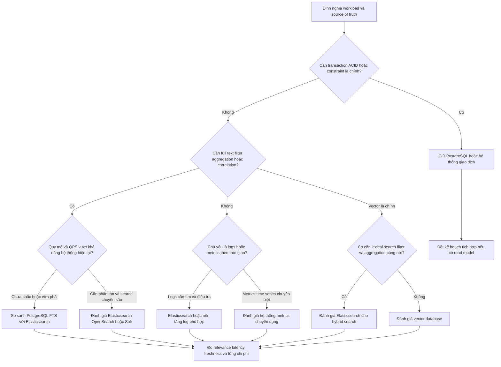

Elasticsearch là một hệ thống tìm kiếm và phân tích phân tán. Nó thường phát huy giá trị khi dữ liệu cần được tìm theo nội dung, lọc theo nhiều chiều, hoặc tổng hợp gần thời gian thực trên nhiều node. Nó không phải là cơ sở dữ liệu giao dịch thay thế cho mọi workload.

<Callout type="info" title="Phạm vi của trang">
  Hãy dùng trang này để thu hẹp lựa chọn, không dùng như một cam kết về hiệu năng. Latency, throughput và chi phí thực tế phụ thuộc vào schema, kích thước document, mapping, truy vấn, thời gian lưu giữ, phần cứng và cách vận hành.
</Callout>

## Mục lục

- [Tổng quan](#tổng-quan)
  - [Elasticsearch phù hợp khi nào](#elasticsearch-phù-hợp-khi-nào)
  - [Khi nào không nên bắt đầu bằng Elasticsearch](#khi-nào-không-nên-bắt-đầu-bằng-elasticsearch)
- [Các nhóm use case chính](#các-nhóm-use-case-chính)
  - [Full text và search ứng dụng](#full-text-và-search-ứng-dụng)
  - [Log analytics](#log-analytics)
  - [Observability](#observability)
  - [Security analytics](#security-analytics)
  - [Vector và hybrid search](#vector-và-hybrid-search)
- [Khung quyết định chọn giải pháp](#khung-quyết-định-chọn-giải-pháp)
  - [Bước 1: Xác định workload và source of truth](#bước-1-xác-định-workload-và-source-of-truth)
  - [Bước 2: Làm rõ freshness và consistency](#bước-2-làm-rõ-freshness-và-consistency)
  - [Bước 3: Chọn search semantics](#bước-3-chọn-search-semantics)
  - [Bước 4: Kiểm tra latency và scale](#bước-4-kiểm-tra-latency-và-scale)
  - [Bước 5: Tính chi phí vận hành và kỹ năng](#bước-5-tính-chi-phí-vận-hành-và-kỹ-năng)
  - [Decision tree thực dụng](#decision-tree-thực-dụng)
- [So sánh với các lựa chọn thay thế](#so-sánh-với-các-lựa-chọn-thay-thế)
  - [PostgreSQL full text](#postgresql-full-text)
  - [OpenSearch và Solr](#opensearch-và-solr)
  - [Hệ thống log và metrics chuyên dụng](#hệ-thống-log-và-metrics-chuyên-dụng)
  - [Vector database](#vector-database)
  - [Bảng tóm tắt](#bảng-tóm-tắt)
- [Ví dụ ra quyết định](#ví-dụ-ra-quyết-định)
  - [Catalog sản phẩm](#catalog-sản-phẩm)
  - [Log ứng dụng](#log-ứng-dụng)
  - [Tài liệu nội bộ hỏi đáp](#tài-liệu-nội-bộ-hỏi-đáp)
  - [Hệ thống giao dịch](#hệ-thống-giao-dịch)
- [Anti pattern cần tránh](#anti-pattern-cần-tránh)
  - [Dùng Elasticsearch làm database giao dịch](#dùng-elasticsearch-làm-database-giao-dịch)
  - [Index mọi dữ liệu không có vòng đời](#index-mọi-dữ-liệu-không-có-vòng-đời)
  - [Đánh giá bằng cảm giác](#đánh-giá-bằng-cảm-giác)
  - [Gộp workload không có ranh giới](#gộp-workload-không-có-ranh-giới)
- [Lộ trình đánh giá và next steps](#lộ-trình-đánh-giá-và-next-steps)
  - [Thiết kế thử nghiệm](#thiết-kế-thử-nghiệm)
  - [Checklist go hoặc no go](#checklist-go-hoặc-no-go)
  - [Tài liệu liên quan](#tài-liệu-liên-quan)

## Tổng quan

### Elasticsearch phù hợp khi nào

Elasticsearch đáng cân nhắc khi một hoặc nhiều điều sau là yêu cầu cốt lõi:

- Người dùng cần tìm theo từ, cụm từ, trường, ngữ nghĩa hoặc nhiều điều kiện kết hợp.
- Kết quả cần xếp hạng theo độ liên quan, hỗ trợ autocomplete, highlight, faceting hoặc filter nhanh.
- Đội ngũ cần vừa tìm kiếm vừa làm aggregation để trả lời câu hỏi phân tích trên cùng tập dữ liệu.
- Dữ liệu được ghi nhiều, đọc nhiều và có thể chấp nhận mô hình near-real-time. *Near-real-time* nghĩa là document thường xuất hiện trong tìm kiếm sau một khoảng refresh, không phải ngay trong cùng transaction.
- Workload cần scale ngang theo shard và có thể chấp nhận chi phí bản sao, lưu trữ index và vận hành cluster.

Ví dụ, một catalog có hàng triệu sản phẩm cần tìm theo tên và mô tả, lọc theo thương hiệu, khoảng giá và thuộc tính. Đây là bài toán search và faceting tự nhiên hơn là chỉ dùng phép so sánh trên một bảng quan hệ.

### Khi nào không nên bắt đầu bằng Elasticsearch

Không nên chọn Elasticsearch chỉ vì dữ liệu lớn hoặc vì cần một dashboard. Hãy bắt đầu bằng hệ thống khác nếu:

- Dữ liệu là source of truth cho giao dịch, cần ACID, foreign key, constraint, transaction nhiều bảng hoặc cập nhật nhất quán ngay lập tức.
- Workload chủ yếu là CRUD theo khóa chính và không có yêu cầu tìm toàn văn hay aggregation phân tán.
- Dữ liệu nhỏ, ít thay đổi và PostgreSQL hiện tại đã đáp ứng latency lẫn relevance.
- Bài toán chỉ là lưu metric dạng time series với retention dài và mô hình truy vấn chuyên biệt. Một hệ thống metrics chuyên dụng có thể hiệu quả hơn.
- Ứng dụng chỉ cần nearest-neighbor trên vector, không cần lexical search, faceting hoặc pipeline phân tích của Elasticsearch. Vector database có thể đơn giản hơn.
- Đội ngũ chưa có ngân sách cho backup, capacity planning, mapping, shard và theo dõi sức khỏe cluster.

<Callout type="warn" title="Tách hệ thống giao dịch và hệ thống tìm kiếm">
  Một mô hình phổ biến là PostgreSQL giữ dữ liệu chuẩn, còn Elasticsearch giữ projection phục vụ search và analytics. Cần thiết kế pipeline đồng bộ, xử lý retry, xóa document và độ trễ đồng bộ. Đừng coi hai bản sao là nhất quán tuyệt đối nếu chưa có cơ chế kiểm tra và sửa lệch.
</Callout>

## Các nhóm use case chính

### Full text và search ứng dụng

**Dạng dữ liệu.** Sản phẩm, bài viết, tài liệu, hồ sơ, câu hỏi, địa điểm và metadata đi kèm. Một document thường có field kiểu `text` để phân tích ngôn ngữ và các field kiểu `keyword` hoặc số để lọc, sort, aggregate. Nếu dữ liệu có quan hệ giao dịch phức tạp, document trong Elasticsearch thường là bản chiếu đã denormalize, không phải bản ghi chuẩn duy nhất.

**Truy vấn và tính năng.** Nhóm này dùng `match`, `multi_match`, phrase search, bool query, filter, boost, highlighting, autocomplete, synonym và aggregation cho faceting. Analyzer quyết định cách văn bản được tách và chuẩn hóa. Vì vậy, mapping và analyzer cần được kiểm thử bằng các truy vấn thật, đặc biệt với tiếng Việt và tên riêng. Xem [Full-text search](../elasticsearch-core/full-text-search) và [Analyzers và tokenizers](../elasticsearch-core/analyzers-tokenizers) để đi sâu hơn.

Ví dụ, truy vấn sản phẩm có thể kết hợp độ liên quan của `name` và `description` với filter về trạng thái, thương hiệu và khoảng giá:

```http
GET /products/_search
{
  "query": {
    "bool": {
      "must": [
        {
          "multi_match": {
            "query": "áo khoác chống nước",
            "fields": ["name^3", "description"]
          }
        }
      ],
      "filter": [
        { "term": { "status": "active" } },
        { "range": { "price": { "lte": 2000000 } } }
      ]
    }
  },
  "highlight": { "fields": { "description": {} } },
  "aggs": {
    "brands": { "terms": { "field": "brand.keyword" } }
  }
}
```

**Latency và scale.** Đây thường là interactive workload: API tìm kiếm cần đáp ứng mục tiêu p95 do sản phẩm đặt ra, với tail latency (độ trễ ở phần chậm nhất của phân phối) được theo dõi riêng. Scale phụ thuộc số document, kích thước field, số shard, replica, QPS, tỷ lệ cập nhật và độ phức tạp query. Khi catalog lớn hoặc QPS tăng, có thể scale ngang, nhưng shard quá nhiều và query quá rộng cũng làm tăng chi phí phối hợp.

**Ví dụ.** Website bán hàng cần trả về kết quả trong một request gồm danh sách sản phẩm, facet thương hiệu và khoảng giá. PostgreSQL vẫn có thể giữ đơn hàng và tồn kho; Elasticsearch chỉ phục vụ projection tìm kiếm. Tồn kho hiển thị cần có chiến lược làm mới hoặc kiểm tra lại từ source of truth trước khi chốt đơn.

### Log analytics

**Dạng dữ liệu.** Log ứng dụng, access log, audit log và sự kiện từ hạ tầng. Dữ liệu thường append-only, có timestamp, message, service, host, environment, status code, trace ID và các field đã chuẩn hóa. [ECS](../data-ingestion/ecs) là một quy ước có thể giúp các nguồn log dùng field nhất quán; không bắt buộc phải dùng nếu schema nội bộ đã rõ ràng.

**Truy vấn và tính năng.** Người vận hành cần lọc theo thời gian, service, host, severity hoặc request ID; tìm chuỗi trong message; group và count theo field; dựng dashboard; tạo alert; và drill down từ một sự kiện sang các sự kiện liên quan. Aggregation, data stream, ingest pipeline và một công cụ khám phá như Kibana thường quan trọng không kém full-text search. Xem [Data streams](../data-ingestion/data-streams) và [Aggregations](../elasticsearch-core/aggregations).

**Latency và scale.** Log analytics thường ưu tiên ingest ổn định, truy vấn tương tác trên cửa sổ thời gian gần đây và retention có kiểm soát. Dòng ghi có thể tăng đột biến khi có incident. Thiết kế phải tính đến backpressure, burst, refresh, shard theo thời gian, replica, tier lưu trữ và xóa dữ liệu hết hạn. Không nên hứa một latency cố định cho mọi truy vấn; truy vấn 15 phút dữ liệu khác hoàn toàn truy vấn nhiều năm.

**Ví dụ.** Khi tỷ lệ HTTP 5xx tăng, kỹ sư lọc `service.name`, `http.response.status_code`, `trace.id` và khoảng thời gian xảy ra lỗi, sau đó xem message và trace liên quan. Giá trị của Elasticsearch nằm ở việc tìm và liên kết các sự kiện khác loại, không chỉ ở việc lưu chuỗi log.

### Observability

**Dạng dữ liệu.** Observability kết hợp logs, metrics, traces, service metadata, deployment event và synthetic check. Logs mô tả sự kiện, metrics là chuỗi số theo thời gian, còn traces mô tả đường đi của một request qua các service. Mỗi loại có tần suất, cardinality và retention khác nhau.

**Truy vấn và tính năng.** Workflow điển hình là đi từ service hoặc endpoint có vấn đề đến metric, trace, span, log và deployment liên quan. Cần filter theo service, environment và time range; aggregation theo status hoặc latency; percentile khi phù hợp; correlation bằng trace ID; alert theo rule; và dashboard để theo dõi xu hướng. [Elastic Observability](../observability-security/elastic-observability) mô tả các mảnh ghép của workflow này.

**Latency và scale.** Dashboard và điều tra tương tác cần phản hồi đủ nhanh trong cửa sổ thời gian thường dùng. Ingest phải chịu được biến động theo số service, số host, sampling của trace và cardinality của metric. Traces có thể rất lớn nếu giữ mọi span; metrics có thể phình ra nếu mỗi label có quá nhiều giá trị. Retention, sampling và aggregation trước khi index là các quyết định scale, không phải việc xử lý sau cùng.

**Ví dụ.** Một alert cho latency API mở trang điều tra: xem metric latency theo service, mở trace chậm, rồi tìm log cùng `trace.id`. Nếu hệ thống metrics chuyên dụng đã phục vụ tốt việc tính toán time series, có thể giữ metrics ở đó và chỉ đưa dữ liệu cần correlation vào Elasticsearch. Không có yêu cầu phải gom mọi loại telemetry vào một nơi.

### Security analytics

**Dạng dữ liệu.** Sự kiện đăng nhập, audit, endpoint, network, cloud, identity, process và threat intelligence. Dữ liệu cần có timestamp, actor, resource, action, outcome, địa chỉ mạng và context về tài sản hoặc người dùng. Schema ổn định giúp rule và điều tra không phụ thuộc vào tên field riêng của từng nguồn.

**Truy vấn và tính năng.** Use case gồm lọc sự kiện, tìm chuỗi hành vi, join hoặc correlate theo user/IP/host, aggregation theo thời gian, phát hiện bất thường, detection rule, alert triage và timeline điều tra. [Elastic Security](../observability-security/elastic-security) và [SIEM và detection rules](../observability-security/siem-detection-rules) là các trang liên quan. Cần phân quyền document/field và audit truy cập, vì chính dữ liệu security thường nhạy cảm.

**Latency và scale.** Điều tra cần search tương tác trên dữ liệu nóng. Detection có thể chạy theo lịch hoặc theo dòng sự kiện, với freshness tùy mức độ rủi ro. Ingest thường nhiều nguồn và dễ biến động; retention có thể dài nhưng không phải dữ liệu nào cũng cần ở tier nhanh. Thiết kế phải cân bằng độ trễ phát hiện, độ đầy đủ của dữ liệu, chi phí lưu giữ và khả năng truy hồi sau sự cố.

**Ví dụ.** Một rule phát hiện nhiều lần đăng nhập thất bại rồi đăng nhập thành công từ context bất thường có thể dùng filter thời gian, group theo tài khoản và địa chỉ mạng, sau đó mở timeline các sự kiện liên quan. Elasticsearch hỗ trợ phần index và phân tích; chất lượng phát hiện còn phụ thuộc nguồn dữ liệu, logic rule, quy trình triage và người phụ trách.

### Vector và hybrid search

**Dạng dữ liệu.** Vector search lưu embedding — một mảng số biểu diễn đặc trưng ngữ nghĩa của văn bản, hình ảnh hoặc sản phẩm — cùng với nội dung gốc và metadata. Hybrid search kết hợp lexical search (khớp từ) với vector search (gần về embedding). Metadata như tenant, quyền truy cập, ngôn ngữ và loại tài liệu thường cần filter trước hoặc trong quá trình lấy ứng viên.

**Truy vấn và tính năng.** Vector search thường dùng kNN hoặc approximate nearest neighbor để lấy các ứng viên gần nhất. Hybrid search có thể kết hợp điểm lexical và semantic bằng cơ chế hợp nhất phù hợp, rồi rerank bằng model hoặc quy tắc nghiệp vụ. Cần kiểm thử embedding model, số lượng ứng viên, filter, chunking và chất lượng kết quả; không nên xem vector là thay thế tự động cho analyzer và lexical query. Xem [Vector search](../advanced-search/vector-search), [Semantic search](../advanced-search/semantic-search) và [Hybrid search](../advanced-search/hybrid-search).

**Latency và scale.** Workload vector chịu ảnh hưởng bởi số vector, số chiều, memory, mức recall mong muốn, số truy vấn đồng thời và chi phí tính embedding. Index vector có thể làm tăng footprint và thời gian build. Nếu cần vừa filter, full-text, aggregation và vector trên cùng projection, Elasticsearch có thể giảm số hệ thống cần tích hợp. Nếu chỉ cần nearest-neighbor quy mô lớn với API vector đơn giản, vector database chuyên dụng có thể dễ vận hành hơn.

**Ví dụ.** Cổng tài liệu nhận câu hỏi tự nhiên. Hệ thống dùng lexical query để giữ các thuật ngữ chính xác, vector query để bắt các cách diễn đạt tương đương, filter theo tenant và quyền truy cập, rồi trả về đoạn văn có trích dẫn. Phần sinh câu trả lời của ứng dụng vẫn phải kiểm soát nguồn và quyền; search engine không tự biến kết quả thành sự thật.

## Khung quyết định chọn giải pháp

Không bắt đầu bằng câu hỏi “Elasticsearch có nhanh không?”. Hãy bắt đầu bằng dữ liệu, SLA và thao tác mà người dùng cần. Mỗi tiêu chí dưới đây nên có một giả định đo được hoặc một ví dụ query cụ thể.

### Bước 1: Xác định workload và source of truth

Viết rõ các luồng đọc và ghi:

| Câu hỏi | Điều cần ghi lại |
| --- | --- |
| Dữ liệu là gì? | Schema, kích thước document, field text/keyword/vector, quan hệ và mức nhạy cảm. |
| Ghi như thế nào? | CRUD hay append-only, burst, bulk, update một phần, xóa và retry. |
| Đọc để làm gì? | Lookup, full-text, filter, aggregation, timeline, time series hay nearest-neighbor. |
| Hệ thống nào là chuẩn? | Nơi quyết định trạng thái đúng của đơn hàng, tài khoản, quyền hoặc cấu hình. |
| Nếu index mất thì sao? | Rebuild từ source, restore snapshot hay mất dữ liệu không thể phục hồi. |

Nếu hệ thống cần transaction để đảm bảo nhiều bản ghi thay đổi cùng nhau, hãy giữ transaction ở source of truth. Elasticsearch có thể là read model được xây lại, thay vì nơi duy nhất lưu trạng thái nghiệp vụ.

### Bước 2: Làm rõ freshness và consistency

*Freshness* là độ mới mà người đọc nhìn thấy. *Consistency* là mức các lần đọc phản ánh cùng trạng thái đúng. Hai khái niệm này liên quan nhưng không giống nhau.

- Nếu kết quả phải thấy ngay trong cùng transaction, kiểm tra PostgreSQL hoặc hệ thống giao dịch trước. Nếu dùng projection, cần nói rõ độ trễ đồng bộ chấp nhận được.
- Nếu chấp nhận near-real-time, đo thời gian từ lúc event phát sinh đến lúc document searchable. Tính cả queue, retry, ingest, refresh và lúc cluster quá tải.
- Nếu cần đọc nhất quán trong nhiều vùng hoặc tenant, xác định chiến lược replication, failover và xử lý duplicate trước khi chọn datastore.
- Nếu dữ liệu có thể rebuild, việc chấp nhận eventual consistency thường dễ hơn. Nếu dữ liệu không thể tái tạo, không nên để index là bản duy nhất.

Nói ngắn gọn: ghi SLA freshness và consistency thành yêu cầu, không dùng cụm “real-time” mà không định nghĩa.

### Bước 3: Chọn search semantics

Search semantics là cách hệ thống quyết định một document “phù hợp”. Hãy phân loại truy vấn thật:

| Semantics | Ví dụ | Năng lực thường cần |
| --- | --- | --- |
| Chính xác | Mã đơn, tenant, trạng thái | `keyword`, filter, lookup theo khóa |
| Toàn văn | Tìm bài viết có nội dung liên quan | analyzer, match, phrase, relevance |
| Có cấu trúc | Giá, ngày, loại, vị trí | range, filter, sort, geo query |
| Phân tích | Đếm lỗi theo service và khoảng thời gian | aggregation, bucket, time filter |
| Ngữ nghĩa | “giày chạy êm” gần với mô tả tương đương | embedding, kNN, semantic/hybrid |
| Tương quan | Cùng trace, user, host hoặc incident | field chuẩn hóa, correlation, timeline |

Một ứng dụng thường kết hợp nhiều semantics. Ví dụ catalog dùng full text cho `name`, filter cho `brand`, range cho `price` và aggregation cho facet. Nếu chỉ có một semantics đơn giản, một hệ thống nhỏ hơn có thể là lựa chọn hợp lý hơn.

### Bước 4: Kiểm tra latency và scale

Đặt workload vào các chiều sau thay vì dùng một con số benchmark chung:

- **Latency:** p50 cho trải nghiệm điển hình, p95/p99 cho tail latency, thời gian ingest và thời gian dữ liệu trở nên searchable.
- **Throughput:** số request đọc, số document ghi, kích thước bulk, tỷ lệ update và burst khi có sự kiện.
- **Dung lượng:** tổng dữ liệu gốc, overhead của inverted index, doc values, vector, replica, snapshot và bản sao pipeline.
- **Phạm vi truy vấn:** số shard phải fan-out, time range, số field, aggregation cardinality và mức độ phân trang.
- **Tăng trưởng:** tốc độ tăng dữ liệu, retention, số tenant, số user và nhu cầu reindex khi mapping thay đổi.

Kiểm thử bằng schema và truy vấn đại diện. Một truy vấn đơn giản trên dữ liệu nóng không đại diện cho dashboard với nhiều aggregation trên toàn bộ retention. Xem [Sizing và capacity planning](../deployment/sizing-capacity), [Performance tuning](../production/performance-tuning) và [Scaling và shard strategy](../production/scaling-shard-strategy).

### Bước 5: Tính chi phí vận hành và kỹ năng

Chi phí không chỉ là dung lượng đĩa. Hãy đưa các khoản sau vào đánh giá:

- Cluster hoặc managed service, node dự phòng, replica và tầng lưu trữ.
- RAM cho cache và vector, CPU cho ingest/query, I/O cho merge và snapshot.
- On-call, nâng cấp, security, backup, restore, shard allocation, mapping và reindex.
- Pipeline đồng bộ từ source of truth, dead letter, replay và kiểm tra document bị lệch.
- Kỹ năng của đội ngũ về Query DSL, profiling, capacity planning và xử lý incident.
- Chi phí cơ hội khi thêm một hệ thống mà đội ngũ chưa quen, cùng chi phí tích hợp và đào tạo.

Managed service giảm một phần công việc hạ tầng nhưng không loại bỏ trách nhiệm về mapping, query, dữ liệu nhạy cảm, retention và chi phí tăng theo usage. Nếu đội ngũ chỉ cần một search nhỏ và đã vận hành PostgreSQL tốt, tổng chi phí của PostgreSQL có thể thấp hơn dù Elasticsearch có nhiều tính năng hơn.

### Decision tree thực dụng

Sơ đồ này là điểm bắt đầu để đặt câu hỏi. Nhánh cuối vẫn cần được xác nhận bằng thử nghiệm workload thật.



## So sánh với các lựa chọn thay thế

Không có hệ thống tốt tuyệt đối. So sánh phải dựa trên workload, đội ngũ và ràng buộc dữ liệu. Tên sản phẩm không thay thế cho việc kiểm thử; khả năng cụ thể còn phụ thuộc deployment, plugin, phiên bản và dịch vụ đi kèm.

### PostgreSQL full text

PostgreSQL phù hợp khi dữ liệu giao dịch đã ở đó, kích thước và traffic còn trong phạm vi vận hành hiện tại, và search chủ yếu là full-text cùng filter cơ bản. Nó giữ transaction, constraint, join và source of truth trong một hệ thống. PostgreSQL có thể là lựa chọn đơn giản nhất cho tìm kiếm nội bộ hoặc catalog vừa phải.

Elasticsearch phù hợp hơn khi relevance, autocomplete, faceting, aggregation, search phân tán hoặc ingestion append-heavy là yêu cầu trung tâm. Đổi lại, đội ngũ phải vận hành index, mapping, đồng bộ và consistency giữa hai hệ thống nếu PostgreSQL vẫn là nguồn chuẩn. Đừng thêm Elasticsearch chỉ để thay một `LIKE` nhỏ mà chưa đo bottleneck.

### OpenSearch và Solr

OpenSearch và Solr đều là các lựa chọn search và analytics có hệ sinh thái riêng. Chúng đáng cân nhắc khi tổ chức đã có cluster, công cụ, kỹ năng, quy trình hoặc yêu cầu tương thích với hệ sinh thái đó. Solr có lịch sử mạnh về search và khả năng tùy biến; OpenSearch có mô hình vận hành và tích hợp riêng. Đây không phải một bảng xếp hạng chung.

Khi so sánh với Elasticsearch, hãy dùng cùng corpus, analyzer, query, mức replica, cách refresh, retention và tiêu chí relevance. Kiểm tra cả migration, client, security, observability, backup và năng lực tuyển dụng. Một engine có điểm tính năng tốt hơn nhưng tạo chi phí chuyển đổi lớn chưa chắc là lựa chọn tốt hơn.

### Hệ thống log và metrics chuyên dụng

Nền tảng log chuyên dụng có thể ưu tiên ingest, retention và tìm kiếm log theo cách phù hợp với tổ chức. Hệ thống metrics hoặc time-series chuyên dụng thường tối ưu cho chuỗi số, downsampling, label và truy vấn theo thời gian. Chúng có thể là lựa chọn tốt khi workload chỉ tập trung vào một loại telemetry.

Elasticsearch có lợi thế khi cần một nơi để tìm text, lọc nhiều field, aggregation, correlation giữa logs-traces-events và điều tra theo context. Nhưng việc gom mọi dữ liệu vào Elasticsearch chỉ để có một dashboard có thể làm tăng chi phí và cardinality không cần thiết. Kiến trúc lai là hợp lệ: dùng metrics backend cho metrics, log backend cho log, rồi liên kết hoặc đẩy các sự kiện cần điều tra vào một nơi tìm kiếm chung.

### Vector database

Vector database phù hợp khi nearest-neighbor là truy vấn cốt lõi, dữ liệu chủ yếu là embedding, filter metadata đơn giản và đội ngũ muốn một API tập trung cho vector. Một hệ thống như vậy có thể giảm phần search không liên quan và phù hợp với pipeline ML chuyên biệt.

Elasticsearch phù hợp khi vector chỉ là một phần của trải nghiệm: cần khớp từ chính xác, filter quyền truy cập, faceting, aggregation, highlight hoặc tìm kiếm log/tài liệu cùng dữ liệu. Cần so sánh recall, freshness của embedding, cập nhật vector, memory, backup, phân quyền và thời gian vận hành. Đừng chọn vector database chỉ vì ứng dụng có một bước tạo embedding.

### Bảng tóm tắt

| Lựa chọn | Phù hợp nhất khi | Điểm cần kiểm tra | Khi không nên ưu tiên |
| --- | --- | --- | --- |
| Elasticsearch | Full-text, filter, aggregation, log search, correlation hoặc hybrid search phân tán | Mapping, shard, refresh, retention, đồng bộ và năng lực vận hành | Giao dịch ACID là trung tâm hoặc workload rất nhỏ |
| PostgreSQL full text | Đã có PostgreSQL làm source of truth và search vừa phải | Relevance, ranking, query plan, tải đọc/ghi và giới hạn scale | Cần faceting/search chuyên sâu hoặc nhiều kiểu dữ liệu append-only |
| OpenSearch hoặc Solr | Đã có hệ sinh thái và kỹ năng tương ứng, hoặc cần đặc tính của nền tảng đó | Tương thích API, plugin, migration, vận hành và ecosystem | Không có lý do chuyển đổi rõ ràng hoặc đội ngũ chưa biết vận hành |
| Log/metrics chuyên dụng | Chủ yếu là một loại telemetry với pipeline và retention chuyên biệt | Khả năng điều tra chéo, alert, export và liên kết với hệ khác | Cần một search layer chung cho nhiều loại tài liệu |
| Vector database | Nearest-neighbor là trung tâm, lexical search tối thiểu | Recall, filter, index build, cập nhật vector, memory và backup | Cần full-text, faceting, aggregation hoặc correlation phong phú |

## Ví dụ ra quyết định

### Catalog sản phẩm

**Bối cảnh.** PostgreSQL giữ sản phẩm, giá chuẩn, tồn kho và đơn hàng. Người dùng cần tìm tên/mô tả, autocomplete, lọc thuộc tính và facet. Catalog cập nhật thường xuyên nhưng kết quả search có thể trễ trong khoảng được sản phẩm chấp nhận.

**Lựa chọn.** Dùng PostgreSQL làm source of truth và Elasticsearch làm read model. Index chỉ các field phục vụ search và hiển thị. Dùng event hoặc CDC để đồng bộ, có retry và job đối soát. Khi người dùng thanh toán, kiểm tra tồn kho từ hệ thống giao dịch thay vì tin vào document search.

**Điều cần đo.** Relevance trên truy vấn thật, tỷ lệ kết quả rỗng, thời gian đồng bộ, p95/p99 search, chi phí reindex khi analyzer đổi và hành vi khi traffic tăng. Nếu catalog nhỏ và PostgreSQL FTS đáp ứng các tiêu chí này, không cần thêm Elasticsearch.

### Log ứng dụng

**Bối cảnh.** Nhiều service ghi log JSON. Khi có incident, đội ngũ cần lọc theo thời gian, service, status, trace ID và xem aggregation lỗi. Dữ liệu cũ ít được truy vấn nhưng cần giữ theo chính sách.

**Lựa chọn.** Elasticsearch là ứng viên tự nhiên nếu search text, correlation và dashboard là trọng tâm. Dùng schema chuẩn, data stream hoặc index theo vòng đời phù hợp, pipeline parse có dead letter và retention theo tier. Nếu tổ chức đã có log platform chuyên dụng đáp ứng điều tra và alert, hãy so sánh chi phí di chuyển trước khi thay thế.

**Điều cần đo.** Ingest trong giờ cao điểm, khả năng chịu burst, thời gian searchable, query trên cửa sổ nóng và chi phí mỗi thời gian lưu giữ. Kiểm thử cả incident query chứ không chỉ một request tìm chuỗi.

### Tài liệu nội bộ hỏi đáp

**Bối cảnh.** Nhân viên tìm chính sách và runbook bằng câu hỏi tự nhiên. Tài liệu có tenant hoặc nhóm quyền khác nhau. Kết quả cần vừa giữ thuật ngữ chính xác vừa bắt được cách diễn đạt tương đương.

**Lựa chọn.** Thử hybrid search: lexical query cho tên dịch vụ, mã lỗi và thuật ngữ; vector query cho ý định; filter quyền trước khi trả kết quả; rerank các ứng viên nếu cần. Elasticsearch phù hợp nếu tài liệu đã cần full-text, filter, highlight và aggregation. Vector database đơn giản hơn nếu chỉ cần nearest-neighbor và lớp ứng dụng đã có đầy đủ filter, ACL và retrieval workflow.

**Điều cần đo.** Bộ câu hỏi có đáp án chuẩn, tỷ lệ top-k chứa tài liệu đúng, kết quả theo từng tenant, độ trễ embedding và search, cũng như hành vi khi tài liệu bị thu hồi quyền. Không đánh giá bằng một vài câu hỏi được chọn thủ công.

### Hệ thống giao dịch

**Bối cảnh.** Dịch vụ quản lý số dư cần cập nhật nguyên tử, constraint và audit chính xác. UI có thể cần một ô tìm kiếm giao dịch theo mô tả hoặc mã.

**Lựa chọn.** Giữ PostgreSQL hoặc datastore giao dịch làm source of truth. Có thể thêm Elasticsearch làm projection cho màn hình điều tra nếu nhu cầu search đủ lớn. Tại bước xác nhận giao dịch, đọc trạng thái từ nguồn chuẩn và xử lý trường hợp projection trễ hoặc lỗi.

**Kết luận.** Elasticsearch không phải lựa chọn chính cho phần cần ACID. Dùng nó ở lớp đọc khi lợi ích search lớn hơn chi phí đồng bộ và vận hành.

## Anti pattern cần tránh

### Dùng Elasticsearch làm database giao dịch

Lỗi này xảy ra khi ứng dụng ghi trạng thái nghiệp vụ duy nhất vào index rồi mong có transaction, constraint và join như cơ sở dữ liệu quan hệ. Khi update đồng thời, retry hoặc mất cluster, việc xác định trạng thái đúng trở nên khó.

Cách sửa là xác định source of truth, phát event có định danh, ghi projection có thể lặp lại và xây job reconcile. Với dữ liệu không thể rebuild, phải có datastore giao dịch hoặc cơ chế lưu bền phù hợp trước khi thêm search index.

### Index mọi dữ liệu không có vòng đời

Đưa toàn bộ message, field động, bản sao payload và vector vào mọi index làm tăng storage, memory, mapping và chi phí snapshot. Field có cardinality cao cũng có thể làm aggregation đắt hơn.

Hãy xác định field nào dùng để search, filter, sort, aggregate hoặc chỉ hiển thị. Đặt retention, tier và chính sách xóa ngay từ thiết kế. Nếu một field không có use case truy vấn, cân nhắc không index nó.

### Đánh giá bằng cảm giác

“Search có vẻ nhanh” hoặc “kết quả trông đúng” không đủ để go-live. Một query demo có thể bỏ qua tail latency, refresh delay, burst ingest, phân quyền và truy vấn dài.

Tạo corpus đại diện và bộ truy vấn được version hóa. Đo relevance bằng tiêu chí do domain xác nhận. Đo latency, throughput, freshness, lỗi, chi phí và khả năng rebuild dưới điều kiện gần production. Không dùng benchmark công khai để thay cho kiểm thử hệ thống của mình.

### Gộp workload không có ranh giới

Đặt search tương tác, bulk ingest, dashboard nặng, vector query và retention dài vào cùng một pool mà không có giới hạn có thể khiến một workload làm suy giảm workload khác.

Tách index hoặc data stream theo vòng đời và tính chất truy vấn. Đặt giới hạn về time range, page size, aggregation và concurrency. Xem xét node role, tier hoặc cluster riêng khi ranh giới workload có lý do rõ ràng. Đừng tách cluster chỉ theo cảm tính; mỗi ranh giới mới cũng tạo thêm chi phí vận hành.

## Lộ trình đánh giá và next steps

### Thiết kế thử nghiệm

Thực hiện một thử nghiệm có thể lặp lại theo các bước sau:

1. **Mô tả workload.** Ghi nguồn dữ liệu, schema, tốc độ ghi, QPS đọc, kích thước document, retention, freshness và consistency.
2. **Chọn corpus.** Dùng dữ liệu đã ẩn thông tin nhạy cảm nhưng giữ phân phối kích thước, ngôn ngữ, cardinality và thời gian giống thực tế.
3. **Viết query set.** Bao gồm query thành công, query rỗng, filter nhiều điều kiện, aggregation, truy vấn incident và truy vấn xấu có thể gây fan-out rộng.
4. **Đặt tiêu chí.** Định nghĩa p95/p99, thời gian searchable, throughput, tỷ lệ lỗi, recall hoặc relevance, chi phí dự kiến và thời gian rebuild.
5. **Chạy các lựa chọn công bằng.** Giữ corpus, query, retention và điều kiện tải tương đương. Ghi lại tuning để kết quả có thể giải thích.
6. **Thử failure và vận hành.** Kiểm tra retry, node mất kết nối, snapshot/restore, reindex, mapping thay đổi, backpressure và dữ liệu đến trễ.
7. **Ra quyết định có điều kiện.** Ghi rõ lựa chọn, lý do, giả định, giới hạn và tín hiệu cần xem lại quyết định.

### Checklist go hoặc no go

- [ ] Đã xác định source of truth và cách rebuild index.
- [ ] Đã ghi rõ freshness, consistency, RPO/RTO và retention.
- [ ] Đã có query set đại diện cho search, filter, aggregation và failure case.
- [ ] Đã đo p95/p99, ingest throughput, thời gian searchable và tỷ lệ lỗi.
- [ ] Đã kiểm thử relevance hoặc recall bằng dữ liệu và đánh giá của domain.
- [ ] Đã ước lượng storage, replica, snapshot, RAM/CPU và chi phí vận hành.
- [ ] Đã kiểm tra phân quyền, dữ liệu nhạy cảm và audit truy cập.
- [ ] Đã có kế hoạch mapping, reindex, schema evolution và xử lý document lệch.
- [ ] Đã so sánh ít nhất một lựa chọn đơn giản hơn khi nó có thể đáp ứng yêu cầu.
- [ ] Đã chỉ định người sở hữu on-call và quy trình xử lý sự cố.

### Tài liệu liên quan

<Cards>
  <Card title="Elasticsearch là gì?" href="./elasticsearch-la-gi" description="Ôn lại mô hình lập chỉ mục và nhóm bài toán Elasticsearch giải quyết." />
  <Card title="Mô hình dữ liệu" href="./mo-hinh-du-lieu" description="Chọn index, document, field và mapping trước khi thiết kế workload." />
  <Card title="Full-text search" href="../elasticsearch-core/full-text-search" description="Tìm hiểu match, relevance và các mẫu truy vấn văn bản." />
  <Card title="Vector và hybrid search" href="../advanced-search/hybrid-search" description="Kết hợp lexical search và semantic search trong workflow hiện đại." />
  <Card title="Sizing và capacity planning" href="../deployment/sizing-capacity" description="Ước lượng dung lượng, throughput và tài nguyên cho deployment." />
  <Card title="Performance tuning" href="../production/performance-tuning" description="Đo và tối ưu indexing, search, refresh và tài nguyên cluster." />
</Cards>
